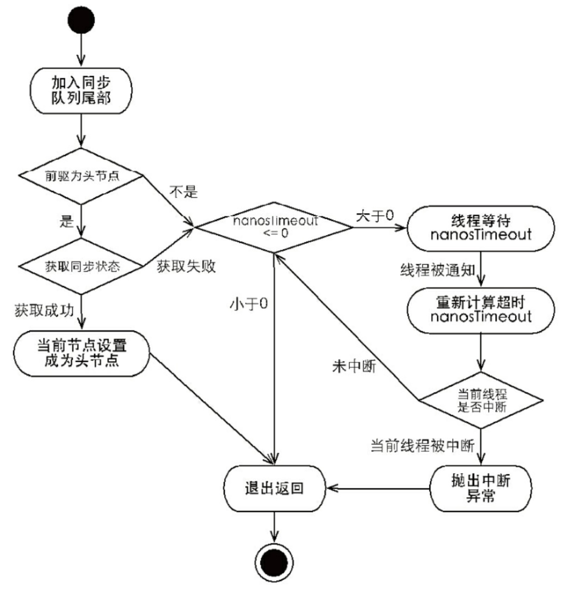

## 第5章 Java中的锁
### 5.1 Lock接口
**1 与synchronized相比**

    1.synchronized隐式的获取锁和释放锁，Lock显示的获取锁和释放锁
    2.Lock拥有获取锁与释放锁的可操作性，可中断的获取锁以及超时获取锁等synchronized关键字不剧本的同步特性
    
**2 Lock获取锁和释放锁代码示例**
    
    Lock lock = new ReentrantLock();
    lock.lock();
    try{
    } finally {
        lock.unlock();
    }  
    
    注意：获取锁不要在try块中，因为如果在获取锁时发生异常，异常抛出的同事，也会导致锁无故释放
    
**3 Lock 接口提供了synchronized关键字所不具备的主要特性**  
 
| 特性 | 描述 |
| :----| :---- | 
| 尝试非阻塞地获取锁 | 当前线程尝试获取锁，如果这一时刻锁没有被 其他线程获取到，则成功获取并持有锁 | 
| 能被中断地获取锁 | 与synchronize不同，获取到锁的线程能够响应 中断，当获取到锁的编程被中断时，中断异常 将会抛出，同时锁会被释放 | 
| 超时获取锁 | 在指定的截止时间之前获取锁，如果截止时间到 了人就无法获取锁，则返回 | 

**4 Lock的API**  

| 方法名称 | 描述 |
| :---- | :---- |
| void lock() | 获取锁，调用该方法当前线程将会获取锁，获得锁后，返回|
| void lockInterruptibly()  throws InterruptedEception | 可中断的获取锁，和lock()不同在该方法响应中断，在锁获取 中可以响应中断当前线程 |
| boolean tryLock() | 尝试非阻塞的获取锁，调用该方法后立刻返回，如果能够获取则返回true，否则返回false |
| boolean tryLock(long time, TimeUnit unit) throws Interrupted Exception | 超时的获取锁，当前线程在一下3中情况会返回： 1 当前线程在超时时间内获取锁 2 当前线程在超时时间内被中断  3 超时时间结束，返回false |
| void unlock() | 释放锁 |
| Condition newCondition()| 获取等待通知组件，该组件和当前的锁绑定，当前线程只有获得了锁，才能调用该组件的wait()方法，而调用后，当前线程将释放锁 |

### 5.2 对列同步器
**简介**

    1.对列同步器AbstractQueuedSynchronizer,用来构建锁和其他同步器的基础框架。
    2.使用一个int成员变量表示同步状态，内置FIFO对列来完成资源获取线程的排对工作。
    3.提供(getState()、setState(int newState)、compareAndSetState(int expect,int update)),来进行状态操作，保证安全改变状态
    4.同步器自身没实现任何接口，推荐子类被定义为自定义同步组件的静态内部内(比如ReentrantLock里的Sync类)
    5.同步器既可以支持独占式，也可以支持共享式地获取同步状态
    6.同步器的设计师基于模板方法模式的
 
#### 5.2.1 对列同步器的接口与示例
**1 同步器可重写的方法**  

|方法名称|描述|
|:----|:----|
|protected boolean tryAcquire(int arg)|独占式获取同步状态，实现该方法需要查询当前状态并判断同步状态是否符合预期，然后再进行CAS设置同步状态|
|protected boolean tryRelease(int arg)|独占式释放同步状态，等待获取同步状态的线程将有机会获取同步状态|
|protected int tryAcquireShared(int arg)|共享式获取同步状态，返回大于0的值，标识获取成功，泛指，获取失败 |
|protected boolean tryReleaseShare(int args)|共享式释放同步状态|
|protected boolean isHeldExclusively()|当前同步器是否在独占模式下被线程占用，一般该方法表示是否被当前线程所独占|

**2 同步器提供的模板方法**  

|方法名称|描述|
|:----|:----|
|void acquire(int arg)|独占式获取同步状态，如果当前线程获取同步状态成功，则由该方法返回，否则，将会进入同步对列等待，该方法将会调用重写的tryAcquire(int arg)方法|
|void acquireInterruptibly(int arg)|与acquire(int arg)相同，但是该方法响应中断，当前线程未获取到同步状态而进入同步对列中，如果当前线程被中断，则该方法会抛出InterruptedException返回|
|boolean tryAcquireNanos(int arg,long nanos)|在acquireInterruptibly(int arg)基础上增加了超时限制，如果当前线程在超时时间内没有获取到同步状态，那么将会返回false，如果获取到了返回true|
|void acquireShared(int arg)|共享式的获取同步状态，如果当前线程未获取到同步状态，将会进入同步对列等待，与独占式获取的主要区别是在同一时刻可以有多个线程获取到同步状态|
|void acquireSharedInterruptibly(int age)|与acquireShared(int arg)相同，该方法响应中断|
|boolean tryAcquireSharedNanos(int arg,long nanos)|在acquireSharedInterruptibly(int arg)基础上增加了超时限制|
|boolean release(int arg)|独占式的释放同步状态，该方法会在释放同步状态之后，将同步对垒中第一个节点包含的线程唤醒|
|boolean release(int arg)|共享式的释放同步状态|
|Collection<Thread> getQueuedThread()|获取等待在同步对列上的线程集合|

    同步器提供的模板方法基本上分3类：独占式获取与释放同步状态、共享式获取与释放同步状态和查询同步对垒中的等待线程情况。

#### 5.2.2 对列同步器的实现分析
**1.1同步对列**
    
    1.同步器依赖内部的同步对列（FIFO）完成同步状态的管理，
    2.当前线程获取同步状态失败时，同步器会将该线程以及等待状态信息构造成一个节点
    (Node)加入到同步对列，同时阻塞该线程
    3.当同步状态释放时，会把首节点中的线程唤醒，使其获取同步状态
    
**1.2同步对列中节点类属性与名称以及描述**  
  
|属性类型与名称|描述|
|:----|:-----|
|属性类型|描述|
|int waitStatus| 等待状态，包含如下状态。  1、CANCELLED,值为1，由于在同步对列中等待的线程等待超时或者被中断，需要从同步对列中取消等待，节点进入该状态将不会变化 2、SIGNAL，值为-1，后继节点的线程处于等待状态，而当前节点的线程如果释放了同步状态或者被取消，将会通知后继节点，使后继节点的线程得以运行 3、CONDITION，值为-2，节点在等待对列中，节点线程等待在Condition上，当其他线程对Condition调用了signal()方法后，该节点将会从等待对列中转移到同步对列中，加入到同步状态的获取中 4、PROPAGATE，值为-3，表示下一次共享式同步状态获取将会无条件地被传播下去 5、INITIAL，值为0，初始状态|
|Node prev| 前驱节点，当节点加入同步对列被设置（尾部添加）|
|Node next| 后继节点|
|Node nextWaiter|等待对列中的后继节点。如果当前节点是共享的，那么这个字段将是一个SHARED常量，也就是说节点类型（独占和共享）和等待对列中的后继节点共用同一个字段|
|Thread thread|获取同步状态的线程|

**1.3 同步对列结构图及加入过程**
    
    同步器拥有首节点(head)和尾节点(tail)，没有成功获取同步状态的线程将会成为节点加入该对列的尾部。

    
    当一个线程成功获取到了同步状态(或者锁)，其他线程将无法获取到同步状态而被构造成节点并加入到同步对列中，
    这个加入的过程通过CAS：compareAndSetTail(Node expect,Node update)。
    

    
    首节点是获取同步状态成功的节点，首节点的线程在释放同步状态时，将会唤醒后继节点，而后继节点将会在获取同步状态成功时将自己设置为首节点，如下图
    由于只有一个线程能够获取到同步状态，所以设置头结点不需要CAS保证

**2 独占式同步状态的获取与释放**
**2.1 acquire(int arg)方法**

    acquire(int arg)获取同步状态，对中断不敏感，获取同步状态失败进入同步对列，后续对线程进行中断操作，不会从对列中移除
    public final void acquire(int arg){
        if(!tryAcquire(arg) && acquireQueued(addWaiter(Node.EXCLUSIVE),arg))
            selfInterrupt();
    }
    1.tryAcquire(arg)获取线程安全的获得同步状态，失败则构造独占式(Node.EXCLUSIVE)并通过addWaiter(Node node)方法将节点加入同步对列尾部
    2.调用acquireQueued(Node node,int arg)方法，使得该节点以"死循环"的方式获取同步状态。获取不到，则阻塞节点中的线程，被阻塞的线程唤醒主要依靠前去节点的出队会阻塞线程被中断来实现。
    
**2.2 addWaiter和enq方法**

    同步器的addWaiter和enq方法
    private Node addWaiter(Node node){
        Node node = new Node(Thread.currentThread(),node);
        // 快速尝试在尾部添加
        Node pred = tail;
        if(pred != null){
            node.prev = pred;
            if(compareAndSetTail(pred,node)){
                pred.next = node;
                return node;
            }
        }
        // 用于初始化
        enq(node);
        return node;
    }
    
    private Node enq(final Node node){
        for(;;){
            Node t = tail;
            if(t == null){
                if(compareAndSetHead(new Node())){
                    tail = head;
                }
            }else{
                node.prev = t;
                if(compareAndSetTail(t,node)){
                    t.next = node;
                    return t;
                }
            }
        }
    }

**2.4 acquireQueued方法**

    节点进入到同步对列后，就进入一个自旋的过程，每个节点都在自省的观察，当条件满足的时候，就获去到了同步状态。就可以从自旋过程中退出
    
    final boolean acquireQueued(final Node node,int arg){
        boolean failed  = true;
        try{
            boolean interrupted = false;
            for(;;){
                final Node p = node.predecessor();
                if(p == head && tryAcquire(arg)){
                    setHead(node);
                    p.next = null; // help GC
                    failed = false;
                    return interrupted;
                }
                if(shouldParkAfterFailedAcquire(p,node) && parkAndCheckInterrupt()){
                    interrupted - true;
                }
            }
        } finally {
            if(failed){
                cancelAcquire(node);
            }
        }
    }
    
    当前线程在"死循环"中尝试获取同步状态，而只有前驱节点是头节点才能够尝试获取同步状态，原因如下？
    1.头节点是成功获取到同步状态的节点，而头结点的线程释放了同步状态之后，将会唤醒其后继节点，后继节点的线程被唤醒后需要检查自己的前驱节点是否是头结点。
    2.维护同步对列的FIFO原则。该方法中，节点自旋获取同步状态的行为如下图

   
    
    由于非首节点线程前驱节点出队或者被中断而从等待状态返回，随后检查自己的前驱节点是否是头结点，如果是则尝试获取同步状态。可以看到节点值之间在循环内检查
    的过程中基本不互相通信，而是简单地判断自己的前驱是否为头结点，这样使得节点的释放过程复合FIFO，且也便于对过早通知的处理（过早通知是指前驱节点不是头节
    点的线程由于终端而被唤醒）。
    
    独占式同步状态获取流程如下图

    
**2.5 release方法**

    调用同步器的release(int arg)方法可以释放同步状态，该方法在释放了同步状态之后，会唤醒其后继结点。
    public final boolean release(int arg){
        if(tryRelease(arg)){
            Node h = head;
            if(h != null && h.waitStatus != 0){
                unparkSuccessor(h);
            }
            retrun true;
        }
        return false;
    }

**2.6 总结**

    在获取同步状态时，同步器维护一个对列，获取状态失败的线程都会被加入到对列中并在对列中进行自旋；
    移除对列的条件是前驱节点为头节点且成功获取了同步状态。在释放同步状态时，听不器调用tryReleas(int arg)
    方法释放同步状态，然后唤醒头节点的后继节点。
    
    
**3 共享式同步状态的获取与释放**

    共享式获取与独占式获取最最要的区别在与同一时刻能否有多个线程同时获取到同步状态。以文件的读写为例，
    如果一个程序在对文件进行读写操作，那么这一时刻对于该文件的写操作军备阻塞，而读操作能够同时进行。
    写操作要求对资源的独占式访问，而读操作可以共享式访问，两种不同的访问模式在同一时刻对文件或资源的
    访问情况如下图：
    

**3.1 同步器acquireShared(int arg)方法**

    public final void acquireShared(int arg){
        if(tryAcquireShared(arg) < 0){
            doAcquireShared(arg);
        }
        private void doAcquireShared(int arg){
            final Node node = addWaiter(Node.SHARED);
            boolean failed = true;
            try{
                boolean interrupted = false;
                for(;;){
                    final Node p = node.predecessor();
                    if(p == head){
                        int r = tryAcquireShared(arg);
                        if(r >= 0){
                            setHeadAndPropagate(node,r);
                            p.next = null;
                            if(interrupted){
                                selfInterrupt();
                            }
                            failed = false;
                            return;
                        }
                    }
                    if(shouldParkAfterFailedAcquire(p,node) && parkAndCheckInterrupt()){
                        interrupted = true;
                    }
                }
            
            } finally {
                if(failed){
                    cancelAcquired(node);
                }
            }
        }
    }
    
    1.tryAcquireShared(int arg)方法返回值>=0时，获取同步状态
    2.doAcquireShared(int arg)方法在自旋过程中，若果当前节点的前驱节点为头结点时，调用tryAcquireShared(int arg)方法尝试获取同步状态
    
**3.2 releaseShared(int arg)释放同步状态方法**
  
    public final boolean releaseShared(int arg){
        if(tryReleaseShared(arg)){
            doReleaseShared();
            return true;
        }
        return false;
    }
    1.该方法用于释放同步状态，将会唤醒后续处于等待状态的节点。
    2.和独占式主要区别在于tryReleaseShared(int arg)方法必须确保同步状态线程安全释放，一般是通过循环和CAS来保证
    
**4 独占式超时获取同步状态**    
**4.1 doAcquireNanos(int arg,long nanosTimeout)**
    
       1.在指定的时间段内获取同步状态，获取到返回true，否则，返回false
       2.synchronized 响应中断，是修改中断线程中断标志位，但线程依旧被阻塞在synchronized上，等待着获取锁 。
       3.同步器提供acquireInterruptibly(int arg)方法，这个方法在等待获取同步状态时，如果当前线程被中断，会立刻返回，并抛出InterruptedException
       
       private boolean doAcquireNanos(long arg, long nanosTimeout)
               throws InterruptedException {
           if (nanosTimeout <= 0L)
               return false;
           final long deadline = System.nanoTime() + nanosTimeout;
           final Node node = addWaiter(Node.EXCLUSIVE);
           boolean failed = true;
           try {
               for (;;) {
                   final Node p = node.predecessor();
                   if (p == head && tryAcquire(arg)) {
                       // 获取到同步状态
                       setHead(node);
                       p.next = null; // help GC
                       failed = false;
                       return true;
                   }
                   // 没有获取到同步状态，检验是否超时
                   nanosTimeout = deadline - System.nanoTime();
                   if (nanosTimeout <= 0L)
                       return false;
                   if (shouldParkAfterFailedAcquire(p, node) &&
                       nanosTimeout > spinForTimeoutThreshold)
                       LockSupport.parkNanos(this, nanosTimeout);
                   if (Thread.interrupted())
                       throw new InterruptedException();
               }
           } finally {
               if (failed)
                   cancelAcquire(node);
           }
       }
 
      
       
       
**5 自定义同步组件---TwinsLock** 
    
    设计同步工具：该工具在同一时刻，只允许之多两个线程同时访问，超过两个线程的访问将被阻塞
    1.确定其是共享式的
    2.定义资源数。至多两个线程同时访问，设置字段status(类似计数器)初始值为2，一个线程获得同步状态，status减1，该线程释放，则status加1
    
    
### 5.3 重入锁
    
    1.ReentrantLock,支持重进入,例子Mutex，不支持重入，synchronized隐式的支持重入
    2.锁获取公平性：先请求获取锁的线程优先获得满足，就是公平的，否则就不公平，不公平锁效率高，公平锁一定程度上能减少线程"饥饿"发生的概率

#### 5.3.1 实现重入锁
    
    重进入：任意线程在获取到锁之后能够再次获取该锁而不会被锁锁阻塞
    要解决以下两个问题，才能实现重进入
    1.线程再次获取锁：锁需要去识别获取锁的线程是否为当前占据锁的线程，若果是，则在次成功获取
    2.锁的最终是释放：线程重复n次去识别取了锁，状态值累加n次，被释放时，计数自减，计数等于0，表示成功释放
    
    // 非公平 加锁
    final boolean nonfairTryAcquire(int acquires) {
        final Thread current = Thread.currentThread();
        int c = getState();
        if (c == 0) {
            if (compareAndSetState(0, acquires)) {
                setExclusiveOwnerThread(current);
                return true;
            }
        }
        else if (current == getExclusiveOwnerThread()) {
            // 同一个线程，计数器加 acquires，
            int nextc = c + acquires;
            if (nextc < 0) // overflow
                throw new Error("Maximum lock count exceeded");
            setState(nextc);
            return true;
        }
        return false;
    }
    
    // 释放锁
    protected final boolean tryRelease(int releases) {
        int c = getState() - releases;
        if (Thread.currentThread() != getExclusiveOwnerThread())
            throw new IllegalMonitorStateException();
        boolean free = false;
        if (c == 0) {
            free = true;
            setExclusiveOwnerThread(null);
        }
        setState(c);
        return free;
    }
    
#### 5.3.2 公平与非公平获取锁的区别
    
     
     protected final boolean tryAcquire(int acquires) {
         final Thread current = Thread.currentThread();
         int c = getState();
         if (c == 0) {
             // 区别在这里，多了个hasQueuedPredecessors()方法的判断条件
             // 表示加入同步对列中当前节点是否有前驱节点，如果该方法返回true，表示有线程比当前线程个更早地请求获取锁，因此需要等待前驱线程获取并释放锁
             if (!hasQueuedPredecessors() &&
                 compareAndSetState(0, acquires)) {
                 setExclusiveOwnerThread(current);
                 return true;
             }
         }
         else if (current == getExclusiveOwnerThread()) {
             int nextc = c + acquires;
             if (nextc < 0)
                 throw new Error("Maximum lock count exceeded");
             setState(nextc);
             return true;
         }
         return false;
     }
     
     
     // 如下，代码可以看出公平和非公平的区别
     package com.book.study.ArtOfJavaConcurrencyProgramming.chapter05;
     import org.junit.Test;
     import java.io.IOException;
     import java.util.ArrayList;
     import java.util.Collection;
     import java.util.Collections;
     import java.util.List;
     import java.util.concurrent.locks.ReentrantLock;
     
     public class FairAndUnfairTest {
     
         private static RenntrantLock2 fairLock = new RenntrantLock2(true);
     
         private static RenntrantLock2 unfairLock = new RenntrantLock2(false);
     
     
         @Test
         public void testFair() throws IOException {
             testLock(fairLock);
         }
     
         @Test
         public void testUnFair() throws IOException {
             testLock(unfairLock);
         }
     
         private void testLock(RenntrantLock2 lock) throws IOException {
             for (int i = 0; i < 5; i++) {
                 new Job(lock, "" + i).start();
             }
             System.in.read();
         }
     
         private static class Job extends Thread {
             private RenntrantLock2 lock;
     
             public Job(RenntrantLock2 lock, String name) {
                 super(name);
                 this.lock = lock;
             }
     
             public void run() {
                 for (int i = 0; i < 5; i++) {
                     lock.lock();
                     try {
                         try {
                             Thread.sleep(1000);
                         } catch (InterruptedException e) {
                             e.printStackTrace();
                         }
                         System.out.println("lock by [" + Thread.currentThread().getName() + "],wait by " + lock.getQueuedThreads());
                     } finally {
                         lock.unlock();
                     }
                 }
             }
     
             @Override
             public String toString() {
                 return getName();
             }
         }
     
     
         private static class RenntrantLock2 extends ReentrantLock {
             public RenntrantLock2(boolean fair) {
                 super(fair);
             }
     
             @Override
             protected Collection<Thread> getQueuedThreads() {
                 List<Thread> arrayList = new ArrayList<Thread>(super.getQueuedThreads());
                 Collections.reverse(arrayList);
                 return arrayList;
             }
         }
     }
     
     testFair输出如下，明显等待对列中是按请求顺序进行执行的
     
     lock by [0],wait by [1, 2, 3, 4]
     lock by [1],wait by [2, 3, 4, 0]
     lock by [2],wait by [3, 4, 0, 1]
     lock by [3],wait by [4, 0, 1, 2]
     lock by [4],wait by [0, 1, 2, 3]
     lock by [0],wait by [1, 2, 3, 4]
     lock by [1],wait by [2, 3, 4, 0]
     lock by [2],wait by [3, 4, 0, 1]
     lock by [3],wait by [4, 0, 1, 2]
     lock by [4],wait by [0, 1, 2, 3]
     lock by [0],wait by [1, 2, 3, 4]
     lock by [1],wait by [2, 3, 4, 0]
     lock by [2],wait by [3, 4, 0, 1]
     lock by [3],wait by [4, 0, 1, 2]
     lock by [4],wait by [0, 1, 2, 3]
     lock by [0],wait by [1, 2, 3, 4]
     lock by [1],wait by [2, 3, 4, 0]
     lock by [2],wait by [3, 4, 0, 1]
     lock by [3],wait by [4, 0, 1, 2]
     lock by [4],wait by [0, 1, 2, 3]
     lock by [0],wait by [1, 2, 3, 4]
     lock by [1],wait by [2, 3, 4]
     lock by [2],wait by [3, 4]
     lock by [3],wait by [4]
     lock by [4],wait by []
     
     testUnFair输出，由于重入性，同一个线程会连续执行多次
     lock by [0],wait by [1, 2, 3, 4]
     lock by [0],wait by [1, 2, 3, 4]
     lock by [0],wait by [1, 2, 3, 4]
     lock by [0],wait by [1, 2, 3, 4]
     lock by [0],wait by [1, 2, 3, 4]
     lock by [1],wait by [2, 3, 4]
     lock by [1],wait by [2, 3, 4]
     lock by [1],wait by [2, 3, 4]
     lock by [1],wait by [2, 3, 4]
     lock by [1],wait by [2, 3, 4]
     lock by [2],wait by [3, 4]
     lock by [3],wait by [4, 2]
     lock by [3],wait by [4, 2]
     lock by [3],wait by [4, 2]
     lock by [4],wait by [2, 3]
     lock by [4],wait by [2, 3]
     lock by [4],wait by [2, 3]
     lock by [4],wait by [2, 3]
     lock by [4],wait by [2, 3]
     lock by [2],wait by [3]
     lock by [2],wait by [3]
     lock by [2],wait by [3]
     lock by [2],wait by [3]
     lock by [3],wait by []
     lock by [3],wait by []

### 5.4 读写锁

    1.Mutex和ReentrantLock都是排他锁，同一时刻只允许一个线程通过
    2.读写锁，读锁和写锁，可以多个线程进行读，但只允许一个线程写（其他的线程，无论读和写都被阻塞）
    3.一般情况，读写锁的性能好于排它锁，多数场景是读多于写
    读写锁的特性如下
    
|特性|说明|
|:----|:----|
|公平选择性|支持非公平(默认)和公平的锁获取方式，吞吐量还是非公平优于公平|
|重进入|该锁支持冲进入，以读写线程为例；读线程在获取了读锁之后，能够再次获取读锁，而写线程在获取了 写锁之后能够再次获取写锁，同时也可以获取读锁|
|锁降级|遵循获取写锁，获取读锁再释放写锁的次序，写锁能够降级为读锁|
    

### 5.4.1 读写锁的接口与示例
     
     1.ReadWriteLock 定义了获取读锁和写锁的两个方法，即readLock()和writeLock()
     2.ReentrantReadWriteLock,除了接口方法之外，还提供了便于监控内部工作状态的方法。
     
 |方法名称|描述|
 |:-----|:-----|
 |int getReadLockCount()|返回当前读锁被获取的次数。该次数不等于获取读锁的线程数，例如，仅一个 线程，它连续获取(重进入)了n次读锁，那么占据读锁的线程数是1，但该方法 返回n|
 |int getReadHoldCount()|返回当前线程获取读锁的次数。该方法在Java6中加入到ReentrantReadWriteLock中， 使用ThreadLocal保存当前线程获取的次数，这也使java6的实现变得复杂|
 |boolean isWriteLocked()|写锁是否被获取|
 |boolean getWriteHoldCount()|返回当前写锁被获取的次数|
        
    
    
