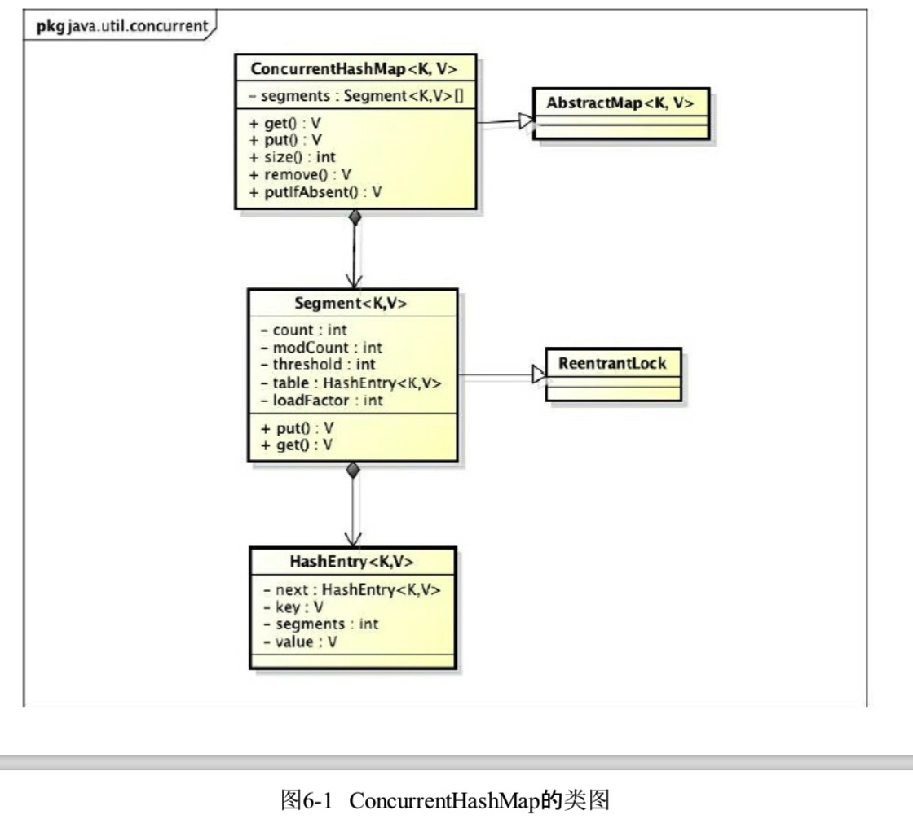
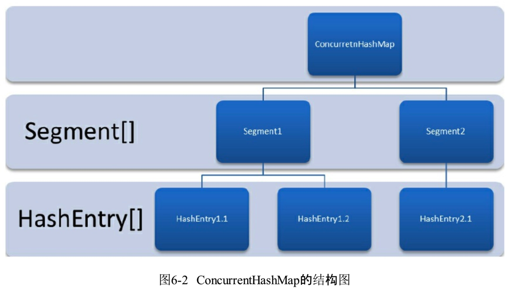

## 第6章 Java并发容器和框架
    
### 6.1 ConcurrentHashMap的实现原理
    
#### 6.1.1 为什么要使用ConcurrentHashMap

**1 线程不安全的HashMap**
    
    执行下面代码会造成死循环(笔者没有测试出来)，原因是多线程会导致HashMap的Entry链表形成环形数据结构
    
    public class UnSafeHashMapTest {
        public static void main(String[] args) throws InterruptedException {
            HashMap<String, String> map = new HashMap<>(2);
            Thread t = new Thread(new Runnable() {
                @Override
                public void run() {
    
                    for (int i = 0; i < 10000; i++) {
                        new Thread(new Runnable() {
                            @Override
                            public void run() {
                                map.put(UUID.randomUUID().toString(),"");
                            }
                        },"ftf"+i).start();
                    }
                }
            },"ftf");
            t.start();
            t.join();
        }
    } 
          
**2 效率低下的HashTable**

    HashTable 容器使用synchronized来保证线程安全，但在线程竞争激烈的情况下HashTable的效率非常低下。
    一旦有线程获得同步，则HashTable的put和get方法，其他线程均不能使用
 
**3 ConcurrentHashMap的锁分段技术**
    
    1.HashTable使用同一把锁，并发效率低下
    2.ConcurrentHashMap将容器的数据分成多段，每一段配一把锁，当访问不同段数据时，就不存在竞争了
    
#### 6.1.2 ConcurrentHashMap的结构
    
    1.ConcurrentHashMap是由Segment数组结构和HashEntry数组结构组成。
    2.Segment是一种可重入锁，一个ConcurrentHashMap包含一个Segment数组，Segment的结构和HashMap类似，是一种数组和链表的结构。
    3.HashEntry用于存储键值对数据。一个Segment包含一个HashEntry数组，每个HashEntry是一个链表结构的元素，每个Segmeent守护着一个HashEntry数组里的元素
    

 
#### 6.1.3 ConcurrentHashMap的初始化(jdk1.7)
  
** 初始化segments、segmentShift和segmentMask、segment**
    
    1.通过initialCapacity,loadFactor和concurrencyLevel等几个参数来初始化segment数组、段偏移量segmentShift，段掩码segmentMask和segment里的HashEntry
    2.segments数组的长度是2的N次方，大于等于concurrencyLevel的最小的2的N次方值，如concurrencyLevel等于14，15或16，那么只能是16
    3.segmentShift用于定位参与散列运算的位数，segmentShift=32-sshift(默认情况下concurrencyLevel=16=1<<4, 可以看成concurrencyLevel= 1<< sshift,所以sshift = 4)
    4.segmentShift=32-sshift，32是由于ConcurrentHashMap里的hash()方法输出的最大数是32位的
    5.segmentMask(散列运算掩码)= ssize(segments的长度) -1; 16<= ssize <= 65536, 15=<segmentMask<=65535
    6.initialCapacity是ConcurrentHashMap初始化容量，cap是HashEntry数组的长度，cap不是1就是2的N次方
    7.loadFactor是segment负载因子
    
    
    初始化Segment
     public ConcurrentHashMap(int initialCapacity,
                                 float loadFactor, int concurrencyLevel) {
        if (!(loadFactor > 0) || initialCapacity < 0 || concurrencyLevel <= 0)
            throw new IllegalArgumentException();
        // concurrencyLevel 的最大值65535
        if (concurrencyLevel > MAX_SEGMENTS)
            concurrencyLevel = MAX_SEGMENTS;
        // Find power-of-two sizes best matching arguments
        int sshift = 0;
        int ssize = 1;
        // 计算出ssize刚好是大于或等于concurrencyLevel的2的N次方的最小值
        while (ssize < concurrencyLevel) {
            ++sshift;
            ssize <<= 1;
        }
        // sshift 2的N次方的N的值
        this.segmentShift = 32 - sshift;
        // segmentMask segments数组长度-1
        this.segmentMask = ssize - 1;
        // 初始容量最大值 1073741824 2的30次方
        if (initialCapacity > MAXIMUM_CAPACITY)
            initialCapacity = MAXIMUM_CAPACITY;
        // 初始容量对segments长度整除
        int c = initialCapacity / ssize;
        if (c * ssize < initialCapacity)
            ++c;
        int cap = MIN_SEGMENT_TABLE_CAPACITY;
        // cap就是segment里HashEntry数组的长度
        while (cap < c)
            cap <<= 1;
        // create segments and segments[0]
        Segment<K,V> s0 =
            new Segment<K,V>(loadFactor, (int)(cap * loadFactor),
                             (HashEntry<K,V>[])new HashEntry[cap]);
        Segment<K,V>[] ss = (Segment<K,V>[])new Segment[ssize];
        UNSAFE.putOrderedObject(ss, SBASE, s0); // ordered write of segments[0]
        this.segments = ss;
    }
    
#### 6.1.4 定位Segment

    1.ConcurrentHashMap在插入和获取元素的时候，必须先通过散列算法定位到Segment。先使用Wang/Jenkins hash的变种算法对元素hashCode进行一次再散列
    
    
    private int hash(Object k) {
       // hashSeed = randomHashSeed(this)
       int h = hashSeed;
       
       if ((0 != h) && (k instanceof String)) {
           // 这里根据k算出hashCode
           return sun.misc.Hashing.stringHash32((String) k);
       }
       
       // 这里也是算hashCode的值
       h ^= k.hashCode();

       // Spread bits to regularize both segment and index locations,
       // using variant of single-word Wang/Jenkins hash.
       h += (h <<  15) ^ 0xffffcd7d;
       h ^= (h >>> 10);
       h += (h <<   3);
       h ^= (h >>>  6);
       h += (h <<   2) + (h << 14);
       return h ^ (h >>> 16);
   }
       
    
    
#### 6.1.5 ConcurrentHashMap的操作
    
**1 get操作**

    Class tc = HashEntry[].class;
    Class sc = Segment[].class;
    TBASE = UNSAFE.arrayBaseOffset(tc); // 获取数组元素的第一个元素的偏移地址
    SBASE = UNSAFE.arrayBaseOffset(sc);
    ts = UNSAFE.arrayIndexScale(tc);
    ss = UNSAFE.arrayIndexScale(sc);
    
    arrayIndexScale方法也是一个本地方法，可以获取数组的转换因子，也就是数组中元素的增量地址
    SSHIFT = 31 - Integer.numberOfLeadingZeros(ss);
    TSHIFT = 31 - Integer.numberOfLeadingZeros(ts);
    
    （hash >>> segmentShift) & segmentMask// 定位Segment所使用的hash算法
     int index = hash & (tab.length - 1)// 定位HashEntry锁使用过的hash算法
     定位Segment使用的是元素的hashCode通过再散列后得到的值的高位，而定位HashEntry直接使用的是再散列后的值
    
    
     public V get(Object key) {
         Segment<K,V> s; // manually integrate access methods to reduce overhead
         HashEntry<K,V>[] tab;
         int h = hash(key);
         // 拿到数组的索引
         long u = (((h >>> segmentShift) & segmentMask) << SSHIFT) + SBASE;
         // (Segment<K,V>)UNSAFE.getObjectVolatile(segments, u)  根据索引拿到Segment对象
         // s.table 拿到HashEntry<K,V>[] 数组
         if ((s = (Segment<K,V>)UNSAFE.getObjectVolatile(segments, u)) != null &&
             (tab = s.table) != null) {
             // ((long)(((tab.length - 1) & h)) << TSHIFT) + TBASE 相当于HashEntry对象的索引(应该是偏移地址值)
             // UNSAFE.getObjectVolatile(Object obj, long offset):获取obj对象中offset偏移地址对应的object型field的值,支持volatile load语义
             for (HashEntry<K,V> e = (HashEntry<K,V>) UNSAFE.getObjectVolatile
                      (tab, ((long)(((tab.length - 1) & h)) << TSHIFT) + TBASE);
                  e != null; e = e.next) {
                  // 到这里终于拿到了entry了，然后 就是比对k的问题了
                 K k;
                 if ((k = e.key) == key || (e.hash == h && key.equals(k)))
                     return e.value;
             }
         }
         return null;
     }   
    
    
**2 put操作**   
    
    public V put(K key, V value) {
        Segment<K,V> s;
        if (value == null)
            throw new NullPointerException();
        int hash = hash(key);
        int j = (hash >>> segmentShift) & segmentMask;
        // 增加一段Segment操作
        if ((s = (Segment<K,V>)UNSAFE.getObject          // nonvolatile; recheck
             (segments, (j << SSHIFT) + SBASE)) == null) //  in ensureSegment
            s = ensureSegment(j);
        return s.put(key, hash, value, false);
    }
    
    
    private Segment<K,V> ensureSegment(int k) {
        final Segment<K,V>[] ss = this.segments;
        long u = (k << SSHIFT) + SBASE; // raw offset
        Segment<K,V> seg;
        if ((seg = (Segment<K,V>)UNSAFE.getObjectVolatile(ss, u)) == null) {
            Segment<K,V> proto = ss[0]; // use segment 0 as prototype
            // 重新构造一个Segment对象
            int cap = proto.table.length;
            float lf = proto.loadFactor;
            int threshold = (int)(cap * lf);
            HashEntry<K,V>[] tab = (HashEntry<K,V>[])new HashEntry[cap];
            if ((seg = (Segment<K,V>)UNSAFE.getObjectVolatile(ss, u))
                == null) { // recheck
                // 重新构造一个Segment对象
                Segment<K,V> s = new Segment<K,V>(lf, threshold, tab);
                // 自旋CAS 扩容，是不是？
                while ((seg = (Segment<K,V>)UNSAFE.getObjectVolatile(ss, u))
                       == null) {
                    if (UNSAFE.compareAndSwapObject(ss, u, null, seg = s))
                        break;
                }
            }
        }
        return seg;
    }
    
    // 参数key，key散列后的hash，value 
    final V put(K key, int hash, V value, boolean onlyIfAbsent) {
        HashEntry<K,V> node = tryLock() ? null :
            scanAndLockForPut(key, hash, value);
        V oldValue;
        try {
            HashEntry<K,V>[] tab = table;
            int index = (tab.length - 1) & hash;
            HashEntry<K,V> first = entryAt(tab, index);
            // 又自旋
            for (HashEntry<K,V> e = first;;) {
                if (e != null) {
                    K k;
                    if ((k = e.key) == key ||
                        (e.hash == hash && key.equals(k))) {
                        oldValue = e.value;
                        if (!onlyIfAbsent) {
                            e.value = value;
                            ++modCount;
                        }
                        break;
                    }
                    e = e.next;
                }
                else {
                    if (node != null)
                        node.setNext(first);
                    else
                        node = new HashEntry<K,V>(hash, key, value, first);
                    int c = count + 1;
                    if (c > threshold && tab.length < MAXIMUM_CAPACITY)
                        rehash(node);
                    else
                        setEntryAt(tab, index, node);
                    ++modCount;
                    count = c;
                    oldValue = null;
                    break;
                }
            }
        } finally {
            unlock();
        }
        return oldValue;
    }
    
    
**3 size操作**     
      
    public int size() {
        // Try a few times to get accurate count. On failure due to
        // continuous async changes in table, resort to locking.
        final Segment<K,V>[] segments = this.segments;
        int size;
        boolean overflow; // true if size overflows 32 bits
        long sum;         // sum of modCounts
        long last = 0L;   // previous sum
        int retries = -1; // first iteration isn't retry
        try {
            for (;;) {
                if (retries++ == RETRIES_BEFORE_LOCK) {
                    for (int j = 0; j < segments.length; ++j)
                        ensureSegment(j).lock(); // force creation
                }
                sum = 0L;
                size = 0;
                overflow = false;
                for (int j = 0; j < segments.length; ++j) {
                    Segment<K,V> seg = segmentAt(segments, j);
                    if (seg != null) {
                        sum += seg.modCount;
                        int c = seg.count;
                        if (c < 0 || (size += c) < 0)
                            overflow = true;
                    }
                }
                if (sum == last)
                    break;
                last = sum;
            }
        } finally {
            if (retries > RETRIES_BEFORE_LOCK) {
                for (int j = 0; j < segments.length; ++j)
                    segmentAt(segments, j).unlock();
            }
        }
        return overflow ? Integer.MAX_VALUE : size;
    }
    
    
