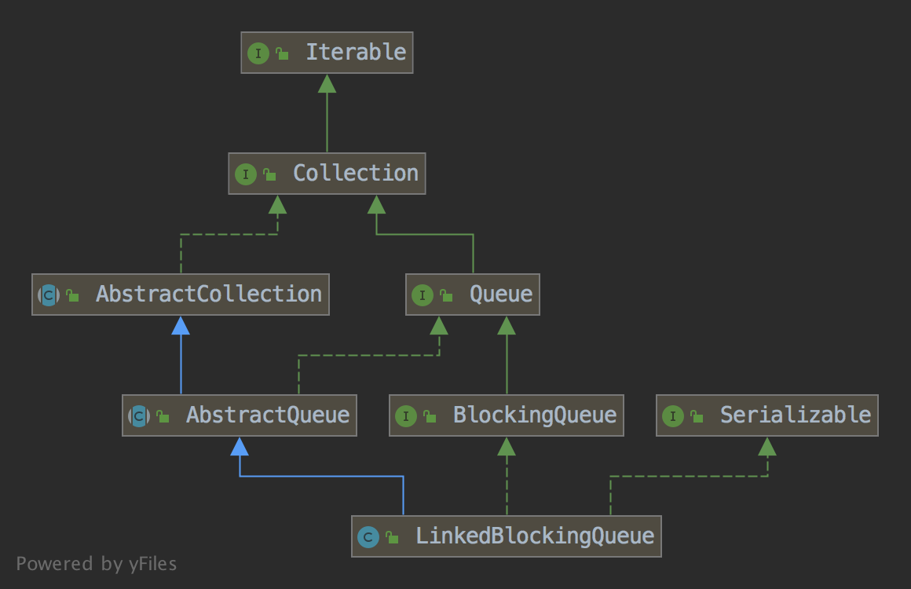

## LinkedBlockQueue

### 简介

    一个基于链表的固定容量FIFO先进先出的对列。
    
### 类图
    

                          
### api方法介绍
#### 构造方法
##### 1.指定容量构造LinkedBlockingQueue()
    // 
    public LinkedBlockingQueue(int capacity) {
        if (capacity <= 0) throw new IllegalArgumentException();
        this.capacity = capacity;
        // 头结点和尾结点 均指向一个值的节点对象Node
        last = head = new Node<E>(null);
    }
    
    // Node节点是静态内部类
    static class Node<E> {
        E item;
        Node<E> next;
        Node(E x) { item = x; }
    }
    
    
##### 2.无参构造LinkedBlockingQueue()
    
    // 默认容量是整型的最大值
    public LinkedBlockingQueue() {
        this(Integer.MAX_VALUE);
    }
##### 3.将集合转成对列的构造LinkedBlockingQueue()
    public LinkedBlockingQueue(Collection<? extends E> c) {
        this(Integer.MAX_VALUE);
        final ReentrantLock putLock = this.putLock;
        // 用于put，offer等方法的重入锁
        putLock.lock(); 
        try {
            int n = 0;
            for (E e : c) {
                if (e == null)
                    throw new NullPointerException();
                if (n == capacity)
                    throw new IllegalStateException("Queue full");
                enqueue(new Node<E>(e));
                ++n;
            }
            count.set(n);
        } finally {
            putLock.unlock();
        }
    }
    
    private void enqueue(Node<E> node) {
        // 先将node赋值给last.next的值，然后再将last的指向最新的node
        last = last.next = node;
    }

#### 普通方法 
##### 1.offer方法    
    offer:返回true(入队成功)和false(入队失败)，不超过容量，加入对列的尾部
    
    @Test
    public void testOffer()  {
        LinkedBlockingQueue<String> blockingQueue = new LinkedBlockingQueue<String>(3);
        blockingQueue.offer("1");
        blockingQueue.offer("2");
        blockingQueue.offer("3");
        blockingQueue.offer("4");
        System.out.println(blockingQueue);
        // 输出：[1, 2, 3]
    }
    
##### 2.put方法 
    put:无返回值，不超过容量，加入对列的尾部;当容量超过时，会被阻塞，可以进行打断进行中断，抛出InterruptedException   
    
    public void put(E e) throws InterruptedException {
            if (e == null) throw new NullPointerException();
            int c = -1;
            Node<E> node = new Node<E>(e);
            final ReentrantLock putLock = this.putLock;
            final AtomicInteger count = this.count;
            putLock.lockInterruptibly();
            try {
                while (count.get() == capacity) {
                    // 当容量满的时候，这段代码会阻塞等待
                    // 当另一个线程进行出队操作之后，方能继续添加
                    notFull.await();
                }
                enqueue(node);
                c = count.getAndIncrement();
                if (c + 1 < capacity)
                    notFull.signal();
            } finally {
                putLock.unlock();
            }
            if (c == 0)
                signalNotEmpty();
        }       

    
    
    
    

