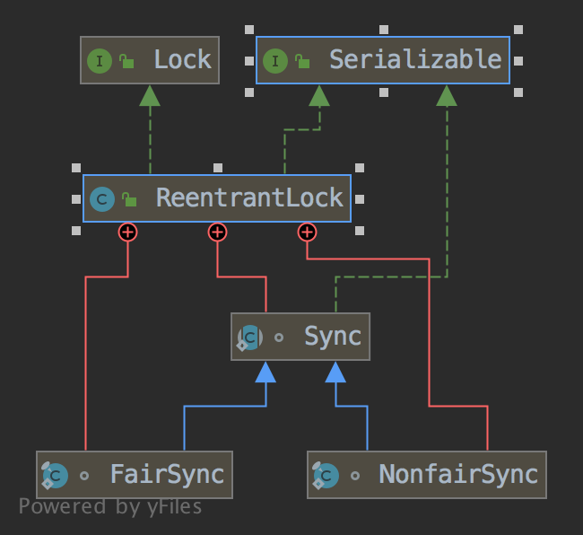

## ReentrantLock
## 简介
    1.可重入的互斥的Lock：同一个线程，多次获得同一把锁，只是计数累加（重入锁中有个计数器），
    不会有锁争夺开销
    2.可以设置是否公平：公平指等待锁资源的线程集合中，按顺序获得锁；
    非公平：等待锁资源的线程集合中，随机线程获得锁资源。
## 类图

## 构造方法
### 1.无参构造方法
    public ReentrantLock() {
        // sync同步器,是AQS的一个实现
        // 无参构造器默认 构建非公平锁
        sync = new NonfairSync();
    }
### 2.可指定是否公平的boolean类型入参的构造函数
    public ReentrantLock(boolean fair) {
        // FairSync和NonfairSync是ReentrantLock的两个内部类
        // 类图上可以看到均继承自Sync，
        // Sync是个抽象静态内部类，它继承自AbstractQueuedSynchronizer
        sync = fair ? new FairSync() : new NonfairSync();
    }
    
    

## 普通方法
### lock()
    

    
