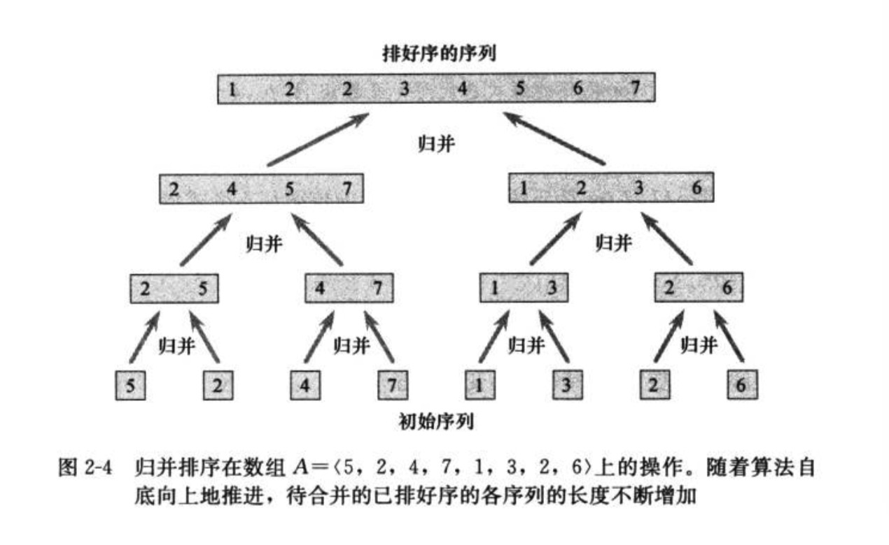
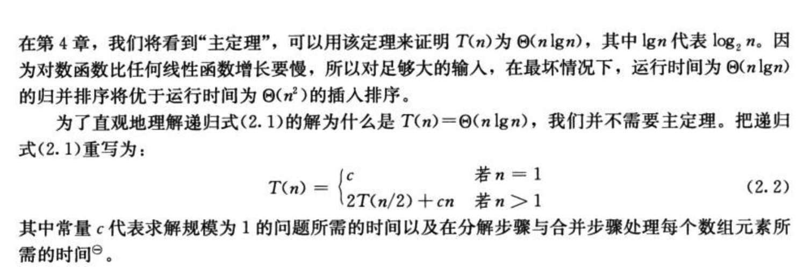

2 算法基础

### 2.1 插入排序

> 1.排序问题
  输入：n个数的一个序列(a1,a2,...,an)
  输入序列的一个排列(a1',a2',...,an')
  
  
```
INSERTION-SORT(A)
for j = 2 to A.lenth
    key = A[j]
    // Insert A[j] into the sorted sequenceA[1..j-1]
    i = j - 1
    while i > 0 and A[i] > key    # 所有在j之前，比A[j]大的元素，都往后移动一位，
        A[i+1] = A[i]
        i = i - 1
    A[i+1] = key                  # 将key赋给移动之后的正确位置


```


### 2.2 分析算法


```
INSERTION-SORT(A)                                           代价      次数       
for j = 2 to A.lenth                                        c1         n
    key = A[j]                                              c2         n-1
    // Insert A[j] into the sorted sequenceA[1..j-1]        0          n-1
    i = j - 1                                               c4         n-1
    while i > 0 and A[i] > key                              c5         ∑tj 求和从j=2 至n
        A[i+1] = A[i]                                       c6         ∑(tj-1) 求和从j=2 至n
        i = i - 1                                           c7         ∑(tj-1) 求和从j=2 至n
    A[i+1] = key                                            c8         n-1

```


> 若数组已经排好序，最佳运行情况：


> 若数组完全逆序，最坏运行情况：


### 2.3 设计算法

#### 2.3.1 分治法

> 1.将原问题分解为几个规模较小但类是与原问题的子问题，递归地求解这些问题，然后再合并这些子问题的解。
> 2.分治模式在每层递归时都有三个步骤：
（1）<strong>分解</strong>原问题为若干子问题，这些子问题是原问题的规模较小的实例
（2）<strong>解决</strong>这些子问题，递归地求解各个子问题。若子问题的规模足够小，则直接求解
（3）<strong>合并</strong>这些子问题的解成原问题的解

```
# 归并排序 p <= q < r
MERGE(A,p,q,r)
n1=q-p+1                                            #
n2=r-q                                              #
let L[1..n1+1] and R[1..n2+1] be new arrays
for i = 1 to n1
    L[i] = A[p+i-1]
for j = 1 to n2
    R[j] = A[q+j]
L[n1+1] = ∞
R[n2+1] = ∞
i = 1
j = 1
for k = p to r
    if L[i] <= R[j]
        A[k] = L[i]
        i = i + 1
    else A[k] = R[j]
        j = j + 1
        
        
        
#
MERGE-SORT(A,p,r)
if p < r
    q = |(p+r)/2|
    MERGE-SORT(A,p,q)
    MERGE-SORT(A,q+1,r)
    MERGE(A,p,q,r)

```



#### 2.3.2 分析分治算法





