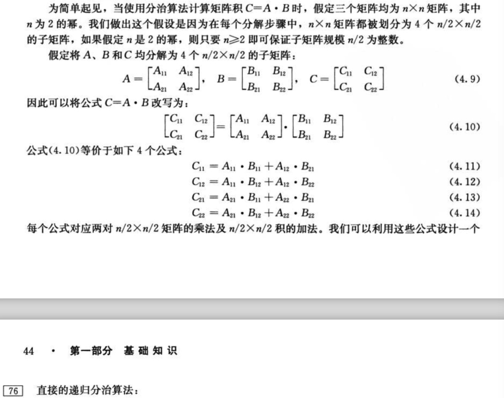

4 分之策略

> 递归求解三步骤：
  (1)分解(Divide)步骤将问题划分为一些子问题，子问题的形式与原问题一样，只是规模更小。
  (2)解决(Conquer)步骤递归地求解出子问题。如果子问题的规模足够小，则停止递归，直接求解。
  (3)合并(Combine)步骤将子问题的解组合成原问题的解。

###  4.1最大子数组

**使用分治策略的求解方法**

> A[low,high]的任何连续的子数组A[i,j]所处的位置必然是一下三种情况之一：
  (1):完全位于子数组A[low...mid]中，因此low≤i≤j≤mid
  (2):完全位于子数组A[mid+1..high]中，因此mid≤i≤j≤high
  (3):跨越了中点，因此low≤i≤mid≤j≤high
  因此，A[low..high]的最大子数组所处的位置必然是这三种情况之一。实际上，A[low,high]的一个最大子数组必然是完全位于
  A[low..mid]中、完全位于A[mid+1..high]中或者跨越中点的所有子数组中和最大者。我们可以递归地求解A[low..mid]和A[mid+1..high]
  的最大子数组，因为这两个子问题仍是最大子数组问题，只是规模更小。 因此，剩下的全部工作就是寻找跨越中点的最大子数组，然后再三种情况
  中选取和最大者
  


```

// FIND-MAX-CROSSING-SUBARRAY接收数组A和下标low、mid和high为输入，
// 返回一个下标元组划定跨越中点的最大子数组的边界，并返回最大子数组中值的和
FIND-MAX-CROSSING-SUBARRAY(A,low,mid,high)
left-sum = -∞
sum = 0
for i = mid down low
    sum = sum + A[i]
    if sum > left-sum
        left-sum = sum
        max-left = i
right-sum = -∞
sum = 0
for j = mid + 1 to high
sum = sum + A[j]
if sum > right-sum
    right-sum = sum
    max-right = j
return (max-left,max-right,left-sum+right-sum)

# 
FIND-MAXIMUM-SUBARRAY(A,low,high)
if high == low
    return (low,high,A[low]);
else mid = |(low+high)/2|
    (left-low,left-high,left-sum) = 
        FIND-MAXIMUM-SUBARRAY(A,low,mid)
    (right-low,right-high,right-sum) = 
        FIND-MAXIMUM-SUBARRAY(A,mid+1,high)
    (cross-low,cross-high,cross-sum) =
        FIND-MAX-CROSSING-SUBARRAAY(A,low,mid,high)
    if left-sum ≥ right-sum and left-sum ≥ cross-sum
        return (left-low,left-high,left-sum)
    elseif right-sum ≥  left-sum and right-sum ≥ cross-sum
        return (right-low,right-high,right-sum)
    else return (cross-low,cross-high,cross-sum)

```

**分治算法分析**


###  4.2 矩阵乘法的Strassen算法

> 1.若A=(aij)和B=(bij)是n*n的方阵，则对i,j=1,2,...,n,定义乘积C=A·B中的元素Cij为:
  


```
# SQUARE-MAXTRIX-MULTIPLY 花费O(n3)时间
SQUARE-MAXTRIX-MULTIPLY(A,B)
n = A.rows
let C be a new n*n matrix
for i = 1 to n
    for j = 1 to n
        cij = 0
        for k = 1 to n
            cij = cij + aik * bkj

```

**一个简单的分治算法**



```
SQUARE-MATRIX-MULTIPLY-RECURSIVE(A,B)
n = A.rows
let C be a new n*n matrix
if n == 1
    c11 = a11* b11
else A,B, and C as in equations(4,9)                        # 如何分解矩阵？
    c11 = SQUARE-MATRIX-MULTIPLY-RECURSIVE(A11,B11)
        + SQUARE-MATRIX-MULTIPLY-RECURSIVE(A12,B21)
    C12 = SQUARE-MATRIX-MULTIPLY-RECURSIVE(A11,B12)
        + SQUARE-MATRIX-MULTIPLY-RECURSIVE(A12,B22)
    C21 = SQUARE-MATRIX-MULTIPLY-RECURSIVE(A21,B11)
        + SQUARE-MATRIX-MULTIPLY-RECURSIVE(A21,B21)
    C22 = SQUARE-MATRIX-MULTIPLY-RECURSIVE(A21,B12)
        + SQUARE-MATRIX-MULTIPLY-RECURSIVE(A22,B22)
return C

```


###  4.3 用带入发求解递归式

> 代入法求解分两步：
  1.猜测解的形式：
  2.用数学归纳法求出解中的常数，并证明是正确的
  
 

 
###  4.4 用递归树方法求解递归式

> 以递归式T(n)=3T(⌊n/4⌋)+Θ(n2)为例：可以将上式改为T(n)=3T(⌊n/4⌋)+cn2


> 详细证明过程略


###  4.5 用主方法求解递归式
    
> 主方法求解方法：T(n) = aT(n/b) + f(n)；其中a≥1 和b＞1
    
    
      
    
    


  
  


