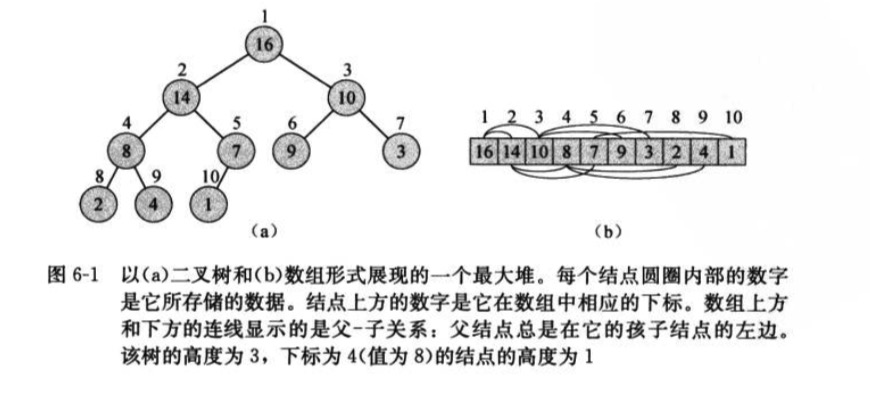
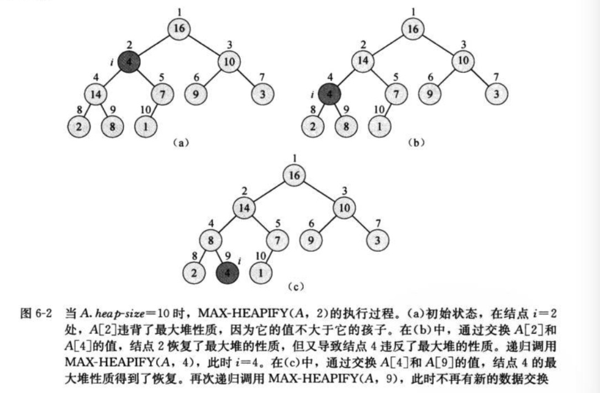
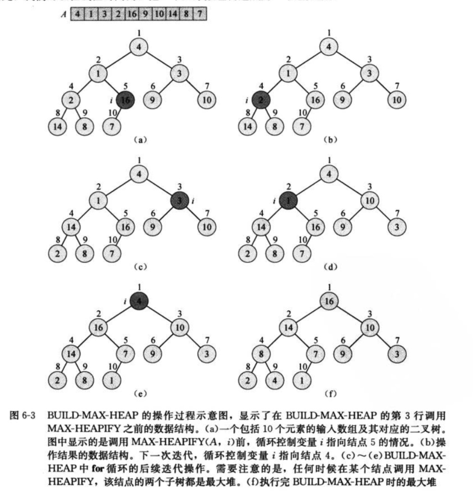
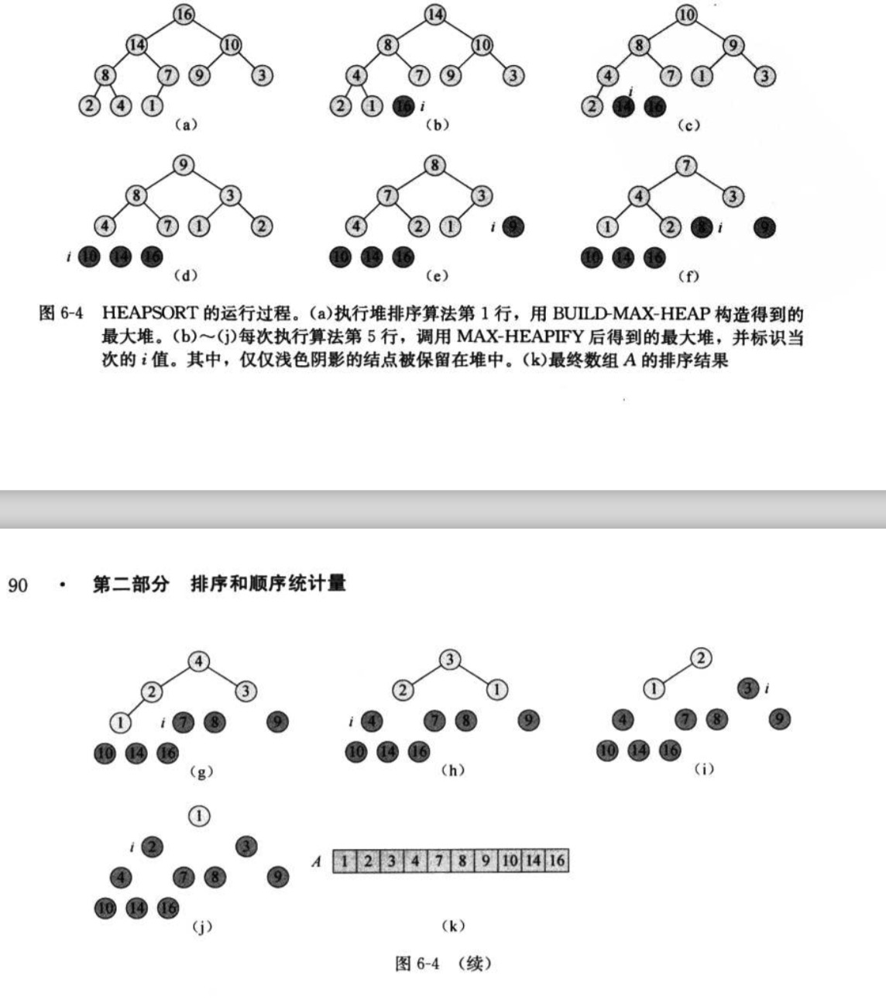
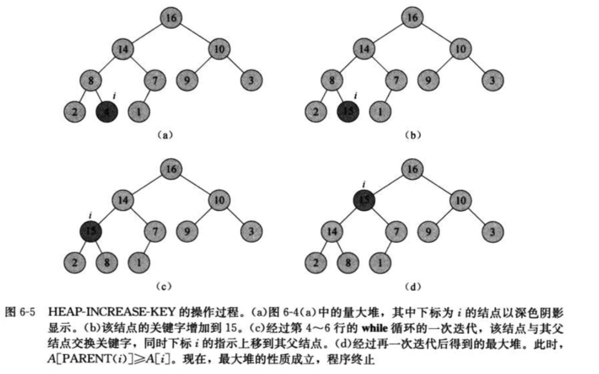

6 堆排序

> 1.堆排序的时间复杂度是O(nlgn)
> 2.它可以构造一种有效的优先队列。

### 6.1 堆

> 1.二叉堆是一个数组，它可以被看成一个近似的完全二叉树，树上的每一个结点对应数组中的一个元素。
> 2.表示堆的数组A包括两个属性：A.length给出数组元素的个数，A.heap-size表示有多少个堆元素存储在该数组中。
> 3.树的根结点是A[1],这样给定的结点的下标i，可以计算出它的父结点、左孩子和右孩子。

```
PARENT(i)
    return [i/2]

LEFT(i)
    return 2i;
 
RIGHT(i)
    return 2i+1;

```



> 4.<strong>最大堆</strong>，最大堆性质是指除了根以外的所有结点i都要满足：A[PARENT(i)] >= A[i],某个结点的值至多与其父结点的值一样大。
  堆中最大元素存放在根节点中。
> 5.<strong>最小堆</strong>，除了根以外的所有结点i都有A[PARENT(i)] <= A[i]，最小堆中的最小元素存放在根结点中。
> 6.堆的高度是O(lgn),运行时间至多与树的高度成正比，即时间复杂度为O(lgn)。
> 7.堆中的常见操作：
  MAX-HEAPIFY过程：其时间复杂度为O(lgn),它是维护最大堆性质的关键。
  BUILD-MAX-HEAP过程：具有线性时间复杂度，功能是从无序的输入数据数组中构造一个最大堆。
  HEAPSORT过程：其时间复杂度为O(nlgn),功能是对一个数组进行原址排序。
  MAX-HEAP-INSERT、HEAP-EXIRACT-MAX、HEAP-INCREASE-KEY和HEAP-MAXIMUM过程：时间复杂度为O(lgn),功能是利用堆实现一个优先队列。
  

### 6.2 维护堆的性质

> 1.MAX-HEAPIFY是用于维护最大堆性质的重要过程。它的输入为一个数组A和一个下标i：
> 2.MAX-HEAPIFY的时间复杂度是O(h)
 
```
MAX-HEAPIFY(A,i)
l = LEFT(i)
r = RIGHT(i)
if l <= A.heap-size and A[l] > A[i]
    largest = l
else largest = i
if r <= A.heap-size and A[r] > A[largest]
    largest = r
if largest != i
    exchange A[i] with A[largest]
    MAX-HEAPIFY(A,largest)

```




### 6.3 建堆

```
BUILD-HEAP(A)
A.heap-size = A.length
for i = [A.length / 2] downto 1
    MAX-HEAPIFY(A,i)
```



### 6.4 堆排序算法
    
```
HEAPSORT(A)
BUILD-MAX-HEAP(A)
for i = A.length downto 2
    exchange A[l] with A[i]
    A.heap-size = A.heap-size - 1
    MAX-HEAPIFY(A,l)
```



### 6.5 优先队列

> 1.优先队列(priority queue)是一种用来维护由一组元素构成的集合S的数据结构，其中的每一个元素都有一个相关的值，称为关键字(key)。
> 2.一个最大优先队列支持一下操作：
  INSERT(S,x): 把元素x插入集合S中。这一操作等价于S=SU{x}
  MAXIMUM(S)：返回S中的具有最大键字的元素。
  EXTRACT-MAX(S)：去掉并返回S中的具有最大键字的元素。
  INCERASE-KEY(S,x,k)：将元素x的关键字值增加到k，这里假设k的值不小于x的原关键字
  

```

HEAP-MAXIMUM(A)
    return A[1]

# 过程 HEAP-EXTRACT-MAX实现EXTRACT-MAX操作。他与HEAPSORT过程中的for循环体部分很相似
# HEAP-EXTRACT-MAX时间复杂度为O(lgn)
HEAP-EXTRACT-MAX(A)
if A.heap-size < 1
    error "heap underflow"
max = A[1]
A[1] = A[A.heap-size]
A.heap-size = A.heap-size - 1
MAX-HEAPIFY(A,1)
return max

# 时间复杂度是O(lgn)
HEAP-INSCERASE-KEY(A,i,key)
if key<A[i]
    error "new key is smaller than current key"
A[i] = key 
while i > l and A[PARENT(i) < A[i]]
    exchange A[i] with A[PARENT(i)]
    i = PARENT(i)
    
# MAX-HEAP-INSERT运行时间为O(lgn)   
MAX-HEAP-INSERT(A,key)
A.heap-size = A.heap-size + 1
A[A.heap-size] = -∞
HEAP-INCREASE-KEY(A,A.heap-size,key)

```




