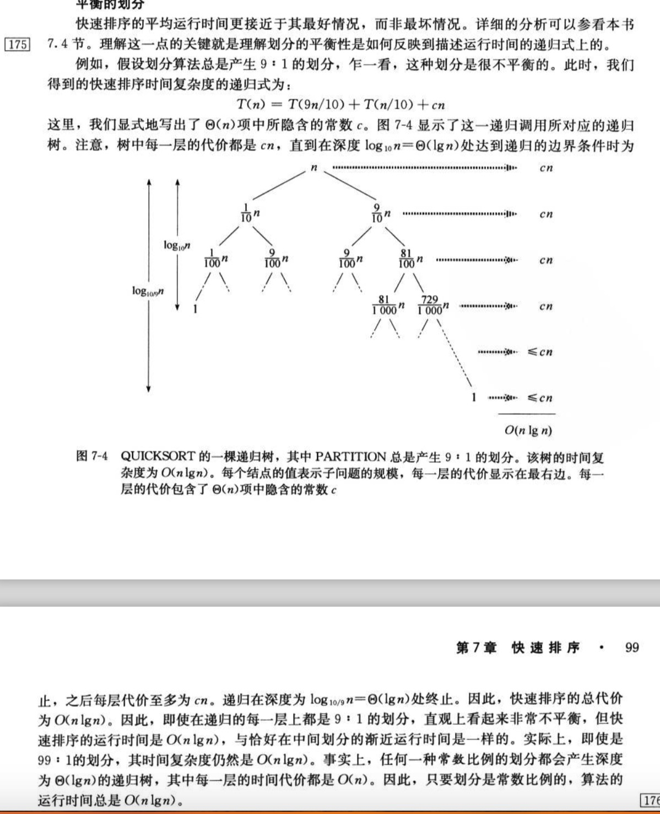

7 快速排序

> 快速排序是一种最坏的情况时间复杂度为Θ(n^2)的排序算法，虽然最坏情况时间复杂度很差，
  但是快速排序通常是实际排序应用中最好的选择，因为它的平均性能非常好：它的期望时间复
  杂度是Θ(nlgn)


### 7.1 快速排序的描述

> 快速排序使用了分治思想
  分解：数组A[p..r]被划分为两个(可能为空)子数组A[p..q-1]和A[q+1..r]，使得A[p..q-1]中
  的每一个元素都小于等于A[q]，而A[q]也小于等于A[q+1..r]中的每个元素。其中，计算下标q也是
  被划分过程的一部分。
  解决：通过递归调用快速排序，对子数组A[p..q-1]和A[q+1..r]进行排序
  合并：因为子数组都是原址排序的，所以不需要合并操作：数组A[p..r]已经有序。
  <stong>备注:原址排序是指基本上不需要额外的空间，也就是允许少量额外的辅助变量进行的排序</strong>
  
```
QUICHSORT(A,p,r)
if p<r
    q = PARTITION(A,p,r)
    QUICHSORT(A,p,q-1)
    QUICHSORT(A,q+1,r)
    
# 数组划分，PARTITION在子数组A[p..r]上的时间复杂度是Θ(n)
PARTITION(A,p,r)
x = A[r]                            # 主元(pivot elements)
i = p - 1                           
for j = p to r-1
    if A[j] ≤ x
        i = i + 1
        exchange A[i] with A[j]
exchange A[i+1] with A[r]
return i + 1    
``` 

### 7.2 快速排序的性能

> 快速排序的运行时间依赖于划分是否平衡，而平衡与否又依赖划分的元素。如果划分平衡，
  那么快速排序性能与归并排序一样。如果划分不平衡，那么快速排序的性能就接近于插入排序了。
  
> 最坏情况：当划分产生的两个子问题分别包含了n-1个元素和0个元素时，  此时的时间复杂度为Θ(n^2)
> 最好情况：PARTITION得到的两个子问题的规模都不大于n/2。这种情况，性能非常好。T(n)Θ(nlgn)




 
### 7.3 快速排序的随机化版本

```
RANDOMIZED-PARTITION(A,p,r)
i = RANDOM(p,r)
exchange A[r] with A[i]
return PARTITION(A,p,r)

RANDOMIZE-QUICKSORT(A,p,r)
if p < r
    q = RANDOMIZED-PARTITION(A,p,r)
    RNADOMIZED-QUICKSORT(A,p,q-1)
    RANDOMIZED-QUICKSORT(A,q+1,r)
```


