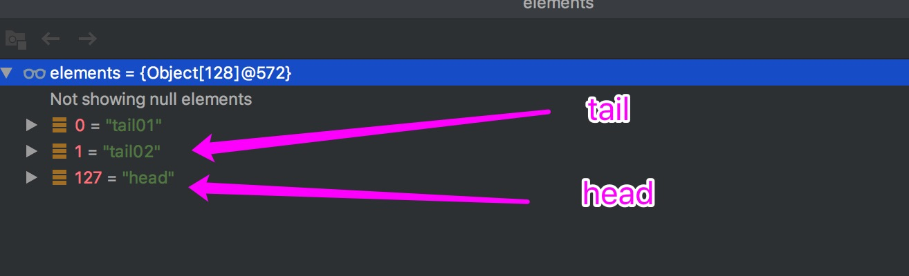

ArrayDeque.md(双端对列)

### 1 介绍
#### 1.1 概念介绍

>1.在index.md文件里的简单介绍<br/>
>2.ArrayDeque双端对列，可以对对列尾部和头部进行增加、删除的对列<br/>
>3.ArrayDeque底层是数组，LinkedList底层是链表<br/>
>4.ArrayDeque的装元素的数组长度永远是2的N次方<br/>
>5.当ArrayDeque满时，head=tail，形成了一个环，也叫循环数组<br/>
>6.head和tail在add和remove时，随着操作在动态变化，就向指针一样，addFirst，则head-1；addLast，则tail+1

#### 1.2 类图结构


### 2 源码额分析

#### 2.1 字段

>elements Object[]:存放对列的数组<br/>
>head int :对列头部<br/>
>tail int :对列尾部<br/>
>private static final int MIN_INITIAL_CAPACITY = 8 :最小容量<br/>

#### 2.2 方法

##### 2.2.1 构造方法

```$xslt
// 默认16容量的无参构造函数
public ArrayDeque() {
    elements = new Object[16];
}

// 指定大小的构造函数，虽然指定大小，但是elements的大小永远都是2的N次方
public ArrayDeque(int numElements) {
    allocateElements(numElements);
}

private void allocateElements(int numElements) {
    elements = new Object[calculateSize(numElements)];
}

// 计算大小的主要方法，这个方法计算之后，根据numElements的值，计算出initialCapacity刚好是大于numElements最小的2的N次方数
// 比如numElements <=16 则initialCapacity = 16；16< numElements <=128 则initialCapacity = 128；....
private static int calculateSize(int numElements) {
    int initialCapacity = MIN_INITIAL_CAPACITY;
    // Find the best power of two to hold elements.
    // Tests "<=" because arrays aren't kept full.
    if (numElements >= initialCapacity) {
        initialCapacity = numElements;
        initialCapacity |= (initialCapacity >>>  1);
        initialCapacity |= (initialCapacity >>>  2);
        initialCapacity |= (initialCapacity >>>  4);
        initialCapacity |= (initialCapacity >>>  8);
        initialCapacity |= (initialCapacity >>> 16);
        initialCapacity++;

        if (initialCapacity < 0)   // Too many elements, must back off
            initialCapacity >>>= 1;// Good luck allocating 2 ^ 30 elements
    }
    return initialCapacity;
}
```

##### 2.2.2 add及相关方法

```$xslt
// 在对尾加入
public boolean add(E e) {
    addLast(e);
    return true;
}
//
public void addLast(E e) {
    if (e == null)
        throw new NullPointerException();
    // 直接赋值给对尾
    elements[tail] = e;
    // tail+1,并且判断对列是否满了，满了进行扩容
    // elements.length - 1 = 2^n - 1 (二进制的值全是1)
    // tail + 1（初始情况head = tail = 0，一般情况下是从0向上增长，当tail+1 = elements.length，这时就会越界，但是进过(tail + 1) & (elements.length - 1) 后，又会回到0，即tail = head，满了，进行扩容）
    if ( (tail = (tail + 1) & (elements.length - 1)) == head)
        doubleCapacity();
}

// 而被扩容操作，这个方法，处理的情况，包含了head不一定是从0开始的情况，
private void doubleCapacity() {
    // 判断是否相等
    assert head == tail;
    // 对头
    int p = head;
    // 长度
    int n = elements.length;
    // 对头到elements长度，即末尾的数量，即将数组分了两部分，左边部分，和右边部分
    int r = n - p; // number of elements to the right of p
    // 这里主要判断 newCapacity是否超过(一般是Integer的最大值，即溢出了)最大值
    int newCapacity = n << 1;
    if (newCapacity < 0)
        throw new IllegalStateException("Sorry, deque too big");
    Object[] a = new Object[newCapacity];
    // 拷贝数组左半部分
    // 拷贝数组右半部分
    System.arraycopy(elements, p, a, 0, r);
    System.arraycopy(elements, 0, a, r, p);
    elements = a;
    head = 0;
    tail = n;
}

```
#####2.2.2 offer及相关方法(和add方法类似）

```$xslt
// 对尾入队
public boolean offer(E e) {
    return offerLast(e);
}
// 对尾入队
public boolean offerLast(E e) {
    addLast(e);
    return true;
}

```
#####2.2.3 offerFirst(首位入队)

```$xslt

public boolean offerFirst(E e) {
    addFirst(e);
    return true;
}

public void addFirst(E e) {
    if (e == null)
        throw new NullPointerException();
    // 这里和末尾入队是一样的套路，重新计算了一下head的值
    elements[head = (head - 1) & (elements.length - 1)] = e;
    if (head == tail)
        doubleCapacity();
}


```

#####2.2.4 addFirst和addLast同时使用的例子

```$xslt
public class ArrayQueueTest {
    public static void main(String[] args) {
        ArrayDeque<String> deque = new ArrayDeque<String>(100);
        // 通过断点可知，head的索引是127，其实是element.length的最后一位
        // tail 是从0开始增长的，但无论怎么操作，最后满的时候，tail==head
        deque.addLast("tail01");
        deque.addFirst("head");
        deque.addLast("tail02");
    }
}

```




#####2.2.5 removeFirst及相关的方法

```$xslt

// 删除对列
public E removeFirst() {
    E x = pollFirst();
    if (x == null)
        throw new NoSuchElementException();
    return x;
}

public E pollFirst() {
    // 
    int h = head;
    @SuppressWarnings("unchecked")
    E result = (E) elements[h];
    // Element is null if deque empty
    if (result == null)
        return null;
    // 手动置空，触发GC
    elements[h] = null;     // Must null out slot
    // 将head向后移动一位
    head = (h + 1) & (elements.length - 1);
    return result;
}


```
