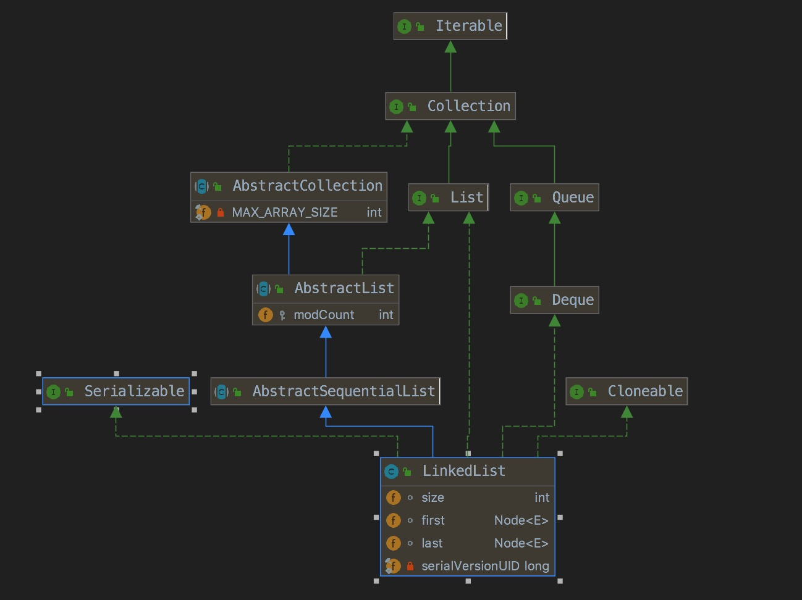

LinkedList
### 1 介绍
### 1.1 概念介绍

略

### 1.2 类图结构



### 2 源码额分析
#### 2.1 字段
> 1. transient int size = 0 ,链表大小
> 2. transient Node<E> first ,链表头部,初始值为null
> 3. transient Node<E> last ,链表尾部,初始值为null
#### 2.2 内部类

```

// 链表的节点，
private static class Node<E> {
    E item;
    Node<E> next;
    Node<E> prev;

    Node(Node<E> prev, E element, Node<E> next) {
        this.item = element;
        this.next = next;
        this.prev = prev;
    }
}


```

#### 2.3 方法
##### 2.3.1 构造方法

```

// 无参构造方法，说明为长度为0的链表，fisrt=last=null，若是链表长度为1，则first=last，都指向第一个Node
public LinkedList() {
}

// 传入目标集合转化为链表的1个参数的构造方法
public LinkedList(Collection<? extends E> c) {
    this();
    addAll(c);
}

public boolean addAll(Collection<? extends E> c) {
    // size = 0 ,初始size为0
    return addAll(size, c);
}

public boolean addAll(int index, Collection<? extends E> c) {
    // 校验索引的合法性
    checkPositionIndex(index);
    // 将集合转化为数组
    Object[] a = c.toArray();
    int numNew = a.length;
    if (numNew == 0)
        return false;

    // 构造两个节点，前驱(pred)和后继(succ)
    Node<E> pred, succ;
    // 若是指定的位置index与size相等，则是从size处开始，向后进行增加节点
    if (index == size) {
        // 这里后继肯定是null,前驱(即则增加开始出是最后一个节点)
        // 初始构造 index = 0 ，size = 0，所以肯定走这里的逻辑
        succ = null;
        pred = last;
    } else {
        // 否则，获得指定index处的节点先
        succ = node(index);
        pred = succ.prev;
    }
    
    // 循环将集合的元素，添加到链表中
    for (Object o : a) {
        @SuppressWarnings("unchecked") E e = (E) o;
        // 构造新的节点，新节点的后继是null
        Node<E> newNode = new Node<>(pred, e, null);
        // 若前驱pred == null,说明是链表是空的，那么将新节点赋值个first，这里的逻辑肯定是空链表
        if (pred == null)
            first = newNode;
        else
            // pred != null,说明不是空链表了，那么将前驱节点的后继succ指向新构造的节点newNode
            pred.next = newNode;
        // 将新节点赋值给前驱节点，便于下次循环将新节点添加在新的pred后面
        pred = newNode;
    }
    
    // succ == null ,说明是空链表
    if (succ == null) {
        // 那么上面循环走完后，最后一个pred赋值给last
        last = pred;
    } else {
        // 否则，走完循环的最后一个节点pred的后继要指向succ， succ的前驱指向pred，
        pred.next = succ;
        succ.prev = pred;
    }
    
    // 维护链表长度
    size += numNew;
    modCount++;
    return true;
}


// 获得指定index的节点
Node<E> node(int index) {
        // assert isElementIndex(index);
    // size >> 1相当于 size除以2，其实这里是为了提升查找速度，将链表一分为2，分成了从前往后遍历查找和从后往前查找两部分
    // 有点类似2分查找，但这里值2分了一次
    if (index < (size >> 1)) {
        // 这里从前往后查找目标节点
        Node<E> x = first;
        for (int i = 0; i < index; i++)
            x = x.next;
        return x;
    } else {
        // 从后往前查找目标元素
        Node<E> x = last;
        for (int i = size - 1; i > index; i--)
            x = x.prev;
        return x;
    }
}

```
    
##### 2.3.2 普通方法(主要分析一下方法)

|方法名称|方法描述|
|----|----|
|addFirst(E e)| 在链表头部增加|
|addLast(E e)|在链表尾部增加|
|add(E e)|添加一个元素，实际是addLast(E e)|
|add(int index, E element)|在指定位置，添加元素|
|removeFirst()|移除第一个元素|
|removeLast()|移除最后一个元素|
|remove(Object o)|移除目标元素|
|get(int index)|获得指定index的元素|
|set(int index, E element)|在指定位置，存放目标元素|
|remove(int index)|移除指定index元素|
|E peek()|获取第一个元素，类似获取栈顶元素，只获取，不出栈(即不移除)|
|E poll()|获取并移除，出栈操作|
|boolean offer(E e)|类似对列的入队操作，其实就是增加元素，调用add(E e)方法|


```
// 在链表第一个元素增加
public void addFirst(E e) {
    linkFirst(e);
}

private void linkFirst(E e) {
    final Node<E> f = first;
    // 构造一个前驱节点为null的新节点
    final Node<E> newNode = new Node<>(null, e, f);
    // 第一个元素指向新节点
    first = newNode;
    // f==null,说明空链表，那么first=last=newNode
    if (f == null)
        last = newNode;
    else
        // 否则，将没增加前的第一个节点的前驱指向新的节点
        f.prev = newNode;
    size++;
    modCount++;
}

// 在链表尾部增加
public void addLast(E e) {
    linkLast(e);
}    
   
void linkLast(E e) {
    final Node<E> l = last;
    // 构造一个后继节点为null的新节点
    final Node<E> newNode = new Node<>(l, e, null);
    // 将last指向新节点
    last = newNode;
    // l == null 说明空链表，增加第一个元素，则last=first=newNode
    if (l == null)
        first = newNode;
    else
        // 没增加前的最后一个节点的后继指向newNode
        l.next = newNode;
    size++;
    modCount++;
} 

// 删除第一个节点
public E removeFirst() {
    final Node<E> f = first;
    if (f == null)
        throw new NoSuchElementException();
    return unlinkFirst(f);
}

// 移除指定节点
private E unlinkFirst(Node<E> f) {
    // assert f == first && f != null;
    // 节点中存放的元素 
    final E element = f.item;
    // 获得f的后继节点
    final Node<E> next = f.next;
    // 将f的元素和后继置空，有助于GC回收
    f.item = null;
    f.next = null; // help GC
    // 将f的后继赋给第一个节点
    first = next;
    if (next == null)
        // next == null 说明链表就1个元素，那么移除first，其实需要将last也置空
        last = null;
    else
        // 将next的前驱置空，一位next现在已经是第一个节点，则第一个节点的前驱是null
        next.prev = null;
    size--;
    modCount++;
    return element;
}

// 移除最后一个节点
public E removeLast() {
    final Node<E> l = last;
    if (l == null)
        throw new NoSuchElementException();
    return unlinkLast(l);
}

private E unlinkLast(Node<E> l) {
    // assert l == last && l != null;
    final E element = l.item;
    // 最后一个节点的前驱
    final Node<E> prev = l.prev;
    // 将节点置空，助于GC回收
    l.item = null;
    l.prev = null; // help GC
    // 将前驱节点赋给last，称为新的为节点
    last = prev;
    if (prev == null)
        // 说明链表中就一个元素，置空last同时需置空fisrt
        first = null;
    else
        // 尾节点是没有后继的，所以需要将称为新的为节点的prev的后继置空掉
        prev.next = null;
    size--;
    modCount++;
    return element;
}

// 添加一个元素，实际是添加在尾部
public boolean add(E e) {
    linkLast(e);
    return true;
}

// 移除目标元素
public boolean remove(Object o) {
    // 这里说明链表是支持存放null元素的节点
    if (o == null) {
        for (Node<E> x = first; x != null; x = x.next) {
            if (x.item == null) {
                unlink(x);
                return true;
            }
        }
    } else {
        for (Node<E> x = first; x != null; x = x.next) {
            if (o.equals(x.item)) {
                unlink(x);
                return true;
            }
        }
    }
    return false;
}

// 移除指定节点，类似unlinkFirst,unlinkLast
E unlink(Node<E> x) {
        // assert x != null;
    final E element = x.item;
    // 分别获得当前x的前驱和后继
    final Node<E> next = x.next;
    final Node<E> prev = x.prev;

    // prev == null，说明是移除第一个元素，需要将next赋给first
    if (prev == null) {
        first = next;
    } else {
        // 否则，需要将x前驱节点的后继重新指向为x的后继节点
        prev.next = next;
        // x的前驱置空
        x.prev = null;
    }

    // next == null ,说明移除最后一个元素，需要将prev赋给last。
    if (next == null) {
        last = prev;
    } else {
        // 否则，需要将x的后继的前驱指向x的前驱节点
        next.prev = prev;
        // x的后继置空
        x.next = null;
    }

    x.item = null;
    size--;
    modCount++;
    return element;
}

// 获得指定index的元素
public E get(int index) {
    checkElementIndex(index);
    // node(index)方法前面已经分析过
    return node(index).item;
}

// 将目标元素，存放在指定位置
public E set(int index, E element) {
    checkElementIndex(index);
    // 将index出的元素替换掉
    Node<E> x = node(index);
    E oldVal = x.item;
    x.item = element;
    return oldVal;
}

// 在指定位置处添加目标元素
public void add(int index, E element) {
    checkPositionIndex(index);
    
    // 说明在链表尾部添加
    if (index == size)
        // 已经分析过
        linkLast(element);
    else
        // 在index出节点之前添加目标元素element
        linkBefore(element, node(index));
}

void linkBefore(E e, Node<E> succ) {
    // assert succ != null;
    // index处的节点的前驱节点
    final Node<E> pred = succ.prev;
    // 构造新的节点，新节点的前驱是之前succ的前驱，新节点的后继就是succ
    final Node<E> newNode = new Node<>(pred, e, succ);
    // 将succ的前驱指向新节点
    succ.prev = newNode;
    if (pred == null)
        // 说明是在第一个位置处增加，那么新节点赋值给fisrt
        first = newNode;
    else    
        // 将succ节点的前驱节点的后继指向新节点
        pred.next = newNode;
    size++;
    modCount++;
}

// 移除指定位置处的元素
public E remove(int index) {
    checkElementIndex(index);
    // unlick方法前面已经介绍
    return unlink(node(index));
}

// 以下 类似栈相关的操作 最好先去看看Stack或者Vector
// 查看栈顶元素，查看第一个元素，获取第一个元素
public E peek() {
    final Node<E> f = first;
    return (f == null) ? null : f.item;
}
// 获取第一个元素，并移除，类似栈顶出栈
public E poll() {
    final Node<E> f = first;
    return (f == null) ? null : unlinkFirst(f);
}

// 类似对列的操作，入队，其实就是增加元素
public boolean offer(E e) {
    return add(e);
}

// 后面的offerLast，offerFirst不在介绍

```
