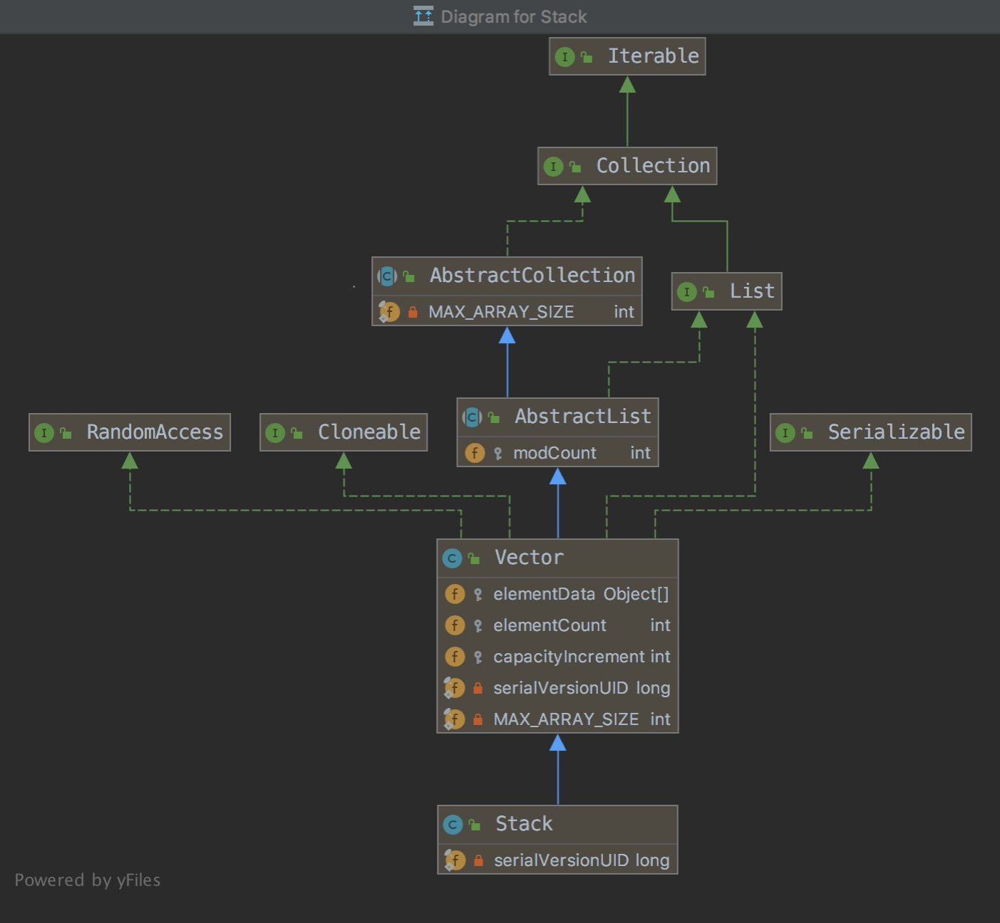

Vector

###1 类图

###2 源码分析
####2.1 字段
    
```
// 存放元素的数组
protected Object[] elementData;
// elementData存放的元素的个数
protected int elementCount;
// 数组动态扩容时，每次指定增加的步长，capacityIncrement=0时，每次扩容是2倍长度进行扩容
protected int capacityIncrement;
// elementData数组的最大长度值
private static final int MAX_ARRAY_SIZE = Integer.MAX_VALUE - 8;
```

####2.2 方法

#####2.2.1 构造方法
```$xslt
// 指定初始容量、和扩容增加的步长的构造函数
public Vector(int initialCapacity, int capacityIncrement) {
    super();
    if (initialCapacity < 0)
        throw new IllegalArgumentException("Illegal Capacity: "+
                                           initialCapacity);
    // 创建长度为initialCapacity的长度的数组
    this.elementData = new Object[initialCapacity];
    // 扩容的步长
    this.capacityIncrement = capacityIncrement;
}

// 只指定初始容量的构造函数
public Vector(int initialCapacity) {
    // 扩容步长为0
    this(initialCapacity, 0);
}
public Vector() {
    // 初始长度为10，扩容步长为0
    this(10);
}
// 传入一个集合，构造一个Vector
public Vector(Collection<? extends E> c) {
    elementData = c.toArray();
    elementCount = elementData.length;
    // c.toArray might (incorrectly) not return Object[] (see 6260652)
    if (elementData.getClass() != Object[].class)
        // 数组的copy方法，获得新数组赋值给elementData，底层就是
        // 其实每次动态扩容，基本也是这个操作，将老数组elementData里的值copy出一个新elementData
        elementData = Arrays.copyOf(elementData, elementCount, Object[].class);
}

//Arrays.copyOf(elementData, elementCount, Object[].class)方法
public static <T,U> T[] copyOf(U[] original, int newLength, Class<? extends T[]> newType) {
    // 构造一份新数组
    @SuppressWarnings("unchecked")
    T[] copy = ((Object)newType == (Object)Object[].class)
        ? (T[]) new Object[newLength]
        : (T[]) Array.newInstance(newType.getComponentType(), newLength);
    // 这个是个native方法，将原original拷贝到copy中
    System.arraycopy(original, 0, copy, 0,
                     Math.min(original.length, newLength));
    return copy;
}

```

#####2.2.2 add

```$xslt
// 添加元素方法，返回boolean类型，该方法是同步的
public synchronized boolean add(E e) {
    // 根据类图上可以看到这个字段是父类AbstractList的字段，这个字段主要用于集合框架中的fast-fail机制
    // modCount这个值，一般在add，remove的时候会做出改变，主要目的，监控对集合的变化，
    // 用于多线程操作时，对集合做出的remove操作，以fast-fail机制响应(其实，就是抛出了个throw new ConcurrentModificationException()异常)
    modCount++;
    // 该方法主要是判断是否扩容，需要扩容，则进行扩容操作
    ensureCapacityHelper(elementCount + 1);
    // 赋值，并将长度加1
    elementData[elementCount++] = e;
    return true;
}

// 扩容操作
private void ensureCapacityHelper(int minCapacity) {
        // overflow-conscious code
    // minCapacity是elementData里的实际多少个元素， 
    // elementData.length是数组的长度
    // minCapacity - elementData.length > 0 说明，数组装不下了，需要扩容  
    if (minCapacity - elementData.length > 0)
        grow(minCapacity);
}

// 扩容操作
private void grow(int minCapacity) {
    // overflow-conscious code
    // 原来的数组长度
    int oldCapacity = elementData.length;
    // 新数组的长度，capacityIncrement这里就是构造函数传入的步长字段的用处
    // capacityIncrement > 0，每次扩容是oldCapacity+capacityIncrement，若是capacityIncrement=0，则次扩容是oldCapacity+oldCapacity
    int newCapacity = oldCapacity + ((capacityIncrement > 0) ?
                                     capacityIncrement : oldCapacity);
    // 若是新的数组长度小于elementData实际装元素所需要的最小容量minCapacity(我是需要底线的)，就将最小容量值赋给newCapacity
    if (newCapacity - minCapacity < 0)
        newCapacity = minCapacity;
    // 若是newCapacity超过了数组的最大上限值，则进行最大值合适值赋值
    if (newCapacity - MAX_ARRAY_SIZE > 0)
        newCapacity = hugeCapacity(minCapacity);
    // 拷贝操作
    elementData = Arrays.copyOf(elementData, newCapacity);
}
// 判断是否是超过最大值的操作
private static int hugeCapacity(int minCapacity) {
    if (minCapacity < 0) // overflow
        throw new OutOfMemoryError();
    return (minCapacity > MAX_ARRAY_SIZE) ?
        Integer.MAX_VALUE :
        MAX_ARRAY_SIZE;
}

```
#####2.2.2 addElement
```$xslt
// 该方法和add方法代码一毛一样，就是返回值不一样
// 笔者只是发现Vector的子类Stack的push(入栈)操作调用了addElement方法，而非add方法，原因尚未明却，读者可自行脑补？
/**
 * 增加指定元素至vector末尾
 * Adds the specified component to the end of this vector,
 * 长度+1，vector的容量将会增加，如果它的size(实际需求长度)大于length(数组长度)
 * increasing its size by one. The capacity of this vector is
 * increased if its size becomes greater than its capacity.
 * 这个方法在功能上和add方法（add方法是接口List的方法）一毛一样
 * <p>This method is identical in functionality to the
 * {@link #add(Object) add(E)}
 * method (which is part of the {@link List} interface).
 *
 * @param   obj   the component to be added
 */
public synchronized void addElement(E obj) {
    modCount++;
    ensureCapacityHelper(elementCount + 1);
    elementData[elementCount++] = obj;
}
```

#####2.2.2 get

```$xslt
// 获取元素的方法，贼简单
public synchronized E get(int index) {
    if (index >= elementCount)
        throw new ArrayIndexOutOfBoundsException(index);

    return elementData(index);
}
```

#####2.2.2 remove
```$xslt
public synchronized E remove(int index) {
    // 又见modCount，不在赘述，读者不明所以，可自行搜索fast-fail机制
    modCount++;
    if (index >= elementCount)
        throw new ArrayIndexOutOfBoundsException(index);
    E oldValue = elementData(index);
    
    // 去掉一个元素，index后面的元素需要向前移动1个位置
    int numMoved = elementCount - index - 1;
    if (numMoved > 0)
        // 这里的移动操作还是用的native的拷贝方法
        // 如果不使用这个方法，读者可以尝试自行实现，笔者下面给出了自己的简单操作
        System.arraycopy(elementData, index+1, elementData, index,
                         numMoved);
    elementData[--elementCount] = null; // Let gc do its work

    return oldValue;
}

// 笔者给出的简单移动操作，这里只是移动不改变数组长度，所以将最后一位赋值为0
import java.util.Arrays;
public class VectorTest {

    public static void main(String[] args) {
        int[] arr = {1, 2, 3, 4, 5, 6};
        remove(arr, 4);
        // [1, 2, 3, 5, 6, 0]
        System.out.println(Arrays.toString(arr));

    }

    public static void remove(int[] arr, int index) {
        // index后面的元素向前移动一位
        for (int i = index; i < arr.length; i++) {
            arr[i - 1] = arr[i];
        }
        arr[arr.length - 1] = 0;
    }

}


```


