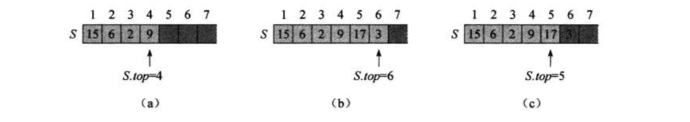
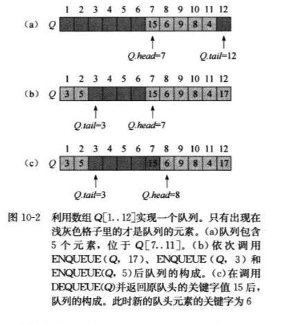
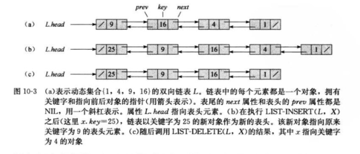
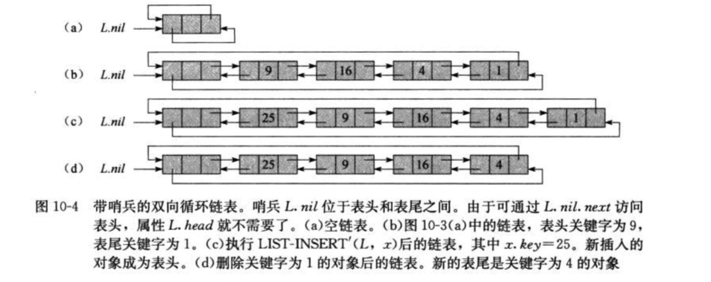

10 基本数据结构

### 10.1 栈和对列

>1.栈和对列都是动态集合 <br/>
>2.栈中，被删除的是最近插入的元素，栈实现的是一种后进先出(last-in,first-out,LIFO)策略<br/>
>3.对列中，被删除的总是在集合中存在时间最长的那个元素：对列实现的是一种先进先出(first-in,first-out,FIFO)策略<br/>

**栈**
    
>1.栈上的INSERT操作称为压入(PUSH)，无参的DELETE操作称为弹出(POP)<br/>
>2.数组S[1..n]，最多容纳n个元素，该数组有个属性S.top，指向最新插入的元素，栈中元素S[1..S.top],S[1]栈底元素，S[S.top]是栈顶元素<br/>
<br/>
>3.试图对空栈执行弹出，称为下溢(underflow),若是S.top超过了n，则称为栈上溢(overflow)<br/>
>4.入栈和出栈的执行时间都为O(1);

```
// 空栈判断伪代码
STACK-EMPTY(S) 
if S.top == 0
    return TRUE
else 
    return FALSE
 
// 进栈伪代码
PUSH(S,x)
S.top = S.top + 1
S[S.top] = x

// 出栈伪代码
POP(S)
if STACK-EMPTY(S) 
    error "underflow"
else S.top = S.top - 1
    return S[S.top + 1]
```

**对列**

>1.对列上的INSERT操作称为入队(ENQUEUE)，DELETE操作称为出队(DEQUEUE)<br/>
>2.对列有对头(head)和对尾(tail),当一个元素入队时，被放置在对尾，出队，则是队头元素<br/>
>3.数组Q[1..n]表示n-1元素的对列，对列有属性Q.head指向对头元素，Q.tail指向对尾元素<br/>
>4.对列Q.head,Q.head+1,...,Qtail-1，位置1紧邻在位置n后面形成一个环序，Q.head=Q.tail,对列为空，Q.head=Q.tail+1,对列是满的<br/>
>5.入队和出队的执行时间都为O(1);<br/>


```$xslt

ENQUEUE(Q.x)
Q[Q.tail] = x
if Q.tail == Q.length 
    Q.tail = 1
else
    Q.tail = Q.tail + 1
    
    
DEQUEUE(Q)
x = Q[Q.head]
if Q.heead == Q.length
    Q.head = 1
else Q.head = Q.head + 1
return x

```

### 10.2 链表

>1.数组的线性顺序是由数组下标决定的，链表的顺序是由各个对象里的指针决定的。<br/>
>2.双向链表的每个元素都是一个对象，每个对象有一个关键字key和两个指针，next和prev。x.prev指向它的前驱元素，x.next是指向它在链表中的后继元素<br/>
>x.prev=NIL,则元素x没有前驱，因此是链表的第一个元素，链表的头(head).x.next=NIL，则元素x没有后继，因此链表的最后一个元素，即链表的尾(tail),L.head=NIL,链表为空<br/>

>3.链表可以是循环的或非循环的，如果一个链表是单连接的(Singly linked).则省略每个元素中的prev指针<br/>
>4.在循环链表中，表头元素的prev指针指向表尾元素，而表尾元素的next指针则指向表头元素。 

```
// 链表的搜索
// 搜索n个对象链表，过程LIST-SEARCH在最坏情况下的运行时间为O(n)
LIST-SEEARCH(L,k)
x = L.head
while x != NIL and x.key != k
    x = x.next
return x

// 链表的插入,插入到链表的前端
// 在一个含n个元素的链表上执行LIST-INSERT的运行时间是O(1).
LIST-INSEERT(L,x)
x.next = L.head
if L.head != NIL
    L.head.prev= x
L.head = x
x.prev=NIL

// 链表的删除
// LIST-DELETE的原型时间为O(1).但如果要删除具有给定关键的元素，则最坏情况需要的时间是O(n),因为需要先调用LIST-SEARCH找到该元素
LIST-DELETE(L,x)
if x.prev != NIL
    x.prev.next = x.next
else L.head = x.next
if x.next != NIL
    x.next.prev = x.prev 


```
**哨兵**

>1.哨兵(sentinel)是一个哑对象，作用简化边界条件的处理。<br/>
>2.链表L中设置一个对象L.nil，该对象代表NIL，具有和其他对象相同的各个属性。对于链表代码中出现的每一处对NIL的引用，都代之以对哨兵L.nil的引用
   这样的调整将一个常规的双向链表转变为一个有哨兵的双向循环链表<br/>
>3.哨兵L.nil位于表头和表尾之间。属性L.nil.next指向表头，L.nil.prev指向表尾，类似，表尾的next属性和表头的prev属性同时指向L.nil.



```
LIST-SEARCH(L,k)
x = L.nil.next
while x != L.nil and x.key != k
    x = x.next
return x


LIST-INSEERT(L,x)
x.next = L.nil.next
L.nil.next.prev=x
L.nil.next=x
x.prev=L.nil


```

### 10.3 指针和对象的实现

> 看不懂。。。。

    
### 10.4 有根树的表示

**二叉树**

> 1.二叉树T中属性p、left和right存放指向父节点、左孩子和右孩子的指针
> 2.若x.p=NIL，则x是根节点，若x没有左孩子，则x.left=NIL，右孩子一样。
> 3.属性T.root指向整颗树T的根节点，如果T.root=NIL,则树为空


**分支无限制的有根树**

> 1.对任意n个节点的有根树，只需要O(n)的存储空间。
> 2.每个节点都包含一个父节点指针p,且T.root指向树T的根节点。每个节点中不是包含指向每个孩子的指针，而是只有两个指针
> 3.x.left-child指向节点x最左边的孩子节点。
> 4.x.rigth-sibling指向x右侧相邻的兄弟节点。
> 5.如果x没有孩子节点，则x.left-child=NIL;若果x时期父节点的最右孩子，则x.right-sibling=NIL


