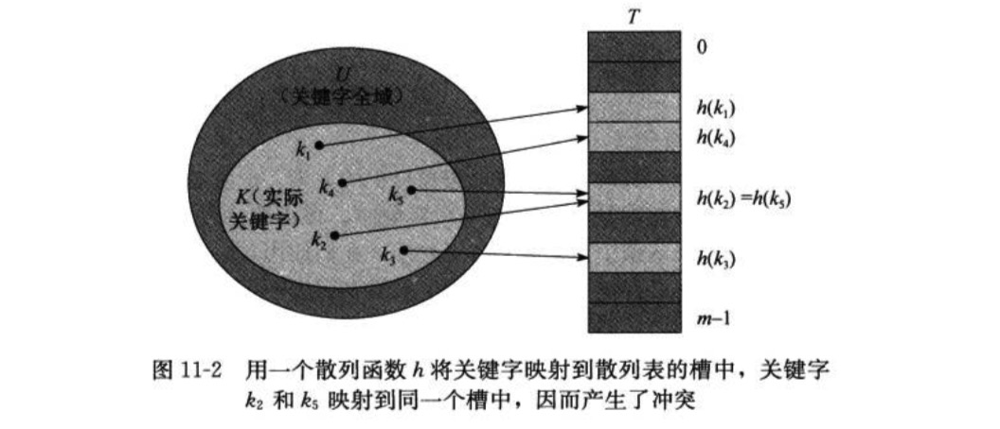

11 散列表

### 11.1 直接寻址表

> 1.为表示动态集合，我们用一个数组，或称为直接寻址表(direct-address table),记为T[0..m-1].<br/>
> 2.其中每个位置，或称为槽(slot)，对应全域U中的一个关键字。<br/>
> 3.槽k指向集合中一个关键字为k的元素。如果该集合中没有关键字为k的元素，则T[k]=NIL<br/>


```

DIRECT-ADDRESS-SEARCH(T,k)
return T[k]

DIRECT-ADDRESS-INSERT(T,x)
T[x.key]=x

DIRECT-ADDRESS-DELEETE(T,x)
T[x.key]=NIL

```

> 上述每个操作都只需要O(1)时间<br/>

### 11.2 散列表

> 1.直接寻址技术的缺陷：如果全域U很大，实际存储的关键自己和K相对U来说可能很小，使得存储U的大部分空间都将浪费<br/>
> 2.在散列方式下，该元素存放在槽h(k)中；即散列函数(hash function)h,由关键字k计算出槽的位置。函数h将全域U映射到散列表(hash table)T[0..m-1]的槽位上，m一般比|U|小很多。<br/>
> 3.存在问题:两个关键字可能映射到同一个槽位中。这个情形为冲突<br/>




> 4.解约冲突的方法：链接法和开放寻址法<br/>
> 5.链接法：把散列到同一个槽中的所有元素都放在同一个链表中，槽j中有一个指针，它指向存储所有散列到j的元素的链表的表头；如果不存在这样元素，则槽j中为NIL<br/>


### 11.3 散列函数

> 1.好的散列函数的特点：满足简单均匀散列假设：每个关键字都被等可能地散列到m个槽位中的任何一个，并与其他关键字已散列到那个槽位无关<br/>
> 2.将关键字转换为自然数：需要找到一种方法将关键字转换为自然数。<br/>

#### 11.3.1 除法散列法

> 1.散列函数: h(k) = k mod m <br/>
> 2.注意m的选值，不应为2的幂，一般一个不太接近2的整数幂的素数，常常是m的一个较好的选择。<br/>

#### 11.3.2 乘法散列法
    
    
