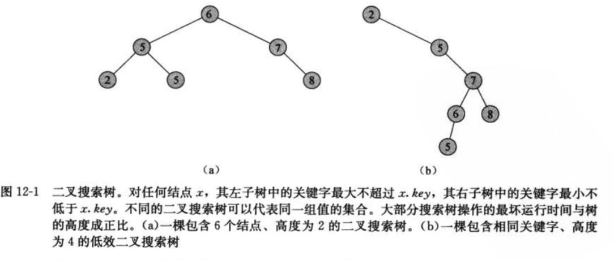
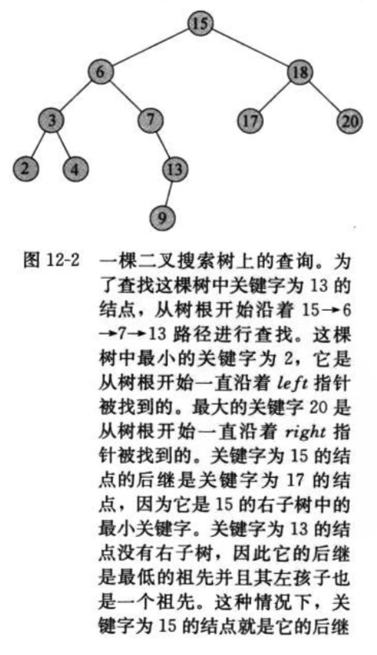
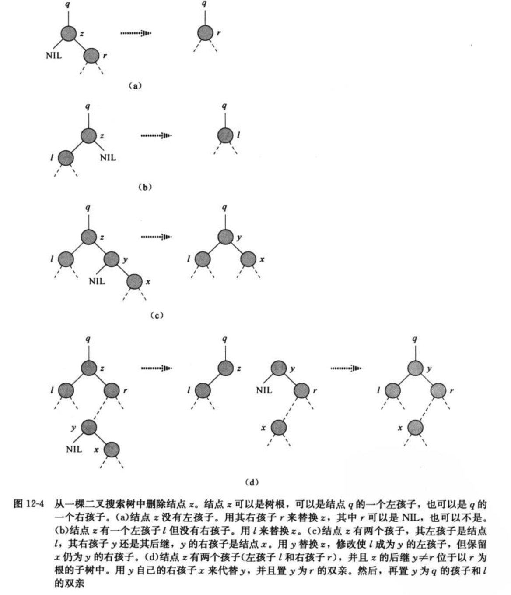

二叉搜索树

> 1.搜索树数据结构支持许多动态结合的操作，包括SEARCH，MINIMUM，MAXIMUM，PREDECESSOR，SUCCESSOR，INSERT和DELETE等


### 12.1 什么是二叉树

> 1.一颗树可以使用一个链表数据结构来表示，其中每个节点就是一个对象。除了key和卫星数据之外，每个节点还包含属性left、right和p，他们分别指向结点的左孩子、右孩子和双亲
> 2.如果某个孩子节点和父节点不存在，则相应属性的值为NIL。根节点是树种唯一父指针为NIL的节点。
> 3.二叉搜索树种的关键字总是以满足二叉搜索树性质的方式来存储：设x是二叉搜索树种的一个节点。若果y是x左子树中的一个节点，那么y.key <= x.key。如果y是x有字数中的节点，那么y.key>=x.key。



> 4.中序遍历(inorder tree walk)：通过简单的递归算法来按序输出二叉搜索树种的所有关键字，这样命名的原因是输出的子树根的关键字位于其左子树的关键值和右子树的关键字之间。
> 5.先序遍历(preorder tree walk)：输出的根的关键字在器左右子树关键字值之前
> 6.后序遍历(postorder tree walk)：输出的根的关键字在其左右子树的关键值之后
> 7.定理：如果x是一颗有n个结点子树的根，那么调用INORDER-TREE-WALK(x)需要O(n)时间
    
### 12.2 查询二叉搜索树

**查找**

```

TREE-SEARCH(x,k)
if x == NIL or k == x.key
    return x
if k < x.key
    return TREE-SEARCH(x,left.k)
else
    return TREE-SEARCH(x,right.k)


```


> 如下图，对于遇到的每个节点x，比较关键字k与x.key.如果两个关键字相等，查找就终止。如果k小于x.key，查找在x的左子树中继续，因为二叉树性质蕴含了k不可能被存储在右子树中。
  对称地，如果k大于x.key，查找在右子树中继续，从树根开始递归期间遇到的节点就形成了一个向下的简单路径，所以TREE-SEARCH的运行时间为O(h),其中h是这个树的高度。

```
// 采用while循环来展开递归，对于大多数计算机，迭代版本的效率要高的多
INTERATIVE-TREE-SEARCH(x,k)
while x != NIL and k != x.key
    if k < x.key
        x = x.left
    else
        x = x.right
return x


```

**最大关键字元素和最小关键字元素**

```

TREE-MINIMUM(x)
while x.left != NIL
    x = x.left
return x
    

```

> 如果结点x没有左子树，那么由于x右子树中的每个关键字都至少大于或等于x.key，则以x为根的子树中的最小关键字是x.key。<br/>
> 如果节点x有左子树，那么由于其右子树中没有关键字小于x.key。且在左子树中的每个关键字不大于x.key，则以x为根的子树中<br/>
> 的最小关键字一定在以x.left为根的子树中。  
    


```

TREE-MAXIMUM(x)
while x.right != NIL
    x = x.right
return x

```

**后继和前驱**

> 1.如果所有的关键字互不相同，则一个节点x的后继是大于x.key的最小关键字的节点。 <br/>
> 2.一颗二叉树搜索树的结构允许我们通过没有任何关键字的比较来确定一个节点的后继。<br/>
> 3.如果后继存在，下面的过程将返回一颗二叉树中的节点x的后继；如果x是这颗树种的最大关键字，则返回NIL<br/>

```

TREE-SUCCESS(x)
if x.right != NIL
    return TREE-MINIMUM(x.right)
y = x.p

while y!= NIL and x == y.right
    x = y
    y = y.p
return y

```

> 4.如果结点x的右子树非空，那么x的后继恰是x右子树中的最最节点，通过第2行中的TREE-MINIMUM(x.right)调用可以找到。关键字15的后继是17
> 5.在一颗高度为h的树上，TREE-SUCCESSOR的运行时间为O(h)，因为该过程或者遵从一条简单路径沿树向上或者遵从简单路径沿树向下。过程TREE-PREDECESSOR与TREE-SUCCESSOR是对称的。其运行时间也为O(h)
> 6.定理：在一颗高度为h的二叉树上，动态集合上的操作SEARCH、MINIMUM、MAXIMUM、SUCCESSOR和PREDECESSOR可以在O(h)时间内完成。


### 12.3 插入和删除

**插入**

> 1.将一个新值v插入到一颗二叉搜索树T中，该过程以结点z作为输入，其中z.key=v，z.left=NIL，z.right=NIL.这个过程要修改T和z的某些属性。

```

TREE-INSERT(T,z)
y=NIL
x=T.root
while x!=NIL
    y = x
    if z.key < x.key
        x = x.left
    else
        x = x.right
z.p=y
if y== NIL
    t.root=z        // tree T was empty
elseif z.key < y.key
    y.left=z
else 
    y.right=z

```

> 2.正如TREE-SEARCH和INTERATIVE-TREE-SEARCH一样，TREE-INSERT从树根开始，指针x记录了一条向下的简单路径，并查找要替换的输入项z的NIL。
> 3.查找过程保持遍历指针(trailing pointer)y作为x的双亲。初始化后，第3-7行的while循环使得这两个指针沿树向下移动，知道x变为NIL。
> 4.这个NIL占据的位置就是输入项z要放置的地方。遍历指针y是z的父节点
> 5.与其他搜索树上的原始操作一样，过程TREE-INSERT在一颗高度为h的树上运行时间为O(h)


**删除**

> 从一棵二叉搜索树T中删除一个结点z的整个策略分为三种基本情况 <br/>
> 1.如果z没有孩子结点，那么只是简单地将它删除，并修改它的父节点，用NIL作为孩子来替换z. <br/>
> 2.如果z只是有一个孩子，那么将这个孩子提升到树中z的位置上，并修改z的父结点，用z的孩子来替换z。 <br/>
> 3.如果z有两个孩子，那么找z的后继y(一定在z的右子树中)，并让y占据树种z的位置。z的原来右子树 <br/>
    部分称为y的新的右子树，并且z的左子树称为y的新的左子树。这种情况稍显麻烦，因为还与y是否为 <br/>
    z的右孩子相关。


> 从一颗二叉树搜索树T中删除一个给定的节点z，这个过程取指向T和z的指针作为输入参数。
> 1.如果z没有左孩子，那么用其右孩子来替换z，这个右孩子可以是NIL，也可以不是。当z的右孩子是NIL时，<br/>
    此时这种情况归为z没有孩子结点的情形。当z的右孩子非NIL时，这种情况就是z仅有一个孩子节点的情形，<br/>
    该孩子是其右孩子
> 2.如果z仅有一个左孩子且为其左孩子，那么用左孩子来替换z。
> 3.否则，z即有一个左孩子又有一个右孩子。我们要查找z的后继y，这个后继位于z的右子树中并且没有左孩子。现在<br/>
    需要将y移出原来的位置进行拼接，并提换树中的z。
> 4.如果y是z的右孩子。那么用y替换z，并仅留下y的右孩子。
> 5.否则，y位于z的右子树中但并不是z的右孩子，在这种情况下，先用y的右孩子替换y，然后再用y替换z。
 
 

> 6.为了在二叉搜索树内移动子树，定义一个子过程TRANSPLANT，它是用另一颗子树替换一颗子树并成为其双亲的孩子节点。
    当TRANSPLANT用一颗已v为根的子树来替换一颗以u为根的子树时，结点u的双亲就变为结点v的双亲，并且最后v成为u的双亲的相应孩子。

```
// 子树替换过程
TRANSPLANT(T,u,v)
if u.p == NIL
    T.root = v // 处理u是T的树根的情况
elseif u == u.p.left
    u.p.left=v // u是左孩子
else 
    u.p.right=v // u是右孩子
if v!=NIL
    v.p=u.p // v有可能为NIL
    
    
// 二叉搜索树T中删除z的删除过程
Tree-DELETE(T,z)
if z.left == NIL
    TRANSPLANT(T,z,z.right)
elseif z.right == NIL
    TRANSPLANT(T,z,z.left)
else y=TREE-MINMUM(z,right)
    if y.p !=z
        TRANSPLANT(T,y,y.right)
        y.right=z.right
        y.right.p=y
    TRANSPLANT(T,z,y)
    y.left = z.left
    y.left.p = y

```


