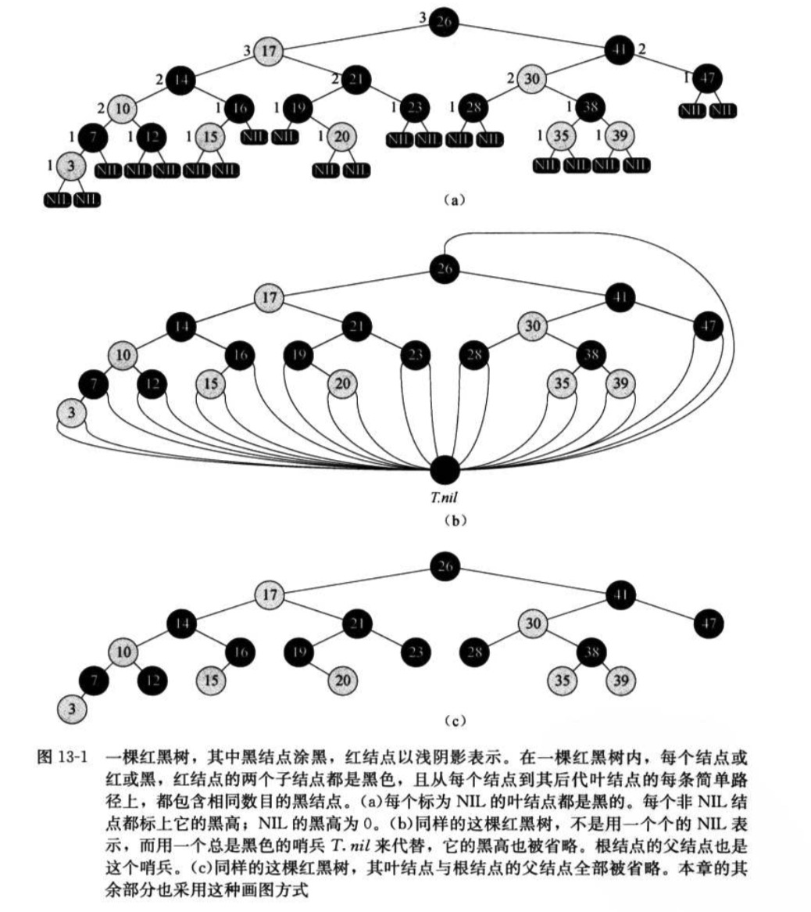
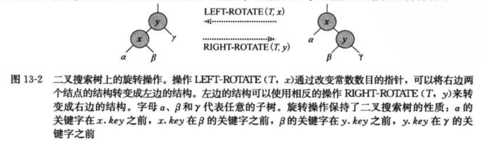
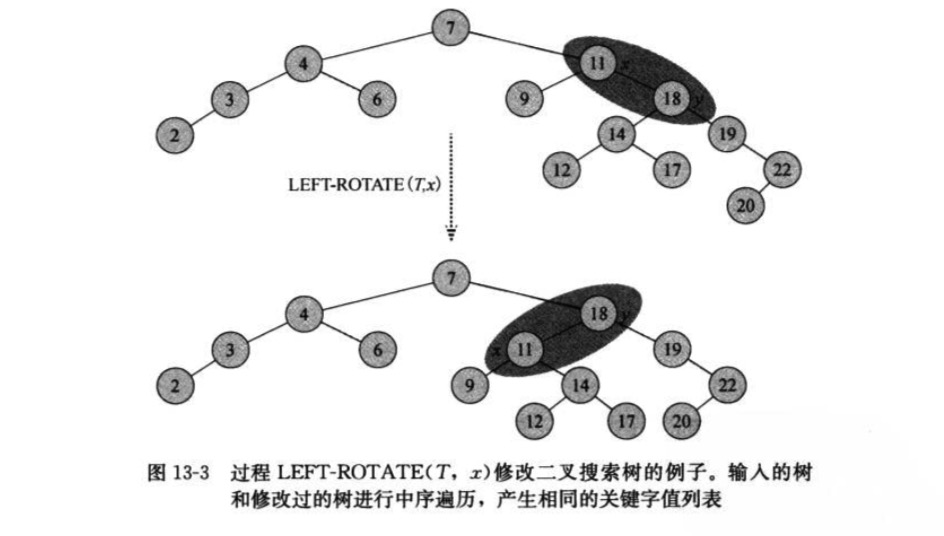
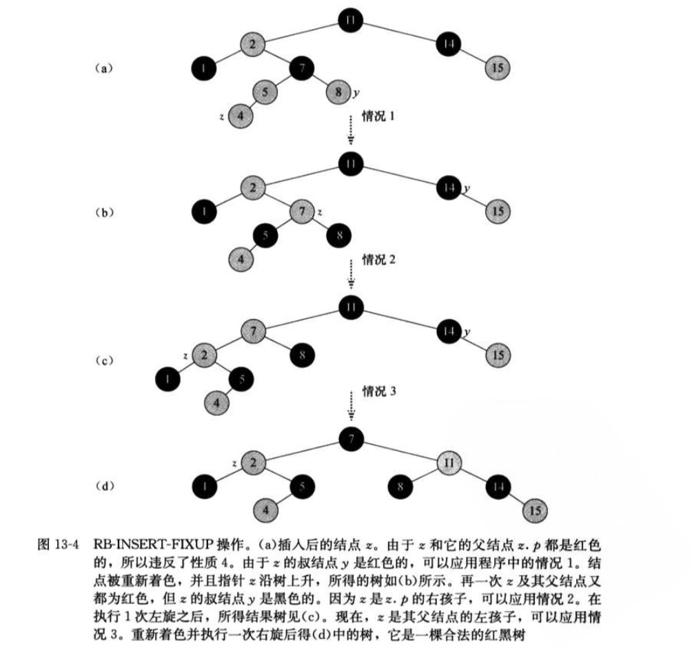
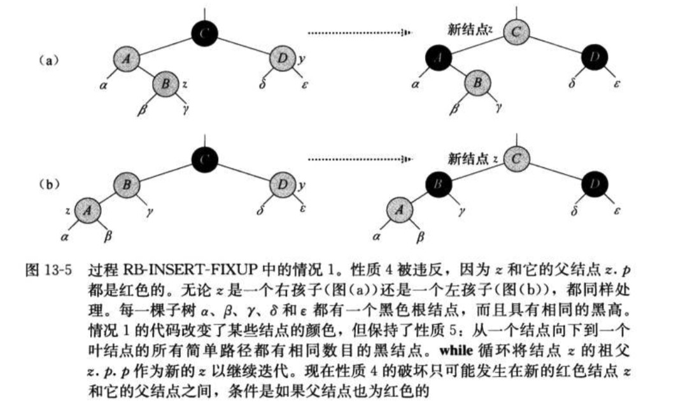
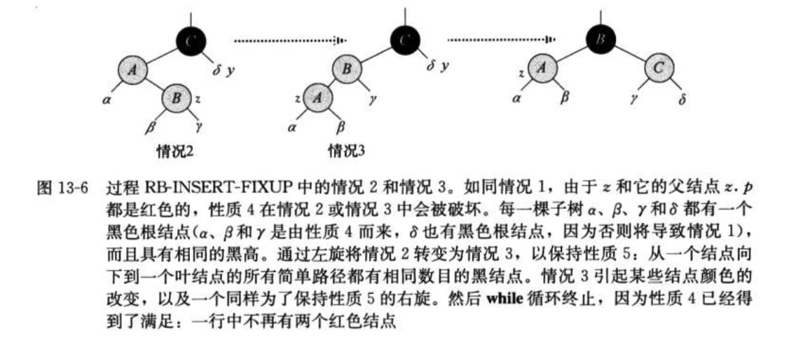
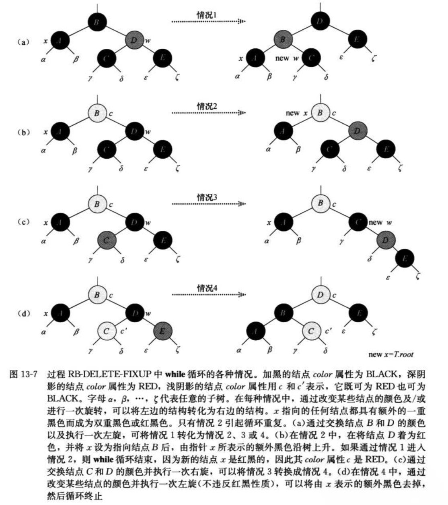

红黑树

> 红黑树(red-black-tree)是许多"平衡"搜索树种的一种，可以保证在最坏的情况下基本动态集合操作的时间复杂度为O(lgn)

### 13.1 红黑树的性质

> 树中每个节点包含5个属性：color，key，left，right和p。如果一个结点没有子结点或父结点，则该结点的相应指针属性为NIL。
> 红黑树的性质：    
> 1.每个结点或是红色的，或是黑色的
> 2.根结点是黑色的
> 3.每个叶结点(NIL)是黑色的
> 4.如果一个结点的红色的，则它的两个子结点都是黑色的
> 5.对每个结点，从该结点到其后代叶结点的简单路径上，均包含相同数目的黑色结点。



> 从某个结点x出发(不含该结点)到达一个叶结点的任意一条简单路径上的黑色结点个数称为该结点的<strong font-color="black">黑高</strong>,记为bh(x)。
> 从某个结点出发的所有下降到其叶结点的简单路径的黑结点个数都相同。于是红黑树的黑高为其根结点的黑高
> 定理：一颗有n个内部结点的红黑树的高度至多为2lg(n+1)
> 由定理可知，动态集合操作SEARCH、MINIMUM、MAXIMUM、SUCCESSOR和PREDECESSOR可在红黑树上在O(lgn)时间内执行


### 13.2 旋转

> 指针结构的修改是通过旋转(ratation)来完成的，这是一种能保持二叉搜索树性质的搜索树局部操作。
> 左旋和右旋。当在某个节点x上做左旋时，假设它的右孩子为y而不是T.nil；x可以为其右孩子不是T.nil结点
  的树内任意结点。左旋以x到y的链为"支轴"进行。它使y称为该子树新的根结点，x成为y的左孩子，y的左孩子成为x的右孩子



```
// 左旋:以x的右孩子y为结点，进行逆时针旋转，旋转后x成为y结点的左孩子，y的左孩子成为了x的右孩子
LEFT-ROTATE(T,x)
y = x.right                 // 拿到结点x的右孩子y这个是要左旋的目标结点，
x.right = y.left            // 将旋转的目标节点y的左孩子当做x的右孩子
if y.left != T.nil          // y的左孩子不是哨兵的话(其实相当于非空节点)，将y的左孩子的父结点指针指向结点x
    y.left.p = x            
y.p = x.p                   // 进行旋转，y的父结点指向x的父结点
if x.p == T.nil             // x的父结点是哨兵，说明x原来是根结点，则将根结点指向y
    T.root = y
elseif x == x.p.left        // 判断x原来若是左结点，这x的父结点的左孩子指向y
    x.p.left = y
else x.p.right = y          // 否则x原来是右结点，则x的父结点的右孩子指向y
y.left = x                  // 将y的左孩子指向x，及x的父结点指向y
x.p = y

// 右旋:将以目标结点的左孩子为支轴，顺时针旋转，旋转后目标节点变为左孩子结点的右节点
RIGHT-ROTATE(T,y)
x = y.left
y.left = x.right
if x.right != nil
    x.right.p = y
x.p = y.p
if y.p == T.nil
    T.root = x
elseif y = y.p.left
    y.p.left = x
else 
    y.p.right = x    
x.right = y
y.p = x

```


### 13.3 插入

```
RB-INSERT(T,z)
y = T.nil
x = T.root
// 循环找出z的合适的父结点
while x != T.nil
    y=x 
    if z.key < x.key
    x = x.left
    else x = x.right
z.p = y
// 下面对z进行插入操作
if y == T.nil
    y.left=z
elseif z.key < y.key
    y.left = z
else y.right = z
z.left = T.nil
z.right = T.nil
z.color = RED
RB-INSERT-FIXUP(T,z)


// 保证红黑树性质的方法
RB-INSERT-FIXUP(T,z)
while z.p.color == RED
    if z.p == z.p.p.left
        y = z.p.p.right
        if y.color == RED
            z.p.color = BLACK
            y.color = BLACK
            z.p.p.color = RED
            z = z.p.p
         else if z == z.p.right
            z = z.p
            LEFT-ROTATE(T,z)
         z.p.color = BLACK
         z.p.p.color = RED
         RIGHT-ROTATE(T,z.p.p)
    else (same as then clause with "right" and "left" exchanged)
T.root.color = BLACK

```


> 插入情况：<br/>
> 情况1：z的叔结点是红色的。这种情况在z.p和y都是红色时发生。因为z.p.p是黑色而的，所以将z.p和y都着为黑色，以此解决z和z.p都是红色的问题，<br/>
  将z.p.p着为红色以保持性质5。然后，把z.p.p作为新结点z来重复while循环。指针z在书中上移两层。<br/>



> 情况2：z的叔结点y是黑色的且z是一个又孩子<br/>
> 情况3：z的叔结点y是黑色的且z是一个左孩子<br/>
> 在情况2和情况3中，z的叔结点y是褐色的。通过z是z.p的右孩子还是左孩子来区别这两种情况。在情况2中，结点z是它的父结点的右孩子。可以立即使用一个<br/>
  无论是直接进入情况2，还是通过情况3进入情况2，z的树节点y重视黑色的，因为否则就要执行情况1.此外，结点z.p.p存在，因为已经推断在执行第2行和第3行<br/>
  时该节点存在，且在第10行将z往上移一层，然后再第11行将z往下移一层之后，z.p.p的身份保持不变。在情况3中，改变某些结点的颜色并做一次右旋，以保持性质5.<br/>
  这样，由于在一行中不再有两个红色结点，所有处理到此完毕。因为此时z.p是黑色的，所以无需再执行一次while循环。




### 13.4 删除

> 从一颗红黑树中删除结点的过程基于TREE-DELETE而来的。首先，需要特别设计一个供TREE-DELETE调用的子过程TRANSPLANT，并将其应用到红黑树上。

```
// 将结点v取代u结点位置(u.p.left 或者u.p.right 指向了v，且v.p 也指向了u.p,但是u.p这个指针没有断开)

RB-TRANSPLANT(T,u,v)
if u.p == T.nil
    T.root = v
elseif u == u.p.left
    u.p.left = v
else 
    u.p.right = v
v.p = u.p

```

```

RB-DELETE(T,z)
y = z
y-original-color = y.color
if z.left == T.nil
    x = z.right
    RB-TRANSPLANT(T,z,z.right)        # z的右节点取代z的位置
elseif z.right == T.nil
    x = z.left
    RB-TRANSPLANT(T,z,z.left)         # z的左结点取代z的位置
else y = TREE-MINIMUM(z.right)        # 找到z的后继，即右子树中的最小的结点
    y-original-color = y.color        # 记下后继的颜色
    x = y.right                       # 后继节点的右子结点
    if y.p == z                       # 若后继节点，刚好是z的子结点，则x.p 还是 y
        x.p = y                       # 
    else RB-TRANSPLANT(T,y,y.right)   # 将y的右子结点取代y的位置
        y.right = z.right             # y的右子结点指向z的右子结点
        y.right.p = y                 # 将z的右子结点的父结点指向y
    RB-TRANSPLANT(T,z,y)              # 将y结点取代z结点的位置 这一步是删除z结点的操作
    y.left = z.left                   # y的做结点是z的左结点
    y.left.p = y                      # 将z的左子结点的父结点指向y，这一行和上一行是为了将z的左子树移给y
    y.color = z.color                 # 将y的颜色改变为要删除的节点的z的颜色
if y-original-color == BLACK
    RB-DELETE-FIXUP(T,x)

```

```
// 1.x是z的右子结点(且是红色的，因为，这种情况下，y的刚好是z的子结点) 
// 2.x是y的右子树(y是z的后继).

RB-DELETE-FIXUP(T,x)
while x != T.root and x.color == BLACK                              # x是y的子结点
    if x == x.p.left                                                # y的左结点
        w = x.p.right                                               # w是y的右结点，即是x的兄弟结点
        if w.color == RED                                           # case1 # w是红色：则将w的颜色改为黑色，父结点的颜色改为红色，进行左旋一次
            w.color = BLACK                                         # case1 
            x.p.color = RED                                         # case1 
            LEFT-ROTATE(T,x.p)                                      # case1
            w = x.p.right                                           # case1 
        if w.left.color == BLACK and w.right.color == BLACK         # case2
            w.color = RED                                           # case2
            x = x.p                                                 # case2
        elseif w.right.color == BLACK                               # case3
                w.left.color = BLACK                                # case3
                w.color = RED                                       # case3
                RIGHT-ROTATE(T,w)                                   # case3
                w = x.p.right                                       # case3
             w.color = x.p.color
             x.p.color = BLACK
             w.right.color = BLACK
             LEFT-ROTATE(T,x.p)
             x = T.root
    else (same as then claue with "right" and "left" exchanged)
x.color = BLACK

```



> case1: x的兄弟结点w是红色的
  x的兄弟结点w为红色时。w必须有黑色结点，所以可以改变w和x.p的颜色，然后对x.p做一次左旋而不违反红黑树的任何性质。现在，
  x的新兄弟结点是旋转之前w的某个子结点，其颜色为黑色。这样，就将情况1转为情况2、3、或4处理。
> case2: x的兄弟结点w是黑色的，而且w的两个子结点都是黑色的
  w的两个子结点都是黑色的。因为w也是黑色的，所以从x和w上去掉的一重黑色，使得x只有一冲黑色而w为红色。为了补偿从x和w中
  去掉的一重黑色，在原来是红色或黑色的x.p上新增一重额外的黑色。通过将x.p作为新节点x来重复while循环。
> case3: x的兄弟结点w是黑色的，w的左孩子是红色的，w的右孩子是黑色的
  w为黑色且其左孩子为红色，右孩子为黑色时。可以交换w和其左孩子w.left的颜色，然后对w进行右旋而不违反红黑树的任何性质。
  现在x的新兄弟节点w是一个有红色右孩子的黑色结点，这样我们就将情况3转成了情况4.
> case4: x的兄弟结点w是黑色的，且w的右孩子是红色的
  发生在节点x的兄弟结点w为黑色且w的右孩子为红色时。通过进行某些颜色修改并对x.p做一次左旋，可以去掉x的额外黑色，从而
  使它变为重黑色，而且不破坏红黑树的任何性质。将x设置为根后，当while循环测试器换条件时，循环终止。


