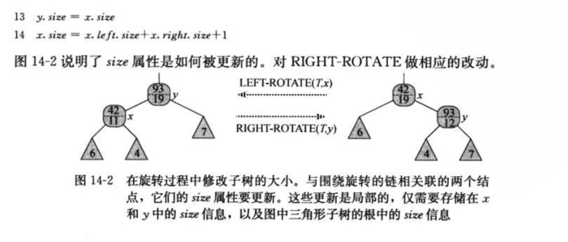

14 数据结构的扩张


### 14.1 动态顺序的统计

> 1.秩：元素在集合线性序中的位置。
> 2.顺序统计树(order-statistic tree)：属性x.key,x.color,x.p,x.left,x.right,x.size


```
#查找具有给定秩的元素:对具有给定秩的元素的检索

OS-SELECT(x,i)
r = x.left.size + 1
if i == r
    return x
elseif i < r
    return OS-SELECT(x.left,i)
else return OS-SELECT(x.right,i-r)

```

> 3.在上图中查找第17小的元素的查找过程。
    以x为根开始，器关键字为26，i=17.26的左子树的大小为12，故它的秩为13.因此，秩为17的节点是26的右子树中第17-13=4小的元素。
    递归调用，x为关键字41的结点，i=4。因为41的左子树大小为5，故它的秩为6.遮掩，可以知道值为4的结点是41的左子树中的第4小元素。
    再次递归调用后，x为关键字30的结点，在其子树中它的秩为2.如此，再进行一次递归，就能找到以关键字38的结点为根的子树中第4-2=2小的元素。
    它的左子树大小为1，它就是第2小元素。返回一个纸箱关键字为38的结点的指针。
    
    
```
确定一个元素的秩：最坏情况下OS-RANK的运行时间与树的高度成正比，在n个节点顺序统计树上为O(lgn)
OS-RANK(T,x)
r = x.left.size + 1
y = x
while y != T.root
    if y == y.p.right
        r = r + y.p.left.size + 1
    y = y.p
return r

```

> 4.对子树规模的维护
  
```
左旋维护结点的size

LEFT-ROTATE(T,x)
y = x.right                             // 拿到结点x的右孩子y这个是要左旋的目标结点，
x.right = y.left                        // 将旋转的目标节点y的左孩子当做x的右孩子
if y.left != T.nil                      // y的左孩子不是哨兵的话(其实相当于非空节点)，将y的左孩子的父结点指针指向结点x
    y.left.p = x            
y.p = x.p                               // 进行旋转，y的父结点指向x的父结点
if x.p == T.nil                         // x的父结点是哨兵，说明x原来是根结点，则将根结点指向y
    T.root = y
elseif x == x.p.left                    // 判断x原来若是左结点，这x的父结点的左孩子指向y
    x.p.left = y
else x.p.right = y                      // 否则x原来是右结点，则x的父结点的右孩子指向y
y.left = x                              // 将y的左孩子指向x，及x的父结点指向y
x.p = y

y.size = x.size                         // 旋转之后，y替代x的位置变成根节点，所以y.size = x.size
x.size = x.left.size + x.right.size + 1 // 此时x结点有原来的左子树，和y结点的左子树移给x作为右子树，所以直接将两个子树的size相加即可

# 右旋为堆成操作

```




> 5.对n个结点的顺序统计树进行插入与删除操作，包括维护size属性，都只需要O(lgn)时间


### 14.2 如何扩张数据结构

**4步骤扩张一种数据结构**
> 1.选者一种基础数据结构
> 2.确定基础数据结构中要维护的附加信息
> 3.检验基础数据结构上的基本修改操作能否维护附加信息
> 4.设计一些新操作

> 定理(红黑树的扩张)：设f是n个结点的红黑树T扩张的属性，且假设对任意结点x，f的值仅依赖于结点
  x，x.left和x.right的信息，还可能包括x.left.f和x.right.f。那么，我们可以在插入和删除操
  作期间对T的所有结点的f值进行维护，并且不影响着两个恶操作的O(lgn)渐进时间性能。
  


### 14.3 区间树

> 1.闭区间(closed interval)是一个实数的有序对[t1,t2]，其中t1<=t2.表示集合{t∈R:t1≤t≤t2}。开区间和半开区间，分别是去掉了两端或一个端点。
> 2.把一个区间[t1,t2]表示成一个对象i，其中属性i.low=t1为<strong>低端点(low endpoint)</strong>，属性i.high=t2为<strong>高端点(high endpoint)</strong>
> 3.区间三分定律(interval trichotomy)


> 4.区间树(interval tree)是一种冬天集合进行维护的红黑树，其中每个袁术x都包含一个去加x.int。支持的操作：
  INTERVAL-INSERT(T,x):将包含区间属性int的元素x掺入到区间树T中。
  INTERVAL-DELTETE(T,x):从区间树T中删除元素x。
  INTERVAL-SEARCH(T,i):返回一个指向区间树T中元素x的指针，将x.int与i重叠；若此元素不存在。则返回T.nil.


> 5.(1)基础数据结构：每个节点x包含一个区间属性x.int,且x的关键字为区间的低端点x.int.low。因此，按中序遍历列出的就是按低端点的次序排列的各区间。
    (2)附加信息：x中除了自身区间信息之外，还包含一个值x.max，它是以x为根的子树中所有区间的端点的最大值。
    (3)对信息的维护：通过给定区间x.int 和节点x的子结点的max值，可以确定x.max值：x.max = max(x.int.high,x.left.max,x.right.max)
    (4)设计新操作：唯一的一个新操作INTERVAL-SEARCH(T,i)，它是用来找出树T中与区间i充电的那个结点。
    
```
# INTERVAL-SEARCH 耗费O(lgn)的时间
INTERVAL-SEARCH(T,i)
x = T.root                                              
while x!=T.nil and i does not overlap x.int
    if x.left != T.nil and x.left.max >= i.low          #i的低端点小于x左结点的最大值，说明i在x左子树的区间中有重叠，否则就在右子树
        x = x.left
    else x = x.right                                    
return x

```


> 定理：INTEERVAL-SEARCH(T,i)的任意一次执行，或者返回一个其区间与i重叠的结点，或者返回T.nil,此时树T中没有任何结点的区间与i重叠


