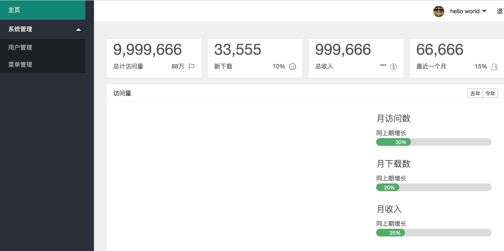
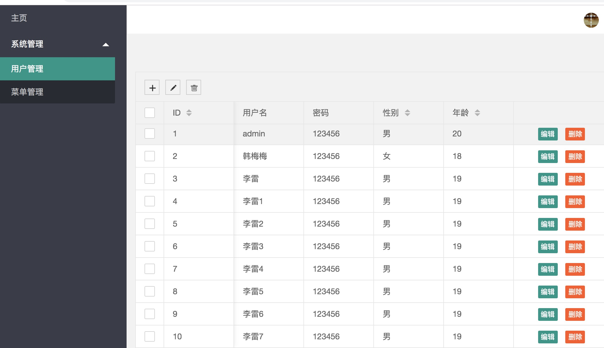
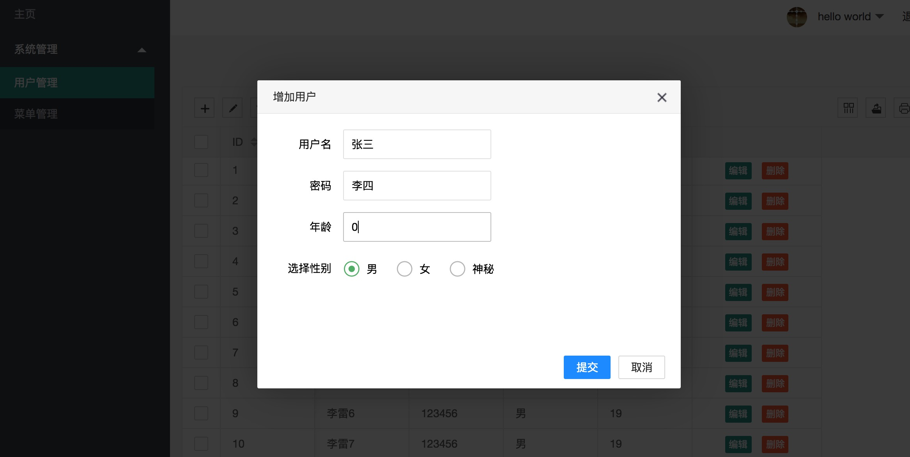
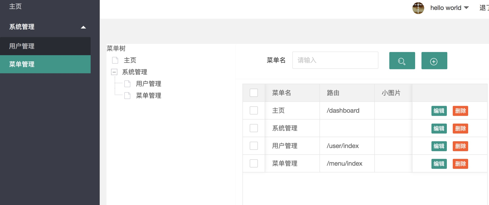
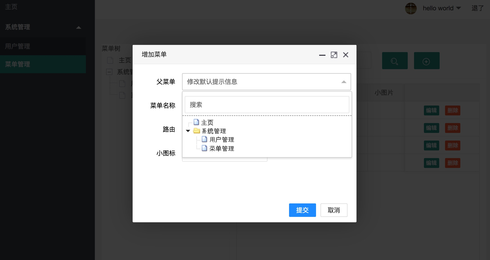

## 1.目标
    boot-bmodule01 主要使用layui单页面版本，学习layui的使用
    主要实现
    1.列表页的crud
    2.菜单的动态渲染
    3.面包屑问题
    4.tree树控件的使用
    6.首页的图表总览页面
    7.前端代码封装优化

## 2.技术框架
    前后端不分离：jdk8,springboot,tk.mybatis,h2(数据库),layui
    启动就能运行，不需要开启数据库
    
## 3.实现功能和进度
    2019-09-01 实现用户页面crud，菜单的静态页面和后台接口
    2019-09-02 菜单树列表展示实现，增加selectTree(这个有缺憾，仍需要继续扩展)
    2019-09-03 菜单的编辑，js代码优化;动态菜单加载
    2019-09-04 首页面已经存在，面包屑问题不在解决，前端代码优化留在下一个版本解决
    
## 4.展示

主页：直接copy的官方网的凑数，后面改掉
 
用户管理：增加、删除、修改
 
 
菜单管理：增加，修改
 
 

## 5 下一个版本升级问题 

    1.暂定版本模块:boot-bmodule0101
    2.主要做的优化:
    前端：layui升级iframe版本，登陆页面的实现，增加文件管理模块，前端的代码优化问题（js分离出来，进行模块化）
    后端：简单实现登陆支持，实现validator(校验器)功能，统一异常管理功能
    
    

   
    
    
    
    
    
    
    
    

   

