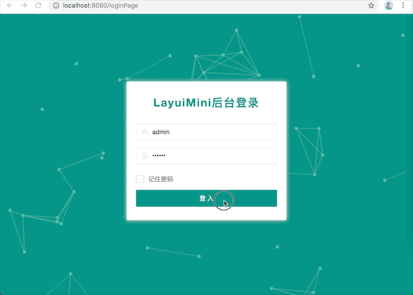
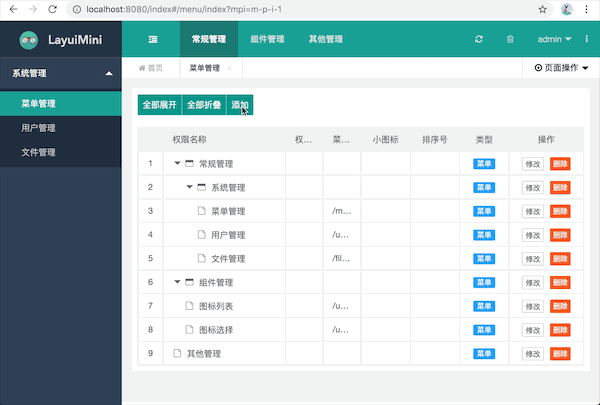
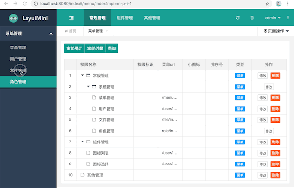

## 1.目标
    boot-bmodule0101 在boot-bmodule01基础上进行，做以下实现
    1.登陆功能前后端实现
    2.前端进行iframe化
    3.前端js进行模块化
    4.后端统一异常管理
    5.重新搭建fdfs图片服务器，并编写搭建文档
    6.修复boot-bmodule01中存在编码的问题

## 2.技术
    前后端不分离：jdk8,springboot,tk.mybatis,h2(数据库),layui
    图片服务器：fastdfs
    启动就能运行，不需要开启数据库
    
## 3.实现功能和进度
    2019-09-06 boot-bmodule0101模块初始化，校验器和业务统一异常处理基本完成
    2019-09-08 boot-bmodule0101将layui换成layuiMini,优化了菜单和用户管理前端
    2019-09-09 boot-bmodule0101简单实现登陆，退出，问题:拦截不了localhost:8080和localhost:8080/这两个路径
    2019-09-10 boot-bmodule0101解决拦截器拦截不了的问题，文件上传功能完成、boot-bmodule0101注释等
                                                 
备注：layuiMini由[zhongshaofa](https://github.com/zhongshaofa/layuimini)大佬基于layui开发的实用开源框架，欢迎小伙伴去fork&star

## 4.产生的bug问题

|类型|是否解决|产生时间|解决时间|描述|
|:-----|:-----|:-----|:-----|:-----|
|前端|待解决|2019/09/08|-----|1.菜单管理，增加修改不能刷新|
|前端|待解决|2019/09/10|-----|2.tab也关闭按钮，和菜单新增修改小图标不能正常显示|
    

## 5.展示
   
    登入登出
    
    
    菜单管理
    
 
    
    文件管理:需要开启文件服务器，这里演示没有开启，所以没上传成功
    

备注：文件服务器搭建参考 https://www.cnblogs.com/chiangchou/p/fastdfs.html
   
    

## 6.下一个版本升级问题 

    1.制作boot-bmodule0102 稳定版，移除boot-bmodule0101中多余的文件和无用代码，不做功能升级
    2.进行file-upload模块开发，将file-upload和boot-bmodule0102模块结合
    
    
    

   
    
    
    
    
    
    
    
    

   

