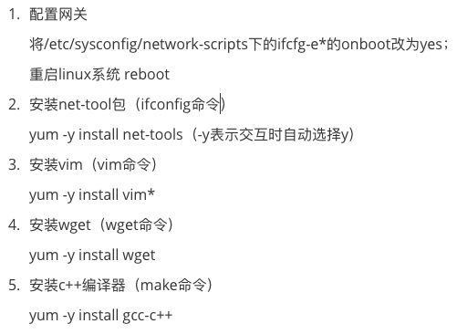
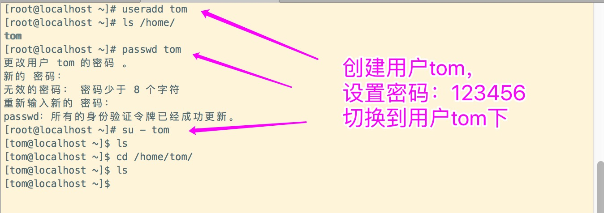
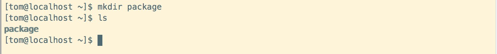
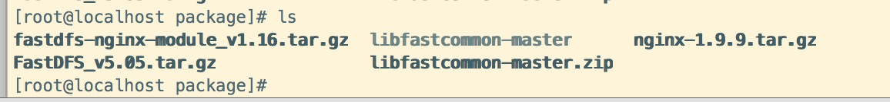
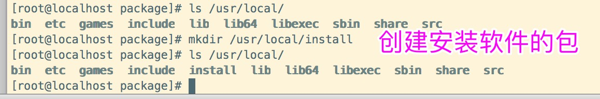
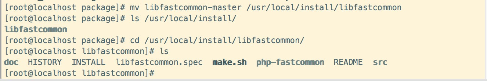
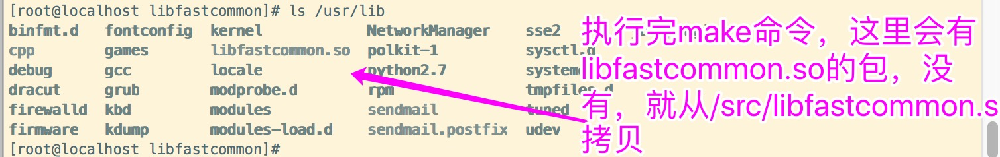
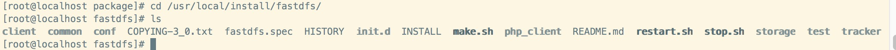
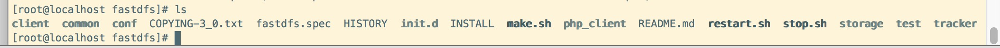
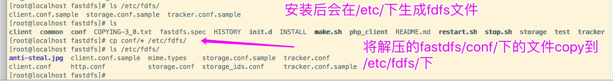

### 搭建一台fdfs文件服务器
    
#### 1 准备工作

|环境及安装包|版本说明|下载链接|
|:----|:----|:-----|
|vmware|10.1.5 |自行搜索下载|
|centos7|CentOS-7-x86_64-Minimal-1810.iso|http://isoredirect.centos.org/centos/7/isos/x86_64/CentOS-7-x86_64-Minimal-1810.iso| 
|nginx|nginx-1.9.9.tar.gz|http://nginx.org/download/| 
|fastfs相关资料|安装步骤提供|安装处提供|  

#### 2 安装vmware、centos7
##### 2.1 vmware
    
    自行搜索安装教程
    
##### 2.2 centos7
    
    自行搜索安装教程
    安装成功后以下图 安装一些package
    
    
    
    安装好centos7后创建个新用户
 
    
    在tom用户下创建文件夹 package
    mkdir package  
    
      
##### 2.3 将准备好的安装包上传到centos7上
    
    下载的资料
    nginx-1.9.9.tar.gz
    libfastcommon-master.zip
    FastDFS_v5.05.tar.gz
    fastdfs-nginx-module_v1.16.tar.gz
    
    用ftp工具或者用scp命令，这里采用scp命令
    scp fdfs_package/* root@172.16.144.145:/root/package/

    
    
##### 2.4 安装
**2.4.1 安装依赖Gcc，libevent，perl** 
    
    安装gcc  
    yum install gcc-c++ -y
    安装 zlib
    yum -y install zlib zlib-devel pcre pcre-devel gcc gcc-c++ openssl openssl-devel libevent libevent-devel perl unzip net-tools wget
    安装libevent
    yum -y install libevent
    安装 perl
    yum install perl*
    
**2.4.2 安装 libfastcommon-master.zip**  
   
    unzip libfastcommon-master.zip
    mkdir /usr/local/install (自定义安装位置)
    mv libfastcommon-master /usr/local/install/libfastcommon
   

    
    cd /usr/local/install/libfastcommon
    ./make.sh 
    ./make.sh install
 
 
**2.4.3 安装 FastDFS_v5.05.tar.gz** 
    
    解压FastDFS_v5.05.tar.gz 
    cd /root/package/
    tar -zxvf FastDFS_v5.05.tar.gz 
    解压完后，会文件为FastDFS 将其移动到/usr/local/install/下
    mv FastDFS /usr/local/install/fastdfs
    cd /usr/local/install/fastdfs
    如下是fdfs解压后的目录结构
 
        
    ./make.sh 
    ./make.sh install
     编译安装之后如下图
 
    
    安装之后，在/etc/文件下回产生fdfs文件
    ls /etc/fdfs
    cp conf/* /etc/fdfs/
 

    

    
    

    
    
    
    

       
    
