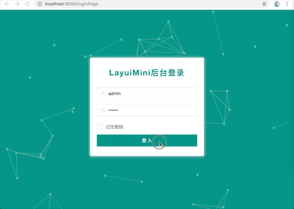
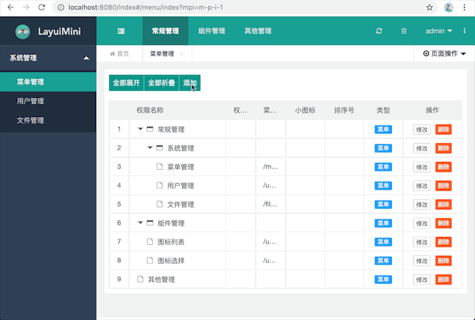
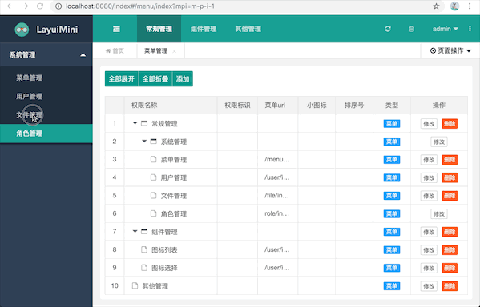

## 1.目标
    制作boot-bmodule01稳定版

## 2.技术
    开发工具：idea，maven
    前后端不分离：jdk8,springboot,tk.mybatis,h2(数据库),layui
    图片服务器：fastdfs
    启动就能运行，不需要开启数据库
    
## 3.实现功能
    1.菜单的动态加载
    2.文件的上传
                                           
备注：layuiMini由[zhongshaofa](https://github.com/zhongshaofa/layuimini)大佬基于layui开发的实用开源框架，欢迎小伙伴去fork&star

## 4.bug问题

|类型|是否解决|描述|
|:-----|:-----|:-----|
|前端|待解决|1.菜单管理，增加修改不能刷新|
|前端|待解决|2.tab也关闭按钮，和菜单新增修改小图标不能正常显示|
    

## 5.展示
   
    登入登出
    
    
    菜单管理
    
 
    
    文件管理:需要开启文件服务器，这里演示没有开启，所以没上传成功
    

备注：文件服务器搭建参考 https://www.cnblogs.com/chiangchou/p/fastdfs.html
   
    

## 6.下一个版本升级问题 

    1.file-upload 模块开发，同时会进行bootbmodule01XX版本的其他功能扩展
    2.boot-bmodule02 大版本开始，主要工作：引入spring-security，redis做权限登陆，认证，授权，
    同时将mybatis持久层进行再次封装，日志管理 ，api化，大致计划在10月中旬完成boot-bmodule02模块
    
    
    
    
    
    

   
    
    
    
    
    
    
    
    

   

