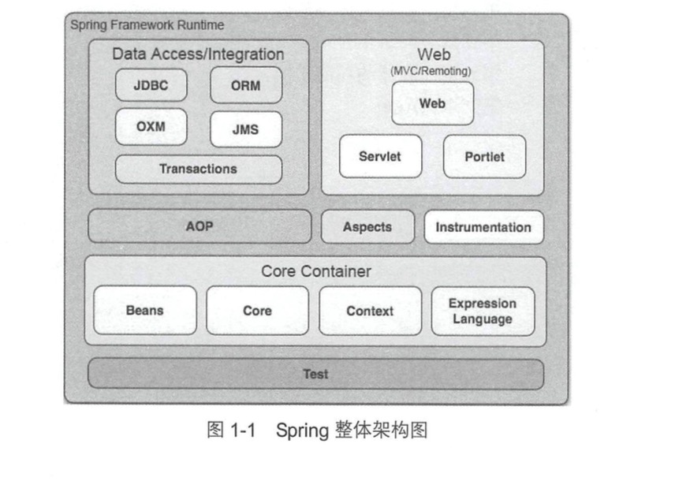

1 Spring整体架构和环境搭建

## 1.1 Spring的整体架构

**1 Core Container**

> Core Container(核心容器)包含由Core、Beans、Context和Expression Language模块
  1.Core模块主要包含Spring框架的核心工具类，Spring的其他组件都要用到这个包里的类，
  Core模块是其他模块的额基本核心
  2.Beans模块是所有应用都要用到的，它包含访问配置文件、创建和管理bean以及进行
  Inversion of Control/Dependency Injection(IOC/DI)操作相关的所有类
  3.Context模块构建于Core和Beans模块基础之上，提供了一种类似于JNDI注册器的框架的
  对象访问方法。Context模块继承了Beans的特性，为Spring核心提供了大量扩展，添加了对
  国际化(例如资源绑定)、事件传播、资源加载和对Context的透明创建的支持。Context模块
  同时也支持J2EE的一些特性，例如EJB、JMX和基础的远程处理。ApplicationContext接口是
  Context模块的关键
  4.Expression Language模块提供了强大的表达式语言，用于在运行时查询和操纵对象。该语言
  支持设置/获取属性的值，属性的分配，方法的调用，访问数组上下文(accession the context of arrays)，
  容器和所引起、逻辑和算术运算符、命名变量以及从Spring的IOC容器中根据名称检索对象。
  
    
**2 Data Access/Integration**

> Data Access/Integration层包括JDBC、ORM、OXM、JMS和Transaction模块
  1.JDBC模块提供了衣蛾JDBC抽象层，它可以消除冗长JDBC编码和解析数据库厂商特有的错误代码，
  这个模块包含了Spring对JDBC数据访问进行封装的所有类。
  2.ORM模块为流行的对象-关系映射API，如JPA、JDO、Hibernate、iBatis等，提供了一个交互层。
  利用ORM封装包。可以混合使用所有Spring提供的特性进行O/R映射，如前边提到的简单声明性事务
  3.OXM模块提供了一个对Object/XML映射实现的抽象层，Object/XML映射实现包括JAXB，Castor，XMLBeans，JiBX赫尔XStream
  4.JMS(java Messaging Service) 模块主要包含了一些制造和消费消息的特性
  5.Transaction模块支持编程和声明性事务管理，这些事务类必须实现特定的接口，并且对所有的POJO都适用
  
**3 Web**
    
> Web上下文模块简历在应用程序上线文模块之上，为给予Web的应用程序提供了上下文。Web模块还简化了处理大部分
  请求以及将请求参数绑定到域对象的工作。Web层包含Web、Web-Servlet，Web-Struts和Web-Porlet模块。
  1.Web模块提供了基础的面向Web的集成特性。例如，多文件上传，使用servlet listeners 初始化IOC容器以及
  一个面向Web的应用上下文。它还包含Spring远程支持中的Web相关部分。
  2.Web-Servlet模块：包含Spring的model-view-controller(MVC)实现。Spring的MVC框架是的模型范围内
  代码和web form之间能够清楚的分离开来。
  3.Web-Struts：提供了对Struts的支持
  4.Web-Porlet：提供了用于Porlet和Web-Servlet模块的MVC的实现
  
**4 AOP**

> 1.Aspects模块提供了对AspectJ的集成支持
> 2.Instrumentation模块提供了class instrumenttation支持和classloader实现，使得可以在特定的应用于服务器上使用 

**5 Test**  

  
  
  

    

  
