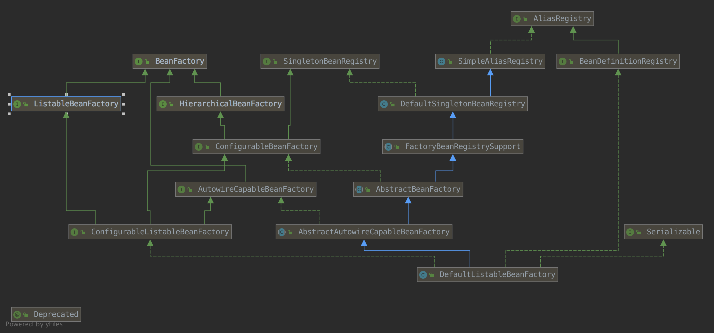
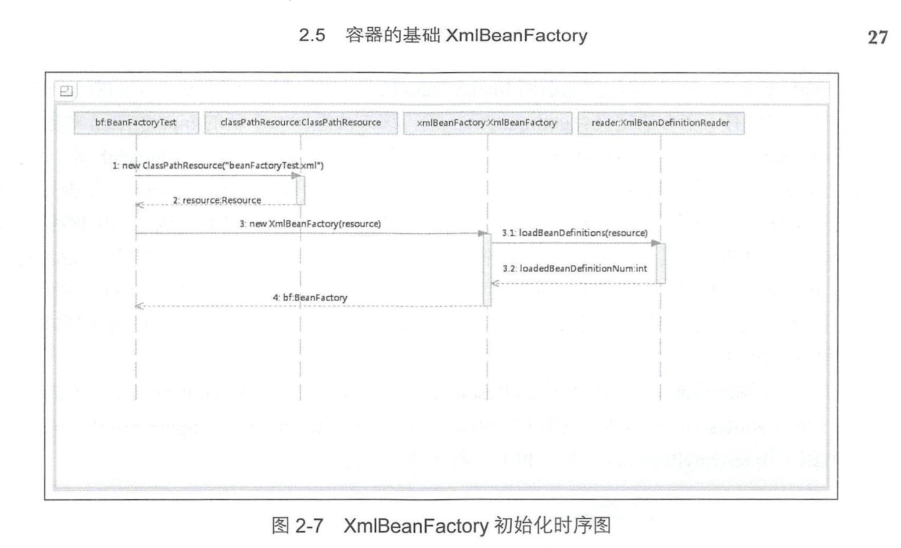
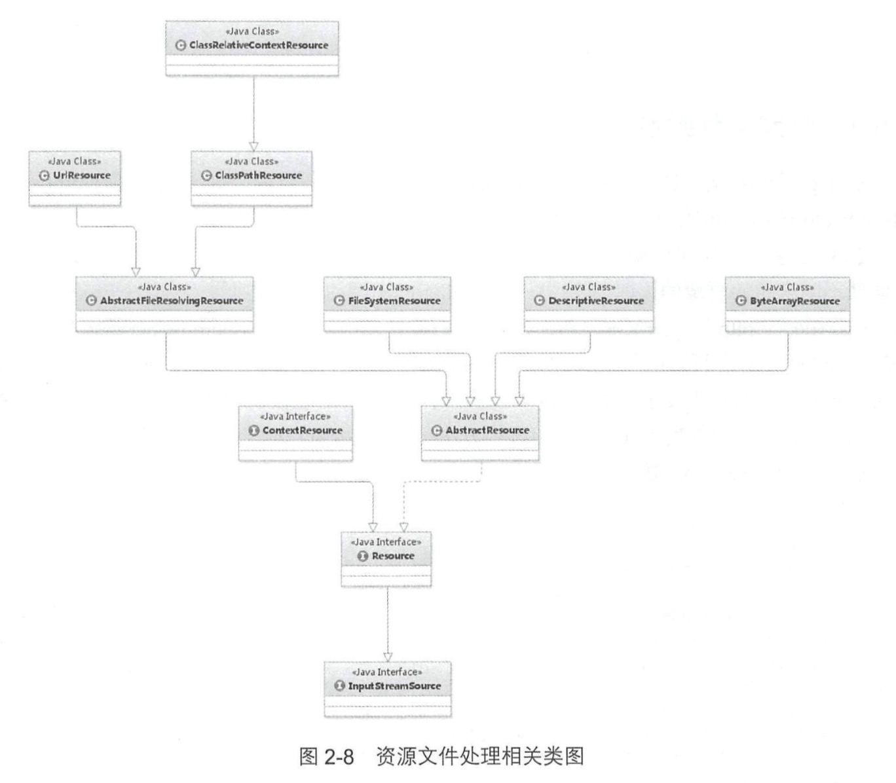
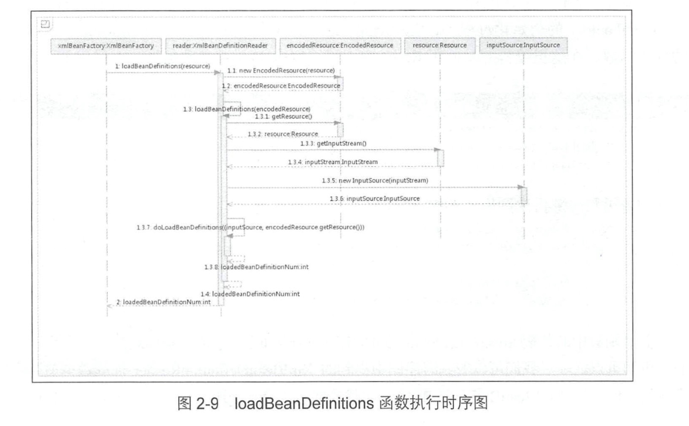
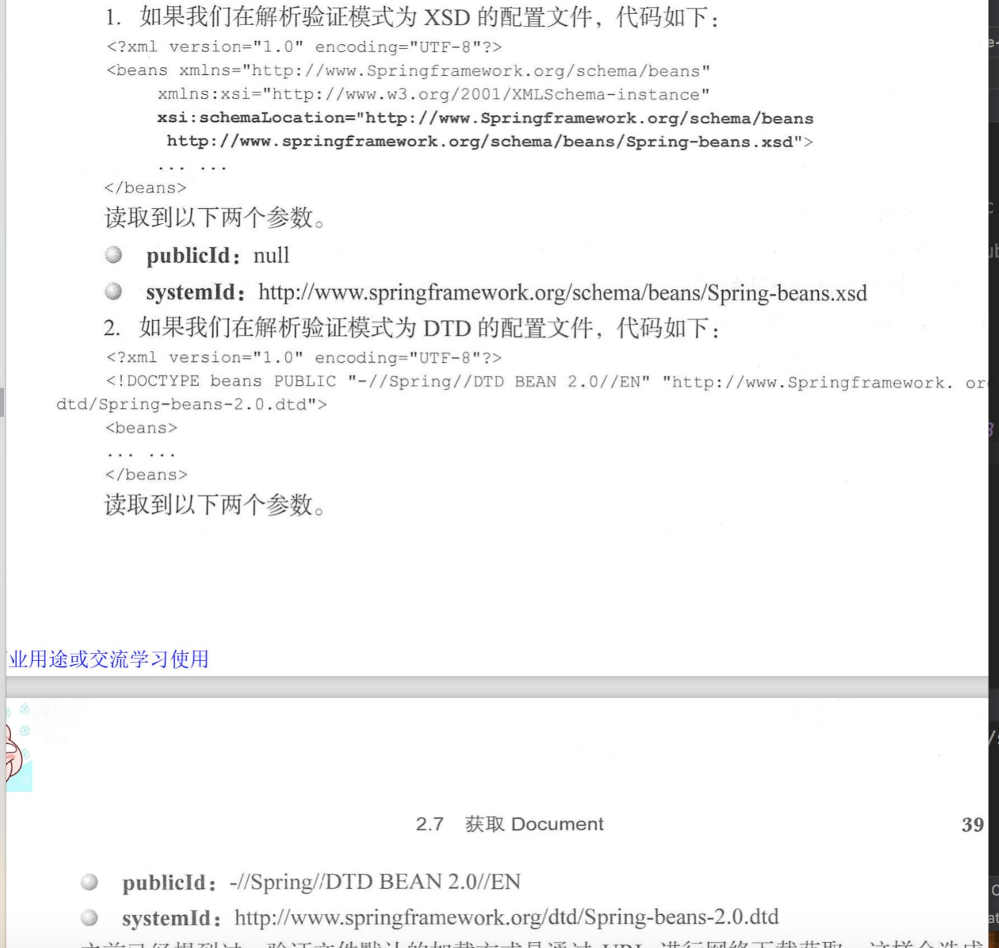
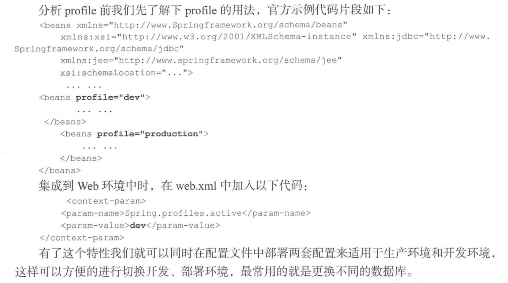
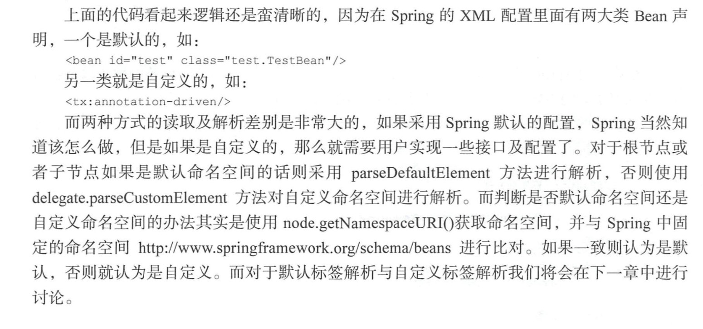

2 容器的基本实现

## 2.1 容器的基本用法

```

package com.spring.book.study.chapter02;

public class MyTestBean {

    private String testStr = "testStr";

    public String getTestStr() {
        return testStr;
    }

    public void setTestStr(String testStr) {
        this.testStr = testStr;
    }
}


```
> pom文件

```
<?xml version="1.0" encoding="UTF-8"?>
<project xmlns="http://maven.apache.org/POM/4.0.0"
         xmlns:xsi="http://www.w3.org/2001/XMLSchema-instance"
         xsi:schemaLocation="http://maven.apache.org/POM/4.0.0 http://maven.apache.org/xsd/maven-4.0.0.xsd">
    <modelVersion>4.0.0</modelVersion>

    <groupId>com.spring.book.study</groupId>
    <artifactId>book1-spring-source-deep-analysis</artifactId>
    <version>1.0-SNAPSHOT</version>

    <dependencies>

        <dependency>
            <groupId>junit</groupId>
            <artifactId>junit</artifactId>
            <version>4.12</version>
        </dependency>
        <dependency>
            <groupId>org.springframework</groupId>
            <artifactId>spring-context</artifactId>
            <version>4.1.6.RELEASE</version>
        </dependency>
        <dependency>
            <groupId>org.springframework</groupId>
            <artifactId>spring-jdbc</artifactId>
            <version>4.1.6.RELEASE</version>
        </dependency>
    </dependencies>
</project>

```

> 在resources新建beanFactoryTest.xml

```

<?xml version="1.0" encoding="UTF-8"?>
<beans xmlns="http://www.springframework.org/schema/beans" xmlns:context="http://www.springframework.org/schema/context"
       xmlns:xsi="http://www.w3.org/2001/XMLSchema-instance" xmlns:aop="http://www.springframework.org/schema/aop"
       xmlns:tx="http://www.springframework.org/schema/tx" xmlns:p="http://www.springframework.org/schema/p"
       xmlns:util="http://www.springframework.org/schema/util" xmlns:jdbc="http://www.springframework.org/schema/jdbc"
       xmlns:cache="http://www.springframework.org/schema/cache"
       xsi:schemaLocation="
    http://www.springframework.org/schema/context
    http://www.springframework.org/schema/context/spring-context.xsd
    http://www.springframework.org/schema/beans
    http://www.springframework.org/schema/beans/spring-beans.xsd
    http://www.springframework.org/schema/tx
    http://www.springframework.org/schema/tx/spring-tx.xsd
    http://www.springframework.org/schema/jdbc
    http://www.springframework.org/schema/jdbc/spring-jdbc-3.1.xsd
    http://www.springframework.org/schema/cache
    http://www.springframework.org/schema/cache/spring-cache-3.1.xsd
    http://www.springframework.org/schema/aop
    http://www.springframework.org/schema/aop/spring-aop.xsd
    http://www.springframework.org/schema/util
    http://www.springframework.org/schema/util/spring-util.xsd">

    <bean id="myTestBean" class="com.spring.book.study.chapter02.MyTestBean"></bean>


</beans>    

```

> 在test包里建立测试类BeanFactoryTest.java

```
package com.spring.book.study.chapter02;

import org.junit.Test;
import org.springframework.beans.factory.BeanFactory;
import org.springframework.beans.factory.xml.XmlBeanFactory;
import org.springframework.core.io.ClassPathResource;

import static org.junit.Assert.*;

public class BeanFactoryTest {


    @Test
    public void testSimpleUpload() {
        BeanFactory bf = new XmlBeanFactory(new ClassPathResource("beanFactoryTest.xml"));
        MyTestBean bean = (MyTestBean) bf.getBean("myTestBean");
        System.out.println(bean.getTestStr());
        assertEquals("testStr", bean.getTestStr());
    }


}


```

> 运行可以正常输出testStr


 
## 2.2 功能分析

> 上述代码完成的功能
  1.读取配置文件beanFactoryTest.xml
  2.根据beanFactoryTest.xml中的配置找到对应的类配置，并实例化
  3.调用实例化后的实例
  
> 简化的设计:
  ConfigReader: 用于读取及验证配置文件
  ReflectionUtil: 根据配置文件进行反射实例化
  App:用于完成整个逻辑的串联
  
 
## 2.3 功能结构

```

book1-spring-source-deep-analysis
    ├── pom.xml
    └── src
        ├── main
        │   ├── java
        │   │   └── com
        │   │       └── spring
        │   │           └── book
        │   │               └── study
        │   │                   └── chapter02
        │   │                       └── MyTestBean.java   
        │   └── resources
        │       ├── beanFactoryTest.xml
        │       ├── chapter01
        │       │   ├── README.md
        │       │   └── images
        │       │       └── 01_spring_module_component.jpg
        │       └── chapter02
        │           ├── README.md
        │           └── images
        └── test
            └── java
                └── com
                    └── spring
                        └── book
                            └── study
                                └── chapter02
                                    └── BeanFactoryTest.java


```

## 2.4 Spring的结构组成

### 2.4.2 核心类介绍

**1.DefaultListableBeanFactory**

> XmlBeanFactory继承自DefaultListableBeanFactory，而DefaultListableBeanFactory是整个bean加载的核心部分，
  是Spring注册及加载bean的默认实现，而对于XmlBeanFactory与DefaultListableBeanFactory不同的地方其实是在
  XmlBeanFactory中使用了自定义的XML读取器XmlBeanDefinitionReader，实现了个性化的BeanDefinitionReader读取，
  DefaultListableBeanFactory继承了AbstractAutowireCapableBeanFactory并实现了ConfigurableListBeanFactory
  以及BeanDefinitionRegistry接口。
  
  

> AliasRegistry:定义对alias的简单增删改等操作

```
public interface AliasRegistry {
    void registerAlias(String var1, String var2);

    void removeAlias(String var1);

    boolean isAlias(String var1);

    String[] getAliases(String var1);
}

```

> SimpleAliasRegistry: 主要使用map作为alias缓存，并对接口AliasRegistry进行实现

```

public class SimpleAliasRegistry implements AliasRegistry {
    private final Map<String, String> aliasMap = new ConcurrentHashMap(16);

}

```
> SingletonBeanRegistry:定义对单例的注册及获取

```

public interface SingletonBeanRegistry {
    void registerSingleton(String var1, Object var2);

    Object getSingleton(String var1);

    boolean containsSingleton(String var1);

    String[] getSingletonNames();

    int getSingletonCount();
}

```

> BeanFactory：定义获取bean及bean的各种属性

```
public interface BeanFactory {
    String FACTORY_BEAN_PREFIX = "&";

    Object getBean(String var1) throws BeansException;

    <T> T getBean(String var1, Class<T> var2) throws BeansException;

    <T> T getBean(Class<T> var1) throws BeansException;

    Object getBean(String var1, Object... var2) throws BeansException;

    <T> T getBean(Class<T> var1, Object... var2) throws BeansException;

    boolean containsBean(String var1);

    boolean isSingleton(String var1) throws NoSuchBeanDefinitionException;

    boolean isPrototype(String var1) throws NoSuchBeanDefinitionException;

    boolean isTypeMatch(String var1, Class<?> var2) throws NoSuchBeanDefinitionException;

    Class<?> getType(String var1) throws NoSuchBeanDefinitionException;

    String[] getAliases(String var1);
}

```
> DefaultSingletonBeanRegistry:对接口SingletonBeanRegistry个函数的实现。
> HierarchicalBeanFactory:继承BeanFactory，也就是在BeanFactory定义的功能的基础上增加了对parentFactory
> BeanDefinitionRegistry: 定义对BeanDefinition各种增删改操作
> FactoryBeanRegistrySupport:在DefaultSingletonBeanRegistry基础上增加了对FactoryBean的特殊处理功能
> ConfigurableBeanFactory:提供了配置Factory的各种方法。
> ListableBeanFactory: 根据各种条件获取bean的配置清单。
> AbstractBeanFactory:综合FactoryBeanRegistrySupport和ConfigurableBeanFactory的功能
> AutowireCapableBeanFactory:提供创建bean、自动注入、初始化以及应用bean的后处理器
> AbstractAutowireCapableBeanFactory:综合AbstractBeanFactory并对接口AutowireCapableBeanFactory进行实现。
> ConfigurableListableBeanFactory:BeanFactory配置清单，指定忽略类型及接口等
> DefaultListableBeanFactory:综合上面所有功能，主要是对bean注册后的处理

> XmlBeanFactory对DefaultListableBeanFactory类进行扩展，主要用于从XML文档中读取BeanDefinition，对于注册及
  获取bean都是使用从父类DefaultListableBeanFactory继承的方法实现，与父类不同的个性化实现就是增加了
  XmlBeanDefinitionReader类型的reader属性。在XmlBeanFactory中主要使用reader属性对资源文件进行读取和注册。


**2.XmlBeanDefinitionReader**

> XmlBeanDefinitionReader主要完成资源文件的读取，解析及注册等功能
> ResourceLoader：定义资源加载器，主要应用于根据给定的资源文件地址返回对应的Resource。
> BeanDefinitionReader:主要定义资源文件读取并转换为BeanDefinition的各个功能。
> EnvironmentCapable: 定义获取Environment方法。
> DocumentLoader：定义从资源文件加载到转换为Document的功能。
> AbstractBeanDefinitionReader：对EnvironmentCapable、BeanDefinitionReader类定义的功能进行实现。
> BeanDefinitionDocumentReader: 定义读取Document并注册BeanDefinition功能
> BeanDefinitionParserDelegate: 定义解析Element的各种方法。


> XmlBeanDefinitionReader中主要包含以下几步走
> 1.通过继承自AbstractBeanDefinitionReader中的方法，来使用ResourceLoader将资源文件路径转换为对应的Resource文件
> 2.通过DocumentLoader对Resource文件进行装换，将Resource文件转为Document
> 3.通过实现接口BeanDefinitionDocumentReader的DefaultBeanDefinitionDocumentReader类对Document进行解析，
    并使用BeanDefinitionParserDelegate对Element进行解析。
    
    
## 2.5 容器的基础XmlBeanFactory



### 2.5.1 配置文件封装
 
> Spring配置文件读取是通过ClassPathResource进行封装的。
> Spring对其内部使用到的资源实现了自己的抽象结构:Resource接口封装底层资源。

```
public interface InputStreamSource {
    InputStream getInputStream() throws IOException;
}

public interface Resource extends InputStreamSource {
    boolean exists();

    default boolean isReadable() {
        return true;
    }

    default boolean isOpen() {
        return false;
    }

    default boolean isFile() {
        return false;
    }

    URL getURL() throws IOException;

    URI getURI() throws IOException;

    File getFile() throws IOException;

    default ReadableByteChannel readableChannel() throws IOException {
        return Channels.newChannel(this.getInputStream());
    }

    long contentLength() throws IOException;

    long lastModified() throws IOException;

    Resource createRelative(String var1) throws IOException;

    @Nullable
    String getFilename();

    String getDescription();
}

```

> 对不同来源的资源文件都有相应的Resource实现：文件(FileSystemResource),ClassPath资源、URL资源(UrlResource)、
  InputStream资源(InputStreamResource)、Byte数组(ByteArrayResource)等
  
  


```

# ClassPathResource的输入流方法实现
public InputStream getInputStream() throws IOException {
    InputStream is;
    if (this.clazz != null) {
        is = this.clazz.getResourceAsStream(this.path);
    } else if (this.classLoader != null) {
        is = this.classLoader.getResourceAsStream(this.path);
    } else {
        // 
        is = ClassLoader.getSystemResourceAsStream(this.path);
    }

    if (is == null) {
        throw new FileNotFoundException(this.getDescription() + " cannot be opened because it does not exist");
    } else {
        return is;
    }
}

#FileSystemResource.java
public InputStream getInputStream() throws IOException {
    return Files.newInputStream(this.file.toPath());
}

#XmlBeanFactory


public XmlBeanFactory(Resource resource) throws BeansException {
    this(resource, null);
}

public XmlBeanFactory(Resource resource, BeanFactory parentBeanFactory) throws BeansException {
    super(parentBeanFactory);
    // 资源加载的真正实现，
    this.reader.loadBeanDefinitions(resource);
}


```


### 2.5.2 加载Bean

> XmlBeanDefinitionReader类型的reader，this.reader.loadBeanDefinitions(resource),这个方法是整个资源加载的切入点



> 1.封装资源文件。当进入XmlBeanDefinitionReader后首先对参数Resource使用EncodedResource类进行封装。
> 2.获取输入流。从Resource中获取对应的InputStream并构造InputSource
> 3.通过构造的InputSource实例和Resource实例继续调用函数doLoadBeanDefinitions。


```

# 进行编码处理
public int loadBeanDefinitions(Resource resource) throws BeanDefinitionStoreException {
    return this.loadBeanDefinitions(new EncodedResource(resource));
}


# 真正的数据准备阶段
public int loadBeanDefinitions(EncodedResource encodedResource) throws BeanDefinitionStoreException {
    Assert.notNull(encodedResource, "EncodedResource must not be null");
    if (logger.isTraceEnabled()) {
        logger.trace("Loading XML bean definitions from " + encodedResource);
    }
    
    
    // 通过属性来记录已经加载的资源
    Set<EncodedResource> currentResources = this.resourcesCurrentlyBeingLoaded.get();
    if (currentResources == null) {
        currentResources = new HashSet<>(4);
        this.resourcesCurrentlyBeingLoaded.set(currentResources);
    }
    if (!currentResources.add(encodedResource)) {
        throw new BeanDefinitionStoreException(
                "Detected cyclic loading of " + encodedResource + " - check your import definitions!");
    }
    try {
        // 从encodedResource中获取已经封装的Resource对象并再次从Resource中获取其中的inputStream
        InputStream inputStream = encodedResource.getResource().getInputStream();
        try {
        
            // 从encodedResource中获取已经封装的Resource对象并在此从Resource中获取其中的inputStream
            InputSource inputSource = new InputSource(inputStream);
            if (encodedResource.getEncoding() != null) {
                inputSource.setEncoding(encodedResource.getEncoding());
            }
            // 核心逻辑部分
            return doLoadBeanDefinitions(inputSource, encodedResource.getResource());
        }
        finally {
            inputStream.close();
        }
    }
    catch (IOException ex) {
        throw new BeanDefinitionStoreException(
                "IOException parsing XML document from " + encodedResource.getResource(), ex);
    }
    finally {
        currentResources.remove(encodedResource);
        if (currentResources.isEmpty()) {
            this.resourcesCurrentlyBeingLoaded.remove();
        }
    }
}


# 书上有行代码int validationMode = getValidationModeForResource(resource)
protected int doLoadBeanDefinitions(InputSource inputSource, Resource resource)
			throws BeanDefinitionStoreException {
    try {
        // int validationMode = getValidationModeForResource(resource) //这行代码4.1版本以上都没有这行代码
        Document doc = doLoadDocument(inputSource, resource);
        return registerBeanDefinitions(doc, resource);
    }
    catch (BeanDefinitionStoreException ex) {
        throw ex;
    }
    catch (SAXParseException ex) {
        throw new XmlBeanDefinitionStoreException(resource.getDescription(),
                "Line " + ex.getLineNumber() + " in XML document from " + resource + " is invalid", ex);
    }
    catch (SAXException ex) {
        throw new XmlBeanDefinitionStoreException(resource.getDescription(),
                "XML document from " + resource + " is invalid", ex);
    }
    catch (ParserConfigurationException ex) {
        throw new BeanDefinitionStoreException(resource.getDescription(),
                "Parser configuration exception parsing XML from " + resource, ex);
    }
    catch (IOException ex) {
        throw new BeanDefinitionStoreException(resource.getDescription(),
                "IOException parsing XML document from " + resource, ex);
    }
    catch (Throwable ex) {
        throw new BeanDefinitionStoreException(resource.getDescription(),
                "Unexpected exception parsing XML document from " + resource, ex);
    }
}

# Xml模式的验证放在了这个方法里面了getValidationModeForResource(Resource),作为参数
protected Document doLoadDocument(InputSource inputSource, Resource resource) throws Exception {
    return this.documentLoader.loadDocument(inputSource, getEntityResolver(), this.errorHandler,
            getValidationModeForResource(resource), isNamespaceAware());
}

```

> 1 获取对xml文件的验证模式
> 2 加载xml文件，并得到对应的Document
> 3.根据返回的Document注册Bean信息


## 2.6 获取XML的验证模式

### 2.6.1 DTD和XSD

> DTD(Document Type Definition)即文档类型定义，是一种XML约束模式语言。

```
<?xml versioπ=”1.0” encod1ng=”UTF 8”?>
<!DOCTYPE beans PUBLIC "-//Sp口 ng//DTD BEAN 2 0//EN" dtd/ Spring-beans-2 O.dtd">
<beans> 
</beans>

```

> XML Schema语言就是XSD(XML Schemas Definition)。描速了XML文档的结构。

```
# 复制过来的 有错误
<?xml versio口=”1.0” encoding="UTF-8” standalone=”no”?>
<xsd:schema xmlns=”http ://www.Springframework.org/schema/beans”
xmlns:xsd = ”http://www.w3.org/2001/XMLSchema”
targetNamespace=”http://www.Springframework.org/schema/beans”>
<beans>

</beans>  

```

### 2.6.2 验证模式的读取

```
protected int getValidationModeForResource(Resource resource) {
    int validationModeToUse = getValidationMode();
    // 如果手动指定了验证模式则使用指定的验证模式
    if (validationModeToUse != VALIDATION_AUTO) {
        return validationModeToUse;
    }
    // 如果为指定则使用自动检测
    int detectedMode = detectValidationMode(resource);
    if (detectedMode != VALIDATION_AUTO) {
        return detectedMode;
    }
    // Hmm, we didn't get a clear indication... Let's assume XSD,
    // since apparently no DTD declaration has been found up until
    // detection stopped (before finding the document's root tag).
    return VALIDATION_XSD;
}


protected int detectValidationMode(Resource resource) {
    if (resource.isOpen()) {
        throw new BeanDefinitionStoreException(
                "Passed-in Resource [" + resource + "] contains an open stream: " +
                "cannot determine validation mode automatically. Either pass in a Resource " +
                "that is able to create fresh streams, or explicitly specify the validationMode " +
                "on your XmlBeanDefinitionReader instance.");
    }

    InputStream inputStream;
    try {
        inputStream = resource.getInputStream();
    }
    catch (IOException ex) {
        throw new BeanDefinitionStoreException(
                "Unable to determine validation mode for [" + resource + "]: cannot open InputStream. " +
                "Did you attempt to load directly from a SAX InputSource without specifying the " +
                "validationMode on your XmlBeanDefinitionReader instance?", ex);
    }

    try {
        return this.validationModeDetector.detectValidationMode(inputStream);
    }
    catch (IOException ex) {
        throw new BeanDefinitionStoreException("Unable to determine validation mode for [" +
                resource + "]: an error occurred whilst reading from the InputStream.", ex);
    }
}


public int detectValidationMode(InputStream inputStream) throws IOException {
    // Peek into the file to look for DOCTYPE.
    BufferedReader reader = new BufferedReader(new InputStreamReader(inputStream));
    try {
        boolean isDtdValidated = false;
        String content;
        while ((content = reader.readLine()) != null) {
            content = consumeCommentTokens(content);
            // 如果读取的行是空或者是注释则略过
            if (this.inComment || !StringUtils.hasText(content)) {
                continue;
            }
            
            if (hasDoctype(content)) {
                isDtdValidated = true;
                break;
            }
            if (hasOpeningTag(content)) {
                // End of meaningful data...
                break;
            }
        }
        return (isDtdValidated ? VALIDATION_DTD : VALIDATION_XSD);
    }
    catch (CharConversionException ex) {
        // Choked on some character encoding...
        // Leave the decision up to the caller.
        return VALIDATION_AUTO;
    }
    finally {
        reader.close();
    }
}


private boolean hasDoctype(String content) {
    return content.contains(DOCTYPE);
}

```

> 验证的办法就是判断是否包含DOCTYPE，包含就是DTD，否则就是XSD

## 2.7 获取Document

```
# 通过SAX解析xml
public Document loadDocument(InputSource inputSource, EntityResolver entityResolver,
			ErrorHandler errorHandler, int validationMode, boolean namespaceAware) throws Exception {

    DocumentBuilderFactory factory = createDocumentBuilderFactory(validationMode, namespaceAware);
    if (logger.isDebugEnabled()) {
        logger.debug("Using JAXP provider [" + factory.getClass().getName() + "]");
    }
    DocumentBuilder builder = createDocumentBuilder(factory, entityResolver, errorHandler);
    return builder.parse(inputSource);
}


# entityResolver
protected EntityResolver getEntityResolver() {
    if (this.entityResolver == null) {
        // Determine default EntityResolver to use.
        ResourceLoader resourceLoader = getResourceLoader();
        if (resourceLoader != null) {
            this.entityResolver = new ResourceEntityResolver(resourceLoader);
        }
        else {
            this.entityResolver = new DelegatingEntityResolver(getBeanClassLoader());
        }
    }
    return this.entityResolver;
}

```


### 2.7.1 EntityResolver用法

> 如果SAX应用程序需要实现自定义的处理外部实体，则必须实现此接口并使用setEntityResolver方法想SAX
  驱动注册一个实例。也就是，解析一个XML，SAX首先读取该XML文档上的声明，根据声明去寻找相应的DTD定义，
  以便对文档进行一个验证。默认的寻找规则，通过网络(实现上就是声明的DTD的URI地址)来下载相应的DTD声明，
  并进行认证。下载可能会中断等原因，导致声明不被找到。
> EntityResolver的作用是项目本身就可以提供一个如何寻找DTD声明的方法，即有程序来实现寻找DTD声明的
  过程。


```

public interface EntityResolver {

    public abstract InputSource resolveEntity (String publicId,
                                               String systemId)
        throws SAXException, IOException;

}

```




```

# DelegatingEntityResolver
public InputSource resolveEntity(String publicId, String systemId) throws SAXException, IOException {
    if (systemId != null) {
        if (systemId.endsWith(DTD_SUFFIX)) {
            // 如果是dtd从这里解析
            // DTD类型直接截取systemId最后的xx.dd 去当前路径下寻找，
            return this.dtdResolver.resolveEntity(publicId, systemId);
        }
        else if (systemId.endsWith(XSD_SUFFIX)) {
            // 通过调用META-INF/Spring.schemas解析 而加载XSD类型的PluggableSchemaResolver类的resolveEntity，
            // 默认到META-INF/Spring.schemas文件中找到systemid锁对应的XSD文件
            return this.schemaResolver.resolveEntity(publicId, systemId);
        }
    }
    return null;
}


# BeansDtdResolver
public InputSource resolveEntity(String publicId, String systemId) throws IOException {
    if (logger.isTraceEnabled()) {
        logger.trace("Trying to resolve XML entity with public ID [" + publicId +
                "] and system ID [" + systemId + "]");
    }
    if (systemId != null && systemId.endsWith(DTD_EXTENSION)) {
        int lastPathSeparator = systemId.lastIndexOf("/");
        for (String DTD_NAME : DTD_NAMES) {
            int dtdNameStart = systemId.indexOf(DTD_NAME);
            if (dtdNameStart > lastPathSeparator) {
                String dtdFile = systemId.substring(dtdNameStart);
                if (logger.isTraceEnabled()) {
                    logger.trace("Trying to locate [" + dtdFile + "] in Spring jar");
                }
                try {
                    Resource resource = new ClassPathResource(dtdFile, getClass());
                    InputSource source = new InputSource(resource.getInputStream());
                    source.setPublicId(publicId);
                    source.setSystemId(systemId);
                    if (logger.isDebugEnabled()) {
                        logger.debug("Found beans DTD [" + systemId + "] in classpath: " + dtdFile);
                    }
                    return source;
                }
                catch (IOException ex) {
                    if (logger.isDebugEnabled()) {
                        logger.debug("Could not resolve beans DTD [" + systemId + "]: not found in class path", ex);
                    }
                }

            }
        }
    }

    // Use the default behavior -> download from website or wherever.
    return null;
}
```

## 2.8 解析及注册BeanDefinitions

> xml解析完成之后开始调用注册bean的方法

```

# 这个方法中个很好地应用了面向对象中单一职责的原则，将逻辑处理委托给单一的类进行处理，这个逻辑类就是BeanDefinitionDocumentReader。
# BeanDefinitionDocumentReader是接口，实例化是createBeanDefinitionDocumentReader()中完成，默认实现为DefaultBeanDefinitionDocumentReader
public int registerBeanDefinitions(Document doc, Resource resource) throws BeanDefinitionStoreException {
    // 使用DefaultBeanDefinitionDocumentReader实例化BeanDefinitionDocumentReader
    BeanDefinitionDocumentReader documentReader = createBeanDefinitionDocumentReader();
    // 将环境变量设置其中
    documentReader.setEnvironment(getEnvironment());
    // 在实例化BeanDefinitionReader时会将BeanDefinitionRegistry传入，默认使用继承自DefaultListableBeanFactory的子类
    // 记录统计前BeanDefinition的加载个数
    int countBefore = getRegistry().getBeanDefinitionCount();
    // 加载及注册bean
    documentReader.registerBeanDefinitions(doc, createReaderContext(resource));
    // 记录本次加载的BeanDefinition个数
    return getRegistry().getBeanDefinitionCount() - countBefore;
}

# 这个方法的最重要的目的之一就是提取root，以便于再次将root作为参数继续BeanDefinition的注册。
public void registerBeanDefinitions(Document doc, XmlReaderContext readerContext) {
    this.readerContext = readerContext;
    logger.debug("Loading bean definitions");
    Element root = doc.getDocumentElement();
    // 
    doRegisterBeanDefinitions(root);
}

# 
protected void doRegisterBeanDefinitions(Element root) {
	
	// 专门处理解析
    BeanDefinitionParserDelegate parent = this.delegate;
    this.delegate = createDelegate(getReaderContext(), root, parent);

    if (this.delegate.isDefaultNamespace(root)) {
        // 处理profile属性
        String profileSpec = root.getAttribute(PROFILE_ATTRIBUTE);
        if (StringUtils.hasText(profileSpec)) {
            String[] specifiedProfiles = StringUtils.tokenizeToStringArray(
                    profileSpec, BeanDefinitionParserDelegate.MULTI_VALUE_ATTRIBUTE_DELIMITERS);
            if (!getReaderContext().getEnvironment().acceptsProfiles(specifiedProfiles)) {
                return;
            }
        }
    }
    
    // 模板方法
    // 解析前处理，留给子类实现
    preProcessXml(root);
    parseBeanDefinitions(root, this.delegate);
    // 解析后处理，留给子类实现
    postProcessXml(root);

    this.delegate = parent;
}

```

### 2.8.1 profile属性的使用



### 2.8.2 解析并注册BeanDefinition

```

protected void parseBeanDefinitions(Element root, BeanDefinitionParserDelegate delegate) {
    // 对beans的处理
    if (delegate.isDefaultNamespace(root)) {
        NodeList nl = root.getChildNodes();
        for (int i = 0; i < nl.getLength(); i++) {
            Node node = nl.item(i);
            if (node instanceof Element) {
                Element ele = (Element) node;
                if (delegate.isDefaultNamespace(ele)) {
                    // 对bean的处理
                    parseDefaultElement(ele, delegate);
                }
                else {
                    // 对bean的处理
                    delegate.parseCustomElement(ele);
                }
            }
        }
    }
    else {
        delegate.parseCustomElement(root);
    }
}

```




 
