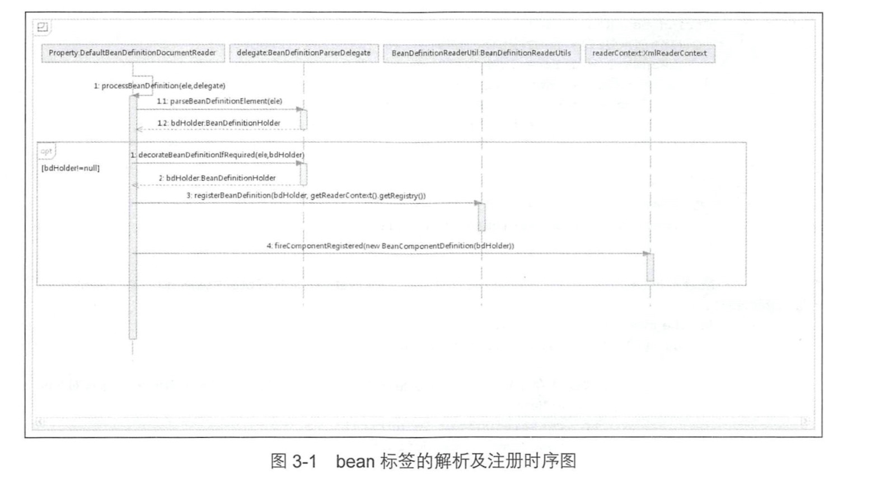
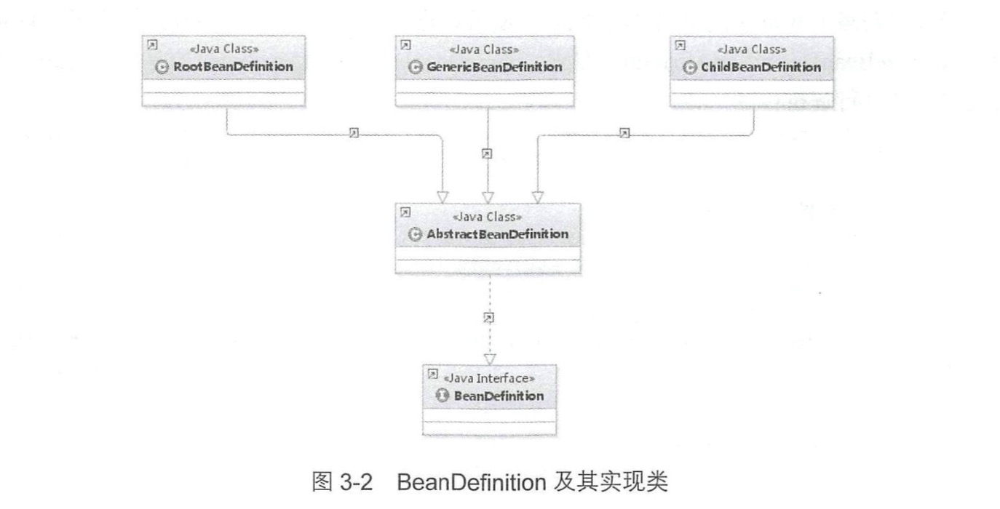
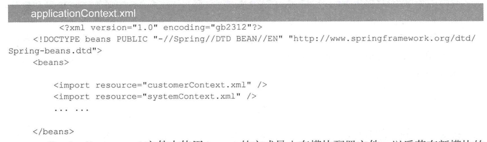

3 默认标签的解析


```
#DefaultBeanDefinitionDocumentReader.java 默认标签的解析，分别对(import,alias,bean和beans)做了不同处理
private void parseDefaultElement(Element ele, BeanDefinitionParserDelegate delegate) {
    if (delegate.nodeNameEquals(ele, IMPORT_ELEMENT)) {
        importBeanDefinitionResource(ele);
    }
    else if (delegate.nodeNameEquals(ele, ALIAS_ELEMENT)) {
        processAliasRegistration(ele);
    }
    else if (delegate.nodeNameEquals(ele, BEAN_ELEMENT)) {
        processBeanDefinition(ele, delegate);
    }
    else if (delegate.nodeNameEquals(ele, NESTED_BEANS_ELEMENT)) {
        // recurse
        doRegisterBeanDefinitions(ele);
    }
}


```

## 3.1 bean标签的解析及注册


```
protected void processBeanDefinition(Element ele, BeanDefinitionParserDelegate delegate) {
    BeanDefinitionHolder bdHolder = delegate.parseBeanDefinitionElement(ele);
    if (bdHolder != null) {
        bdHolder = delegate.decorateBeanDefinitionIfRequired(ele, bdHolder);
        try {
            // Register the final decorated instance.
            BeanDefinitionReaderUtils.registerBeanDefinition(bdHolder, getReaderContext().getRegistry());
        }
        catch (BeanDefinitionStoreException ex) {
            getReaderContext().error("Failed to register bean definition with name '" +
                    bdHolder.getBeanName() + "'", ele, ex);
        }
        // Send registration event.
        getReaderContext().fireComponentRegistered(new BeanComponentDefinition(bdHolder));
    }
}

```

> 1.首先委托BeanDefinitionDelegate类的parseBeanDefinitionElement方法进行元素解析，返回BeanDefinitionHolder类型的实例bdHolder，
    进过这个方法后，bdHolder实例已经包含我们配置文件中的各种属性了，例如class，name，id，alias之类的属性。
> 2.当返回的bdHolder部位空的情况下若存在默认标签的子结点下再有自定义属性，还需要再次对自定义标签进行解析。
> 3.解析完成后，需要对解析后的bdHolder进行注册，同样，注册操作委托给了BeanDefinitionReaderUtils的registerBeanDefinition方法。
> 4.最后发出响应时间，通知相关的监听器，这个bean已经加载完成了



### 3.1.1 解析BeanDefinition


```

# BeanDefinitionParserDelegate.java
public BeanDefinitionHolder parseBeanDefinitionElement(Element ele) {
    return parseBeanDefinitionElement(ele, null);
}


public BeanDefinitionHolder parseBeanDefinitionElement(Element ele, BeanDefinition containingBean) {
    // 解析id属性
    String id = ele.getAttribute(ID_ATTRIBUTE);
    String nameAttr = ele.getAttribute(NAME_ATTRIBUTE);
    
    // 解析name属性
    List<String> aliases = new ArrayList<String>();
    if (StringUtils.hasLength(nameAttr)) {
        String[] nameArr = StringUtils.tokenizeToStringArray(nameAttr, MULTI_VALUE_ATTRIBUTE_DELIMITERS);
        aliases.addAll(Arrays.asList(nameArr));
    }
    
    // 分割name属性
    String beanName = id;
    if (!StringUtils.hasText(beanName) && !aliases.isEmpty()) {
        beanName = aliases.remove(0);
        if (logger.isDebugEnabled()) {
            logger.debug("No XML 'id' specified - using '" + beanName +
                    "' as bean name and " + aliases + " as aliases");
        }
    }

    if (containingBean == null) {
        checkNameUniqueness(beanName, aliases, ele);
    }

    AbstractBeanDefinition beanDefinition = parseBeanDefinitionElement(ele, beanName, containingBean);
    if (beanDefinition != null) {
        if (!StringUtils.hasText(beanName)) {
            try {
                // 如果不存在beanName那么根据Spring中提供的命名规则为当前bean生成对应的beanName
                if (containingBean != null) {
                    beanName = BeanDefinitionReaderUtils.generateBeanName(
                            beanDefinition, this.readerContext.getRegistry(), true);
                }
                else {
                    beanName = this.readerContext.generateBeanName(beanDefinition);
                    // Register an alias for the plain bean class name, if still possible,
                    // if the generator returned the class name plus a suffix.
                    // This is expected for Spring 1.2/2.0 backwards compatibility.
                    String beanClassName = beanDefinition.getBeanClassName();
                    if (beanClassName != null &&
                            beanName.startsWith(beanClassName) && beanName.length() > beanClassName.length() &&
                            !this.readerContext.getRegistry().isBeanNameInUse(beanClassName)) {
                        aliases.add(beanClassName);
                    }
                }
                if (logger.isDebugEnabled()) {
                    logger.debug("Neither XML 'id' nor 'name' specified - " +
                            "using generated bean name [" + beanName + "]");
                }
            }
            catch (Exception ex) {
                error(ex.getMessage(), ele);
                return null;
            }
        }
        String[] aliasesArray = StringUtils.toStringArray(aliases);
        return new BeanDefinitionHolder(beanDefinition, beanName, aliasesArray);
    }

    return null;
}

```

> 在当前层完成的主要工作包括：
  1.提取元素中的id以及name属性。
  2.进一步解析其他所有属性并同意封装至GenericBeanDefinition类型的实例中
  3.如果检测到bean没有指定beanName，那么使用默认规则为此Bean生成beanName
  4.将获取到的信息封装到BeanDefinitionHolder的实例中
  

```

# BeanDefinitionParserDelegate.java

public AbstractBeanDefinition parseBeanDefinitionElement(
			Element ele, String beanName, BeanDefinition containingBean) {

    this.parseState.push(new BeanEntry(beanName));

    String className = null;
    // 解析Class属性
    if (ele.hasAttribute(CLASS_ATTRIBUTE)) {
        className = ele.getAttribute(CLASS_ATTRIBUTE).trim();
    }

    try {
        // 捷信parent属性
        String parent = null;
        if (ele.hasAttribute(PARENT_ATTRIBUTE)) {
            parent = ele.getAttribute(PARENT_ATTRIBUTE);
        }
        // 创建用于承载属性的AbstractBeanDefinition类型的GenericBeanDefinition
        AbstractBeanDefinition bd = createBeanDefinition(className, parent);

        // 硬编码解析默认bean的各种属性
        parseBeanDefinitionAttributes(ele, beanName, containingBean, bd);
        // 提取description
        bd.setDescription(DomUtils.getChildElementValueByTagName(ele, DESCRIPTION_ELEMENT));

        // 解析元数据
        parseMetaElements(ele, bd);
        // 解析lookup-method属性
        parseLookupOverrideSubElements(ele, bd.getMethodOverrides());
        // 解析replaced-method属性
        parseReplacedMethodSubElements(ele, bd.getMethodOverrides());

        // 解析构造函数参数
        parseConstructorArgElements(ele, bd);
        // 解析property子元素
        parsePropertyElements(ele, bd);
        // 解析qualifier子元素
        parseQualifierElements(ele, bd);

        bd.setResource(this.readerContext.getResource());
        bd.setSource(extractSource(ele));

        return bd;
    }
    catch (ClassNotFoundException ex) {
        error("Bean class [" + className + "] not found", ele, ex);
    }
    catch (NoClassDefFoundError err) {
        error("Class that bean class [" + className + "] depends on not found", ele, err);
    }
    catch (Throwable ex) {
        error("Unexpected failure during bean definition parsing", ele, ex);
    }
    finally {
        this.parseState.pop();
    }

    return null;
}

```

**1.创建用于属性承载的BeanDefinition**

> BeanDefinition是一个接口，在Spring中存在三种实现：RootBeanDefinition、ChildBeanDefinition以及GenericBeanDefinition。
  三种实现均继承AbstractBeanDefinition，其中BeanDefinition是配置文件<bean>元素标签在容器中的内部表示形式。<bean>元素标签拥有
  class、scope、lazy-init等配置属性，BeanDefinition则提供了相应的beanClass，scope，lazyInit属性，BeanDefinition和<bean>中
  的属性时一一对应的。其中RootBeanDefinition是最常用的实现类，它对应一般性的<bean>元素标签，GenericBeeanDefinition是自2.5版本以后
  新加入bean文件配置属性定义类。
> 在配置文件中可以定义父<bean>和子<bean>,父<bean>用RootBeanDefinition表示，而子<bean>用ChildBeanDefinition表示，而没有父<bean>
  的<bean>就使用RootBeanDefinition表示。  
  
> Spring通过BeanDefinition将配置文件中的<bean> 配置信息转换为容器内部表示，并将这些BeanDefinition注册到BeanDefinitionRegistry中。
  Spring容器的BeanDefinitionRegistry就向是Spring配置信息的内存数据库，主要是以map的形式保存，后续操作直接从BeanDefinitionRegistry中
  读取配置信息。
  



```

# BeanDefinitionParserDelegate.java
protected AbstractBeanDefinition createBeanDefinition(String className, String parentName)
        throws ClassNotFoundException {

    return BeanDefinitionReaderUtils.createBeanDefinition(
            parentName, className, this.readerContext.getBeanClassLoader());
}


# BeanDefinitionReaderUtils.java 创建BeanDefinition对象
public static AbstractBeanDefinition createBeanDefinition(
			String parentName, String className, ClassLoader classLoader) throws ClassNotFoundException {

    GenericBeanDefinition bd = new GenericBeanDefinition();
    bd.setParentName(parentName);
    if (className != null) {
        if (classLoader != null) {
            bd.setBeanClass(ClassUtils.forName(className, classLoader));
        }
        else {
            bd.setBeanClassName(className);
        }
    }
    return bd;
}

```

**2.解析属性**


```

public AbstractBeanDefinition parseBeanDefinitionAttributes(Element ele, String beanName,
			BeanDefinition containingBean, AbstractBeanDefinition bd) {

    // 解析singleton属性
    if (ele.hasAttribute(SINGLETON_ATTRIBUTE)) {
        error("Old 1.x 'singleton' attribute in use - upgrade to 'scope' declaration", ele);
    }
    // 解析scope属性
    else if (ele.hasAttribute(SCOPE_ATTRIBUTE)) {
        bd.setScope(ele.getAttribute(SCOPE_ATTRIBUTE));
    }
    else if (containingBean != null) {
        // Take default from containing bean in case of an inner bean definition.
        bd.setScope(containingBean.getScope());
    }

    if (ele.hasAttribute(ABSTRACT_ATTRIBUTE)) {
        bd.setAbstract(TRUE_VALUE.equals(ele.getAttribute(ABSTRACT_ATTRIBUTE)));
    }

    // 解析lazy-init
    String lazyInit = ele.getAttribute(LAZY_INIT_ATTRIBUTE);
    if (DEFAULT_VALUE.equals(lazyInit)) {
        lazyInit = this.defaults.getLazyInit();
    }
    bd.setLazyInit(TRUE_VALUE.equals(lazyInit));

    // 解析autowire属性
    String autowire = ele.getAttribute(AUTOWIRE_ATTRIBUTE);
    bd.setAutowireMode(getAutowireMode(autowire));

    // 解析dependency-check属性
    String dependencyCheck = ele.getAttribute(DEPENDENCY_CHECK_ATTRIBUTE);
    bd.setDependencyCheck(getDependencyCheck(dependencyCheck));

    // 解析depends-on属性
    if (ele.hasAttribute(DEPENDS_ON_ATTRIBUTE)) {
        String dependsOn = ele.getAttribute(DEPENDS_ON_ATTRIBUTE);
        bd.setDependsOn(StringUtils.tokenizeToStringArray(dependsOn, MULTI_VALUE_ATTRIBUTE_DELIMITERS));
    }
    
    // 解析autowire-candidate属性
    String autowireCandidate = ele.getAttribute(AUTOWIRE_CANDIDATE_ATTRIBUTE);
    if ("".equals(autowireCandidate) || DEFAULT_VALUE.equals(autowireCandidate)) {
        String candidatePattern = this.defaults.getAutowireCandidates();
        if (candidatePattern != null) {
            String[] patterns = StringUtils.commaDelimitedListToStringArray(candidatePattern);
            bd.setAutowireCandidate(PatternMatchUtils.simpleMatch(patterns, beanName));
        }
    }
    else {
        bd.setAutowireCandidate(TRUE_VALUE.equals(autowireCandidate));
    }

    // 解析primary属性
    if (ele.hasAttribute(PRIMARY_ATTRIBUTE)) {
        bd.setPrimary(TRUE_VALUE.equals(ele.getAttribute(PRIMARY_ATTRIBUTE)));
    }
    
    // 解析init-method属性
    if (ele.hasAttribute(INIT_METHOD_ATTRIBUTE)) {
        String initMethodName = ele.getAttribute(INIT_METHOD_ATTRIBUTE);
        if (!"".equals(initMethodName)) {
            bd.setInitMethodName(initMethodName);
        }
    }
    else {
        if (this.defaults.getInitMethod() != null) {
            bd.setInitMethodName(this.defaults.getInitMethod());
            bd.setEnforceInitMethod(false);
        }
    }
    // 解析destroy-method属性
    if (ele.hasAttribute(DESTROY_METHOD_ATTRIBUTE)) {
        String destroyMethodName = ele.getAttribute(DESTROY_METHOD_ATTRIBUTE);
        if (!"".equals(destroyMethodName)) {
            bd.setDestroyMethodName(destroyMethodName);
        }
    }
    else {
        if (this.defaults.getDestroyMethod() != null) {
            bd.setDestroyMethodName(this.defaults.getDestroyMethod());
            bd.setEnforceDestroyMethod(false);
        }
    }
    
    // 解析factory-method属性
    if (ele.hasAttribute(FACTORY_METHOD_ATTRIBUTE)) {
        bd.setFactoryMethodName(ele.getAttribute(FACTORY_METHOD_ATTRIBUTE));
    }
    // 解析factory-bean属性
    if (ele.hasAttribute(FACTORY_BEAN_ATTRIBUTE)) {
        bd.setFactoryBeanName(ele.getAttribute(FACTORY_BEAN_ATTRIBUTE));
    }

    return bd;
}

```


**3.解析子元素meta**

```

<bean id="myTestBean" class="com.spring.book.study.chapter02.MyTestBean">
    <meta key="testStr" value="aaaaa"/>
</bean>

public void parseMetaElements(Element ele, BeanMetadataAttributeAccessor attributeAccessor) {
    NodeList nl = ele.getChildNodes();
    for (int i = 0; i < nl.getLength(); i++) {
        Node node = nl.item(i);
        // 提取meta
        if (isCandidateElement(node) && nodeNameEquals(node, META_ELEMENT)) {
            Element metaElement = (Element) node;
            String key = metaElement.getAttribute(KEY_ATTRIBUTE);
            String value = metaElement.getAttribute(VALUE_ATTRIBUTE);
            // 使用key value构造BeanMetadataAttribute
            BeanMetadataAttribute attribute = new BeanMetadataAttribute(key, value);
            attribute.setSource(extractSource(metaElement));
            // 记录信息
            attributeAccessor.addMetadataAttribute(attribute);
        }
    }
}


```

**4.解析子元素lookup-method**

> lookup-method通常称为获取器注入。它是把一个方法声明为返回某种类型的bean，但实际要返回的bean是在配置文件里配置的。

```
# 新建User类
package com.spring.book.study.chapter03;

public class User {

    public void showMe(){
        System.out.println("i am user");
    }

}

#子类Teacher
package com.spring.book.study.chapter03;

public class Teacher extends User {

    public void showMe() {
        System.out.println("i am Teacher");
    }

}

#调用类GetBeanTest
package com.spring.book.study.chapter03;

// 创建调用方法
public abstract class GetBeanTest {

    public void showMe() {
        this.getBean().showMe();
    }

    public abstract User getBean();

}

# 新建配置文件
<?xml version="1.0" encoding="UTF-8"?>
<beans xmlns="http://www.springframework.org/schema/beans" xmlns:context="http://www.springframework.org/schema/context"
       xmlns:xsi="http://www.w3.org/2001/XMLSchema-instance" xmlns:aop="http://www.springframework.org/schema/aop"
       xmlns:tx="http://www.springframework.org/schema/tx" xmlns:p="http://www.springframework.org/schema/p"
       xmlns:util="http://www.springframework.org/schema/util" xmlns:jdbc="http://www.springframework.org/schema/jdbc"
       xmlns:cache="http://www.springframework.org/schema/cache"
       xsi:schemaLocation="
    http://www.springframework.org/schema/context
    http://www.springframework.org/schema/context/spring-context.xsd
    http://www.springframework.org/schema/beans
    http://www.springframework.org/schema/beans/spring-beans.xsd
    http://www.springframework.org/schema/tx
    http://www.springframework.org/schema/tx/spring-tx.xsd
    http://www.springframework.org/schema/jdbc
    http://www.springframework.org/schema/jdbc/spring-jdbc-3.1.xsd
    http://www.springframework.org/schema/cache
    http://www.springframework.org/schema/cache/spring-cache-3.1.xsd
    http://www.springframework.org/schema/aop
    http://www.springframework.org/schema/aop/spring-aop.xsd
    http://www.springframework.org/schema/util
    http://www.springframework.org/schema/util/spring-util.xsd">

    <bean id="getBeanTest" class="com.spring.book.study.chapter03.GetBeanTest">
        <lookup-method name="getBean" bean="teacher"/>
    </bean>

    <bean id="teacher" class="com.spring.book.study.chapter03.Teacher"/>
</beans>    


# 测试类Main
package com.spring.book.study.chapter03;

import org.springframework.context.ApplicationContext;
import org.springframework.context.support.ClassPathXmlApplicationContext;

public class Main {
    public static void main(String[] args) {
        ApplicationContext ap = new ClassPathXmlApplicationContext("lookupTest.xml");
        GetBeanTest test = (GetBeanTest) ap.getBean("getBeanTest");
        // 输出：i am Teacher
        test.showMe();
    }
}

# 新建子类Student
package com.spring.book.study.chapter03;

public class Student extends User {
    public void showMe() {
        System.out.println("i am Student");
    }
}

修改lookupTest.xml
<?xml version="1.0" encoding="UTF-8"?>
<beans xmlns="http://www.springframework.org/schema/beans" xmlns:context="http://www.springframework.org/schema/context"
       xmlns:xsi="http://www.w3.org/2001/XMLSchema-instance" xmlns:aop="http://www.springframework.org/schema/aop"
       xmlns:tx="http://www.springframework.org/schema/tx" xmlns:p="http://www.springframework.org/schema/p"
       xmlns:util="http://www.springframework.org/schema/util" xmlns:jdbc="http://www.springframework.org/schema/jdbc"
       xmlns:cache="http://www.springframework.org/schema/cache"
       xsi:schemaLocation="
    http://www.springframework.org/schema/context
    http://www.springframework.org/schema/context/spring-context.xsd
    http://www.springframework.org/schema/beans
    http://www.springframework.org/schema/beans/spring-beans.xsd
    http://www.springframework.org/schema/tx
    http://www.springframework.org/schema/tx/spring-tx.xsd
    http://www.springframework.org/schema/jdbc
    http://www.springframework.org/schema/jdbc/spring-jdbc-3.1.xsd
    http://www.springframework.org/schema/cache
    http://www.springframework.org/schema/cache/spring-cache-3.1.xsd
    http://www.springframework.org/schema/aop
    http://www.springframework.org/schema/aop/spring-aop.xsd
    http://www.springframework.org/schema/util
    http://www.springframework.org/schema/util/spring-util.xsd">

    <bean id="getBeanTest" class="com.spring.book.study.chapter03.GetBeanTest">
        <lookup-method name="getBean" bean="student"/>
    </bean>

    <bean id="teacher" class="com.spring.book.study.chapter03.Teacher"/>
    <bean id="student" class="com.spring.book.study.chapter03.Student"/>
</beans>

# 重新运行Main会发现输出为：i am Student

#解析lookup-method标签方法

public void parseLookupOverrideSubElements(Element beanEle, MethodOverrides overrides) {
    NodeList nl = beanEle.getChildNodes();
    for (int i = 0; i < nl.getLength(); i++) {
        Node node = nl.item(i);
        // 仅当在Spring默认bean的子元素且为 <lookup-method时有效
        if (isCandidateElement(node) && nodeNameEquals(node, LOOKUP_METHOD_ELEMENT)) {
            Element ele = (Element) node;
            // 获得要修饰的方法
            String methodName = ele.getAttribute(NAME_ATTRIBUTE);
            String beanRef = ele.getAttribute(BEAN_ELEMENT);
            LookupOverride override = new LookupOverride(methodName, beanRef);
            override.setSource(extractSource(ele));
            overrides.addOverride(override);
        }
    }
}


```

**5.解析子元素replaced-method**

```
# 新增TestChangeMethod类
package com.spring.book.study.chapter03;

// 在changeMe中完成某个业务逻辑
public class TestChangeMethod {

    public void changeMe(){
        System.out.println("changeMe");
    }

}

# 新增TestMethodReplacer
package com.spring.book.study.chapter03;

import org.springframework.beans.factory.support.MethodReplacer;

import java.lang.reflect.Method;

public class TestMethodReplacer implements MethodReplacer {
    public Object reimplement(Object obj, Method method, Object[] args) throws Throwable {
        System.out.println("我替换了原有的方法");
        return null;
    }
}

# 新增replaceMethodTest.xml
<?xml version="1.0" encoding="UTF-8"?>
<beans xmlns="http://www.springframework.org/schema/beans"
       xmlns:xsi="http://www.w3.org/2001/XMLSchema-instance"
       xsi:schemaLocation="
    http://www.springframework.org/schema/beans
    http://www.springframework.org/schema/beans/spring-beans.xsd">

    <bean id="testChangeMethod" class="com.spring.book.study.chapter03.TestChangeMethod">
        <replaced-method name="changeMe" replacer="replacer"/>
    </bean>

    <bean id="replacer" class="com.spring.book.study.chapter03.TestMethodReplacer"/>
</beans>


#测试
public static void main(String[] args) {
    ApplicationContext ap = new ClassPathXmlApplicationContext("replaceMethodTest.xml");
    TestChangeMethod test = (TestChangeMethod) ap.getBean("testChangeMethod");
    test.changeMe();
}

#BeanDefinitionParserDelegate.java
# 最终会记录在AbstractBeanDefinition中的methodOverrides属性中
public void parseReplacedMethodSubElements(Element beanEle, MethodOverrides overrides) {
    NodeList nl = beanEle.getChildNodes();
    for (int i = 0; i < nl.getLength(); i++) {
        Node node = nl.item(i);
        if (isCandidateElement(node) && nodeNameEquals(node, REPLACED_METHOD_ELEMENT)) {
            Element replacedMethodEle = (Element) node;
            String name = replacedMethodEle.getAttribute(NAME_ATTRIBUTE);
            String callback = replacedMethodEle.getAttribute(REPLACER_ATTRIBUTE);
            ReplaceOverride replaceOverride = new ReplaceOverride(name, callback);
            // Look for arg-type match elements.
            List<Element> argTypeEles = DomUtils.getChildElementsByTagName(replacedMethodEle, ARG_TYPE_ELEMENT);
            for (Element argTypeEle : argTypeEles) {
                String match = argTypeEle.getAttribute(ARG_TYPE_MATCH_ATTRIBUTE);
                match = (StringUtils.hasText(match) ? match : DomUtils.getTextValue(argTypeEle));
                if (StringUtils.hasText(match)) {
                    replaceOverride.addTypeIdentifier(match);
                }
            }
            replaceOverride.setSource(extractSource(replacedMethodEle));
            overrides.addOverride(replaceOverride);
        }
    }
}


```

**6.解析子元素constructor-arg**

```
# BeanDefinitionParserDelegate.java
public void parseConstructorArgElements(Element beanEle, BeanDefinition bd) {
    NodeList nl = beanEle.getChildNodes();
    for (int i = 0; i < nl.getLength(); i++) {
        Node node = nl.item(i);
        if (isCandidateElement(node) && nodeNameEquals(node, CONSTRUCTOR_ARG_ELEMENT)) {
            // 解析constructor-arg
            parseConstructorArgElement((Element) node, bd);
        }
    }
}


# 提取contructor-arg上必要的属性(index,type,name)
# 如果配置中指定了index属性，那么操作步骤如下：
# 1.解析Constructor-arg的子元素
# 2.使用ConstructorArgumentValues.ValueHolder类型来封装解析出来的元素
# 3.将type、name和index属性一并封装在ConstructorArgumentValues.ValueHolder类型中，并添加至当前BeanDefinition的constructorArgumentValues的indexArgumentValues属性中
# 如果没有指定index属性，那么操作步骤如下：
# 1.解析Constructor-arg的子元素
# 2.使用ConstructorArgumentValues.ValueHolder类型来封装解析出来的元素
# 3.将type、name和index属性一并封装在ConstructorArgumentValues.ValueHolder类型中，并添加至当前BeanDefinition的constructorArgumentValues的genericArgumentValues属性中
public void parseConstructorArgElement(Element ele, BeanDefinition bd) {
    // 提取index属性
    String indexAttr = ele.getAttribute(INDEX_ATTRIBUTE);
    // 提取type属性
    String typeAttr = ele.getAttribute(TYPE_ATTRIBUTE);
    // 提取name属性
    String nameAttr = ele.getAttribute(NAME_ATTRIBUTE);
    if (StringUtils.hasLength(indexAttr)) {
        try {
            int index = Integer.parseInt(indexAttr);
            if (index < 0) {
                error("'index' cannot be lower than 0", ele);
            }
            else {
                try {
                    this.parseState.push(new ConstructorArgumentEntry(index));
                    // 解析ele对应的属性元素
                    Object value = parsePropertyValue(ele, bd, null);
                    ConstructorArgumentValues.ValueHolder valueHolder = new ConstructorArgumentValues.ValueHolder(value);
                    if (StringUtils.hasLength(typeAttr)) {
                        valueHolder.setType(typeAttr);
                    }
                    if (StringUtils.hasLength(nameAttr)) {
                        valueHolder.setName(nameAttr);
                    }
                    valueHolder.setSource(extractSource(ele));
                    // 不允许重复指定相同参数
                    if (bd.getConstructorArgumentValues().hasIndexedArgumentValue(index)) {
                        error("Ambiguous constructor-arg entries for index " + index, ele);
                    }
                    else {
                        bd.getConstructorArgumentValues().addIndexedArgumentValue(index, valueHolder);
                    }
                }
                finally {
                    this.parseState.pop();
                }
            }
        }
        catch (NumberFormatException ex) {
            error("Attribute 'index' of tag 'constructor-arg' must be an integer", ele);
        }
    }
    else {
        // 没有index属性则负略去属性，自动寻找
        try {
            this.parseState.push(new ConstructorArgumentEntry());
            Object value = parsePropertyValue(ele, bd, null);
            ConstructorArgumentValues.ValueHolder valueHolder = new ConstructorArgumentValues.ValueHolder(value);
            if (StringUtils.hasLength(typeAttr)) {
                valueHolder.setType(typeAttr);
            }
            if (StringUtils.hasLength(nameAttr)) {
                valueHolder.setName(nameAttr);
            }
            valueHolder.setSource(extractSource(ele));
            bd.getConstructorArgumentValues().addGenericArgumentValue(valueHolder);
        }
        finally {
            this.parseState.pop();
        }
    }
}

# 解析构造函数配置中子元素的过程
# 1.略过description或者meta
# 2.提取constructor-arg上ref和value属性，以便于根据规则验证正确性，其规则为在constructor-arg上不存在一下情况
#   （1）:同时即有ref属性又有value属性（2）：存在ref属性或者value属性且又有子元素
# 3.ref属性处理。使用RuntimeBeanReference封装对应的ref名称，如：<constructor-arg ref="a">
# 4.value属性的处理。使用TypedStringValue封装，如：<constructor-arg value="a">
# 5.子元素的处理。如：<constructor-arg><map><entry key="key" value="value" /></map></constructor-arg>
# 
public Object parsePropertyValue(Element ele, BeanDefinition bd, String propertyName) {
		String elementName = (propertyName != null) ?
						"<property> element for property '" + propertyName + "'" :
						"<constructor-arg> element";

    // Should only have one child element: ref, value, list, etc.
    // 一个属性智能对应一种类型：ref、value、list等
    NodeList nl = ele.getChildNodes();
    Element subElement = null;
    for (int i = 0; i < nl.getLength(); i++) {
        // 对应description或则meta不处理
        Node node = nl.item(i);
        if (node instanceof Element && !nodeNameEquals(node, DESCRIPTION_ELEMENT) &&
                !nodeNameEquals(node, META_ELEMENT)) {
            // Child element is what we're looking for.
            if (subElement != null) {
                error(elementName + " must not contain more than one sub-element", ele);
            }
            else {
                subElement = (Element) node;
            }
        }
    }
    
    // 解析constructor-arg上的ref属性
    boolean hasRefAttribute = ele.hasAttribute(REF_ATTRIBUTE);
    // 解析constructor-arg上的value属性
    boolean hasValueAttribute = ele.hasAttribute(VALUE_ATTRIBUTE);
    if ((hasRefAttribute && hasValueAttribute) ||
            ((hasRefAttribute || hasValueAttribute) && subElement != null)) {
        /*
         * 在constructor-arg上不存在：
         *  1.同时即有ref属性又有value属性
         *  2.存在ref属性或者value属性且又有子元素
         *
         */
        error(elementName +
                " is only allowed to contain either 'ref' attribute OR 'value' attribute OR sub-element", ele);
    }

    if (hasRefAttribute) {
        // ref属性的处理，使用RuntimeBeanReference封装对应的ref名称
        String refName = ele.getAttribute(REF_ATTRIBUTE);
        if (!StringUtils.hasText(refName)) {
            error(elementName + " contains empty 'ref' attribute", ele);
        }
        RuntimeBeanReference ref = new RuntimeBeanReference(refName);
        ref.setSource(extractSource(ele));
        return ref;
    }
    else if (hasValueAttribute) {
        // value属性的处理，使用TypedStringValue封装
        TypedStringValue valueHolder = new TypedStringValue(ele.getAttribute(VALUE_ATTRIBUTE));
        valueHolder.setSource(extractSource(ele));
        return valueHolder;
    }
    else if (subElement != null) {
        // 解析子元素
        return parsePropertySubElement(subElement, bd);
    }
    else {
        // Neither child element nor "ref" or "value" attribute found.
        // 既没有ref也没有value也没有子元素，Spring蒙圈了
        error(elementName + " must specify a ref or value", ele);
        return null;
    }
}

# 子元素的处理
public Object parsePropertySubElement(Element ele, BeanDefinition bd) {
    return parsePropertySubElement(ele, bd, null);
}


# 
public Object parsePropertySubElement(Element ele, BeanDefinition bd, String defaultValueType) {
    if (!isDefaultNamespace(ele)) {
        return parseNestedCustomElement(ele, bd);
    }
    else if (nodeNameEquals(ele, BEAN_ELEMENT)) {
        BeanDefinitionHolder nestedBd = parseBeanDefinitionElement(ele, bd);
        if (nestedBd != null) {
            nestedBd = decorateBeanDefinitionIfRequired(ele, nestedBd, bd);
        }
        return nestedBd;
    }
    else if (nodeNameEquals(ele, REF_ELEMENT)) {
        // A generic reference to any name of any bean.
        String refName = ele.getAttribute(BEAN_REF_ATTRIBUTE);
        boolean toParent = false;
        if (!StringUtils.hasLength(refName)) {
            // A reference to the id of another bean in the same XML file.
            // 解析local
            refName = ele.getAttribute(LOCAL_REF_ATTRIBUTE);
            if (!StringUtils.hasLength(refName)) {
                // A reference to the id of another bean in a parent context.
                // 解析parent
                refName = ele.getAttribute(PARENT_REF_ATTRIBUTE);
                toParent = true;
                if (!StringUtils.hasLength(refName)) {
                    error("'bean', 'local' or 'parent' is required for <ref> element", ele);
                    return null;
                }
            }
        }
        if (!StringUtils.hasText(refName)) {
            error("<ref> element contains empty target attribute", ele);
            return null;
        }
        RuntimeBeanReference ref = new RuntimeBeanReference(refName, toParent);
        ref.setSource(extractSource(ele));
        return ref;
    }
    else if (nodeNameEquals(ele, IDREF_ELEMENT)) {
        // idref元素的解析
        return parseIdRefElement(ele);
    }
    else if (nodeNameEquals(ele, VALUE_ELEMENT)) {
        // 对value子元素的解析
        return parseValueElement(ele, defaultValueType);
    }
    else if (nodeNameEquals(ele, NULL_ELEMENT)) {
        // 对null子元素的解析
        // It's a distinguished null value. Let's wrap it in a TypedStringValue
        // object in order to preserve the source location.
        TypedStringValue nullHolder = new TypedStringValue(null);
        nullHolder.setSource(extractSource(ele));
        return nullHolder;
    }
    else if (nodeNameEquals(ele, ARRAY_ELEMENT)) {
        // 解析array子元素
        return parseArrayElement(ele, bd);
    }
    else if (nodeNameEquals(ele, LIST_ELEMENT)) {
        // 解析list元素
        return parseListElement(ele, bd);
    }
    else if (nodeNameEquals(ele, SET_ELEMENT)) {
        // 解析set子元素
        return parseSetElement(ele, bd);
    }
    else if (nodeNameEquals(ele, MAP_ELEMENT)) {
        // 解析map子元素
        return parseMapElement(ele, bd);
    }
    else if (nodeNameEquals(ele, PROPS_ELEMENT)) {
        // 解析props子元素
        return parsePropsElement(ele);
    }
    else {
        error("Unknown property sub-element: [" + ele.getNodeName() + "]", ele);
        return null;
    }
}

```

**7.解析子元素property**

```
# 解析property属性：如
<bean id="test" class="test.TestClass">
    <property name="testStr" value="aaa"/>
</bean>
或者
<bean id="a">
    <property name="p">
        <list>
            <value>aa</value>
            <value>bb</value>
        </list>
    </property>
</bean>


public void parsePropertyElements(Element beanEle, BeanDefinition bd) {
    NodeList nl = beanEle.getChildNodes();
    for (int i = 0; i < nl.getLength(); i++) {
        Node node = nl.item(i);
        if (isCandidateElement(node) && nodeNameEquals(node, PROPERTY_ELEMENT)) {
            parsePropertyElement((Element) node, bd);
        }
    }
}

# 这里是使用PropeertyValue进行封装，并记录在了BeanDefinition中的propertyValues属性中
public void parsePropertyElement(Element ele, BeanDefinition bd) {
    // 获取配置元素中name的值
    String propertyName = ele.getAttribute(NAME_ATTRIBUTE);
    if (!StringUtils.hasLength(propertyName)) {
        error("Tag 'property' must have a 'name' attribute", ele);
        return;
    }
    this.parseState.push(new PropertyEntry(propertyName));
    try {
        // 不允许多次对同一属性配置
        if (bd.getPropertyValues().contains(propertyName)) {
            error("Multiple 'property' definitions for property '" + propertyName + "'", ele);
            return;
        }
        Object val = parsePropertyValue(ele, bd, propertyName);
        PropertyValue pv = new PropertyValue(propertyName, val);
        parseMetaElements(ele, pv);
        pv.setSource(extractSource(ele));
        bd.getPropertyValues().addPropertyValue(pv);
    }
    finally {
        this.parseState.pop();
    }
}


```

**8.解析子元素qualifier**

```

对于qualifier元素的获取，接触更多的是注解的形式，在使用Spring框架中进行自懂注入时，
Spring容器中匹配的候选Bean数目必须有且仅有一个。当找不到一个匹配的Bean时，Spring
容器将抛出BeanCreationException异常，并指出必须至少有一个匹配的Bean。
<bean id="myTestBean" class="bean.MyTestBean">
    <qualifier type="org.Springframework.beans.factory.annotation.Qualifier" value="qf"/>
</bean>

```

### 3.1.2 AbstractBeanDefinition

> GenericBeanDefinition只是子类实现，而大部分的通用属性都保存在了AbstractBeanDefinition中，
  那么我们再次通过AbstractBeanDefinition的属性来回顾一下我们都解析了哪些对应的配置。
  
```
public abstract class AbstractBeanDefinition extends BeanMetadataAttributeAccessor
		implements BeanDefinition, Cloneable {

	private volatile Object beanClass;

    // bean的作用范围，对应bean属性scope
	private String scope = SCOPE_DEFAULT;

    // 是否是抽象，对应bean属性abstract
	private boolean abstractFlag = false;

    // 是否延迟加载，对应bean属性lazy-init
	private boolean lazyInit = false;

    // 自动注入模式，对应bean属性autowire
	private int autowireMode = AUTOWIRE_NO;
    
    // 依赖检查，Spring 3.6 后废弃这个属性
	private int dependencyCheck = DEPENDENCY_CHECK_NONE;
    
    // 用来表示一个bean的实例化依靠另一个bean先实例化，对应bean属性depend-on
	private String[] dependsOn;
    
    // autowire-candidate属性设置为false，这样容器在查找自动装配对象时，
    // 将不考虑该bean，即它不会被考虑为其他bean自动装配的候选者，但是该bean本身还是可以使用自动装配来注入其他bean的
	private boolean autowireCandidate = true;
    
    // 自动装配时，当出现多个bean后选择时，将作为首选者，对应bean属性primary
	private boolean primary = false;

    // 用来记录Qualifier，对应子元素qualifier
	private final Map<String, AutowireCandidateQualifier> qualifiers =
			new LinkedHashMap<String, AutowireCandidateQualifier>(0);

    // 允许访问非公开的构造器和方法，程序设置
	private boolean nonPublicAccessAllowed = true;

    // 是否以一种狂送的模式解析构造函数，默认为true
    // 如果为false，则在如下情况
    // interface ITest{}
    // class ITestImpl implements ITest{};
    // class Main{
    //      Main(ITest i){}
    //      Main(ITestImpl i){}
    // }
    // 抛出异常，因为Spring无法准确定位哪个构造函数
    // 程序设置
	private boolean lenientConstructorResolution = true;

    // 记录构造函数注入属性，对应bean属性constructor-arg
	private ConstructorArgumentValues constructorArgumentValues;
    
    // 普通属性集合
	private MutablePropertyValues propertyValues;
    
    // 方法重写的持有者，记录lookup-method、replaced-method元素
	private MethodOverrides methodOverrides = new MethodOverrides();

    // 对应bean属性factory-bean，用法：
    // <bean id="instanceFactoryBean" class="example.chapter3.InstanceFactroyBean">
    // <bean id="currentTime" factory-bean="instanceFactoryBean" factory-method="createTime" />
	private String factoryBeanName;
    
    // 对应bean属性factory-method
	private String factoryMethodName;

    // 初始化方法，对应bean属性init-method
	private String initMethodName;

    // 销毁方法，对应bean属性destory-method
	private String destroyMethodName;
    
    // 是否执行init-method，程序设置
	private boolean enforceInitMethod = true;

    // 是否执行destory-method，程序设置
	private boolean enforceDestroyMethod = true;
    
    // 是否是用户定义的而不是应用程序本身定义的，创建AOP时候为true，程序设置
	private boolean synthetic = false;

    // 定义这个bean的应用，APPLICATION：用户，INFRASTRUCTURE：完全内部使用，与用户无关，SUPPORT：某些负载配置的一部分
	private int role = BeanDefinition.ROLE_APPLICATION;
    
    // bean的描述信息
	private String description;
    
    // 这个bean定义的资源
	private Resource resource;

}


```
  
### 3.1.3 解析默认标签中的自定义标签元素


```

protected void processBeanDefinition(Element ele, BeanDefinitionParserDelegate delegate) {
    BeanDefinitionHolder bdHolder = delegate.parseBeanDefinitionElement(ele);
    if (bdHolder != null) {
        bdHolder = delegate.decorateBeanDefinitionIfRequired(ele, bdHolder);
        try {
            // Register the final decorated instance.
            BeanDefinitionReaderUtils.registerBeanDefinition(bdHolder, getReaderContext().getRegistry());
        }
        catch (BeanDefinitionStoreException ex) {
            getReaderContext().error("Failed to register bean definition with name '" +
                    bdHolder.getBeanName() + "'", ele, ex);
        }
        // Send registration event.
        getReaderContext().fireComponentRegistered(new BeanComponentDefinition(bdHolder));
    }
}


bdHolder = delegate.decorateBeanDefinitionIfRequired(ele, bdHolder);
对beanDefinition进行装饰，适用场景，如:
<bean id="test" class="test.MyClass">
    <mybean:user username="aaa">
</bean>

# 对自己定义属性的解析
public BeanDefinitionHolder decorateBeanDefinitionIfRequired(Element ele, BeanDefinitionHolder definitionHolder) {
    return decorateBeanDefinitionIfRequired(ele, definitionHolder, null);
}


public BeanDefinitionHolder decorateBeanDefinitionIfRequired(
			Element ele, BeanDefinitionHolder definitionHolder, BeanDefinition containingBd) {

    BeanDefinitionHolder finalDefinition = definitionHolder;

    // Decorate based on custom attributes first.
    NamedNodeMap attributes = ele.getAttributes();
    // 遍历所有的属性，看看是否有适用于修饰的属性
    for (int i = 0; i < attributes.getLength(); i++) {
        Node node = attributes.item(i);
        finalDefinition = decorateIfRequired(node, finalDefinition, containingBd);
    }

    // Decorate based on custom nested elements.
    NodeList children = ele.getChildNodes();
    // 遍历所有的子节点，看看是否有适用于修饰的子元素
    for (int i = 0; i < children.getLength(); i++) {
        Node node = children.item(i);
        if (node.getNodeType() == Node.ELEMENT_NODE) {
            finalDefinition = decorateIfRequired(node, finalDefinition, containingBd);
        }
    }
    return finalDefinition;
}


public BeanDefinitionHolder decorateIfRequired(
			Node node, BeanDefinitionHolder originalDef, BeanDefinition containingBd) {
    
    // 获取自定义标签的命名空间
    String namespaceUri = getNamespaceURI(node);
    // 对于非默认标签进行修饰
    if (!isDefaultNamespace(namespaceUri)) {
        // 根据命名空间找到对应的处理器
        NamespaceHandler handler = this.readerContext.getNamespaceHandlerResolver().resolve(namespaceUri);
        if (handler != null) {
            // 进行修饰
            return handler.decorate(node, originalDef, new ParserContext(this.readerContext, this, containingBd));
        }
        else if (namespaceUri != null && namespaceUri.startsWith("http://www.springframework.org/")) {
            error("Unable to locate Spring NamespaceHandler for XML schema namespace [" + namespaceUri + "]", node);
        }
        else {
            // A custom namespace, not to be handled by Spring - maybe "xml:...".
            if (logger.isDebugEnabled()) {
                logger.debug("No Spring NamespaceHandler found for XML schema namespace [" + namespaceUri + "]");
            }
        }
    }
    return originalDef;
}

public String getNamespaceURI(Node node) {
    return node.getNamespaceURI();
}
	
public boolean isDefaultNamespace(String namespaceUri) {
    return (!StringUtils.hasLength(namespaceUri) || BEANS_NAMESPACE_URI.equals(namespaceUri));
}


```


### 3.1.4 注册解析的BeanDefinition


```

# DefaultBeanDefinitionDocumentReader.java
protected void processBeanDefinition(Element ele, BeanDefinitionParserDelegate delegate) {
    BeanDefinitionHolder bdHolder = delegate.parseBeanDefinitionElement(ele);
    if (bdHolder != null) {
        bdHolder = delegate.decorateBeanDefinitionIfRequired(ele, bdHolder);
        try {
            // Register the final decorated instance.
            BeanDefinitionReaderUtils.registerBeanDefinition(bdHolder, getReaderContext().getRegistry());
        }
        catch (BeanDefinitionStoreException ex) {
            getReaderContext().error("Failed to register bean definition with name '" +
                    bdHolder.getBeanName() + "'", ele, ex);
        }
        // Send registration event.
        getReaderContext().fireComponentRegistered(new BeanComponentDefinition(bdHolder));
    }
}

# 分析BeanDefinitionReaderUtils.registerBeanDefinition(bdHolder, getReaderContext().getRegistry())
# 解析的beanDefinition都会被注册到BeanDefinitionRegistry类型的实例registry中，
# 而对于beanDefinition的注册成了两部分：通过beanName的注册以及通过别名的注册
public static void registerBeanDefinition(
			BeanDefinitionHolder definitionHolder, BeanDefinitionRegistry registry)
			throws BeanDefinitionStoreException {

    // Register bean definition under primary name.
    // 使用beanName做唯一标识注册
    String beanName = definitionHolder.getBeanName();
    registry.registerBeanDefinition(beanName, definitionHolder.getBeanDefinition());

    // Register aliases for bean name, if any.
    // 注册所有的别名
    String[] aliases = definitionHolder.getAliases();
    if (aliases != null) {
        for (String alias : aliases) {
            registry.registerAlias(beanName, alias);
        }
    }
}


```

**1.通过beanName注册BeanDefinition**

```

public void registerBeanDefinition(String beanName, BeanDefinition beanDefinition)
			throws BeanDefinitionStoreException {

    Assert.hasText(beanName, "Bean name must not be empty");
    Assert.notNull(beanDefinition, "BeanDefinition must not be null");

    if (beanDefinition instanceof AbstractBeanDefinition) {
        try {
            /*
             * 注册前的最后一次校验，这里的校验不同于之前的XML文件校验，
             * 主要是对于AbstractBeanDefinition属性中的methodOverrides校验
             * 校验methodOverrides是否与工厂方法并存或者methodOverrides对应的方法根本不存在
             */
            ((AbstractBeanDefinition) beanDefinition).validate();
        }
        catch (BeanDefinitionValidationException ex) {
            throw new BeanDefinitionStoreException(beanDefinition.getResourceDescription(), beanName,
                    "Validation of bean definition failed", ex);
        }
    }

    BeanDefinition existingDefinition = this.beanDefinitionMap.get(beanName);
    // 处理已经注册过的情况
    if (existingDefinition != null) {
        // 如果对应的BeanName已经注册且在配置中配置了bean不允许覆盖，则抛出异常
        if (!isAllowBeanDefinitionOverriding()) {
            throw new BeanDefinitionOverrideException(beanName, beanDefinition, existingDefinition);
        }
        else if (existingDefinition.getRole() < beanDefinition.getRole()) {
            // e.g. was ROLE_APPLICATION, now overriding with ROLE_SUPPORT or ROLE_INFRASTRUCTURE
            if (logger.isInfoEnabled()) {
                logger.info("Overriding user-defined bean definition for bean '" + beanName +
                        "' with a framework-generated bean definition: replacing [" +
                        existingDefinition + "] with [" + beanDefinition + "]");
            }
        }
        else if (!beanDefinition.equals(existingDefinition)) {
            if (logger.isDebugEnabled()) {
                logger.debug("Overriding bean definition for bean '" + beanName +
                        "' with a different definition: replacing [" + existingDefinition +
                        "] with [" + beanDefinition + "]");
            }
        }
        else {
            if (logger.isTraceEnabled()) {
                logger.trace("Overriding bean definition for bean '" + beanName +
                        "' with an equivalent definition: replacing [" + existingDefinition +
                        "] with [" + beanDefinition + "]");
            }
        }
        this.beanDefinitionMap.put(beanName, beanDefinition);
    }
    else {
        if (hasBeanCreationStarted()) {
            // Cannot modify startup-time collection elements anymore (for stable iteration)
            synchronized (this.beanDefinitionMap) {
                this.beanDefinitionMap.put(beanName, beanDefinition);
                List<String> updatedDefinitions = new ArrayList<>(this.beanDefinitionNames.size() + 1);
                updatedDefinitions.addAll(this.beanDefinitionNames);
                updatedDefinitions.add(beanName);
                this.beanDefinitionNames = updatedDefinitions;
                removeManualSingletonName(beanName);
            }
        }
        else {
            // Still in startup registration phase
            //注册beanDefinition
            this.beanDefinitionMap.put(beanName, beanDefinition);
            // 记录beanName
            this.beanDefinitionNames.add(beanName);
            removeManualSingletonName(beanName);
        }
        this.frozenBeanDefinitionNames = null;
    }

    if (existingDefinition != null || containsSingleton(beanName)) {
        // 重置beanName对应缓存
        resetBeanDefinition(beanName);
    }
}

```

> 1.对AbstractBeanDefinition的校验
> 2.对beanName已经注册的情况的处理。
> 3.加入map缓存
> 4.清楚之前留下的对应的beanName的缓存


**2.通过别名注册BeanDefinition*

```

public void registerAlias(String name, String alias) {
    Assert.hasText(name, "'name' must not be empty");
    Assert.hasText(alias, "'alias' must not be empty");
    // 如果beanName与alias相同的话不记录alias，并删除对应的alias
    if (alias.equals(name)) {
        this.aliasMap.remove(alias);
    }
    else {
        // 如果alias不允许被覆盖则抛出异常
        if (!allowAliasOverriding()) {
            String registeredName = this.aliasMap.get(alias);
            if (registeredName != null && !registeredName.equals(name)) {
                throw new IllegalStateException("Cannot register alias '" + alias + "' for name '" +
                        name + "': It is already registered for name '" + registeredName + "'.");
            }
        }
        // 当A->B存在时，若再次出现A->C->B时候则会抛出异常
        checkForAliasCircle(name, alias);
        this.aliasMap.put(alias, name);
    }
}

```

> 1.alias与beanName相同情况处理。若alias与beanName并名称相同则不需要处理并删除掉原有alias
> 2.alias覆盖处理。若aliasName已经使用并已经指向了另一beanName则需要用户的设置进行处理
> 3.alias循环检查。当A->B存在时，若再次出现A->C->B时候则会抛出异常。
> 5.注册alias。


### 3.1.5 通知监听器解析及注册完成

> 通过代码getReaderContext().fireComponentRegisterd(new BeanComponentDefinition(bdHolder))完成此工作


## 3.2 alias标签的解析

> 定义JavaBean：
  <bean id="testBean" class="com.test" />
  可以直接使用bean标签中的name属性：
  <bean id="testBean" name="testBeean,testBean2" class="com.test" />
  还有另外一种方式：
  <bean id="testBean" class="com.test" />
  <alias name="testBean" alias="testBean,testBean2"/>

```
protected void processAliasRegistration(Element ele) {
    // 获取beanName
    String name = ele.getAttribute(NAME_ATTRIBUTE);
    // 获取alias
    String alias = ele.getAttribute(ALIAS_ATTRIBUTE);
    boolean valid = true;
    if (!StringUtils.hasText(name)) {
        getReaderContext().error("Name must not be empty", ele);
        valid = false;
    }
    if (!StringUtils.hasText(alias)) {
        getReaderContext().error("Alias must not be empty", ele);
        valid = false;
    }
    if (valid) {
        try {
            // 注册alias
            getReaderContext().getRegistry().registerAlias(name, alias);
        }
        catch (Exception ex) {
            getReaderContext().error("Failed to register alias '" + alias +
                    "' for bean with name '" + name + "'", ele, ex);
        }
        // 别名注册后通知监听器做相应处理
        getReaderContext().fireAliasRegistered(name, alias, extractSource(ele));
    }
}

```

## 3.3 import标签的解析



```
protected void importBeanDefinitionResource(Element ele) {
    // 获取resource属性
    String location = ele.getAttribute(RESOURCE_ATTRIBUTE);
    // 如果不存在resource属性则不做任何处理
    if (!StringUtils.hasText(location)) {
        getReaderContext().error("Resource location must not be empty", ele);
        return;
    }

    // Resolve system properties: e.g. "${user.dir}"
    // 解析系统属性，格式如："${user.dir}"
    location = getReaderContext().getEnvironment().resolveRequiredPlaceholders(location);

    Set<Resource> actualResources = new LinkedHashSet<Resource>(4);

    // Discover whether the location is an absolute or relative URI
    // 判定location是绝对URI还是相对URI
    boolean absoluteLocation = false;
    try {
        absoluteLocation = ResourcePatternUtils.isUrl(location) || ResourceUtils.toURI(location).isAbsolute();
    }
    catch (URISyntaxException ex) {
        // cannot convert to an URI, considering the location relative
        // unless it is the well-known Spring prefix "classpath*:"
    }

    // Absolute or relative?
    // 如果是绝对URI则直接根据地址加载对应的配置文件
    if (absoluteLocation) {
        try {
            int importCount = getReaderContext().getReader().loadBeanDefinitions(location, actualResources);
            if (logger.isDebugEnabled()) {
                logger.debug("Imported " + importCount + " bean definitions from URL location [" + location + "]");
            }
        }
        catch (BeanDefinitionStoreException ex) {
            getReaderContext().error(
                    "Failed to import bean definitions from URL location [" + location + "]", ele, ex);
        }
    }
    else {
        // No URL -> considering resource location as relative to the current file.
        // 根据相对地址计算出绝对地址
        try {
            // Resource存在多个子实现类，如VfsResource，FileSystemResource等
            // 而每个resource的createRelative方式实现都不一样，所以这里先使用子类的方法尝试解析
            int importCount;
            Resource relativeResource = getReaderContext().getResource().createRelative(location);
            if (relativeResource.exists()) {
                importCount = getReaderContext().getReader().loadBeanDefinitions(relativeResource);
                actualResources.add(relativeResource);
            }
            else {
                // 如果解析不成功，则使用默认解析器ResourcePatternResolver进行解析
                String baseLocation = getReaderContext().getResource().getURL().toString();
                importCount = getReaderContext().getReader().loadBeanDefinitions(
                        StringUtils.applyRelativePath(baseLocation, location), actualResources);
            }
            if (logger.isDebugEnabled()) {
                logger.debug("Imported " + importCount + " bean definitions from relative location [" + location + "]");
            }
        }
        catch (IOException ex) {
            getReaderContext().error("Failed to resolve current resource location", ele, ex);
        }
        catch (BeanDefinitionStoreException ex) {
            getReaderContext().error("Failed to import bean definitions from relative location [" + location + "]",
                    ele, ex);
        }
    }
    // 解析后进行监听器激活处理
    Resource[] actResArray = actualResources.toArray(new Resource[actualResources.size()]);
    getReaderContext().fireImportProcessed(location, actResArray, extractSource(ele));
}


```

> 1.获取resource属性所表示的路径
> 2.解析路径中的系统属性，格式如"${user.dir}"
> 3.判定location是绝对路径还是相对路径
> 4.如果是绝对则递归调用bean的解析过程，进行另一次的解析
> 5.如果是相对路径则计算出绝对路径并进行解析
> 6.通知监听器，解析完成


## 3.4 嵌入式beans标签的解析


  
