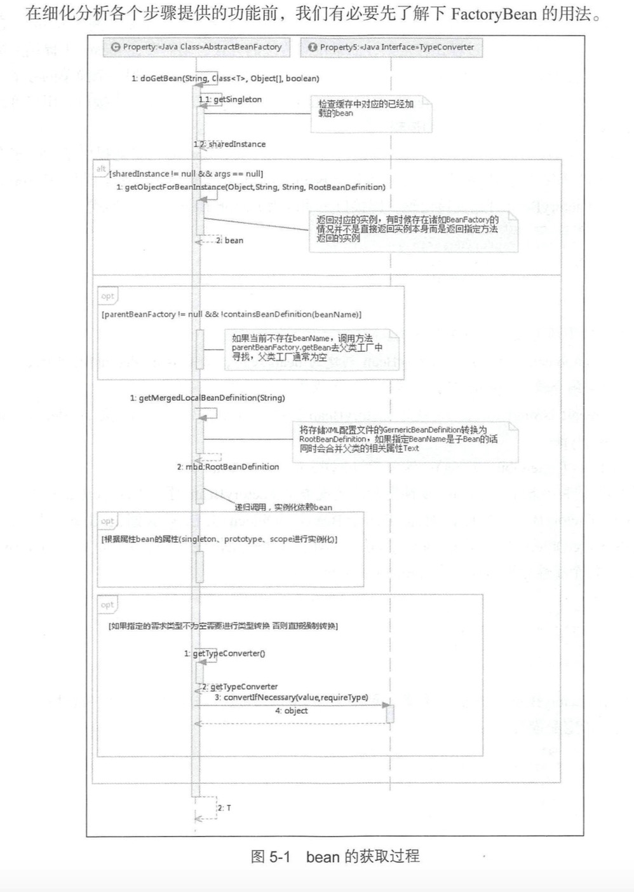
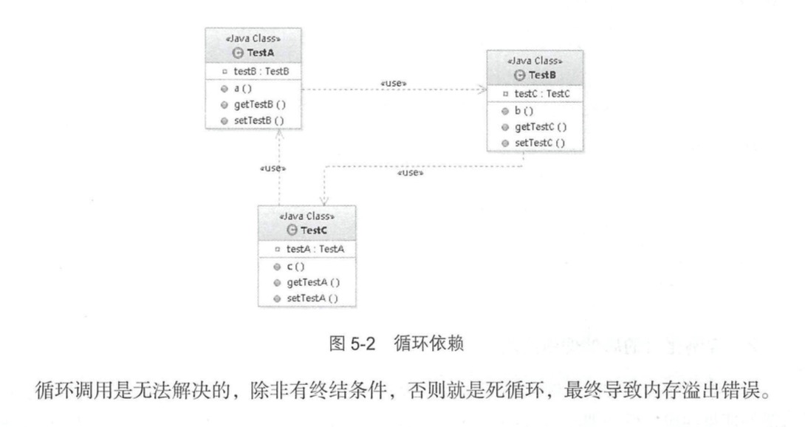

5 bean的加载

```
MyTestBean bean = (MyTestBean) bf.getBean("myTestBean");


# AbstractBeanFactory.java中
public Object getBean(String name) throws BeansException {
    return doGetBean(name, null, null, false);
}


protected <T> T doGetBean(
        final String name, final Class<T> requiredType, final Object[] args, boolean typeCheckOnly)
        throws BeansException {
    // 提取对应的beanName
    final String beanName = transformedBeanName(name);
    Object bean;

    /*
     * 检查缓存中或者实例工厂中是否有对应的实例
     * 为什么首先会使用这段代码呢
     * 因为在创建单例Bean的时候会存在依赖注入的情况，而在创建依赖的时候为了避免循环依赖，
     * Spring创建bean的原则是不等bean创建完成就会将创建bean的ObjectFactory提早曝光
     * 也就是将ObjectFactory加入到缓存中，一旦下一个bean创建的时候需要依赖上个bean则直接使用ObjectFactory
     ***/
     // 直接尝试从缓存获取或则singletonFactories中的ObjectFactory中获取
    Object sharedInstance = getSingleton(beanName);
    if (sharedInstance != null && args == null) {
        if (logger.isDebugEnabled()) {
            if (isSingletonCurrentlyInCreation(beanName)) {
                logger.debug("Returning eagerly cached instance of singleton bean '" + beanName +
                        "' that is not fully initialized yet - a consequence of a circular reference");
            }
            else {
                logger.debug("Returning cached instance of singleton bean '" + beanName + "'");
            }
        }
        // 返回对应的实例，有时候存在诸如BeanFactory的情况并不是直接返回实例本身而是返回指定方法返回的实例
        bean = getObjectForBeanInstance(sharedInstance, name, beanName, null);
    }

    else {
        // Fail if we're already creating this bean instance:
        // We're assumably within a circular reference.
        // 只有在单例情况下回尝试解决循环依赖，原型模式情况下，如果存在
        // A中有B的属性，B中有A的属性，那么当依赖注入的时候，就会产生当A还未创建完的时候因为
        // 对于B的创建再次返回创建A，造成循环依赖，也就是下面的情况
        if (isPrototypeCurrentlyInCreation(beanName)) {
            throw new BeanCurrentlyInCreationException(beanName);
        }

        // Check if bean definition exists in this factory.
        BeanFactory parentBeanFactory = getParentBeanFactory();
        // 如果beanDefinitionMap中也就是在所有已经加载的类中不包括beanName则尝试从parentBeanFactory中加测
        if (parentBeanFactory != null && !containsBeanDefinition(beanName)) {
            // Not found -> check parent.
            String nameToLookup = originalBeanName(name);
            if (args != null) {
                // 递归到BeanFactory中寻找
                // Delegation to parent with explicit args.
                return (T) parentBeanFactory.getBean(nameToLookup, args);
            }
            else {
                // No args -> delegate to standard getBean method.
                return parentBeanFactory.getBean(nameToLookup, requiredType);
            }
        }
        
        // 如果不是仅仅做类型检查则是创建bean，这里要进行记录
        if (!typeCheckOnly) {
            markBeanAsCreated(beanName);
        }

        try {
            // 将存储XML配置文件的GernericBeanDefinition转换为RootBeanDefinition，如果指定
            // BeanName是子Bean的话同时会合并父类的相关属性
            final RootBeanDefinition mbd = getMergedLocalBeanDefinition(beanName);
            checkMergedBeanDefinition(mbd, beanName, args);

            // Guarantee initialization of beans that the current bean depends on.
            String[] dependsOn = mbd.getDependsOn();
            // 若存在依赖则需要递归实例化依赖的Bean
            if (dependsOn != null) {
                for (String dependsOnBean : dependsOn) {
                    if (isDependent(beanName, dependsOnBean)) {
                        throw new BeanCreationException(mbd.getResourceDescription(), beanName,
                                "Circular depends-on relationship between '" + beanName + "' and '" + dependsOnBean + "'");
                    }
                    // 缓存依赖调用
                    registerDependentBean(dependsOnBean, beanName);
                    getBean(dependsOnBean);
                }
            }

            // Create bean instance.
            // 实例化依赖的bean后便可以实例化mbd本身了
            // singleton模式的创建
            if (mbd.isSingleton()) {
                sharedInstance = getSingleton(beanName, new ObjectFactory<Object>() {
                    @Override
                    public Object getObject() throws BeansException {
                        try {
                            return createBean(beanName, mbd, args);
                        }
                        catch (BeansException ex) {
                            // Explicitly remove instance from singleton cache: It might have been put there
                            // eagerly by the creation process, to allow for circular reference resolution.
                            // Also remove any beans that received a temporary reference to the bean.
                            destroySingleton(beanName);
                            throw ex;
                        }
                    }
                });
                bean = getObjectForBeanInstance(sharedInstance, name, beanName, mbd);
            }
            
            else if (mbd.isPrototype()) {
                // prototype模式的创建
                // It's a prototype -> create a new instance.
                Object prototypeInstance = null;
                try {
                    beforePrototypeCreation(beanName);
                    prototypeInstance = createBean(beanName, mbd, args);
                }
                finally {
                    afterPrototypeCreation(beanName);
                }
                bean = getObjectForBeanInstance(prototypeInstance, name, beanName, mbd);
            }

            else {
                // 指定的scope上实例化bean
                String scopeName = mbd.getScope();
                final Scope scope = this.scopes.get(scopeName);
                if (scope == null) {
                    throw new IllegalStateException("No Scope registered for scope '" + scopeName + "'");
                }
                try {
                    Object scopedInstance = scope.get(beanName, new ObjectFactory<Object>() {
                        @Override
                        public Object getObject() throws BeansException {
                            beforePrototypeCreation(beanName);
                            try {
                                return createBean(beanName, mbd, args);
                            }
                            finally {
                                afterPrototypeCreation(beanName);
                            }
                        }
                    });
                    bean = getObjectForBeanInstance(scopedInstance, name, beanName, mbd);
                }
                catch (IllegalStateException ex) {
                    throw new BeanCreationException(beanName,
                            "Scope '" + scopeName + "' is not active for the current thread; " +
                            "consider defining a scoped proxy for this bean if you intend to refer to it from a singleton",
                            ex);
                }
            }
        }
        catch (BeansException ex) {
            cleanupAfterBeanCreationFailure(beanName);
            throw ex;
        }
    }
    
    // 检查需要的类型是否符合bean的实际类型
    // Check if required type matches the type of the actual bean instance.
    if (requiredType != null && bean != null && !requiredType.isAssignableFrom(bean.getClass())) {
        try {
            return getTypeConverter().convertIfNecessary(bean, requiredType);
        }
        catch (TypeMismatchException ex) {
            if (logger.isDebugEnabled()) {
                logger.debug("Failed to convert bean '" + name + "' to required type [" +
                        ClassUtils.getQualifiedName(requiredType) + "]", ex);
            }
            throw new BeanNotOfRequiredTypeException(name, requiredType, bean.getClass());
        }
    }
    return (T) bean;
}


加载的步骤:
1.转换对应beanName
  传入的name可能是别名，也可能是FactoryBean。
  去除FactoryBean的修饰符，也就是如果name="&aa",那么会首先去除&而使name="aa"
  取指定alias锁表示的最终beanName，例如别名A指向名称为B的bean则返回B；若别名A指向别名B，别名B又指向名称为C的bean则返回C。
2.尝试从缓存中加载单例
  单例在Spring的同一个容器内只会被创建一次，后续再获取bean，就直接从单例缓存中获取了。在Spring中创建bean的原则是不等bean创建完成
  就会将创建bean的ObjectFactory提早曝光加入到缓存中，一旦下一个bean创建时候需要依赖上一个bean则直接使用ObjectFactory。
3.bean的实例化
  从缓存中得到了bean的原始状态，则需要对bean进行实例化。缓存中记录的只是最原始的bean状态，并不一定是我们最终想要的bean。假如我们需要
  对工厂bean进行处理，那么这里得到的其实是工厂bean的初始状态，但是真正需要的是工厂bean中定义的factory-method方法中返回的bean，而
  getObjectForBeanInstance就是完成这个工作的。

4.原型模式的依赖检查
 只有在单例情况下才会尝试解决循环依赖，如果存在A中有B的属性，B中有A的属性，那么当依赖注入的时候，就会产生当A还未创建完的时候因为对于B的
 创建再次返回创建A，造成循环依赖，也就是情况：isPrototypeCurrentInCreation(beanName)判断为true。

5.检测parentBeanFactory
 如果缓存没有数据的话直接转到父类工厂上去加载了
 parentBeanFactory != null && !containsBeanDefinition(beanName)，
 
6.将存储XML配置文件的GernericBeanDefinition转换WieRootBeanDefinition
 因为从XML配置文件中读取到的bean信息是存储在GerericBeanDefinition中的，但是所有的bean后续处理都是针对于RootBeanDefinition的，所以
 这里需要进行一个转换，转换的同时如果父类bean部位空的话，则会一并合并父类的属性。

7.寻找依赖
 因为bean的初始化过程中很可能用到某些属性，而某些属性很可能是动态配置的，并且配置成依赖于其他的bean，那么这个时候就有必要加载依赖的bean，
 所以，在Spring的加载顺序中，在初始化某一个bean的时候手续爱你会初始化这个bean锁对应的依赖。
 
8.针对不同的scope进行bean的创建
 在Spring中存在着不同的scope，其中默认是singleton，但是还有些其他的配置如prototype、request之类的。这个步骤中，Spring会根据不同的
 配置进行不同的初始化策略 

9.类型转换


```



### 5.1 FactoryBean的使用

```
Spring提供了一个org.springframework.beans.factory.FactoryBean的工厂列接口，
用户可以通过实现该接口定制实例化bean的逻辑。Spring自身提供了70多个FactoryBean的实现。

public interface FactoryBean<T> {

    // 返回有FactoryBean创建的bean实例，如果isSingleton()返回true，则该实例会放到Spring容器中单实例缓存池中。
	T getObject() throws Exception;

    // 返回FactoryBean创建的bean类型
	Class<?> getObjectType();
    
    // 返回由FactoryBean创建的bean实例的作用域是singleton还是prototype
	boolean isSingleton();
	
}

在com.spring.book.study.chapter05新增Car，CarFactoryBean
package com.spring.book.study.chapter05;

public class Car {

    private int maxSpeed;

    private String brand;

    private double price;

    public int getMaxSpeed() {
        return maxSpeed;
    }

    public void setMaxSpeed(int maxSpeed) {
        this.maxSpeed = maxSpeed;
    }

    public String getBrand() {
        return brand;
    }

    public void setBrand(String brand) {
        this.brand = brand;
    }

    public double getPrice() {
        return price;
    }

    public void setPrice(double price) {
        this.price = price;
    }

    @Override
    public String toString() {
        return "Car{" +
                "maxSpeed=" + maxSpeed +
                ", brand='" + brand + '\'' +
                ", price=" + price +
                '}';
    }
}


package com.spring.book.study.chapter05;

import org.springframework.beans.factory.FactoryBean;

public class CarFactoryBean implements FactoryBean<Car> {

    private String carInfo;

    public Car getObject() throws Exception {
        Car car = new Car();
        String[] infos = carInfo.split(",");
        car.setBrand(infos[0]);
        car.setMaxSpeed(Integer.valueOf(infos[1]));
        car.setPrice(Double.valueOf(infos[1]));
        return car;
    }

    public Class<?> getObjectType() {
        return Car.class;
    }

    public boolean isSingleton() {
        return false;
    }

    public String getCarInfo() {
        return carInfo;
    }

    public void setCarInfo(String carInfo) {
        this.carInfo = carInfo;
    }
}

在src/main/resources/下新增factoryBeanTest.java

<?xml version="1.0" encoding="UTF-8"?>
<beans xmlns="http://www.springframework.org/schema/beans"
       xmlns:xsi="http://www.w3.org/2001/XMLSchema-instance"
       xsi:schemaLocation="
    http://www.springframework.org/schema/beans
    http://www.springframework.org/schema/beans/spring-beans.xsd">

    <bean id="car" class="com.spring.book.study.chapter05.CarFactoryBean">
        <property name="carInfo" value="超级跑车,400,2000000"/>
    </bean>
</beans>

测试类

package com.spring.book.study.chapter05;

import org.springframework.context.ApplicationContext;
import org.springframework.context.support.ClassPathXmlApplicationContext;

public class Main {

    public static void main(String[] args) {
        ApplicationContext ap = new ClassPathXmlApplicationContext("factoryBeanTest.xml");
        Car car = (Car) ap.getBean("car");
        // Car{maxSpeed=400, brand='超级跑车', price=400.0}
        System.out.println(car);

        // 在getBean(beanName)的beanName前加上"&"，可以获得FactoryBean
        Object carFactoryBean =  ap.getBean("&car");
        // class com.spring.book.study.chapter05.CarFactoryBean
        System.out.println(carFactoryBean.getClass());

    }
}

```

### 5.2 缓存中获取单例bean

```

单例在Spring的同一个容器内只会被创建异常，后续再获取bean直接从单例缓存中获取，当然这里也只是尝试加载，首先尝试从缓存中加载，
然后再次尝试尝试从singletonFactories中加载。因为在创建单例bean的时候会存在依赖注入的情况，而在创建依赖的时候为了避免循环
依赖，Spring创建bean的原则是不等bean创建完成就会将创建bean的ObjectFactory提早曝光加到缓存中，一旦下一个bean创建时需要依赖
上个bean的，直接使用ObjectFactory

public Object getSingleton(String beanName) {
    return getSingleton(beanName, true);
}

protected Object getSingleton(String beanName, boolean allowEarlyReference) {
    // 检查缓存中是否存在实例
    Object singletonObject = this.singletonObjects.get(beanName);
    if (singletonObject == null && isSingletonCurrentlyInCreation(beanName)) {
        // 锁定全局变量
        synchronized (this.singletonObjects) {
            // 如果此bean正在加载则不处理
            singletonObject = this.earlySingletonObjects.get(beanName);
            if (singletonObject == null && allowEarlyReference) {
                // 当某些方法需要提前初始化的时候则会调用addSingletonFactory方法将对应的
                // ObjectFactory初始化策略存储在singletonFactories
                ObjectFactory<?> singletonFactory = this.singletonFactories.get(beanName);
                if (singletonFactory != null) {
                    // 调用预先设定的getObject方法
                    singletonObject = singletonFactory.getObject();
                    // 记录在缓存中，earlySingletonObjects和singletonFactories互斥
                    this.earlySingletonObjects.put(beanName, singletonObject);
                    this.singletonFactories.remove(beanName);
                }
            }
        }
    }
    return (singletonObject != NULL_OBJECT ? singletonObject : null);
}

首先尝试从singletonObjects里面获取实例，如果获取不到再从earlySingletonObjects里面获取，如果还获取不到，
再尝试从singletonFactories里面获取beanName对应的ObjectFactory，然后调用这个ObjeectFactory的getObject来创建bean
并放到earlySingletonObjects里面去，并且从singletonFactories里面remove掉这个ObjectFactory，而对于后续的所有内存操作
都只为了循环依赖检测时候使用，也就是在allowEarlyReference为true的情况下才会使用。
singletonObjects：用于保存BeanName和创建bean实例之间的关系，bean name-->bean instance
singletonFactories：用于保存BeanName和创建bean的工厂之间的关系，bean name--> ObjectFactory
earlySingletonObjects：也是保存BeanName和创建bean实例之间的关系，与singletonObjects的不同之处在于，
当一个单例bean被放到这里面后，那么当bean还在创建过程中，就可以通过getBean方法获取到了，七亩地是用来检测循环引用。
registeredSingletons：用力啊保存当前所有已注册的bean。


```

## 5.3 从bean的实例中获取对象

```
getObjectForBeanInstance是在得到bean的实力后要做的第一步就是调用这个方法来检测一下正确性，其实就是用于检车当前bean是否是FactoryBean
类型的bean，如果是，那么需要调用该bean对应的FactoryBean实例中的getObject()作为返回值。
无论是从缓存中获取到的bean还是通过不同的scope策略加载的bean都只是最原始的bean状态，并不一定是我们最终想要的bean。

protected Object getObjectForBeanInstance(
			Object beanInstance, String name, String beanName, RootBeanDefinition mbd) {

    // 如果指定的name是工厂相关(以&为前缀)且beanInstance又不是FactoryBean类型则验证不通过
    // Don't let calling code try to dereference the factory if the bean isn't a factory.
    if (BeanFactoryUtils.isFactoryDereference(name) && !(beanInstance instanceof FactoryBean)) {
        throw new BeanIsNotAFactoryException(transformedBeanName(name), beanInstance.getClass());
    }
    
    // 现在我们有了个bean的实例，这个实例可能会是正常的bean或者是FactoryBean
    // 如果是FactoryBean我们使用它创建实例，但是如果用户想要直接获取工厂实例而不是工厂的getObject方法对应的实例那么传入的name应该加入前缀&
    // Now we have the bean instance, which may be a normal bean or a FactoryBean.
    // If it's a FactoryBean, we use it to create a bean instance, unless the
    // caller actually wants a reference to the factory.
    if (!(beanInstance instanceof FactoryBean) || BeanFactoryUtils.isFactoryDereference(name)) {
        return beanInstance;
    }

    // 加载FactoryBean
    Object object = null;
    if (mbd == null) {
        // 尝试从缓存中加载bean
        object = getCachedObjectForFactoryBean(beanName);
    }
    if (object == null) {
        // 到这里已经明确知道beanInstance一定是FactoryBean类型
        // Return bean instance from factory.
        FactoryBean<?> factory = (FactoryBean<?>) beanInstance;
        // Caches object obtained from FactoryBean if it is a singleton.
        if (mbd == null && containsBeanDefinition(beanName)) {
            // 将存储XML配置文件的GernericBeanDefinition转换为RootBeanDefinition，
            // 如果指定BeanName是子Bean的话同时会和并父类的相关属性
            mbd = getMergedLocalBeanDefinition(beanName);
        }
        // 是否是用户定义的而不是应用程序本身定义的
        boolean synthetic = (mbd != null && mbd.isSynthetic());
        object = getObjectFromFactoryBean(factory, beanName, !synthetic);
    }
    return object;
}

getObjectForBeanInstance所做的工作：
1.对FactoryBean正确性的验证。
2.对非FactoryBean不做任何处理
3.对bean进行装换
4.将从Factory中解析bean的工作委托给getObjectFromFactoryBean。


protected Object getObjectFromFactoryBean(FactoryBean<?> factory, String beanName, boolean shouldPostProcess) {
    // 如果是单例模式
    if (factory.isSingleton() && containsSingleton(beanName)) {
        synchronized (getSingletonMutex()) {
            Object object = this.factoryBeanObjectCache.get(beanName);
            if (object == null) {
                object = doGetObjectFromFactoryBean(factory, beanName);
                // Only post-process and store if not put there already during getObject() call above
                // (e.g. because of circular reference processing triggered by custom getBean calls)
                Object alreadyThere = this.factoryBeanObjectCache.get(beanName);
                if (alreadyThere != null) {
                    object = alreadyThere;
                }
                else {
                    if (object != null && shouldPostProcess) {
                        try {
                            // 调用ObjectFactory的后处理器
                            object = postProcessObjectFromFactoryBean(object, beanName);
                        }
                        catch (Throwable ex) {
                            throw new BeanCreationException(beanName,
                                    "Post-processing of FactoryBean's singleton object failed", ex);
                        }
                    }
                    this.factoryBeanObjectCache.put(beanName, (object != null ? object : NULL_OBJECT));
                }
            }
            return (object != NULL_OBJECT ? object : null);
        }
    }
    else {
        Object object = doGetObjectFromFactoryBean(factory, beanName);
        if (object != null && shouldPostProcess) {
            try {
                object = postProcessObjectFromFactoryBean(object, beanName);
            }
            catch (Throwable ex) {
                throw new BeanCreationException(beanName, "Post-processing of FactoryBean's object failed", ex);
            }
        }
        return object;
    }
}


# FactoryBeanRegistrySupport.java
private Object doGetObjectFromFactoryBean(final FactoryBean<?> factory, final String beanName)
			throws BeanCreationException {

    Object object;
    try {
        // 需要权限验证
        if (System.getSecurityManager() != null) {
            AccessControlContext acc = getAccessControlContext();
            try {
                object = AccessController.doPrivileged(new PrivilegedExceptionAction<Object>() {
                    @Override
                    public Object run() throws Exception {
                            return factory.getObject();
                        }
                    }, acc);
            }
            catch (PrivilegedActionException pae) {
                throw pae.getException();
            }
        }
        else {
            // 直接调用getObject方法
            object = factory.getObject();
        }
    }
    catch (FactoryBeanNotInitializedException ex) {
        throw new BeanCurrentlyInCreationException(beanName, ex.toString());
    }
    catch (Throwable ex) {
        throw new BeanCreationException(beanName, "FactoryBean threw exception on object creation", ex);
    }

    // Do not accept a null value for a FactoryBean that's not fully
    // initialized yet: Many FactoryBeans just return null then.
    if (object == null && isSingletonCurrentlyInCreation(beanName)) {
        throw new BeanCurrentlyInCreationException(
                beanName, "FactoryBean which is currently in creation returned null from getObject");
    }
    return object;
}


# AbstractAutowireCapableBeanFactory.java 后处理器
protected Object postProcessObjectFromFactoryBean(Object object, String beanName) {
    return applyBeanPostProcessorsAfterInitialization(object, beanName);
}


public Object applyBeanPostProcessorsAfterInitialization(Object existingBean, String beanName)
			throws BeansException {

    Object result = existingBean;
    for (BeanPostProcessor beanProcessor : getBeanPostProcessors()) {
        result = beanProcessor.postProcessAfterInitialization(result, beanName);
        if (result == null) {
            return result;
        }
    }
    return result;
}


```

## 5.4 获取单例


```


public Object getSingleton(String beanName, ObjectFactory<?> singletonFactory) {
    Assert.notNull(beanName, "'beanName' must not be null");
    // 全局变量需要同步
    synchronized (this.singletonObjects) {
        // 首先检查对应的bean是否已经加载过，因为singleton模式其实就是复用已创建的bean
        // 所以这一步是必须的
        Object singletonObject = this.singletonObjects.get(beanName);
        // 如果为空才可以进行singleton的bean初始化
        if (singletonObject == null) {
            if (this.singletonsCurrentlyInDestruction) {
                throw new BeanCreationNotAllowedException(beanName,
                        "Singleton bean creation not allowed while the singletons of this factory are in destruction " +
                        "(Do not request a bean from a BeanFactory in a destroy method implementation!)");
            }
            if (logger.isDebugEnabled()) {
                logger.debug("Creating shared instance of singleton bean '" + beanName + "'");
            }
            beforeSingletonCreation(beanName);
            boolean newSingleton = false;
            boolean recordSuppressedExceptions = (this.suppressedExceptions == null);
            if (recordSuppressedExceptions) {
                this.suppressedExceptions = new LinkedHashSet<Exception>();
            }
            try {
                // 初始化bean
                singletonObject = singletonFactory.getObject();
                newSingleton = true;
            }
            catch (IllegalStateException ex) {
                // Has the singleton object implicitly appeared in the meantime ->
                // if yes, proceed with it since the exception indicates that state.
                singletonObject = this.singletonObjects.get(beanName);
                if (singletonObject == null) {
                    throw ex;
                }
            }
            catch (BeanCreationException ex) {
                if (recordSuppressedExceptions) {
                    for (Exception suppressedException : this.suppressedExceptions) {
                        ex.addRelatedCause(suppressedException);
                    }
                }
                throw ex;
            }
            finally {
                if (recordSuppressedExceptions) {
                    this.suppressedExceptions = null;
                }
                afterSingletonCreation(beanName);
            }
            if (newSingleton) {
                // 加入缓存
                addSingleton(beanName, singletonObject);
            }
        }
        return (singletonObject != NULL_OBJECT ? singletonObject : null);
    }
}

上述代码中其实是使用了回调方法，使得程序可以在单例创建的前后做一些准备及处理操作，而真正的
获取单例bean的方法其实并不是在此方法中实现的，实现逻辑是在ObjectFactory类型的实例singletonFactory中
实现的。
1.检查缓存是否已经加载过
2.若没有加载，则记录beanName的正在加载状态，
3.加载单例前记录加载状态
  beforSingletonCreation做的事情：记录加载状态，也就是通过this.singletonsCurrentlyInCreation.add(beanName)
  将当前正要创建的bean记录在缓存中，
  protected void beforeSingletonCreation(String beanName) {
    if (!this.inCreationCheckExclusions.contains(beanName) && !this.singletonsCurrentlyInCreation.add(beanName)) {
        throw new BeanCurrentlyInCreationException(beanName);
    }
}
4.通过调用参数传入的ObjectFactory的个体ObjectFactory的个体Object方法实例化bean。
5.加载单例后的处理方法调用
 同步骤3的记录加载状态相似，当bean架子啊结束后需要移除缓存中的对该bean的正确加载状态的记录
 protected void afterSingletonCreation(String beanName) {
    if (!this.inCreationCheckExclusions.contains(beanName) && !this.singletonsCurrentlyInCreation.remove(beanName)) {
        throw new IllegalStateException("Singleton '" + beanName + "' isn't currently in creation");
    }
 }
 
6.将结果记录至缓存并删除加载bean过程中所记录的各种辅助状态
protected void addSingleton(String beanName, Object singletonObject) {
    synchronized (this.singletonObjects) {
        this.singletonObjects.put(beanName, (singletonObject != null ? singletonObject : NULL_OBJECT));
        this.singletonFactories.remove(beanName);
        this.earlySingletonObjects.remove(beanName);
        this.registeredSingletons.add(beanName);
    }
}

7.返回处理结果
bean的加载逻辑其实是在传入的ObjectFactory类型的参数singletonFactory中定义的，反推参数的获取，得到如下代码：
sharedInstance = getSingleton(beanName, new ObjectFactory<Object>() {
    public Object getObject() throws BeansException {
        try {
            // 创建bean
            return createBean(beanName, mbd, args);
        }
        catch (BeansException ex) {
            // Explicitly remove instance from singleton cache: It might have been put there
            // eagerly by the creation process, to allow for circular reference resolution.
            // Also remove any beans that received a temporary reference to the bean.
            destroySingleton(beanName);
            throw ex;
        }
    }
});


```

## 5.5 准备创建bean

> 一个真正的干活的函数其实是以do开头的，比如doGetObjectFromFactoryBean。而给我们错觉的函数，比如getObjectFromFactoryBean
  其实只是从全局的角度去做一些统筹的工作。这个规则对于createBean也比例外。
  
```
# AbstractAutowireCapableBeanFactory.java

protected Object createBean(final String beanName, final RootBeanDefinition mbd, final Object[] args)
			throws BeanCreationException {
    
    
    if (logger.isDebugEnabled()) {
        logger.debug("Creating instance of bean '" + beanName + "'");
    }
    // Make sure bean class is actually resolved at this point.
    // 锁定class，根据设置的class属性或者根据className来解析Class
    resolveBeanClass(mbd, beanName);

    // Prepare method overrides.
    // 验证及准备覆盖的方法
    try {
        mbd.prepareMethodOverrides();
    }
    catch (BeanDefinitionValidationException ex) {
        throw new BeanDefinitionStoreException(mbd.getResourceDescription(),
                beanName, "Validation of method overrides failed", ex);
    }

    try {
        // Give BeanPostProcessors a chance to return a proxy instead of the target bean instance.
        // 给BeanPostProcessors一个机会来返回代理来替代真正的实例
        Object bean = resolveBeforeInstantiation(beanName, mbd);
        if (bean != null) {
            return bean;
        }
    }
    catch (Throwable ex) {
        throw new BeanCreationException(mbd.getResourceDescription(), beanName,
                "BeanPostProcessor before instantiation of bean failed", ex);
    }
    
    // 真正干活的方法
    Object beanInstance = doCreateBean(beanName, mbd, args);
    if (logger.isDebugEnabled()) {
        logger.debug("Finished creating instance of bean '" + beanName + "'");
    }
    return beanInstance;
}

上述代码的步骤：
1.根据设置的class属性或者根据ClassName来解析Class
2.对override属性进行标记及验证。
  在Spring中没有override-method这样的配置，存在lookup-method和replace-method的，而这两个配置的加载其实就
  是讲配置统一存放在BeanDefinition中的methodOverrides属性里，而这个函数的操作其实也就是针对于这两个配置的
3.应用初始化前的后处理器，解指定bean是否存在初始化前的短路操作。
4.创建bean。


```

### 5.5.1 处理override属性

```
# AbstractBeanDefinition.java
public void prepareMethodOverrides() throws BeanDefinitionValidationException {
    // Check that lookup methods exists.
    MethodOverrides methodOverrides = getMethodOverrides();
    if (!methodOverrides.isEmpty()) {
        for (MethodOverride mo : methodOverrides.getOverrides()) {
            prepareMethodOverride(mo);
        }
    }
}


protected void prepareMethodOverride(MethodOverride mo) throws BeanDefinitionValidationException {
    //获取对应类中对饮方法名的个数
    int count = ClassUtils.getMethodCountForName(getBeanClass(), mo.getMethodName());
    if (count == 0) {
        throw new BeanDefinitionValidationException(
                "Invalid method override: no method with name '" + mo.getMethodName() +
                "' on class [" + getBeanClassName() + "]");
    }
    else if (count == 1) {
        // Mark override as not overloaded, to avoid the overhead of arg type checking.
        // 编辑MethodOverride暂未被覆盖，避免参数类型检查的开销
        mo.setOverloaded(false);
    }
}

```

> 在Spring配置中存在lookup-method和replace-method两个配置功能，而这两个配置的加载其实就是将配置统一存放在
  BeanDefinition中的methodOverrides属性里，这两个功能实现原理其实是在bean实例化的时候如果检测到存在
  methodOverrides属性里，这两个功能实现原理其实是在bean实例化的时候如果检测到存在methodOverrides属性，会动态
  地位当前bean生成代理并使用对应的拦截器为bean做增强处理，相关逻辑是现在bean的实例化不封详细介绍
  
### 5.5.2 实例化的前置处理

> 在真正调用doCreate方法创建bean的实例前使用了这样一个方法resolveBeforeInstantiation对BeanDefinition中属性
  做些前置处理。
  
```

# AbstractAutowireCapableBeanFactory.java
# createBean方法中的前置处理
Object bean = resolveBeforeInstantiation(beanName, mbd);
# 短路判断，前置处理后返回的结果如果不为空，那么会直接略过后续的bean的创建而直接返回结果
if (bean != null) {
    return bean;
}

protected Object resolveBeforeInstantiation(String beanName, RootBeanDefinition mbd) {
    Object bean = null;
    // 如果尚未被解析
    if (!Boolean.FALSE.equals(mbd.beforeInstantiationResolved)) {
        // Make sure bean class is actually resolved at this point.
        if (!mbd.isSynthetic() && hasInstantiationAwareBeanPostProcessors()) {
            Class<?> targetType = determineTargetType(beanName, mbd);
            if (targetType != null) {
                bean = applyBeanPostProcessorsBeforeInstantiation(targetType, beanName);
                if (bean != null) {
                    bean = applyBeanPostProcessorsAfterInitialization(bean, beanName);
                }
            }
        }
        mbd.beforeInstantiationResolved = (bean != null);
    }
    return bean;
}


```  

**1.实例化前的后处理器应用**

> bean的实例化前调用，也就是将AbstractBeanDefinition转换为BeanWrapper前的处理。给子类一个修改BeanDefinition的机会
  也就是说当程序经过这个方法后，可能不是我们认为的bean了，或许是处理过的代理bean，可能是cglib生成的，也可能是通过其他技术生成的 
  
```

# AbstractAutowireCapableBeanFactory.java

public Object applyBeanPostProcessorsAfterInitialization(Object existingBean, String beanName)
			throws BeansException {

    Object result = existingBean;
    for (BeanPostProcessor beanProcessor : getBeanPostProcessors()) {
        result = beanProcessor.postProcessAfterInitialization(result, beanName);
        if (result == null) {
            return result;
        }
    }
    return result;
}

```

**2.实例化后的后处理器应用**

> Spring中的规则是在bean的初始化后尽可能保证将注册的后处理器的postProcessAfterInitialization
  方法应用到该bean中，因为如果返回的bean不为空，那么便不会再次经历普通bean的创建过程。
  
```
# AbstractAutowireCapableBeanFactory.java

public Object applyBeanPostProcessorsAfterInitialization(Object existingBean, String beanName)
			throws BeansException {

    Object result = existingBean;
    for (BeanPostProcessor beanProcessor : getBeanPostProcessors()) {
        result = beanProcessor.postProcessAfterInitialization(result, beanName);
        if (result == null) {
            return result;
        }
    }
    return result;
}


```

## 5.6 循环依赖

### 5.6.1 什么是循环依赖

> 循环依赖就是循环引用，就是两个或多个bean相互之间的持有对方，比如CircleA引用CircleB，CircleB引用CircleC，CircleC引用CircleA，则它们最终反映为一个环。



### 5.6.2 Spring如何解决循环依赖

> Spring容器循环依赖包括构造器循环依赖和setter循环依赖。
  在Spring中将循环一开的处理分成3种情况
  

```

在com.spring.book.study.chapter05 创建TestA，TestB，TestC。

package com.spring.book.study.chapter05;
public class TestA {

    private TestB testB;

    public void a(){
        testB.b();
    }

    public TestB getTestB() {
        return testB;
    }

    public void setTestB(TestB testB) {
        this.testB = testB;
    }
}

package com.spring.book.study.chapter05;

public class TestB {

    private TestC testC;

    public void b(){
        testC.c();
    }

    public TestC getTestC() {
        return testC;
    }

    public void setTestC(TestC testC) {
        this.testC = testC;
    }
}

package com.spring.book.study.chapter05;

public class TestC {

    private TestA testA;

    public void c() {
        testA.a();
    }

    public TestA getTestA() {
        return testA;
    }

    public void setTestA(TestA testA) {
        this.testA = testA;
    }
}


```

**1.构造器循环依赖**
> 表示通过构造器注入构成的循环依赖，此依赖是无法解决的，只能抛出BeanCurrentlyInCreationException异常表示循环依赖。
  创建TestA，需要构建TestB，创建TestB，需要构建TestC，创建TestC，需要TestA，从而形成一个环，没办法创建。
  Spring容器将每一个正在创建的bean标识符放在一个"当前创建bean池"中，bean表示符在创建过程中将一致保持在这个池子中，因此如果在
  创建bean过程中发现自己已经在"当前创建bean池"里时，将抛出BeanCurrentlyInCreationException异常表示循环依赖；而对于创建完毕的
  bean将从"当前创建的bean池"中清除掉

```
# 1.创建配置文件constructorCircleTest.xml。

<?xml version="1.0" encoding="UTF-8"?>
<beans xmlns="http://www.springframework.org/schema/beans"
       xmlns:xsi="http://www.w3.org/2001/XMLSchema-instance"
       xsi:schemaLocation="
    http://www.springframework.org/schema/beans
    http://www.springframework.org/schema/beans/spring-beans.xsd">

    <bean id="testA" class="com.spring.book.study.chapter05.TestA">
        <constructor-arg index="0" ref="testB" />
    </bean>

    <bean id="testB" class="com.spring.book.study.chapter05.TestB">
        <constructor-arg index="0" ref="testC" />
    </bean>

    <bean id="testC" class="com.spring.book.study.chapter05.TestC">
        <constructor-arg index="0" ref="testA" />
    </bean>

</beans>

# 测试类
package com.spring.book.study.chapter05;

import org.springframework.context.ApplicationContext;
import org.springframework.context.support.ClassPathXmlApplicationContext;

public class Main {

    private static ApplicationContext ap;

    public static void main(String[] args) throws Exception {
        // Caused by: org.springframework.beans.factory.BeanCurrentlyInCreationException:
        testConstructorCirleDepend();

    }

    private static void testConstructorCirleDepend() throws Exception {
        ap = new ClassPathXmlApplicationContext("constructorCircleTest.xml");
    }

    public static void testFactBean() {
        ap = new ClassPathXmlApplicationContext("factoryBeanTest.xml");
        Car car = (Car) ap.getBean("car");
        // Car{maxSpeed=400, brand='超级跑车', price=400.0}
        System.out.println(car);

        Object carFactoryBean = ap.getBean("&car");
        // class com.spring.book.study.chapter05.CarFactoryBean
        System.out.println(carFactoryBean.getClass());
    }

}

测试结果抛出异常：
 Error creating bean with name 'testA': Requested bean is currently in creation: Is there an unresolvable circular reference?


```  

> Spring容器创建"testA"bean，首先去"当前创建bean池"查找是否当前bean正在创建，如果发现，则继续准备器需要的构造器参数"testB"，并将"testA"表示符放到"当前创建bean池"
  Spring容器创建"testB"bean，首先去"当前创建bean池"查找是否当前bean正在创建，如果发现，则继续准备器需要的构造器参数"testC"，并将"testB"表示符放到"当前创建bean池"
  Spring容器创建"testC"bean，首先去"当前创建bean池"查找是否当前bean正在创建，如果发现，则继续准备器需要的构造器参数"testA"，并将"testC"表示符放到"当前创建bean池"
  Spring容器创建"testA"bean，发现该bean标识符在"当前创建bean池"中，因为表示循环依赖，抛出BeanCurrentlyInCreationException
  
**2.setter循环依赖**

> 对于setter注入造成的依赖是通过Spring容器提前暴露刚完成构造器注入但为完成其他步骤(setter注入)的bean来完成的，而且只能解决单例作用域的bean循环依赖，
  通过提前暴露一个单例工厂的方法，从而使其他bean能引用到该bean。

```


#AbstractAutowireCapableBeanFactory.java
addSingletonFactory(beanName, new ObjectFactory<Object>() {
    @Override
    public Object getObject() throws BeansException {
        return getEarlyBeanReference(beanName, mbd, bean);
    }
});


```

> 1.Spring容器创建单例"testA"bean，首先根据无参构造器创建bean并暴露一个"ObjectFactory"用于返回一个提前暴露一个创建中的bean，
  并将"testA"标识符放到"当前创建bean池"，然后进行setter注入"testB"
  2.Spring容器创建单例"testB"bean，首先根据无参构造器创建bean，并暴露一个"ObjectFactory"用于返回一个提前暴露一个创建中的bean，
  并将"testB"标识符放到"当前创建bean池"，然后进行setter注入"circle"
  3.Spring容器创建单例"testC"bean，首先根据无参构造器创建bean，并暴露一个"ObjectFactory"用于返回一个提前暴露一个创建中的bean，
  并将"testC"标识符放到"当前创建bean池"，然后进行setter注入"testA"。进行注入"testA"时由于提前暴露了"ObjectFactory"工厂，从而使
  它返回提前暴露一个创建中的bean。
  4.最后在依赖注入"testB"和"testA"，完成setter注入。
  
**3.prototype**
> 对于"prototype"作用域bean，Spring容器无法完成依赖注入，因为Spring容器不进行缓存"prototype"作用域的bean。
  对于"singleton"作用域bean，可以通过"setAllowCircularReferences(false)"来禁用循环引用


## 5.7 创建bean

> 经过resolveBeforeInstantiation方法后，程序有两个选择，如果创建了代理或者说重写了InstantiationAwareBeanPostProcessor的
  postProcessBeforeInstantiation方法并在方法postProcessBeforeInstantiation中改变了bean。

```

# AbstractAutowireCapableBeanFactory.java
protected Object doCreateBean(final String beanName, final RootBeanDefinition mbd, final Object[] args) {
    // Instantiate the bean.
    BeanWrapper instanceWrapper = null;
    if (mbd.isSingleton()) {
        instanceWrapper = this.factoryBeanInstanceCache.remove(beanName);
    }
    if (instanceWrapper == null) {
        // 根据指定bean使用对应的策略创建新的实例，如：工厂方法、构造函数自动注入，简单初始化
        instanceWrapper = createBeanInstance(beanName, mbd, args);
    }
    final Object bean = (instanceWrapper != null ? instanceWrapper.getWrappedInstance() : null);
    Class<?> beanType = (instanceWrapper != null ? instanceWrapper.getWrappedClass() : null);

    // Allow post-processors to modify the merged bean definition.
    synchronized (mbd.postProcessingLock) {
        if (!mbd.postProcessed) {
            // 应用MergeBeanDefinitionPostProcessor
            applyMergedBeanDefinitionPostProcessors(mbd, beanType, beanName);
            mbd.postProcessed = true;
        }
    }

    // Eagerly cache singletons to be able to resolve circular references
    // even when triggered by lifecycle interfaces like BeanFactoryAware.
    /**
      * 是否需要提早曝光：单例&允许循环依赖&当前bean正在创建中，检测循环依赖
      */
    boolean earlySingletonExposure = (mbd.isSingleton() && this.allowCircularReferences &&
            isSingletonCurrentlyInCreation(beanName));
    if (earlySingletonExposure) {
        if (logger.isDebugEnabled()) {
            logger.debug("Eagerly caching bean '" + beanName +
                    "' to allow for resolving potential circular references");
        }
        // 为避免后期循环依赖，可以在bean初始化完成前将创建实例的ObjectFactory加入工厂
        addSingletonFactory(beanName, new ObjectFactory<Object>() {
            @Override
            public Object getObject() throws BeansException {
                // 对bean再一次依赖引用，主要应用SmartInstantiationAware BeanPostProcessor
                // 其中我们熟知的AOP在这里将advice动态织入bean中，若没有则直接返回bean，不做任何处理
                return getEarlyBeanReference(beanName, mbd, bean);
            }
        });
    }

    // Initialize the bean instance.
    Object exposedObject = bean;
    try {
        // 对bean进行填充，将各个属性值注入，其中，可能存在依赖于其他bean的属性，则会递归初始依赖bean
        populateBean(beanName, mbd, instanceWrapper);
        if (exposedObject != null) {
            // 调用初始化方法，比如init-method
            exposedObject = initializeBean(beanName, exposedObject, mbd);
        }
    }
    catch (Throwable ex) {
        if (ex instanceof BeanCreationException && beanName.equals(((BeanCreationException) ex).getBeanName())) {
            throw (BeanCreationException) ex;
        }
        else {
            throw new BeanCreationException(mbd.getResourceDescription(), beanName, "Initialization of bean failed", ex);
        }
    }
    
    if (earlySingletonExposure) {
        Object earlySingletonReference = getSingleton(beanName, false);
        // earlySingletonReference 只有在检测到有循环依赖的情况下才会不为空
        if (earlySingletonReference != null) {
            if (exposedObject == bean) {
                exposedObject = earlySingletonReference;
            }
            else if (!this.allowRawInjectionDespiteWrapping && hasDependentBean(beanName)) {
                String[] dependentBeans = getDependentBeans(beanName);
                Set<String> actualDependentBeans = new LinkedHashSet<String>(dependentBeans.length);
                for (String dependentBean : dependentBeans) {
                    // 检测依赖
                    if (!removeSingletonIfCreatedForTypeCheckOnly(dependentBean)) {
                        actualDependentBeans.add(dependentBean);
                    }
                }
                /*
                 * 因为bean创建后其锁依赖的bean一定是已经创建的
                 * actualDependentBeans 不为空则表示当前bean创建后期依赖的bean却没有没全部创建完，也就是说存在循环依赖
                 * 
                 */
                if (!actualDependentBeans.isEmpty()) {
                    throw new BeanCurrentlyInCreationException(beanName,
                            "Bean with name '" + beanName + "' has been injected into other beans [" +
                            StringUtils.collectionToCommaDelimitedString(actualDependentBeans) +
                            "] in its raw version as part of a circular reference, but has eventually been " +
                            "wrapped. This means that said other beans do not use the final version of the " +
                            "bean. This is often the result of over-eager type matching - consider using " +
                            "'getBeanNamesOfType' with the 'allowEagerInit' flag turned off, for example.");
                }
            }
        }
    }

    // Register bean as disposable.
    try {
        // 根据scope注册bean
        registerDisposableBeanIfNecessary(beanName, bean, mbd);
    }
    catch (BeanDefinitionValidationException ex) {
        throw new BeanCreationException(mbd.getResourceDescription(), beanName, "Invalid destruction signature", ex);
    }

    return exposedObject;
}

```

> 1.如果是单例则需要首先清除缓存
  2.实例化bean，将BeanDefinition转换为BeanWrapper
    如果存在工厂方法则使用工厂方法进行初始化。
    一个类有多个构造函数，每个构造函数都有不同的参数，所以需要根据参数锁定构造函数并进行初始化
    如果既不存在工厂方法也不存在带有参数的构造函数，则使用默认的构造函数进行bean的实例化
  3.MergedBeanDefinitionPostProcessor的应用
    bean合并后的处理，Autowired注解正是通过此方法实现注入类型的预解析。
  4.依赖处理
    通过放入缓存中的ObjectFactory来创建实例，这样就解决了循环依赖的问题
  5.属性填充。将所有属性填充至bean的实例中
  6.循环依赖检查。
    Spring中解决循环依赖只对单例有效，而对于prototype的bean，Spring没有好的解决办法，唯一做的
    就是抛出异常。在这个步骤里面会检测已经加载的bean是否已经出现了依赖循环，并判断是否需要抛出异常  
  7.注册DisposableBean。
    如果配置了destroy-method，这里需要注册以便于在销毁时调用  
  8.完成创建并返回。

### 5.7.1 创建bean的实例
  
  
```
protected BeanWrapper createBeanInstance(String beanName, RootBeanDefinition mbd, Object[] args) {
    // Make sure bean class is actually resolved at this point.
    // 解析class
    Class<?> beanClass = resolveBeanClass(mbd, beanName);

    if (beanClass != null && !Modifier.isPublic(beanClass.getModifiers()) && !mbd.isNonPublicAccessAllowed()) {
        throw new BeanCreationException(mbd.getResourceDescription(), beanName,
                "Bean class isn't public, and non-public access not allowed: " + beanClass.getName());
    }
    
    // 如果工厂方法不为空则使用工厂方法初始化策略
    if (mbd.getFactoryMethodName() != null)  {
        // 
        return instantiateUsingFactoryMethod(beanName, mbd, args);
    }

    // Shortcut when re-creating the same bean...
    boolean resolved = false;
    boolean autowireNecessary = false;
    if (args == null) {
        synchronized (mbd.constructorArgumentLock) {
            // 一个类有多个构造函数，每个构造函数都有不同的参数，所以调用前需要先根据参数锁定构造函数或对应的工厂方法
            if (mbd.resolvedConstructorOrFactoryMethod != null) {
                resolved = true;
                autowireNecessary = mbd.constructorArgumentsResolved;
            }
        }
    }
    // 如果已经解析过则使用解析好的构造函数方法不需要再次锁定
    if (resolved) {
        if (autowireNecessary) {
            // 构造函数自动注入
            return autowireConstructor(beanName, mbd, null, null);
        }
        else {
            // 使用默认构造函数构造
            return instantiateBean(beanName, mbd);
        }
    }

    // Need to determine the constructor...
    // 需要根据参数解析构造函数
    Constructor<?>[] ctors = determineConstructorsFromBeanPostProcessors(beanClass, beanName);
    if (ctors != null ||
            mbd.getResolvedAutowireMode() == RootBeanDefinition.AUTOWIRE_CONSTRUCTOR ||
            mbd.hasConstructorArgumentValues() || !ObjectUtils.isEmpty(args))  {
        // 构造函数自动注入
        return autowireConstructor(beanName, mbd, ctors, args);
    }

    // No special handling: simply use no-arg constructor.
    // 使用默认构造
    return instantiateBean(beanName, mbd);
}

``` 

> 1.如果在RootBeanDefinition中存在factoryMethodName属性，或者说在配置文件中配置了factory-method，那么Spring会尝试使用
  instantiateUnsingFactoryMethod(beanName,mbd,args)方法根据RootBeanDefinition中的配置生成bean的实例
> 2.解析构造函数并进行构造函数的实例化。因为一个bean对应的类中可能会有多个构造函数，而每个构造函数的参数不同，Spring在根据参数及类型
  去判断最终会使用哪个构造函数进行实例化，但是，判断的过程是个比较消耗性能的步骤，所以采用缓存机制，如果已经解析过则不需要重复解析而是
  直接从RootBeanDefinition中的属性resolvedConstructorOrFactoryMethod缓存的值去取，否则需要再次解析，并将解析的结果添加至
  RootBeanDefinition中的属性reesolvedConstructOrFactoryMethod中。


  
```
1.autowireConstructor
#对于实力的创建Spring中分成了两种情况，一种是通用的实例化，另一种是带有参数的实例化。带有参数的实例化过程相当复杂。
public BeanWrapper autowireConstructor(final String beanName, final RootBeanDefinition mbd,
			Constructor<?>[] chosenCtors, final Object[] explicitArgs) {

    BeanWrapperImpl bw = new BeanWrapperImpl();
    this.beanFactory.initBeanWrapper(bw);

    Constructor<?> constructorToUse = null;
    ArgumentsHolder argsHolderToUse = null;
    Object[] argsToUse = null;
    
    // explicitArgs 方法调用的时候指定方法参数那么直接使用
    if (explicitArgs != null) {
        argsToUse = explicitArgs;
    }
    else {
        // 如果在getBean方法时候没有指定则尝试从配置文件中解析
        Object[] argsToResolve = null;
        // 尝试在getBean方法时候没有指定则尝试从配置文件中解析
        synchronized (mbd.constructorArgumentLock) {
            constructorToUse = (Constructor<?>) mbd.resolvedConstructorOrFactoryMethod;
            if (constructorToUse != null && mbd.constructorArgumentsResolved) {
                // Found a cached constructor...
                // 从缓存中取
                argsToUse = mbd.resolvedConstructorArguments;
                if (argsToUse == null) {
                    // 配置的构造函数参数
                    argsToResolve = mbd.preparedConstructorArguments;
                }
            }
        }
        // 如果缓存中存在
        if (argsToResolve != null) {
            // 解析参数类型，如给定方法的构造函数A(int,int)则通过此方法后就会把配置中的("1","1")装换为(1,1)
            // 缓存中的值可能是原始值也可能是最终值
            argsToUse = resolvePreparedArguments(beanName, mbd, bw, constructorToUse, argsToResolve);
        }
    }

    // 没有被缓存
    if (constructorToUse == null) {
        // Need to resolve the constructor.
        boolean autowiring = (chosenCtors != null ||
                mbd.getResolvedAutowireMode() == RootBeanDefinition.AUTOWIRE_CONSTRUCTOR);
        ConstructorArgumentValues resolvedValues = null;

        int minNrOfArgs;
        if (explicitArgs != null) {
            minNrOfArgs = explicitArgs.length;
        }
        else {
            // 提取配置文件中的配置的构造函数参数
            ConstructorArgumentValues cargs = mbd.getConstructorArgumentValues();
            // 用于承载解析后的构造函数参数的值
            resolvedValues = new ConstructorArgumentValues();
            // 能解析到的参数个数
            minNrOfArgs = resolveConstructorArguments(beanName, mbd, bw, cargs, resolvedValues);
        }

        // Take specified constructors, if any.
        Constructor<?>[] candidates = chosenCtors;
        if (candidates == null) {
            Class<?> beanClass = mbd.getBeanClass();
            try {
                candidates = (mbd.isNonPublicAccessAllowed() ?
                        beanClass.getDeclaredConstructors() : beanClass.getConstructors());
            }
            catch (Throwable ex) {
                throw new BeanCreationException(mbd.getResourceDescription(), beanName,
                        "Resolution of declared constructors on bean Class [" + beanClass.getName() +
                                "] from ClassLoader [" + beanClass.getClassLoader() + "] failed", ex);
            }
        }
        // 排序给定的构造函数，public构造函数优先参数数量降序、非public构造函数参数数量降序
        AutowireUtils.sortConstructors(candidates);
        int minTypeDiffWeight = Integer.MAX_VALUE;
        Set<Constructor<?>> ambiguousConstructors = null;
        LinkedList<UnsatisfiedDependencyException> causes = null;

        for (int i = 0; i < candidates.length; i++) {
            Constructor<?> candidate = candidates[i];
            Class<?>[] paramTypes = candidate.getParameterTypes();

            if (constructorToUse != null && argsToUse.length > paramTypes.length) {
                // Already found greedy constructor that can be satisfied ->
                // do not look any further, there are only less greedy constructors left.
                // 如果已经找到选用的构造函数或者需要的参数个数小鱼当前的构造函数参数个数则终止，
                // 因为已经按照参数个数降序排列
                break;
            }
            if (paramTypes.length < minNrOfArgs) {
                // 参数个数不相等
                continue;
            }

            ArgumentsHolder argsHolder;
            if (resolvedValues != null) {
                // 有参数则根据值构造对应参数类型的参数
                try {
                    // 注释上获取参数名称
                    String[] paramNames = ConstructorPropertiesChecker.evaluate(candidate, paramTypes.length);
                    if (paramNames == null) {
                        // 获取参数名称探索器
                        ParameterNameDiscoverer pnd = this.beanFactory.getParameterNameDiscoverer();
                        if (pnd != null) {
                            // 获取指定构造函数的参数名称
                            paramNames = pnd.getParameterNames(candidate);
                        }
                    }
                    // 根据名称和数据类型创建参数持有者
                    argsHolder = createArgumentArray(
                            beanName, mbd, resolvedValues, bw, paramTypes, paramNames, candidate, autowiring);
                }
                catch (UnsatisfiedDependencyException ex) {
                    if (this.beanFactory.logger.isTraceEnabled()) {
                        this.beanFactory.logger.trace(
                                "Ignoring constructor [" + candidate + "] of bean '" + beanName + "': " + ex);
                    }
                    // Swallow and try next constructor.
                    if (causes == null) {
                        causes = new LinkedList<UnsatisfiedDependencyException>();
                    }
                    causes.add(ex);
                    continue;
                }
            }
            else {
                // Explicit arguments given -> arguments length must match exactly.
                if (paramTypes.length != explicitArgs.length) {
                    continue;
                }
                // 构造函数没有参数的情况
                argsHolder = new ArgumentsHolder(explicitArgs);
            }
            
            // 探测是否有不确定性的构造函数存在，例如不同构造函数的参数为父子关系
            int typeDiffWeight = (mbd.isLenientConstructorResolution() ?
                    argsHolder.getTypeDifferenceWeight(paramTypes) : argsHolder.getAssignabilityWeight(paramTypes));
            // Choose this constructor if it represents the closest match.
            // 如果它代表着当前最接近的匹配则选择作为构造函数
            if (typeDiffWeight < minTypeDiffWeight) {
                constructorToUse = candidate;
                argsHolderToUse = argsHolder;
                argsToUse = argsHolder.arguments;
                minTypeDiffWeight = typeDiffWeight;
                ambiguousConstructors = null;
            }
            else if (constructorToUse != null && typeDiffWeight == minTypeDiffWeight) {
                if (ambiguousConstructors == null) {
                    ambiguousConstructors = new LinkedHashSet<Constructor<?>>();
                    ambiguousConstructors.add(constructorToUse);
                }
                ambiguousConstructors.add(candidate);
            }
        }

        if (constructorToUse == null) {
            if (causes != null) {
                UnsatisfiedDependencyException ex = causes.removeLast();
                for (Exception cause : causes) {
                    this.beanFactory.onSuppressedException(cause);
                }
                throw ex;
            }
            throw new BeanCreationException(mbd.getResourceDescription(), beanName,
                    "Could not resolve matching constructor " +
                    "(hint: specify index/type/name arguments for simple parameters to avoid type ambiguities)");
        }
        else if (ambiguousConstructors != null && !mbd.isLenientConstructorResolution()) {
            throw new BeanCreationException(mbd.getResourceDescription(), beanName,
                    "Ambiguous constructor matches found in bean '" + beanName + "' " +
                    "(hint: specify index/type/name arguments for simple parameters to avoid type ambiguities): " +
                    ambiguousConstructors);
        }

        if (explicitArgs == null) {
            // 将解析的构造函数加入缓存
            argsHolderToUse.storeCache(mbd, constructorToUse);
        }
    }

    try {
        Object beanInstance;

        if (System.getSecurityManager() != null) {
            final Constructor<?> ctorToUse = constructorToUse;
            final Object[] argumentsToUse = argsToUse;
            beanInstance = AccessController.doPrivileged(new PrivilegedAction<Object>() {
                @Override
                public Object run() {
                    return beanFactory.getInstantiationStrategy().instantiate(
                            mbd, beanName, beanFactory, ctorToUse, argumentsToUse);
                }
            }, beanFactory.getAccessControlContext());
        }
        else {
            beanInstance = this.beanFactory.getInstantiationStrategy().instantiate(
                    mbd, beanName, this.beanFactory, constructorToUse, argsToUse);
        }
        
        // 将构建的实例加入BeanWrapper
        bw.setWrappedInstance(beanInstance);
        return bw;
    }
    catch (Throwable ex) {
        throw new BeanCreationException(mbd.getResourceDescription(), beanName,
                "Bean instantiation via constructor failed", ex);
    }
}

上述过程实现的功能考虑：
1.构造函数参数的确定
>根据explicitArgs参数判断
 如果explicitArgs不为空，那边可以直接确定参数，因为explicitArgs参数是在调用Bean的时候用户指定的
 在BeanFacotory有方法：Object getBean(String name,Object... args) throws BeanException;
>缓存中获取
>配置文件获取 
 不能根据传入的参数explicitArgs确定构造函数的参数也无法再缓存中得到先关信息。那么只能从配置文件分析了
 Spring中配置文件中的信息经过装换都会通过BeanDefinition实例承载，也就是参数mbd中包含，那么可以通过
 调用mbd.getConstructorArgumentValues()来获取配置的构造函数信息。
2.构造函数的确定
 根虎参数个数匹配。
3.根据确定的构造函数转换对应的参数类型
4.构造函数不确定性的验证
5.根据实例化策略以及得到的构造函数参数实例化Bean


2. instantiateBean


protected BeanWrapper instantiateBean(final String beanName, final RootBeanDefinition mbd) {
    try {
        Object beanInstance;
        final BeanFactory parent = this;
        if (System.getSecurityManager() != null) {
            beanInstance = AccessController.doPrivileged(new PrivilegedAction<Object>() {
                @Override
                public Object run() {
                    // 实例化策略
                    return getInstantiationStrategy().instantiate(mbd, beanName, parent);
                }
            }, getAccessControlContext());
        }
        else {
            beanInstance = getInstantiationStrategy().instantiate(mbd, beanName, parent);
        }
        BeanWrapper bw = new BeanWrapperImpl(beanInstance);
        initBeanWrapper(bw);
        return bw;
    }
    catch (Throwable ex) {
        throw new BeanCreationException(mbd.getResourceDescription(), beanName, "Instantiation of bean failed", ex);
    }
}


3. 实例化策略

# SimpleInstantiationStrategy.java
public Object instantiate(RootBeanDefinition bd, String beanName, BeanFactory owner) {
    // Don't override the class with CGLIB if no overrides.
    // 如果有需要覆盖或者动态替换的方法则当然需要使用cglib进行动态代理，因为可以子啊创建代理的同时
    // 将动态方法织入类中
    // 但是如果没有需要动态改变的方法，为了方便直接反射就可以了
    if (bd.getMethodOverrides().isEmpty()) {
        Constructor<?> constructorToUse;
        synchronized (bd.constructorArgumentLock) {
            constructorToUse = (Constructor<?>) bd.resolvedConstructorOrFactoryMethod;
            if (constructorToUse == null) {
                final Class<?> clazz = bd.getBeanClass();
                if (clazz.isInterface()) {
                    throw new BeanInstantiationException(clazz, "Specified class is an interface");
                }
                try {
                    if (System.getSecurityManager() != null) {
                        constructorToUse = AccessController.doPrivileged(new PrivilegedExceptionAction<Constructor<?>>() {
                            @Override
                            public Constructor<?> run() throws Exception {
                                return clazz.getDeclaredConstructor((Class[]) null);
                            }
                        });
                    }
                    else {
                        constructorToUse =	clazz.getDeclaredConstructor((Class[]) null);
                    }
                    bd.resolvedConstructorOrFactoryMethod = constructorToUse;
                }
                catch (Exception ex) {
                    throw new BeanInstantiationException(clazz, "No default constructor found", ex);
                }
            }
        }
        return BeanUtils.instantiateClass(constructorToUse);
    }
    else {
        // Must generate CGLIB subclass.
        return instantiateWithMethodInjection(bd, beanName, owner);
    }
}


# CglibSubclassingInstantiationStrategy.java
public Object instantiate(Constructor<?> ctor, Object... args) {
    Class<?> subclass = createEnhancedSubclass(this.beanDefinition);
    Object instance;
    if (ctor == null) {
        instance = BeanUtils.instantiate(subclass);
    }
    else {
        try {
            Constructor<?> enhancedSubclassConstructor = subclass.getConstructor(ctor.getParameterTypes());
            instance = enhancedSubclassConstructor.newInstance(args);
        }
        catch (Exception ex) {
            throw new BeanInstantiationException(this.beanDefinition.getBeanClass(),
                    "Failed to invoke constructor for CGLIB enhanced subclass [" + subclass.getName() + "]", ex);
        }
    }
    // SPR-10785: set callbacks directly on the instance instead of in the
    // enhanced class (via the Enhancer) in order to avoid memory leaks.
    Factory factory = (Factory) instance;
    factory.setCallbacks(new Callback[] {NoOp.INSTANCE,
            new LookupOverrideMethodInterceptor(this.beanDefinition, this.owner),
            new ReplaceOverrideMethodInterceptor(this.beanDefinition, this.owner)});
    return instance;
}


```  

### 5.7.2 记录中创建bean的ObjectFactory


```
boolean earlySingletonExposure = (mbd.isSingleton() && this.allowCircularReferences &&
            isSingletonCurrentlyInCreation(beanName));
if (earlySingletonExposure) {
    if (logger.isDebugEnabled()) {
        logger.debug("Eagerly caching bean '" + beanName +
                "' to allow for resolving potential circular references");
    }
    // 为避免后期循环依赖，可以在bean初始化完成前将创建实例的ObjectFactory加入工厂
    addSingletonFactory(beanName, new ObjectFactory<Object>() {
        @Override
        public Object getObject() throws BeansException {
            // 对bean再一次依赖引用，主要应用SmartInstantiationAware BeanPostProcessor
            // 其中我们熟知的AOP在这里将advice动态织入bean中，若没有则直接返回bean，不做任何处理
            return getEarlyBeanReference(beanName, mbd, bean);
        }
    });
}

> earlySingletonExposure：从字面的意思理解就是提早曝光的单例，我们暂不定义它的学名叫什么
> mbd.isSingleton():此RootBeanDefinition代表是否是单例。
> this.allowCircularReferences:是否允许循环依赖，暂未找到在配置文件中如何配置，但是在AbstractRefreshableApplicationContext中提供了设置函数
  可以通过硬编码的方式进行设置或者可以通过自定义命名空间进行配置，其中硬编码的方式如下。
  ClassPathXmlApplicationContext bf = new ClassPathXmlApplicationContext("aspectTest.xml");
  bf.setAllowBeanDefinitionOverriding(false);
> isSingletonCurrentlyInCreation(beanName):该bean是否在创建中。在Spring中，或有个专门的属性默认为DefaultSingletonBeanRegistry的singletonsCurrentInCreation
  来记录bean的加载加载状态，在bean开始创建前会将beanName记录在属性中，在bean开始创建前会将beanName记录在属性中，在bean创建结束后会将beanName从属性中移除。


```


### 5.7.3 属性注入

```

protected void populateBean(String beanName, RootBeanDefinition mbd, BeanWrapper bw) {
    PropertyValues pvs = mbd.getPropertyValues();

    if (bw == null) {
        if (!pvs.isEmpty()) {
            throw new BeanCreationException(
                    mbd.getResourceDescription(), beanName, "Cannot apply property values to null instance");
        }
        else {
            // Skip property population phase for null instance.
            // 没有可填充的属性
            return;
        }
    }

    // Give any InstantiationAwareBeanPostProcessors the opportunity to modify the
    // state of the bean before properties are set. This can be used, for example,
    // to support styles of field injection.
    // 给InstantiationAwareBeanPostProcessors最后一次机会在属性设置前来改变bean
    // 如：可以用来支持属性注入的类型
    boolean continueWithPropertyPopulation = true;

    if (!mbd.isSynthetic() && hasInstantiationAwareBeanPostProcessors()) {
        for (BeanPostProcessor bp : getBeanPostProcessors()) {
            if (bp instanceof InstantiationAwareBeanPostProcessor) {
                InstantiationAwareBeanPostProcessor ibp = (InstantiationAwareBeanPostProcessor) bp;
                // 返回值为是否继续填充bean
                if (!ibp.postProcessAfterInstantiation(bw.getWrappedInstance(), beanName)) {
                    continueWithPropertyPopulation = false;
                    break;
                }
            }
        }
    }
    
    // 如果后处理器发出停止填充命令则终止后续的执行
    if (!continueWithPropertyPopulation) {
        return;
    }

    if (mbd.getResolvedAutowireMode() == RootBeanDefinition.AUTOWIRE_BY_NAME ||
            mbd.getResolvedAutowireMode() == RootBeanDefinition.AUTOWIRE_BY_TYPE) {
        MutablePropertyValues newPvs = new MutablePropertyValues(pvs);

        // Add property values based on autowire by name if applicable.
        // 根据名称自动注入
        if (mbd.getResolvedAutowireMode() == RootBeanDefinition.AUTOWIRE_BY_NAME) {
            autowireByName(beanName, mbd, bw, newPvs);
        }

        // Add property values based on autowire by type if applicable.
        // 根据类型自动注入
        if (mbd.getResolvedAutowireMode() == RootBeanDefinition.AUTOWIRE_BY_TYPE) {
            autowireByType(beanName, mbd, bw, newPvs);
        }

        pvs = newPvs;
    }
    
    // 后处理器已经初始化
    boolean hasInstAwareBpps = hasInstantiationAwareBeanPostProcessors();
    // 需要依赖检查
    boolean needsDepCheck = (mbd.getDependencyCheck() != RootBeanDefinition.DEPENDENCY_CHECK_NONE);

    
    if (hasInstAwareBpps || needsDepCheck) {
        PropertyDescriptor[] filteredPds = filterPropertyDescriptorsForDependencyCheck(bw, mbd.allowCaching);
        if (hasInstAwareBpps) {
            for (BeanPostProcessor bp : getBeanPostProcessors()) {
                if (bp instanceof InstantiationAwareBeanPostProcessor) {
                    InstantiationAwareBeanPostProcessor ibp = (InstantiationAwareBeanPostProcessor) bp;
                    // 多所有需要依赖检查的属性进行后处理
                    pvs = ibp.postProcessPropertyValues(pvs, filteredPds, bw.getWrappedInstance(), beanName);
                    if (pvs == null) {
                        return;
                    }
                }
            }
        }
        if (needsDepCheck) {
            // 依赖检查，对应depends-on水泥杆，3.0已经弃用此属性
            checkDependencies(beanName, mbd, filteredPds, pvs);
        }
    }

    // 将属性应用到bean中
    applyPropertyValues(beanName, mbd, bw, pvs);
}


```

> populateBean提供了这样的处理流程
> 1.InstantiationAwareBeanPostProcessor处理器的postProcessAfterInstantiation函数的应用，
  此函数可以控制程序是否继续进行属性填充。
  2.根据注入类型(byName/byType)，提取依赖的bean，并同意存入PropertyValues中。
  3.应用InstantiationAwareBeanPostProcessor处理器的postProcessPropertyValues方法，对属性获取完毕填充前
  对属性的再次处理，典型应用是RequireAnnotationBeanPostProcessor类中对属性的验证。
  4.将所有PropertyValues中的属性填充至BeanWrapper中。
  
**1.autowireByName**

```
protected void autowireByName(
        String beanName, AbstractBeanDefinition mbd, BeanWrapper bw, MutablePropertyValues pvs) {
    // 寻找bw中需要依赖注入的属性
    String[] propertyNames = unsatisfiedNonSimpleProperties(mbd, bw);
    for (String propertyName : propertyNames) {
        if (containsBean(propertyName)) {
            // 递归初始化相关的bean
            Object bean = getBean(propertyName);
            pvs.add(propertyName, bean);
            // 注册依赖
            registerDependentBean(propertyName, beanName);
            if (logger.isDebugEnabled()) {
                logger.debug("Added autowiring by name from bean name '" + beanName +
                        "' via property '" + propertyName + "' to bean named '" + propertyName + "'");
            }
        }
        else {
            if (logger.isTraceEnabled()) {
                logger.trace("Not autowiring property '" + propertyName + "' of bean '" + beanName +
                        "' by name: no matching bean found");
            }
        }
    }
}


```

**2.autowireByType**

```
protected void autowireByType(
        String beanName, AbstractBeanDefinition mbd, BeanWrapper bw, MutablePropertyValues pvs) {

    TypeConverter converter = getCustomTypeConverter();
    if (converter == null) {
        converter = bw;
    }

    Set<String> autowiredBeanNames = new LinkedHashSet<String>(4);
    // 寻找bw中需要依赖注入的属性
    String[] propertyNames = unsatisfiedNonSimpleProperties(mbd, bw);
    for (String propertyName : propertyNames) {
        try {
            PropertyDescriptor pd = bw.getPropertyDescriptor(propertyName);
            // Don't try autowiring by type for type Object: never makes sense,
            // even if it technically is a unsatisfied, non-simple property.
            if (!Object.class.equals(pd.getPropertyType())) {
                // 探测指定属性的set方法
                MethodParameter methodParam = BeanUtils.getWriteMethodParameter(pd);
                // Do not allow eager init for type matching in case of a prioritized post-processor.
                boolean eager = !PriorityOrdered.class.isAssignableFrom(bw.getWrappedClass());
                DependencyDescriptor desc = new AutowireByTypeDependencyDescriptor(methodParam, eager);
                
                // 解析指定beanName的属性所匹配的值，并把解析到的属性名称存储在
                // autowiredBeanNames中，当属性存在多个封装bean时
                // @Autowired private List<A> aList;将或找到所有匹配A类型的bean并将其注入
                Object autowiredArgument = resolveDependency(desc, beanName, autowiredBeanNames, converter);
                if (autowiredArgument != null) {
                    pvs.add(propertyName, autowiredArgument);
                }
                for (String autowiredBeanName : autowiredBeanNames) {
                    // 注册依赖
                    registerDependentBean(autowiredBeanName, beanName);
                    if (logger.isDebugEnabled()) {
                        logger.debug("Autowiring by type from bean name '" + beanName + "' via property '" +
                                propertyName + "' to bean named '" + autowiredBeanName + "'");
                    }
                }
                autowiredBeanNames.clear();
            }
        }
        catch (BeansException ex) {
            throw new UnsatisfiedDependencyException(mbd.getResourceDescription(), beanName, propertyName, ex);
        }
    }
}


# DefaultListableBeanFactory.java
public Object resolveDependency(DependencyDescriptor descriptor, String beanName,
        Set<String> autowiredBeanNames, TypeConverter typeConverter) throws BeansException {

    descriptor.initParameterNameDiscovery(getParameterNameDiscoverer());
    if (descriptor.getDependencyType().equals(javaUtilOptionalClass)) {
        return new OptionalDependencyFactory().createOptionalDependency(descriptor, beanName);
    }
    else if (descriptor.getDependencyType().equals(ObjectFactory.class)) {
        return new DependencyObjectFactory(descriptor, beanName);
    }
    else if (descriptor.getDependencyType().equals(javaxInjectProviderClass)) {
        return new DependencyProviderFactory().createDependencyProvider(descriptor, beanName);
    }
    else {
        Object result = getAutowireCandidateResolver().getLazyResolutionProxyIfNecessary(descriptor, beanName);
        if (result == null) {
            // 通用处理逻辑
            result = doResolveDependency(descriptor, beanName, autowiredBeanNames, typeConverter);
        }
        return result;
    }
}


public Object doResolveDependency(DependencyDescriptor descriptor, String beanName,
			Set<String> autowiredBeanNames, TypeConverter typeConverter) throws BeansException {

    Class<?> type = descriptor.getDependencyType();
    /*
     * 用于支持Spring中新增的注解@Value
     *
     */
    Object value = getAutowireCandidateResolver().getSuggestedValue(descriptor);
    if (value != null) {
        if (value instanceof String) {
            String strVal = resolveEmbeddedValue((String) value);
            BeanDefinition bd = (beanName != null && containsBean(beanName) ? getMergedBeanDefinition(beanName) : null);
            value = evaluateBeanDefinitionString(strVal, bd);
        }
        TypeConverter converter = (typeConverter != null ? typeConverter : getTypeConverter());
        return (descriptor.getField() != null ?
                converter.convertIfNecessary(value, type, descriptor.getField()) :
                converter.convertIfNecessary(value, type, descriptor.getMethodParameter()));
    }
    
    // 如果解析器没有成功解析，则需要考虑各种情况
    // 属性时数组类型
    if (type.isArray()) {
        Class<?> componentType = type.getComponentType();
        // 根据属性类型找到beanFactory中所有类型的匹配bean，
        // 返回值的构成为：key=匹配的beanName，value=beanName对应的实例化后的bean(通过getBean(beanName)返回)
        DependencyDescriptor targetDesc = new DependencyDescriptor(descriptor);
        targetDesc.increaseNestingLevel();
        Map<String, Object> matchingBeans = findAutowireCandidates(beanName, componentType, targetDesc);
        if (matchingBeans.isEmpty()) {
            // 如果autowire的require属性为true而找到的匹配项却为空则只抛出异常
            if (descriptor.isRequired()) {
                raiseNoSuchBeanDefinitionException(componentType, "array of " + componentType.getName(), descriptor);
            }
            return null;
        }
        if (autowiredBeanNames != null) {
            autowiredBeanNames.addAll(matchingBeans.keySet());
        }
        TypeConverter converter = (typeConverter != null ? typeConverter : getTypeConverter());
        // 通过转换器将bean的值转换位对应的type类型
        Object result = converter.convertIfNecessary(matchingBeans.values(), type);
        if (getDependencyComparator() != null && result instanceof Object[]) {
            Arrays.sort((Object[]) result, adaptDependencyComparator(matchingBeans));
        }
        return result;
    }
    // 属性时Collection类型
    else if (Collection.class.isAssignableFrom(type) && type.isInterface()) {
        Class<?> elementType = descriptor.getCollectionType();
        if (elementType == null) {
            if (descriptor.isRequired()) {
                throw new FatalBeanException("No element type declared for collection [" + type.getName() + "]");
            }
            return null;
        }
        DependencyDescriptor targetDesc = new DependencyDescriptor(descriptor);
        targetDesc.increaseNestingLevel();
        Map<String, Object> matchingBeans = findAutowireCandidates(beanName, elementType, targetDesc);
        if (matchingBeans.isEmpty()) {
            if (descriptor.isRequired()) {
                raiseNoSuchBeanDefinitionException(elementType, "collection of " + elementType.getName(), descriptor);
            }
            return null;
        }
        if (autowiredBeanNames != null) {
            autowiredBeanNames.addAll(matchingBeans.keySet());
        }
        TypeConverter converter = (typeConverter != null ? typeConverter : getTypeConverter());
        Object result = converter.convertIfNecessary(matchingBeans.values(), type);
        if (getDependencyComparator() != null && result instanceof List) {
            Collections.sort((List<?>) result, adaptDependencyComparator(matchingBeans));
        }
        return result;
    }
    // 属性时Map类型
    else if (Map.class.isAssignableFrom(type) && type.isInterface()) {
        Class<?> keyType = descriptor.getMapKeyType();
        if (keyType == null || !String.class.isAssignableFrom(keyType)) {
            if (descriptor.isRequired()) {
                throw new FatalBeanException("Key type [" + keyType + "] of map [" + type.getName() +
                        "] must be assignable to [java.lang.String]");
            }
            return null;
        }
        Class<?> valueType = descriptor.getMapValueType();
        if (valueType == null) {
            if (descriptor.isRequired()) {
                throw new FatalBeanException("No value type declared for map [" + type.getName() + "]");
            }
            return null;
        }
        DependencyDescriptor targetDesc = new DependencyDescriptor(descriptor);
        targetDesc.increaseNestingLevel();
        Map<String, Object> matchingBeans = findAutowireCandidates(beanName, valueType, targetDesc);
        if (matchingBeans.isEmpty()) {
            if (descriptor.isRequired()) {
                raiseNoSuchBeanDefinitionException(valueType, "map with value type " + valueType.getName(), descriptor);
            }
            return null;
        }
        if (autowiredBeanNames != null) {
            autowiredBeanNames.addAll(matchingBeans.keySet());
        }
        return matchingBeans;
    }
    else {
        Map<String, Object> matchingBeans = findAutowireCandidates(beanName, type, descriptor);
        if (matchingBeans.isEmpty()) {
            if (descriptor.isRequired()) {
                raiseNoSuchBeanDefinitionException(type, "", descriptor);
            }
            return null;
        }
        if (matchingBeans.size() > 1) {
            String primaryBeanName = determineAutowireCandidate(matchingBeans, descriptor);
            if (primaryBeanName == null) {
                throw new NoUniqueBeanDefinitionException(type, matchingBeans.keySet());
            }
            if (autowiredBeanNames != null) {
                autowiredBeanNames.add(primaryBeanName);
            }
            return matchingBeans.get(primaryBeanName);
        }
        // We have exactly one match.
        // 已经可以确定只有一个匹配项
        Map.Entry<String, Object> entry = matchingBeans.entrySet().iterator().next();
        if (autowiredBeanNames != null) {
            autowiredBeanNames.add(entry.getKey());
        }
        return entry.getValue();
    }
}


```

**3.applyPropertyValues**


```
protected void applyPropertyValues(String beanName, BeanDefinition mbd, BeanWrapper bw, PropertyValues pvs) {
    if (pvs == null || pvs.isEmpty()) {
        return;
    }

    MutablePropertyValues mpvs = null;
    List<PropertyValue> original;

    if (System.getSecurityManager() != null) {
        if (bw instanceof BeanWrapperImpl) {
            ((BeanWrapperImpl) bw).setSecurityContext(getAccessControlContext());
        }
    }

    if (pvs instanceof MutablePropertyValues) {
        mpvs = (MutablePropertyValues) pvs;
        // 如果mpvs中的值已经被转换为对应的类型那么可以直接设置大奥beanwapper中
        if (mpvs.isConverted()) {
            // Shortcut: use the pre-converted values as-is.
            try {
                bw.setPropertyValues(mpvs);
                return;
            }
            catch (BeansException ex) {
                throw new BeanCreationException(
                        mbd.getResourceDescription(), beanName, "Error setting property values", ex);
            }
        }
        original = mpvs.getPropertyValueList();
    }
    else {
        // 如果pvs并不是使用MutablePropertyValues封装的类型，那么直接使用原始的属性获取方法
        original = Arrays.asList(pvs.getPropertyValues());
    }

    TypeConverter converter = getCustomTypeConverter();
    if (converter == null) {
        converter = bw;
    }
    // 获取对应的解析器
    BeanDefinitionValueResolver valueResolver = new BeanDefinitionValueResolver(this, beanName, mbd, converter);

    // Create a deep copy, resolving any references for values.
    List<PropertyValue> deepCopy = new ArrayList<PropertyValue>(original.size());
    boolean resolveNecessary = false;
    // 遍历属性，将属性转换为对应类的对应属性的类型
    for (PropertyValue pv : original) {
        if (pv.isConverted()) {
            deepCopy.add(pv);
        }
        else {
            String propertyName = pv.getName();
            Object originalValue = pv.getValue();
            Object resolvedValue = valueResolver.resolveValueIfNecessary(pv, originalValue);
            Object convertedValue = resolvedValue;
            boolean convertible = bw.isWritableProperty(propertyName) &&
                    !PropertyAccessorUtils.isNestedOrIndexedProperty(propertyName);
            if (convertible) {
                convertedValue = convertForProperty(resolvedValue, propertyName, bw, converter);
            }
            // Possibly store converted value in merged bean definition,
            // in order to avoid re-conversion for every created bean instance.
            if (resolvedValue == originalValue) {
                if (convertible) {
                    pv.setConvertedValue(convertedValue);
                }
                deepCopy.add(pv);
            }
            else if (convertible && originalValue instanceof TypedStringValue &&
                    !((TypedStringValue) originalValue).isDynamic() &&
                    !(convertedValue instanceof Collection || ObjectUtils.isArray(convertedValue))) {
                pv.setConvertedValue(convertedValue);
                deepCopy.add(pv);
            }
            else {
                resolveNecessary = true;
                deepCopy.add(new PropertyValue(pv, convertedValue));
            }
        }
    }
    if (mpvs != null && !resolveNecessary) {
        mpvs.setConverted();
    }

    // Set our (possibly massaged) deep copy.
    try {
        bw.setPropertyValues(new MutablePropertyValues(deepCopy));
    }
    catch (BeansException ex) {
        throw new BeanCreationException(
                mbd.getResourceDescription(), beanName, "Error setting property values", ex);
    }
}

```

### 5.7.4 初始化bean


> bean配置时bean中有个init-method的属性，这个属性的作用是在bean实例化前调用init-method指定的方法来根据用户业务进行相应的实例化。
  Spring中程序已经执行过bean的实例化，并且进行了属性的填充，而就在这时将会调用用户设定的初始化方法。
  
```

# 该函数的主要目的是进行客户设定的初始化方法的调用。
protected Object initializeBean(final String beanName, final Object bean, RootBeanDefinition mbd) {
    if (System.getSecurityManager() != null) {
        AccessController.doPrivileged(new PrivilegedAction<Object>() {
            @Override
            public Object run() {
                invokeAwareMethods(beanName, bean);
                return null;
            }
        }, getAccessControlContext());
    }
    else {
        invokeAwareMethods(beanName, bean);
    }

    Object wrappedBean = bean;
    if (mbd == null || !mbd.isSynthetic()) {
        wrappedBean = applyBeanPostProcessorsBeforeInitialization(wrappedBean, beanName);
    }

    try {
        invokeInitMethods(beanName, wrappedBean, mbd);
    }
    catch (Throwable ex) {
        throw new BeanCreationException(
                (mbd != null ? mbd.getResourceDescription() : null),
                beanName, "Invocation of init method failed", ex);
    }

    if (mbd == null || !mbd.isSynthetic()) {
        wrappedBean = applyBeanPostProcessorsAfterInitialization(wrappedBean, beanName);
    }
    return wrappedBean;
}
```  
  

**1.激活Aware方法**
 
```

#Hello
package com.spring.book.study.chapter05;

public class Hello {

    public void say() {
        System.out.println("hello");
    }


}

#Test
package com.spring.book.study.chapter05;

import org.springframework.beans.BeansException;
import org.springframework.beans.factory.BeanFactory;
import org.springframework.beans.factory.BeanFactoryAware;

public class Test implements BeanFactoryAware {

    private BeanFactory beanFactory;

    public void setBeanFactory(BeanFactory beanFactory) throws BeansException {
        this.beanFactory = beanFactory;
    }

    public void testAware() {
        Hello hello = (Hello) beanFactory.getBean("hello");
        hello.say();
    }
}


#applicationContext.xml
<?xml version="1.0" encoding="UTF-8"?>
<beans xmlns="http://www.springframework.org/schema/beans" xmlns:context="http://www.springframework.org/schema/context"
       xmlns:xsi="http://www.w3.org/2001/XMLSchema-instance" xmlns:aop="http://www.springframework.org/schema/aop"
       xmlns:tx="http://www.springframework.org/schema/tx" xmlns:p="http://www.springframework.org/schema/p"
       xmlns:util="http://www.springframework.org/schema/util" xmlns:jdbc="http://www.springframework.org/schema/jdbc"
       xmlns:cache="http://www.springframework.org/schema/cache"
       xsi:schemaLocation="
    http://www.springframework.org/schema/context
    http://www.springframework.org/schema/context/spring-context.xsd
    http://www.springframework.org/schema/beans
    http://www.springframework.org/schema/beans/spring-beans.xsd
    http://www.springframework.org/schema/tx
    http://www.springframework.org/schema/tx/spring-tx.xsd
    http://www.springframework.org/schema/jdbc
    http://www.springframework.org/schema/jdbc/spring-jdbc-3.1.xsd
    http://www.springframework.org/schema/cache
    http://www.springframework.org/schema/cache/spring-cache-3.1.xsd
    http://www.springframework.org/schema/aop
    http://www.springframework.org/schema/aop/spring-aop.xsd
    http://www.springframework.org/schema/util
    http://www.springframework.org/schema/util/spring-util.xsd">


    <bean id="test" class="com.spring.book.study.chapter05.Test"></bean>

    <bean id="hello" class="com.spring.book.study.chapter05.Hello"></bean>

</beans>


# 测试类
package com.spring.book.study.chapter05;

import org.springframework.context.ApplicationContext;
import org.springframework.context.support.ClassPathXmlApplicationContext;

public class Main {

    private static ApplicationContext ap;

    public static void main(String[] args) throws Exception {

        testBeanFactoryAware();

    }

    private static void testBeanFactoryAware() {
        ap = new ClassPathXmlApplicationContext("applicationContext.xml");
        Test test = (Test) ap.getBean("test");
        test.testAware();

    }

    private static void testSetterCircleDepend() {
        ap = new ClassPathXmlApplicationContext("setterCircleTest.xml");
        TestA testA = ap.getBean("testA", TestA.class);
        System.out.println(testA.getClass());
    }

    private static void testConstructorCirleDepend() throws Exception {
        ap = new ClassPathXmlApplicationContext("constructorCircleTest.xml");
    }

    public static void testFactBean() {
        ap = new ClassPathXmlApplicationContext("factoryBeanTest.xml");
        Car car = (Car) ap.getBean("car");
        // Car{maxSpeed=400, brand='超级跑车', price=400.0}
        System.out.println(car);

        Object carFactoryBean = ap.getBean("&car");
        // class com.spring.book.study.chapter05.CarFactoryBean
        System.out.println(carFactoryBean.getClass());
    }

}


 
```
 
  
**2.处理器的应用**  

> 在调用客户自定义初始化方法前以及自定义初始化方法后分别会调用BeanPostProcessor的postProcessBeforeInitialization和postProcessAfterInitialization方法

```

protected Object applyBeanPostProcessorsBeforeInstantiation(Class<?> beanClass, String beanName)
			throws BeansException {

    for (BeanPostProcessor bp : getBeanPostProcessors()) {
        if (bp instanceof InstantiationAwareBeanPostProcessor) {
            InstantiationAwareBeanPostProcessor ibp = (InstantiationAwareBeanPostProcessor) bp;
            Object result = ibp.postProcessBeforeInstantiation(beanClass, beanName);
            if (result != null) {
                return result;
            }
        }
    }
    return null;
}


public Object applyBeanPostProcessorsAfterInitialization(Object existingBean, String beanName)
			throws BeansException {

    Object result = existingBean;
    for (BeanPostProcessor beanProcessor : getBeanPostProcessors()) {
        result = beanProcessor.postProcessAfterInitialization(result, beanName);
        if (result == null) {
            return result;
        }
    }
    return result;
}


```


**3.激活自定义的init方法**

> 客户定制的初始化方法处理我们熟知的使用配置init-method外，还有使自定义的bean实现InitialzingBean接口，并在afterPropertiesSet中实现自己的初始化业务逻辑。
> init-method与afterPropertiesSet都是在初始化bean时执行，执行顺序是afterPropertiesSet先执行，而init-method后执行。

```

protected void invokeInitMethods(String beanName, final Object bean, RootBeanDefinition mbd)
			throws Throwable {
    
    // 首先或检查是否是InitializingBean，如果是的话需要调用afterPropertiesSet方法
    boolean isInitializingBean = (bean instanceof InitializingBean);
    if (isInitializingBean && (mbd == null || !mbd.isExternallyManagedInitMethod("afterPropertiesSet"))) {
        if (logger.isDebugEnabled()) {
            logger.debug("Invoking afterPropertiesSet() on bean with name '" + beanName + "'");
        }
        if (System.getSecurityManager() != null) {
            try {
                AccessController.doPrivileged(new PrivilegedExceptionAction<Object>() {
                    @Override
                    public Object run() throws Exception {
                        ((InitializingBean) bean).afterPropertiesSet();
                        return null;
                    }
                }, getAccessControlContext());
            }
            catch (PrivilegedActionException pae) {
                throw pae.getException();
            }
        }
        else {
            // 属性初始化后的处理
            ((InitializingBean) bean).afterPropertiesSet();
        }
    }

    if (mbd != null) {
        String initMethodName = mbd.getInitMethodName();
        if (initMethodName != null && !(isInitializingBean && "afterPropertiesSet".equals(initMethodName)) &&
                !mbd.isExternallyManagedInitMethod(initMethodName)) {
            invokeCustomInitMethod(beanName, bean, mbd);
        }
    }
}


```


  
### 5.7.5 注册DisposableBean
  
> Spring中不但提供了对于初始化方法的扩展入口，同样也童工了销毁的扩展入口，对于销毁方法的扩展，除了我们熟知的配置属性destroy-method方法外，
  用户还可以注册后处理器DestructionAwareBeanPostProcessor来统一处理bean的销毁方法
  
```
protected void registerDisposableBeanIfNecessary(String beanName, Object bean, RootBeanDefinition mbd) {
    AccessControlContext acc = (System.getSecurityManager() != null ? getAccessControlContext() : null);
    if (!mbd.isPrototype() && requiresDestruction(bean, mbd)) {
        if (mbd.isSingleton()) {
            // Register a DisposableBean implementation that performs all destruction
            // work for the given bean: DestructionAwareBeanPostProcessors,
            // DisposableBean interface, custom destroy method.
            /*
             * 单例模式下注册需要销毁的bean，此方法中会处理时限DisposableBean的bean
             * 并且对所有的bean使用DestructionAwareBeeanPostProcessors处理
             * DisposableBean DestructionAwareBeanPostProcessors
             */
            registerDisposableBean(beanName,
                    new DisposableBeanAdapter(bean, beanName, mbd, getBeanPostProcessors(), acc));
        }
        else {
            // A bean with a custom scope...
            /*
             * 自定义scope的处理
             *
             */
            Scope scope = this.scopes.get(mbd.getScope());
            if (scope == null) {
                throw new IllegalStateException("No Scope registered for scope '" + mbd.getScope() + "'");
            }
            scope.registerDestructionCallback(beanName,
                    new DisposableBeanAdapter(bean, beanName, mbd, getBeanPostProcessors(), acc));
        }
    }
}  
    
```    
  
  
  
  
  
  
  
  
  
  
  
  
  


  


