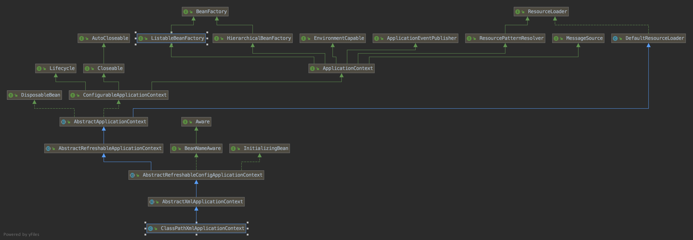
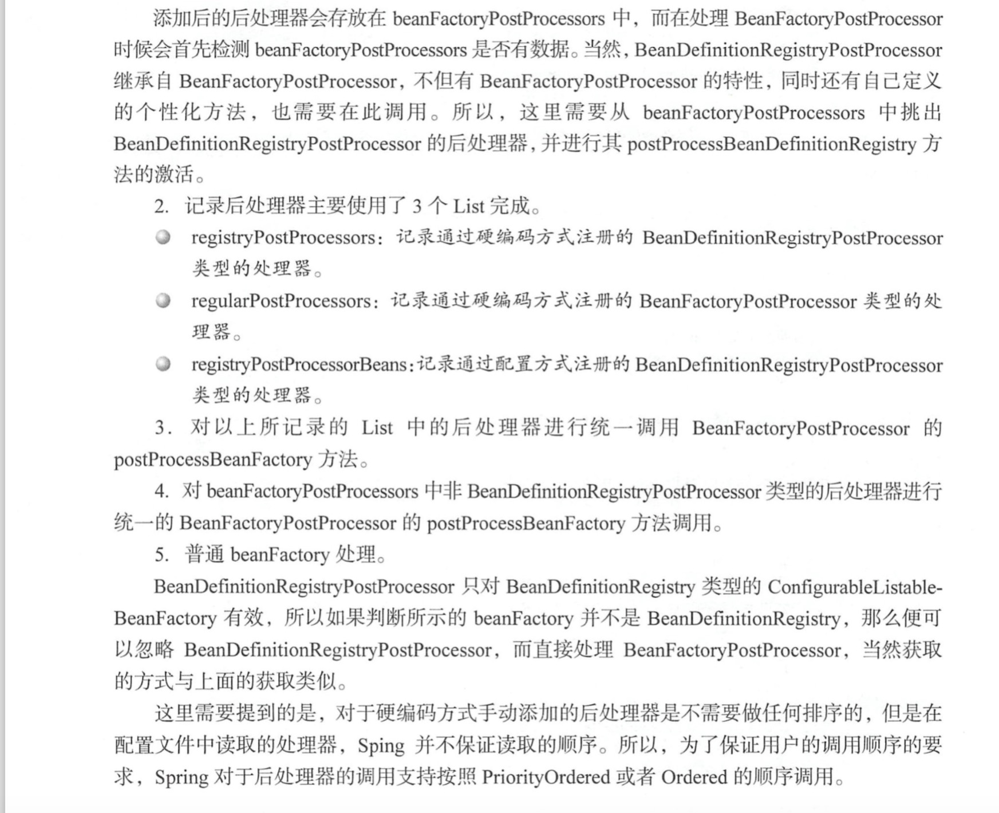
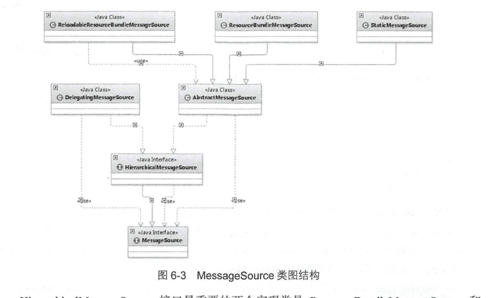

6 容器的功能扩展

> Spring中还提供了另一个接口ApplicationContext，用于扩展BeanFactory，
  ApplicationContext提供了更多的扩展功能，ApplicationContext包含BeanFactory的所有功能


```
public ClassPathXmlApplicationContext(String configLocation) throws BeansException {
    this(new String[] {configLocation}, true, null);
}


public ClassPathXmlApplicationContext(String[] configLocations, boolean refresh, ApplicationContext parent)
        throws BeansException {

    super(parent);
    setConfigLocations(configLocations);
    if (refresh) {
        refresh();
    }
}

```



## 6.1 设置配置路径

```
在ClassPathXmlApplicationContext中支持多个配置文件以数组方式同时传入
这个函数主要用于解析给定的路径数组，当然，如果数组中包含特殊符号，如${var},那么在resolvePath钟会搜寻匹配的系统变量并替换。
public void setConfigLocations(String... locations) {
    if (locations != null) {
        Assert.noNullElements(locations, "Config locations must not be null");
        this.configLocations = new String[locations.length];
        for (int i = 0; i < locations.length; i++) {
            this.configLocations[i] = resolvePath(locations[i]).trim();
        }
    }
    else {
        this.configLocations = null;
    }
}


```


## 6.2 扩展功能

```
public void refresh() throws BeansException, IllegalStateException {
    synchronized (this.startupShutdownMonitor) {
        // Prepare this context for refreshing.
        // 准备刷新的上下文环境
        prepareRefresh();

        // Tell the subclass to refresh the internal bean factory.
        // 初始化BeanFactory，并进行XML文件读取
        ConfigurableListableBeanFactory beanFactory = obtainFreshBeanFactory();

        // Prepare the bean factory for use in this context.
        // 对BeanFactory进行各种功能填充
        prepareBeanFactory(beanFactory);

        try {
            // Allows post-processing of the bean factory in context subclasses.
            // 子类覆盖方法做额外的处理
            postProcessBeanFactory(beanFactory);

            // Invoke factory processors registered as beans in the context.
            // 激活各种BeanFactory处理器
            invokeBeanFactoryPostProcessors(beanFactory);

            // Register bean processors that intercept bean creation.
            // 注册拦截Bean创建的Bean处理器，这里只是注册，真正的调用是在getBean时候
            registerBeanPostProcessors(beanFactory);

            // Initialize message source for this context.
            // 为上下文初始化Message源，即不同语言的消息体，国际化处理
            initMessageSource();

            // Initialize event multicaster for this context.
            // 初始化应用消息广播器，并放入"applicationEventMulticaster"bean中
            initApplicationEventMulticaster();

            // Initialize other special beans in specific context subclasses.
            // 留给子类来初始化其他的Bean
            onRefresh();

            // Check for listener beans and register them.
            // 在所有注册的bean中查找Listener bean，注册到消息广播器中
            registerListeners();

            // Instantiate all remaining (non-lazy-init) singletons.
            // 初始化剩下的单实例(非惰性的)
            finishBeanFactoryInitialization(beanFactory);

            // Last step: publish corresponding event.
            // 完成刷新过程，通知声明周期处理器lifeecycleProcessor刷新过程，同时发出ContextRefreshEvent通知别人
            finishRefresh();
        }

        catch (BeansException ex) {
            logger.warn("Exception encountered during context initialization - cancelling refresh attempt", ex);

            // Destroy already created singletons to avoid dangling resources.
            destroyBeans();

            // Reset 'active' flag.
            cancelRefresh(ex);

            // Propagate exception to caller.
            throw ex;
        }
    }
}

```

> 1.初始化前的准备工作，例如对系统属性或者环境变量进行准备及验证。
  在某种情况下项目的会用需要读取某些系统变量，而这个变量的设置很可能会影响着系统的正确性，那么ClassPathXmlApplicationContext为我们提供了这个准备函数就
  显得非常必要，它可以在Spring启动的时候提前对必须的变量进行存在性验证。
> 2.初始化啊BeanFactory，并进行XML文件读取。
  在这一步骤后，将会复用BeanFactory中的配置文件读取解析及其他功能，这一步之后，ClassPathXmlApplicationContext实际上就已经包含了BeanFactory所提供的功能，
  也就是可以进行bean的提取等基础操作了
> 3.对BeanFactory进行各种功能填充。
  @Qualifier与@Autowired这两个注解正是在这一步中增加的支持
> 4.子类覆盖方法做额外的处理。
  空函数实现postProcessBeanFactory来方便程序员在业务上做进一步扩展。
> 5.激活各种BeanFactory处理器。
> 6.注册拦截bean创建的bean处理器，这里只是注册，真正的调用是在getBean时候。
> 7.为了上线文初始化Message源，即序不同语言的消息体进行国际化处理。
> 8.初始化应用消息广播器，并发昂如"applicationEventMulticaster"bean中
> 9.留给子类来初始化其他的bean
> 10.在所有的注册的bean中查找listener bean，注册到消息广播器中。
> 11.初始化剩下的单实例(非惰性的)
> 12.完成刷新过程，通知声明周期处理器lifecycleProcessor刷新过程，同时发出ContextRefreshEvent通知别人。


## 6.3 环境准备

```
protected void prepareRefresh() {
    this.startupDate = System.currentTimeMillis();
    this.active.set(true);

    if (logger.isInfoEnabled()) {
        logger.info("Refreshing " + this);
    }

    // Initialize any placeholder property sources in the context environment
    // 留给子类覆盖
    initPropertySources();

    // Validate that all properties marked as required are resolvable
    // see ConfigurablePropertyResolver#setRequiredProperties
    // 验证需要的属性文件是否都已经放入环境中
    getEnvironment().validateRequiredProperties();
```

> 1.initPropertySources提供了扩展能力，用户根据需要重写initPropertySources方法，并子啊方法中进行个性化属性处理及设置
> 2.validateRequiredProperties则是对属性进行验证。

```
在com.spring.book.study.chapter06新增MyClassPathXmlApplicationContext
package com.spring.book.study.chapter06;

import org.springframework.beans.BeansException;
import org.springframework.context.support.ClassPathXmlApplicationContext;

public class MyClassPathXmlApplicationContext extends ClassPathXmlApplicationContext {

    public MyClassPathXmlApplicationContext(String... configLocations) throws BeansException {
        super(configLocations);
    }

    @Override
    protected void initPropertySources() {
        
        // 这里是系统的环境变量
        // VAR是未定义的系统变量
        // JAVA_HOME是定义的系统变量
//        getEnvironment().setRequiredProperties("VAR");
        System.out.println(getEnvironment().getRequiredProperty("JAVA_HOME"));
    }
}

在src/main/resources下增加customPropertiesTest.xml
<?xml version="1.0" encoding="UTF-8"?>
<beans xmlns="http://www.springframework.org/schema/beans"
       xmlns:xsi="http://www.w3.org/2001/XMLSchema-instance" xmlns:util="http://www.springframework.org/schema/util"
       xsi:schemaLocation="http://www.springframework.org/schema/beans
    http://www.springframework.org/schema/beans/spring-beans.xsd http://www.springframework.org/schema/util http://www.springframework.org/schema/util/spring-util.xsd">


    <bean id="testBean" class="com.spring.book.study.chapter04.User"/>
</beans>

在com.spring.book.study.chapter06新增Main

package com.spring.book.study.chapter06;

import com.spring.book.study.chapter04.User;
import org.springframework.context.ApplicationContext;

public class Main {

    public static void main(String[] args) {

        testCustomProperties();

    }

    private static void testCustomProperties() {

        // 启动过程中若是定义了系统环境变量，则正常加载
        // 若是没有定义，则抛出异常
        // Exception in thread "main" org.springframework.core.env.MissingRequiredPropertiesException: The following properties were declared as required but could not be resolved: [VAR]
        ApplicationContext app = new MyClassPathXmlApplicationContext("customPropertiesTest.xml");
        User user = (User) app.getBean("testBean");
        System.out.println(user.getEmail());

    }
}


```
## 6.4 加载BeanFactory

> obtainFreshBeanFactory获取BeanFactory。obtainFreshBeanFactory正是实现BeanFactory的地方，也就是经过这个函数后ApplicationContext就已经拥有了BeanFactory的全部功能

```
protected ConfigurableListableBeanFactory obtainFreshBeanFactory() {
    // 初始化BeanFactory，并进行XML文件读取，并将得到的BeanFactory记录在当前实体的属性中
    refreshBeanFactory();
    // 返回的那你去哪实体的beanFactory属性
    ConfigurableListableBeanFactory beanFactory = getBeanFactory();
    if (logger.isDebugEnabled()) {
        logger.debug("Bean factory for " + getDisplayName() + ": " + beanFactory);
    }
    return beanFactory;
}

将核心实现委托给了refershBeanFactory：
# AbstractRefreshableApplicationContext.java
@Override
protected final void refreshBeanFactory() throws BeansException {
    if (hasBeanFactory()) {
        destroyBeans();
        closeBeanFactory();
    }
    try {
        // 创建DefaultListableBeanFactory
        DefaultListableBeanFactory beanFactory = createBeanFactory();
        
        // 为了序列化指定id，如果需要的话，让这个BeanFactory从id反序列化到BeanFactory对象中
        beanFactory.setSerializationId(getId());
        // 定制beanFactory，设置先关属性，包括是否允许覆盖同名称的不同定义的对象以及循环依赖以及
        // 设置@Autowired和@Qualifier注解解析器QualifierAnnotationAutowireCandidateResolver
        customizeBeanFactory(beanFactory);
        // 出水啊DocumentReader，并进行XMl问津读取及解析
        loadBeanDefinitions(beanFactory);
        synchronized (this.beanFactoryMonitor) {
            this.beanFactory = beanFactory;
        }
    }
    catch (IOException ex) {
        throw new ApplicationContextException("I/O error parsing bean definition source for " + getDisplayName(), ex);
    }
}


```

> 1.创建DefaultListableBeanFactory。
  BeanFactory bf = new XmlBeanFactory("test.xml"),其中XMLBeanFactory继承自DefaultListableBeanFactory，并提供了XmlBeanDefinitionReader类型的reade如属性
  也就是说DefaultListableBeanFactory是容器的基础，必须首先实例化
  2.指定序列化ID
  3.定制BeanFactory
  4.加载BeanDefinition
  5.使用全局变量记录BeanFactory类实例
> DefaultListableBeanFactory的变量beanFactory是函数内的局部变量，所以要使用全局变量记录解析结果

### 6.4.1 定制BeanFactory

```

# AbstractRefershableApplicationContext.java
protected void customizeBeanFactory(DefaultListableBeanFactory beanFactory) {
    // 如果shxingallowBeanDefinitionOverrinding不为空，设置给beanFactory对象相应属性，
    // 此属性的含义：是否允许覆盖同名称的不同定义的对象
    if (this.allowBeanDefinitionOverriding != null) {
        beanFactory.setAllowBeanDefinitionOverriding(this.allowBeanDefinitionOverriding);
    }
    // 如果属性allowCircularReferences不为空，设置给beanFactory对象相应属性。
    if (this.allowCircularReferences != null) {
        beanFactory.setAllowCircularReferences(this.allowCircularReferences);
    }
    
    // 用于@Qualifier和@Autowired
    // 这行代码是书上的，4.1.3版本没有这行代码，
    // 
    beanFactory.setAutowireCandidateResolver(new QualifierAnnotationAutowireCandidateResolver())
    
}

在bean加载部分中讲解创建Bean时，如果采用autowireByType方式注入，那么默认会使用Spring提供的SimpleAutowireCandidateResolver，
而对于默认的实现并没有过多的逻辑处理。在这里，Spring使用了QualifierAnnotationAutowireCandidateResolver,设置这个解析器后Spring就可以支持注解方式的注入了


// 以上两个属性可以在自定义的加载器中设置
public class MyClassPathXmlApplicationContext extends ClassPathXmlApplicationContext {

    public MyClassPathXmlApplicationContext(String... configLocations) throws BeansException {
        super(configLocations);
    }

    @Override
    protected void customizeBeanFactory(DefaultListableBeanFactory beanFactory) {
        super.setAllowBeanDefinitionOverriding(false);
        super.setAllowCircularReferences(false);
        super.customizeBeanFactory(beanFactory);
    }
}
# QualifierAnnotationAutowireCandidateResolver.java

public Object getSuggestedValue(DependencyDescriptor descriptor) {
    Object value = findValue(descriptor.getAnnotations());
    if (value == null) {
        MethodParameter methodParam = descriptor.getMethodParameter();
        if (methodParam != null) {
            value = findValue(methodParam.getMethodAnnotations());
        }
    }
    return value;
}

```

### 6.4.2 BeanDefinition

```
# AbstractXmlApplicationContext.java
protected void loadBeanDefinitions(DefaultListableBeanFactory beanFactory) throws BeansException, IOException {
    // Create a new XmlBeanDefinitionReader for the given BeanFactory.
    // 为指定beanFactory创建XmlBeanDefinitionReader
    XmlBeanDefinitionReader beanDefinitionReader = new XmlBeanDefinitionReader(beanFactory);

    // Configure the bean definition reader with this context's
    // resource loading environment.
    // 对beanDefinitionReader进行环境变量的设置
    beanDefinitionReader.setEnvironment(this.getEnvironment());
    beanDefinitionReader.setResourceLoader(this);
    beanDefinitionReader.setEntityResolver(new ResourceEntityResolver(this));

    // Allow a subclass to provide custom initialization of the reader,
    // then proceed with actually loading the bean definitions.
    // 对BeanDefinitionReader进行设置，可以覆盖
    initBeanDefinitionReader(beanDefinitionReader);
    loadBeanDefinitions(beanDefinitionReader);
}

# loadBeanDefinitions方法后面就是之前的内容
protected void loadBeanDefinitions(XmlBeanDefinitionReader reader) throws BeansException, IOException {
    Resource[] configResources = getConfigResources();
    if (configResources != null) {
        reader.loadBeanDefinitions(configResources);
    }
    String[] configLocations = getConfigLocations();
    if (configLocations != null) {
        reader.loadBeanDefinitions(configLocations);
    }
}


```

## 6.5 功能扩展

> 进入函数prepareBeanFactory，Spring已经完成了对配置的解析，而ApplicationContext在功能上的扩展也由此展开

```

protected void prepareBeanFactory(ConfigurableListableBeanFactory beanFactory) {
    // Tell the internal bean factory to use the context's class loader etc.
    // 设置beanFactory的classLoader为当前context的classLoadeer
    beanFactory.setBeanClassLoader(getClassLoader());
    // 设置beanFactory的表达式语言处理器，Spring3增加了表达式语言的支持
    // 默认可以使用#{bean.xxx}的形式调用相关属性值
    beanFactory.setBeanExpressionResolver(new StandardBeanExpressionResolver(beanFactory.getBeanClassLoader()));
    // 为beanFactory增加了一个默认的propertyEditor，这个主要是对bean的属性等设置管理的一个工具
    beanFactory.addPropertyEditorRegistrar(new ResourceEditorRegistrar(this, getEnvironment()));

    // Configure the bean factory with context callbacks.
    // 添加BeanPostProcessor
    beanFactory.addBeanPostProcessor(new ApplicationContextAwareProcessor(this));
    
    // 设置几个忽略自动装配的接口
    beanFactory.ignoreDependencyInterface(ResourceLoaderAware.class);
    beanFactory.ignoreDependencyInterface(ApplicationEventPublisherAware.class);
    beanFactory.ignoreDependencyInterface(MessageSourceAware.class);
    beanFactory.ignoreDependencyInterface(ApplicationContextAware.class);
    beanFactory.ignoreDependencyInterface(EnvironmentAware.class);

    // BeanFactory interface not registered as resolvable type in a plain factory.
    // MessageSource registered (and found for autowiring) as a bean.
    // 设置几个自动装配的特殊规则
    beanFactory.registerResolvableDependency(BeanFactory.class, beanFactory);
    beanFactory.registerResolvableDependency(ResourceLoader.class, this);
    beanFactory.registerResolvableDependency(ApplicationEventPublisher.class, this);
    beanFactory.registerResolvableDependency(ApplicationContext.class, this);

    // Detect a LoadTimeWeaver and prepare for weaving, if found.
    // 增加AspectJ的支持
    if (beanFactory.containsBean(LOAD_TIME_WEAVER_BEAN_NAME)) {
        beanFactory.addBeanPostProcessor(new LoadTimeWeaverAwareProcessor(beanFactory));
        // Set a temporary ClassLoader for type matching.
        beanFactory.setTempClassLoader(new ContextTypeMatchClassLoader(beanFactory.getBeanClassLoader()));
    }

    // Register default environment beans.
    // 添加默认的系统环境bean
    if (!beanFactory.containsLocalBean(ENVIRONMENT_BEAN_NAME)) {
        beanFactory.registerSingleton(ENVIRONMENT_BEAN_NAME, getEnvironment());
    }
    if (!beanFactory.containsLocalBean(SYSTEM_PROPERTIES_BEAN_NAME)) {
        beanFactory.registerSingleton(SYSTEM_PROPERTIES_BEAN_NAME, getEnvironment().getSystemProperties());
    }
    if (!beanFactory.containsLocalBean(SYSTEM_ENVIRONMENT_BEAN_NAME)) {
        beanFactory.registerSingleton(SYSTEM_ENVIRONMENT_BEAN_NAME, getEnvironment().getSystemEnvironment());
    }
}


```

> 上面函数主要进行了几个方面的扩展：
  增加对SpEL语言的支持
  增加对属性编辑器的支持
  增加对一些内置类，比如EnvironmentAware
  设置了依赖功能可忽略的接口
  注册了一些固定依赖的属性
  增加AspectJ的支持
  将相关环境变量及属性注册以单例模式注册
  
### 6.5.1 增加SpEL语言的支持

> SpEL是单独模块，只依赖于core模块，不依赖于其他模块，可以单独使用
> AbstractAutowireCapableBeanFactory类的applyPropertyValues函数来完成功能。
  就在这个函数中，会通过构造BeanDefinitionValueResolver类型实例valueResolver来进行属性值解析。
  同时，也是在这个步骤中一般通过AbstractBeanFactory中的evaluateBeanDefinitionString方法去完成SpEL的解析。


```

protected Object evaluateBeanDefinitionString(String value, BeanDefinition beanDefinition) {
    if (this.beanExpressionResolver == null) {
        return value;
    }
    Scope scope = (beanDefinition != null ? getRegisteredScope(beanDefinition.getScope()) : null);
    return this.beanExpressionResolver.evaluate(value, new BeanExpressionContext(this, scope));
}


```

### 6.5.2 增加属性注册编辑器

> Spring DI注入的时候可以把普通属性注入进来，但是像Date类型就无法被识别。

```
1.使用自定义的属性编辑器

package com.spring.book.study.chapter06;

import java.beans.PropertyEditorSupport;
import java.text.ParseException;
import java.text.SimpleDateFormat;
import java.util.Date;

public class DatePropertyEditor extends PropertyEditorSupport {

    private String format = "yyyy-MM-dd";

    public void setFormat(String format) {
        this.format = format;
    }

    @Override
    public void setAsText(String text) throws IllegalArgumentException {
        System.out.println("text：" + text);
        SimpleDateFormat sdf = new SimpleDateFormat(format);

        try {
            Date date = sdf.parse(text);
            this.setValue(date);
        } catch (ParseException e) {
            e.printStackTrace();
        }
    }
}

2.将自定义属性编辑器注册到Spring中
在src/main/resources下新增propertiesEditorTest.xml
<?xml version="1.0" encoding="UTF-8"?>
<beans xmlns="http://www.springframework.org/schema/beans"
       xmlns:xsi="http://www.w3.org/2001/XMLSchema-instance" xmlns:util="http://www.springframework.org/schema/util"
       xsi:schemaLocation="http://www.springframework.org/schema/beans
    http://www.springframework.org/schema/beans/spring-beans.xsd http://www.springframework.org/schema/util http://www.springframework.org/schema/util/spring-util.xsd">


    <bean id="userManager" class="com.spring.book.study.chapter06.UserManager">
        <property name="dateValue">
            <value>2013-03-15</value>
        </property>
    </bean>

<!--    <bean class="org.springframework.beans.factory.config.CustomEditorConfigurer">-->
<!--        <property name="customEditors">-->
<!--            <map>-->
<!--                <entry key="java.util.Date">-->
<!--                    <bean class="com.spring.book.study.chapter06.DatePropertyEditor">-->
<!--                        <property name="format" value="yyyy-MM-dd"/>-->
<!--                    </bean>-->
<!--                </entry>-->
<!--            </map>-->
<!--        </property>-->
<!--    </bean>-->

    <bean class="org.springframework.beans.factory.config.CustomEditorConfigurer">
        <property name="propertyEditorRegistrars">
            <list>
                <bean class="com.spring.book.study.chapter06.DatePropertyEditorRegister"></bean>
            </list>
        </property>
    </bean>

</beans>

以上测试报错，不晓得是不是版本问题

2.注册Spring自带的属性编辑器CustomDateEditor


package com.spring.book.study.chapter06;

import org.springframework.beans.PropertyEditorRegistrar;
import org.springframework.beans.PropertyEditorRegistry;
import org.springframework.beans.propertyeditors.CustomDateEditor;

import java.text.SimpleDateFormat;
import java.util.Date;

public class DatePropertyEditorRegister implements PropertyEditorRegistrar {


    public void registerCustomEditors(PropertyEditorRegistry registry) {
        registry.registerCustomEditor(Date.class, new CustomDateEditor(new SimpleDateFormat("yyyy-MM-dd"), true));
    }
}

在propertiesEditorTest.xml中如下配置，已配置过
<bean class="org.springframework.beans.factory.config.CustomEditorConfigurer">
    <property name="propertyEditorRegistrars">
        <list>
            <bean class="com.spring.book.study.chapter06.DatePropertyEditorRegister"></bean>
        </list>
    </property>
</bean>
这种方式是可行的，正常运行了

ResourceEditorRegistrar中内部实现

public void registerCustomEditors(PropertyEditorRegistry registry) {
    ResourceEditor baseEditor = new ResourceEditor(this.resourceLoader, this.propertyResolver);
    doRegisterEditor(registry, Resource.class, baseEditor);
    doRegisterEditor(registry, ContextResource.class, baseEditor);
    doRegisterEditor(registry, InputStream.class, new InputStreamEditor(baseEditor));
    doRegisterEditor(registry, InputSource.class, new InputSourceEditor(baseEditor));
    doRegisterEditor(registry, File.class, new FileEditor(baseEditor));
    doRegisterEditor(registry, URL.class, new URLEditor(baseEditor));

    ClassLoader classLoader = this.resourceLoader.getClassLoader();
    doRegisterEditor(registry, URI.class, new URIEditor(classLoader));
    doRegisterEditor(registry, Class.class, new ClassEditor(classLoader));
    doRegisterEditor(registry, Class[].class, new ClassArrayEditor(classLoader));

    if (this.resourceLoader instanceof ResourcePatternResolver) {
        doRegisterEditor(registry, Resource[].class,
                new ResourceArrayPropertyEditor((ResourcePatternResolver) this.resourceLoader, this.propertyResolver));
    }
}


private void doRegisterEditor(PropertyEditorRegistry registry, Class<?> requiredType, PropertyEditor editor) {
    if (registry instanceof PropertyEditorRegistrySupport) {
        ((PropertyEditorRegistrySupport) registry).overrideDefaultEditor(requiredType, editor);
    }
    else {
        registry.registerCustomEditor(requiredType, editor);
    }
}


# PropertyEditorRegistrySupport

private void createDefaultEditors() {
    this.defaultEditors = new HashMap<Class<?>, PropertyEditor>(64);

    // Simple editors, without parameterization capabilities.
    // The JDK does not contain a default editor for any of these target types.
    this.defaultEditors.put(Charset.class, new CharsetEditor());
    this.defaultEditors.put(Class.class, new ClassEditor());
    this.defaultEditors.put(Class[].class, new ClassArrayEditor());
    this.defaultEditors.put(Currency.class, new CurrencyEditor());
    this.defaultEditors.put(File.class, new FileEditor());
    this.defaultEditors.put(InputStream.class, new InputStreamEditor());
    this.defaultEditors.put(InputSource.class, new InputSourceEditor());
    this.defaultEditors.put(Locale.class, new LocaleEditor());
    this.defaultEditors.put(Pattern.class, new PatternEditor());
    this.defaultEditors.put(Properties.class, new PropertiesEditor());
    this.defaultEditors.put(Resource[].class, new ResourceArrayPropertyEditor());
    this.defaultEditors.put(TimeZone.class, new TimeZoneEditor());
    this.defaultEditors.put(URI.class, new URIEditor());
    this.defaultEditors.put(URL.class, new URLEditor());
    this.defaultEditors.put(UUID.class, new UUIDEditor());
    if (zoneIdClass != null) {
        this.defaultEditors.put(zoneIdClass, new ZoneIdEditor());
    }

    // Default instances of collection editors.
    // Can be overridden by registering custom instances of those as custom editors.
    this.defaultEditors.put(Collection.class, new CustomCollectionEditor(Collection.class));
    this.defaultEditors.put(Set.class, new CustomCollectionEditor(Set.class));
    this.defaultEditors.put(SortedSet.class, new CustomCollectionEditor(SortedSet.class));
    this.defaultEditors.put(List.class, new CustomCollectionEditor(List.class));
    this.defaultEditors.put(SortedMap.class, new CustomMapEditor(SortedMap.class));

    // Default editors for primitive arrays.
    this.defaultEditors.put(byte[].class, new ByteArrayPropertyEditor());
    this.defaultEditors.put(char[].class, new CharArrayPropertyEditor());

    // The JDK does not contain a default editor for char!
    this.defaultEditors.put(char.class, new CharacterEditor(false));
    this.defaultEditors.put(Character.class, new CharacterEditor(true));

    // Spring's CustomBooleanEditor accepts more flag values than the JDK's default editor.
    this.defaultEditors.put(boolean.class, new CustomBooleanEditor(false));
    this.defaultEditors.put(Boolean.class, new CustomBooleanEditor(true));

    // The JDK does not contain default editors for number wrapper types!
    // Override JDK primitive number editors with our own CustomNumberEditor.
    this.defaultEditors.put(byte.class, new CustomNumberEditor(Byte.class, false));
    this.defaultEditors.put(Byte.class, new CustomNumberEditor(Byte.class, true));
    this.defaultEditors.put(short.class, new CustomNumberEditor(Short.class, false));
    this.defaultEditors.put(Short.class, new CustomNumberEditor(Short.class, true));
    this.defaultEditors.put(int.class, new CustomNumberEditor(Integer.class, false));
    this.defaultEditors.put(Integer.class, new CustomNumberEditor(Integer.class, true));
    this.defaultEditors.put(long.class, new CustomNumberEditor(Long.class, false));
    this.defaultEditors.put(Long.class, new CustomNumberEditor(Long.class, true));
    this.defaultEditors.put(float.class, new CustomNumberEditor(Float.class, false));
    this.defaultEditors.put(Float.class, new CustomNumberEditor(Float.class, true));
    this.defaultEditors.put(double.class, new CustomNumberEditor(Double.class, false));
    this.defaultEditors.put(Double.class, new CustomNumberEditor(Double.class, true));
    this.defaultEditors.put(BigDecimal.class, new CustomNumberEditor(BigDecimal.class, true));
    this.defaultEditors.put(BigInteger.class, new CustomNumberEditor(BigInteger.class, true));

    // Only register config value editors if explicitly requested.
    if (this.configValueEditorsActive) {
        StringArrayPropertyEditor sae = new StringArrayPropertyEditor();
        this.defaultEditors.put(String[].class, sae);
        this.defaultEditors.put(short[].class, sae);
        this.defaultEditors.put(int[].class, sae);
        this.defaultEditors.put(long[].class, sae);
    }
}


```
   
   
### 6.5.3 添加ApplicaationContextAwareProcessor处理器

> 对于beanFactory.addBeanPostProcessor(new ApplicationContextAwareProcessor(this))
  其实主要目的就是注册个BeanPostProcessor，而真正的逻辑还是在ApplicationContextAwareProcessor中。
  ApplicationContextAwareProcessor实现BeanPostProcessor
  
```
ApplicationContextAwareProcessor
public Object postProcessAfterInitialization(Object bean, String beanName) {
    return bean;
}


public Object postProcessBeforeInitialization(final Object bean, String beanName) throws BeansException {
    AccessControlContext acc = null;

    if (System.getSecurityManager() != null &&
            (bean instanceof EnvironmentAware || bean instanceof EmbeddedValueResolverAware ||
                    bean instanceof ResourceLoaderAware || bean instanceof ApplicationEventPublisherAware ||
                    bean instanceof MessageSourceAware || bean instanceof ApplicationContextAware)) {
        acc = this.applicationContext.getBeanFactory().getAccessControlContext();
    }

    if (acc != null) {
        AccessController.doPrivileged(new PrivilegedAction<Object>() {
            @Override
            public Object run() {
                invokeAwareInterfaces(bean);
                return null;
            }
        }, acc);
    }
    else {
        invokeAwareInterfaces(bean);
    }

    return bean;
}


private void invokeAwareInterfaces(Object bean) {
    if (bean instanceof Aware) {
        if (bean instanceof EnvironmentAware) {
            ((EnvironmentAware) bean).setEnvironment(this.applicationContext.getEnvironment());
        }
        if (bean instanceof EmbeddedValueResolverAware) {
            ((EmbeddedValueResolverAware) bean).setEmbeddedValueResolver(
                    new EmbeddedValueResolver(this.applicationContext.getBeanFactory()));
        }
        if (bean instanceof ResourceLoaderAware) {
            ((ResourceLoaderAware) bean).setResourceLoader(this.applicationContext);
        }
        if (bean instanceof ApplicationEventPublisherAware) {
            ((ApplicationEventPublisherAware) bean).setApplicationEventPublisher(this.applicationContext);
        }
        if (bean instanceof MessageSourceAware) {
            ((MessageSourceAware) bean).setMessageSource(this.applicationContext);
        }
        if (bean instanceof ApplicationContextAware) {
            ((ApplicationContextAware) bean).setApplicationContext(this.applicationContext);
        }
    }
}


```
  

### 6.5.4 设置忽略依赖

```
// 设置几个忽略自动装配的接口
beanFactory.ignoreDependencyInterface(ResourceLoaderAware.class);
beanFactory.ignoreDependencyInterface(ApplicationEventPublisherAware.class);
beanFactory.ignoreDependencyInterface(MessageSourceAware.class);
beanFactory.ignoreDependencyInterface(ApplicationContextAware.class);
beanFactory.ignoreDependencyInterface(EnvironmentAware.class);


```

### 6.5.5 注册依赖

```
// BeanFactory interface not registered as resolvable type in a plain factory.
// MessageSource registered (and found for autowiring) as a bean.
// 设置几个自动装配的特殊规则
beanFactory.registerResolvableDependency(BeanFactory.class, beanFactory);
beanFactory.registerResolvableDependency(ResourceLoader.class, this);
beanFactory.registerResolvableDependency(ApplicationEventPublisher.class, this);
beanFactory.registerResolvableDependency(ApplicationContext.class, this);

```

## 6.6 BeanFactory的后处理

### 6.6.1 激活注册的BeanFacctoryPostProcessor

> BeanFactoryPostProcessor接口跟BeanPostProcessor类似，可以对bean的定义进行处理。
  SpringIoc容器允许BeanFactoryPostProcessor在容器实际实例化任何其他的bean之前读取
  配置元数据，并有可能修改它。还可以通过"order"属性来控制BeanFactoryPostProcessor
  的执行顺序。
> 改变实际的bean实例(例如从配置元数据创建对象)，那么最好使用BeanPostProcessor。同样地，
  BeanFactoryPostProcessor的作用域范围是容器级的。它只和你使用的容器有关，BeanFactoryPostProcessor
  不对对定义在另一个容器中的bean进行后置处理。Spring中存在对于BeanFactoryPostProcessor
  的典型应用，比如PropertyPlaceholderConfigurer。

**1.BeanFactoryPostProcessor的典型应用：PropertyPlaceholderConfigurer**

```
<bean id="message" class='distConfig.HelloMessage">
    <property name="mes">
        <value>${bean.message}</value>
    </property>
</bean>

其中竟然出现了变量引用：${bean.message}。这就是Spring的分散配置，可以在另外的配置文件中为bean.message指定值
如在bean.property配置如下定义：
bean.message=Hi,can you find me?
这个就要靠PropertyPlacehilderConfigurer这个类的bean

<bean id="mesHandler" class="org.springframework.beans.factory.config.PropertyPlaceholderConfigurer">
    <property name="locations">
        <list>
            <value>config/bean.properties</value>
        </list>
    </property>
</bean>

查看层级结果可以看出PropertyPlaceholderConfigurer这个类简介继承了BeanFactoryPostProcessor接口。这是个特别的接口，
当Spring加载任何实现了这个接口的bean的配置时，都会在bean工厂载入所有bean的配置之后执行postProcessBeanFactory方法。
在PropertyResourceConfigurer类中实现了postProcessBeanFactory方法，在这个方法中先后调用了mergeProperties、convertProperties
、processProperties这个三个方法，分别的二到配置，将得到的配置转换为合适的烈性，最后将配置内容告知BeanFactory

```

**2. 使用自定义BeanFactoryPostProcessor**

```

在com.spring.book.study.chapter06新增ObscenityRemovingBeanFactoryPostProcessor
package com.spring.book.study.chapter06;

import org.springframework.beans.BeansException;
import org.springframework.beans.factory.config.BeanDefinition;
import org.springframework.beans.factory.config.BeanDefinitionVisitor;
import org.springframework.beans.factory.config.BeanFactoryPostProcessor;
import org.springframework.beans.factory.config.ConfigurableListableBeanFactory;
import org.springframework.util.StringValueResolver;

import java.util.HashSet;
import java.util.Set;

public class ObscenityRemovingBeanFactoryPostProcessor implements BeanFactoryPostProcessor {

    private Set<String> obscenties;

    public ObscenityRemovingBeanFactoryPostProcessor() {
        this.obscenties = new HashSet<String>();
    }

    public void postProcessBeanFactory(ConfigurableListableBeanFactory beanFactory) throws BeansException {
        String[] beanNames = beanFactory.getBeanDefinitionNames();
        for (String beanName : beanNames) {
            BeanDefinition bd = beanFactory.getBeanDefinition(beanName);
            StringValueResolver valueResolver = new StringValueResolver() {
                public String resolveStringValue(String strVal) {
                    if (isObscene(strVal)) return "******";
                    return strVal;
                }
            };
            BeanDefinitionVisitor visitor = new BeanDefinitionVisitor(valueResolver);
            visitor.visitBeanDefinition(bd);
        }


    }

    public boolean isObscene(String value) {
        String potentialObscenity = value.toString().toUpperCase();
        return this.obscenties.contains(potentialObscenity);
    }

    public Set<String> getObscenties() {
        return obscenties;
    }

    public void setObscenties(Set<String> obscenties) {
        this.obscenties.clear();
        for (String obscenty : obscenties) {
            this.obscenties.add(obscenty.toUpperCase());
        }
    }
}

在com.spring.book.study.chapter06新增SimplePostProcessor
package com.spring.book.study.chapter06;

public class SimplePostProcessor {

    private String connectionString;
    private String password;
    private String username;

    public String getConnectionString() {
        return connectionString;
    }

    public void setConnectionString(String connectionString) {
        this.connectionString = connectionString;
    }

    public String getPassword() {
        return password;
    }

    public void setPassword(String password) {
        this.password = password;
    }

    public String getUsername() {
        return username;
    }

    public void setUsername(String username) {
        this.username = username;
    }

    @Override
    public String toString() {
        return "SimplePostProcessor{" +
                "connectionString='" + connectionString + '\'' +
                ", password='" + password + '\'' +
                ", username='" + username + '\'' +
                '}';
    }
}


在src/main/resources中新增BeanFactory.xml

<?xml version="1.0" encoding="UTF-8"?>
<beans xmlns="http://www.springframework.org/schema/beans"
       xmlns:xsi="http://www.w3.org/2001/XMLSchema-instance" xmlns:util="http://www.springframework.org/schema/util"
       xsi:schemaLocation="http://www.springframework.org/schema/beans
    http://www.springframework.org/schema/beans/spring-beans.xsd http://www.springframework.org/schema/util http://www.springframework.org/schema/util/spring-util.xsd">


<bean id="bfpp" class="com.spring.book.study.chapter06.ObscenityRemovingBeanFactoryPostProcessor">
    <property name="obscenties">
        <set>
            <value>bollocks</value>
            <value>winky</value>
            <value>bum</value>
            <value>Microsoft</value>
        </set>
    </property>
</bean>

<bean id="simpleBean" class="com.spring.book.study.chapter06.SimplePostProcessor">
    <property name="connectionString" value="bollocks"/>
    <property name="password" value="imaginecup"/>
    <property name="username" value="Microsoft"/>
</bean>

</beans>

测试类

package com.spring.book.study.chapter06;

import org.springframework.beans.factory.config.BeanFactoryPostProcessor;
import org.springframework.beans.factory.config.ConfigurableListableBeanFactory;
import org.springframework.beans.factory.xml.XmlBeanFactory;
import org.springframework.core.io.ClassPathResource;

public class PropertyConfigurerDemo {

    public static void main(String[] args) {
        ConfigurableListableBeanFactory bf = new XmlBeanFactory(new ClassPathResource("BeanFactory.xml"));

        BeanFactoryPostProcessor bfpp = (BeanFactoryPostProcessor) bf.getBean("bfpp");

        bfpp.postProcessBeanFactory(bf);
        // sSimplePostProcessor{connectionString='******', password='imaginecup', username='******'}
        System.out.println(bf.getBean("simpleBean"));
    }

}


```

**3.激活BeanFactoryPostProcessor**

```

protected void invokeBeanFactoryPostProcessors(ConfigurableListableBeanFactory beanFactory) {
    PostProcessorRegistrationDelegate.invokeBeanFactoryPostProcessors(beanFactory, getBeanFactoryPostProcessors());
}


public static void invokeBeanFactoryPostProcessors(
			ConfigurableListableBeanFactory beanFactory, List<BeanFactoryPostProcessor> beanFactoryPostProcessors) {

    // Invoke BeanDefinitionRegistryPostProcessors first, if any.
    Set<String> processedBeans = new HashSet<String>();

    if (beanFactory instanceof BeanDefinitionRegistry) {
        BeanDefinitionRegistry registry = (BeanDefinitionRegistry) beanFactory;
        List<BeanFactoryPostProcessor> regularPostProcessors = new LinkedList<BeanFactoryPostProcessor>();
        List<BeanDefinitionRegistryPostProcessor> registryPostProcessors =
                new LinkedList<BeanDefinitionRegistryPostProcessor>();

        /*
         * 硬编码注册的后处理
         ***/
        for (BeanFactoryPostProcessor postProcessor : beanFactoryPostProcessors) {
            if (postProcessor instanceof BeanDefinitionRegistryPostProcessor) {
                BeanDefinitionRegistryPostProcessor registryPostProcessor =
                        (BeanDefinitionRegistryPostProcessor) postProcessor;
                // 对于BeanDefinitionReegistryPostProcessor类型，在BeanFactoryPostProcessor的基础上还有自己定义的方法，需要先调用   
                registryPostProcessor.postProcessBeanDefinitionRegistry(registry);
                registryPostProcessors.add(registryPostProcessor);
            }
            else {
                // 记录常规BeanFactoryPostProcessor
                regularPostProcessors.add(postProcessor);
            }
        }

        // Do not initialize FactoryBeans here: We need to leave all regular beans
        // uninitialized to let the bean factory post-processors apply to them!
        // Separate between BeanDefinitionRegistryPostProcessors that implement
        // PriorityOrdered, Ordered, and the rest.
        String[] postProcessorNames =
                beanFactory.getBeanNamesForType(BeanDefinitionRegistryPostProcessor.class, true, false);

        // First, invoke the BeanDefinitionRegistryPostProcessors that implement PriorityOrdered.
        List<BeanDefinitionRegistryPostProcessor> priorityOrderedPostProcessors = new ArrayList<BeanDefinitionRegistryPostProcessor>();
        for (String ppName : postProcessorNames) {
            if (beanFactory.isTypeMatch(ppName, PriorityOrdered.class)) {
                priorityOrderedPostProcessors.add(beanFactory.getBean(ppName, BeanDefinitionRegistryPostProcessor.class));
                processedBeans.add(ppName);
            }
        }
        OrderComparator.sort(priorityOrderedPostProcessors);
        registryPostProcessors.addAll(priorityOrderedPostProcessors);
       
        invokeBeanDefinitionRegistryPostProcessors(priorityOrderedPostProcessors, registry);

        // Next, invoke the BeanDefinitionRegistryPostProcessors that implement Ordered.
        postProcessorNames = beanFactory.getBeanNamesForType(BeanDefinitionRegistryPostProcessor.class, true, false);
        List<BeanDefinitionRegistryPostProcessor> orderedPostProcessors = new ArrayList<BeanDefinitionRegistryPostProcessor>();
        for (String ppName : postProcessorNames) {
            if (!processedBeans.contains(ppName) && beanFactory.isTypeMatch(ppName, Ordered.class)) {
                orderedPostProcessors.add(beanFactory.getBean(ppName, BeanDefinitionRegistryPostProcessor.class));
                processedBeans.add(ppName);
            }
        }
        OrderComparator.sort(orderedPostProcessors);
        registryPostProcessors.addAll(orderedPostProcessors);
        invokeBeanDefinitionRegistryPostProcessors(orderedPostProcessors, registry);

        // Finally, invoke all other BeanDefinitionRegistryPostProcessors until no further ones appear.
        boolean reiterate = true;
        while (reiterate) {
            reiterate = false;
            postProcessorNames = beanFactory.getBeanNamesForType(BeanDefinitionRegistryPostProcessor.class, true, false);
            for (String ppName : postProcessorNames) {
                if (!processedBeans.contains(ppName)) {
                    BeanDefinitionRegistryPostProcessor pp = beanFactory.getBean(ppName, BeanDefinitionRegistryPostProcessor.class);
                    registryPostProcessors.add(pp);
                    processedBeans.add(ppName);
                    pp.postProcessBeanDefinitionRegistry(registry);
                    reiterate = true;
                }
            }
        }

        // Now, invoke the postProcessBeanFactory callback of all processors handled so far.
        invokeBeanFactoryPostProcessors(registryPostProcessors, beanFactory);
        invokeBeanFactoryPostProcessors(regularPostProcessors, beanFactory);
    }

    else {
        // Invoke factory processors registered with the context instance.
        invokeBeanFactoryPostProcessors(beanFactoryPostProcessors, beanFactory);
    }

    // Do not initialize FactoryBeans here: We need to leave all regular beans
    // uninitialized to let the bean factory post-processors apply to them!
    String[] postProcessorNames =
            beanFactory.getBeanNamesForType(BeanFactoryPostProcessor.class, true, false);

    // Separate between BeanFactoryPostProcessors that implement PriorityOrdered,
    // Ordered, and the rest.
    List<BeanFactoryPostProcessor> priorityOrderedPostProcessors = new ArrayList<BeanFactoryPostProcessor>();
    List<String> orderedPostProcessorNames = new ArrayList<String>();
    List<String> nonOrderedPostProcessorNames = new ArrayList<String>();
    for (String ppName : postProcessorNames) {
        if (processedBeans.contains(ppName)) {
            // skip - already processed in first phase above
        }
        else if (beanFactory.isTypeMatch(ppName, PriorityOrdered.class)) {
            priorityOrderedPostProcessors.add(beanFactory.getBean(ppName, BeanFactoryPostProcessor.class));
        }
        else if (beanFactory.isTypeMatch(ppName, Ordered.class)) {
            orderedPostProcessorNames.add(ppName);
        }
        else {
            nonOrderedPostProcessorNames.add(ppName);
        }
    }

    // First, invoke the BeanFactoryPostProcessors that implement PriorityOrdered.
    OrderComparator.sort(priorityOrderedPostProcessors);
    invokeBeanFactoryPostProcessors(priorityOrderedPostProcessors, beanFactory);

    // Next, invoke the BeanFactoryPostProcessors that implement Ordered.
    List<BeanFactoryPostProcessor> orderedPostProcessors = new ArrayList<BeanFactoryPostProcessor>();
    for (String postProcessorName : orderedPostProcessorNames) {
        orderedPostProcessors.add(beanFactory.getBean(postProcessorName, BeanFactoryPostProcessor.class));
    }
    OrderComparator.sort(orderedPostProcessors);
    invokeBeanFactoryPostProcessors(orderedPostProcessors, beanFactory);

    // Finally, invoke all other BeanFactoryPostProcessors.
    List<BeanFactoryPostProcessor> nonOrderedPostProcessors = new ArrayList<BeanFactoryPostProcessor>();
    for (String postProcessorName : nonOrderedPostProcessorNames) {
        nonOrderedPostProcessors.add(beanFactory.getBean(postProcessorName, BeanFactoryPostProcessor.class));
    }
    invokeBeanFactoryPostProcessors(nonOrderedPostProcessors, beanFactory);
}

上述代码和树上的代码太不一样：
对于BeanFactoryPostProcessor的处理主要分两种情况进行，一个对于BeanDefinitionRegistry类的特殊处理，另一种是对普通的BeanFactoryPostProcessor
进行处理。而对于每种情况都需要考虑硬编码注入注册的后处理器以及通过配置注入的后处理器。

对于BeanDefinitionRegistry类型的处理类的处理主要包括以下内容：
1.对于硬编码注册的后处理器的处理，主要是通过AbstractApplicationContext中的添加处理器方法aaddBeanFactoryPostProcessor进行添加。
public void addBeanFactoryPostProcessor(BeanFactoryPostProcessor beanFactoryPostProcessor){
    this.beanFacotryPostProcessors.add(beanFactoryPostProcessor);
}
2. 记录后处理器主要使用了3个List完成。
  

```



### 6.6.2 注册BeanPostProcessor

```
package com.spring.book.study.chapter06;

import org.springframework.beans.BeansException;
import org.springframework.beans.PropertyValues;
import org.springframework.beans.factory.config.InstantiationAwareBeanPostProcessor;

import java.beans.PropertyDescriptor;

public class MyInstantiationAwareBeanPostProcessor implements InstantiationAwareBeanPostProcessor {


    public Object postProcessBeforeInstantiation(Class<?> beanClass, String beanName) throws BeansException {
        return null;
    }

    public boolean postProcessAfterInstantiation(Object bean, String beanName) throws BeansException {
        return false;
    }

    public PropertyValues postProcessPropertyValues(PropertyValues pvs, PropertyDescriptor[] pds, Object bean, String beanName) throws BeansException {
        return null;
    }

    public Object postProcessBeforeInitialization(Object bean, String beanName) throws BeansException {
        System.out.println("====");
        return null;
    }

    public Object postProcessAfterInitialization(Object bean, String beanName) throws BeansException {
        return null;
    }
}


配置文件：customPostProcessor.xml

<?xml version="1.0" encoding="UTF-8"?>
<beans xmlns="http://www.springframework.org/schema/beans"
       xmlns:xsi="http://www.w3.org/2001/XMLSchema-instance" xmlns:util="http://www.springframework.org/schema/util"
       xsi:schemaLocation="http://www.springframework.org/schema/beans
    http://www.springframework.org/schema/beans/spring-beans.xsd http://www.springframework.org/schema/util http://www.springframework.org/schema/util/spring-util.xsd">

    <bean class="com.spring.book.study.chapter06.MyInstantiationAwareBeanPostProcessor"></bean>

    <bean id="testBean" class="com.spring.book.study.chapter04.User"/>
</beans>


## 

package com.spring.book.study.chapter06;

import com.spring.book.study.chapter04.User;
import org.springframework.context.ApplicationContext;

public class Main {

    public static void main(String[] args) {

//        testCustomProperties();

//        testPropertiesEditor();

        testCustomProcessor();


    }

    private static void testCustomProcessor() {
        ApplicationContext app = new MyClassPathXmlApplicationContext("customPostProcessor.xml");
        // 实例化的时候才会调用后处理器
        app.getBean("testBean");
    }

    private static void testPropertiesEditor() {
        // 不进行适当的处理报错：java.lang.IllegalStateException: Cannot convert value of type [java.lang.String] to required type [java.util.Date] for property 'dateValue': no matching editors or conversion strategy found

        ApplicationContext app = new MyClassPathXmlApplicationContext("propertiesEditorTest.xml");
        UserManager userManager = (UserManager) app.getBean("userManager");
        System.out.println(userManager);

    }

    private static void testCustomProperties() {

        // 启动过程中若是定义了系统环境变量，则正常加载
        // 若是没有定义，则抛出异常
        // Exception in thread "main" org.springframework.core.env.MissingRequiredPropertiesException: The following properties were declared as required but could not be resolved: [VAR]
        ApplicationContext app = new MyClassPathXmlApplicationContext("customPropertiesTest.xml");
        User user = (User) app.getBean("testBean");
        System.out.println(user.getEmail());

    }
}


```

> 继续探索registerBeanPostProcessors的方法实现

```


public static void registerBeanPostProcessors(
			ConfigurableListableBeanFactory beanFactory, AbstractApplicationContext applicationContext) {

    String[] postProcessorNames = beanFactory.getBeanNamesForType(BeanPostProcessor.class, true, false);

    // Register BeanPostProcessorChecker that logs an info message when
    // a bean is created during BeanPostProcessor instantiation, i.e. when
    // a bean is not eligible for getting processed by all BeanPostProcessors.
    /*
     * BeanPostProcessorChecker是一个普通的而信息打印，可能会有些情况
     * 当Spring的配置中的后处理器还没有被注册就已经开始了bean的初始化
     * 便会打印出BeanPostProcessorChecker中设定的信息
     * 
     */
    int beanProcessorTargetCount = beanFactory.getBeanPostProcessorCount() + 1 + postProcessorNames.length;
    beanFactory.addBeanPostProcessor(new BeanPostProcessorChecker(beanFactory, beanProcessorTargetCount));

    // Separate between BeanPostProcessors that implement PriorityOrdered,
    // Ordered, and the rest.
    // 使用PriorityOrdered保正顺序
    List<BeanPostProcessor> priorityOrderedPostProcessors = new ArrayList<BeanPostProcessor>();
    // MergedBeanDefinitionPostProcessor
    List<BeanPostProcessor> internalPostProcessors = new ArrayList<BeanPostProcessor>();
    // 使用Ordered保证顺序
    List<String> orderedPostProcessorNames = new ArrayList<String>();
    // 无需BeanPostProcessor
    List<String> nonOrderedPostProcessorNames = new ArrayList<String>();
    for (String ppName : postProcessorNames) {
        if (beanFactory.isTypeMatch(ppName, PriorityOrdered.class)) {
            BeanPostProcessor pp = beanFactory.getBean(ppName, BeanPostProcessor.class);
            priorityOrderedPostProcessors.add(pp);
            if (pp instanceof MergedBeanDefinitionPostProcessor) {
                internalPostProcessors.add(pp);
            }
        }
        else if (beanFactory.isTypeMatch(ppName, Ordered.class)) {
            orderedPostProcessorNames.add(ppName);
        }
        else {
            nonOrderedPostProcessorNames.add(ppName);
        }
    }

    // First, register the BeanPostProcessors that implement PriorityOrdered.
    // 第一步，注册所有实现PriorityOrdered的BeanProcessor
    OrderComparator.sort(priorityOrderedPostProcessors);
    registerBeanPostProcessors(beanFactory, priorityOrderedPostProcessors);

    // Next, register the BeanPostProcessors that implement Ordered.
    // 第二步，注册所欲实现Ordered的BeanPostProcessor
    List<BeanPostProcessor> orderedPostProcessors = new ArrayList<BeanPostProcessor>();
    for (String ppName : orderedPostProcessorNames) {
        BeanPostProcessor pp = beanFactory.getBean(ppName, BeanPostProcessor.class);
        orderedPostProcessors.add(pp);
        if (pp instanceof MergedBeanDefinitionPostProcessor) {
            internalPostProcessors.add(pp);
        }
    }
    OrderComparator.sort(orderedPostProcessors);
    registerBeanPostProcessors(beanFactory, orderedPostProcessors);

    // Now, register all regular BeanPostProcessors.
    // 第3步，注册所有无序的BeanPostProcessor
    List<BeanPostProcessor> nonOrderedPostProcessors = new ArrayList<BeanPostProcessor>();
    for (String ppName : nonOrderedPostProcessorNames) {
        BeanPostProcessor pp = beanFactory.getBean(ppName, BeanPostProcessor.class);
        nonOrderedPostProcessors.add(pp);
        if (pp instanceof MergedBeanDefinitionPostProcessor) {
            internalPostProcessors.add(pp);
        }
    }
    registerBeanPostProcessors(beanFactory, nonOrderedPostProcessors);

    // Finally, re-register all internal BeanPostProcessors.
    // 第4步，注册所有MergedBeanDefinitionPostProcessor类型的BeanPostProcessor
    // 并非重复注册
    // 在beanFactory.addBeanPostProcessor中会先移除已经存在的BeanPostProcessor
    OrderComparator.sort(internalPostProcessors);
    registerBeanPostProcessors(beanFactory, internalPostProcessors);
    
    // 添加ApplicationListener探测器
    beanFactory.addBeanPostProcessor(new ApplicationListenerDetector(applicationContext));
}

```

### 6.6.3 初始化消息资源



### 6.6.4 初始化ApplicationEventMulticaster

```

package com.spring.book.study.chapter06;

import org.springframework.context.ApplicationContext;
import org.springframework.context.ApplicationEvent;

public class TestEvent extends ApplicationEvent {

    public String msg;

    public TestEvent(Object source) {
        super(source);
    }


    public TestEvent(Object source, String msg) {
        super(source);
        this.msg = msg;
    }

    public void print() {
        System.out.println(msg);
    }
}


package com.spring.book.study.chapter06;

import org.springframework.context.ApplicationEvent;
import org.springframework.context.ApplicationListener;

public class TestListener implements ApplicationListener {
    public void onApplicationEvent(ApplicationEvent event) {
        if(event instanceof TestEvent){
            TestEvent testEvent = (TestEvent) event;
            testEvent.print();
        }
    }
}


<?xml version="1.0" encoding="UTF-8"?>
<beans xmlns="http://www.springframework.org/schema/beans"
       xmlns:xsi="http://www.w3.org/2001/XMLSchema-instance" xmlns:util="http://www.springframework.org/schema/util"
       xsi:schemaLocation="http://www.springframework.org/schema/beans
    http://www.springframework.org/schema/beans/spring-beans.xsd http://www.springframework.org/schema/util http://www.springframework.org/schema/util/spring-util.xsd">

    <bean id="testListener" class="com.spring.book.study.chapter06.TestListener"/>

</beans>


package com.spring.book.study.chapter06;

import com.spring.book.study.chapter04.User;
import org.springframework.context.ApplicationContext;
import org.springframework.context.support.ClassPathXmlApplicationContext;

import java.util.GregorianCalendar;
import java.util.Locale;

public class Main {

    public static void main(String[] args) {

//        testCustomProperties();

//        testPropertiesEditor();

//        testCustomProcessor();

//        testMessageSource();
        
        testListener();

    }

    private static void testListener() {
        ApplicationContext ctx = new ClassPathXmlApplicationContext("listenerTest.xml");
        TestEvent testEvent = new TestEvent("hello", "msg");
        ctx.publishEvent(testEvent);

    }

    private static void testMessageSource() {
        String[] configs = {"messageResourceTest.xml"};
        ApplicationContext ctx = new ClassPathXmlApplicationContext(configs);

        Object[] parms = {"John",new GregorianCalendar().getTime()};

        String str1 = ctx.getMessage("test", parms, Locale.US);
        String str2 = ctx.getMessage("test", parms, Locale.CHINA);
        System.out.println(str1);
        System.out.println(str2);
    }

    private static void testCustomProcessor() {
        ApplicationContext app = new MyClassPathXmlApplicationContext("customPostProcessor.xml");
        // 实例化的时候才会调用后处理器
        app.getBean("testBean");
    }

    private static void testPropertiesEditor() {
        // 不进行适当的处理报错：java.lang.IllegalStateException: Cannot convert value of type [java.lang.String] to required type [java.util.Date] for property 'dateValue': no matching editors or conversion strategy found

        ApplicationContext app = new MyClassPathXmlApplicationContext("propertiesEditorTest.xml");
        UserManager userManager = (UserManager) app.getBean("userManager");
        System.out.println(userManager);

    }

    private static void testCustomProperties() {

        // 启动过程中若是定义了系统环境变量，则正常加载
        // 若是没有定义，则抛出异常
        // Exception in thread "main" org.springframework.core.env.MissingRequiredPropertiesException: The following properties were declared as required but could not be resolved: [VAR]
        ApplicationContext app = new MyClassPathXmlApplicationContext("customPropertiesTest.xml");
        User user = (User) app.getBean("testBean");
        System.out.println(user.getEmail());

    }
}


// 若果用户自定义事件广播器，那么时候用用户自定义的的时间广播器
// 如果用户没有自定义事件广播器，那么使用默认的ApplicationEventMulticaster
protected void initApplicationEventMulticaster() {
    ConfigurableListableBeanFactory beanFactory = getBeanFactory();
    if (beanFactory.containsLocalBean(APPLICATION_EVENT_MULTICASTER_BEAN_NAME)) {
        this.applicationEventMulticaster =
                beanFactory.getBean(APPLICATION_EVENT_MULTICASTER_BEAN_NAME, ApplicationEventMulticaster.class);
        if (logger.isDebugEnabled()) {
            logger.debug("Using ApplicationEventMulticaster [" + this.applicationEventMulticaster + "]");
        }
    }
    else {
        this.applicationEventMulticaster = new SimpleApplicationEventMulticaster(beanFactory);
        beanFactory.registerSingleton(APPLICATION_EVENT_MULTICASTER_BEAN_NAME, this.applicationEventMulticaster);
        if (logger.isDebugEnabled()) {
            logger.debug("Unable to locate ApplicationEventMulticaster with name '" +
                    APPLICATION_EVENT_MULTICASTER_BEAN_NAME +
                    "': using default [" + this.applicationEventMulticaster + "]");
        }
    }
}


```

### 6.6.5 注册监听器

```

protected void registerListeners() {
    // Register statically specified listeners first.
    for (ApplicationListener<?> listener : getApplicationListeners()) {
        getApplicationEventMulticaster().addApplicationListener(listener);
    }
    // Do not initialize FactoryBeans here: We need to leave all regular beans
    // uninitialized to let post-processors apply to them!
    String[] listenerBeanNames = getBeanNamesForType(ApplicationListener.class, true, false);
    for (String lisName : listenerBeanNames) {
        getApplicationEventMulticaster().addApplicationListenerBean(lisName);
    }
}

```


## 6.7 初始化非延迟加载单例

```

protected void finishBeanFactoryInitialization(ConfigurableListableBeanFactory beanFactory) {
    // Initialize conversion service for this context.
    if (beanFactory.containsBean(CONVERSION_SERVICE_BEAN_NAME) &&
            beanFactory.isTypeMatch(CONVERSION_SERVICE_BEAN_NAME, ConversionService.class)) {
        beanFactory.setConversionService(
                beanFactory.getBean(CONVERSION_SERVICE_BEAN_NAME, ConversionService.class));
    }

    // Initialize LoadTimeWeaverAware beans early to allow for registering their transformers early.
    String[] weaverAwareNames = beanFactory.getBeanNamesForType(LoadTimeWeaverAware.class, false, false);
    for (String weaverAwareName : weaverAwareNames) {
        getBean(weaverAwareName);
    }

    // Stop using the temporary ClassLoader for type matching.
    beanFactory.setTempClassLoader(null);

    // Allow for caching all bean definition metadata, not expecting further changes.
    // 冻结所有的bean定义，说明注册的bean定义将不被修改或任何进一步的处理
    beanFactory.freezeConfiguration();

    // Instantiate all remaining (non-lazy-init) singletons.
    // 初始化剩下的单实例(非惰性的)
    beanFactory.preInstantiateSingletons();
}


```

**1.ConversionService的设置**


```
package com.spring.book.study.chapter06;


import org.springframework.core.convert.converter.Converter;

import java.text.ParseException;
import java.text.SimpleDateFormat;
import java.util.Date;

public class String2DateConverter implements Converter<String, Date> {
    public Date convert(String source) {
        SimpleDateFormat sdf = new SimpleDateFormat("yyyy-MM-dd");
        try {
            return sdf.parse(source);
        } catch (ParseException e) {
            e.printStackTrace();
            return null;
        }
    }

}


<?xml version="1.0" encoding="UTF-8"?>
<beans xmlns="http://www.springframework.org/schema/beans"
       xmlns:xsi="http://www.w3.org/2001/XMLSchema-instance" xmlns:util="http://www.springframework.org/schema/util"
       xsi:schemaLocation="http://www.springframework.org/schema/beans
    http://www.springframework.org/schema/beans/spring-beans.xsd http://www.springframework.org/schema/util http://www.springframework.org/schema/util/spring-util.xsd">

    <bean id="conversionService" class="org.springframework.context.support.ConversionServiceFactoryBean">
        <property name="converters">
            <list>
                <bean class="com.spring.book.study.chapter06.String2DateConverter"></bean>
            </list>
        </property>
    </bean>

</beans>


```

**2.冻结配置**

```
冻结所有bean定义，说明注册的bean定义将不被修改或进行任何进一步处理。
public void freezeConfiguration() {
    this.configurationFrozen = true;
    this.frozenBeanDefinitionNames = StringUtils.toStringArray(this.beanDefinitionNames);
}

```

**3.初始化非延迟加载**

```
ApplicationContext实现的默认行为就是启动时将所有单例bean提前进行实例化

public void preInstantiateSingletons() throws BeansException {
    if (this.logger.isDebugEnabled()) {
        this.logger.debug("Pre-instantiating singletons in " + this);
    }

    // Iterate over a copy to allow for init methods which in turn register new bean definitions.
    // While this may not be part of the regular factory bootstrap, it does otherwise work fine.
    List<String> beanNames = new ArrayList<String>(this.beanDefinitionNames);

    // Trigger initialization of all non-lazy singleton beans...
    for (String beanName : beanNames) {
        RootBeanDefinition bd = getMergedLocalBeanDefinition(beanName);
        if (!bd.isAbstract() && bd.isSingleton() && !bd.isLazyInit()) {
            if (isFactoryBean(beanName)) {
                final FactoryBean<?> factory = (FactoryBean<?>) getBean(FACTORY_BEAN_PREFIX + beanName);
                boolean isEagerInit;
                if (System.getSecurityManager() != null && factory instanceof SmartFactoryBean) {
                    isEagerInit = AccessController.doPrivileged(new PrivilegedAction<Boolean>() {
                        @Override
                        public Boolean run() {
                            return ((SmartFactoryBean<?>) factory).isEagerInit();
                        }
                    }, getAccessControlContext());
                }
                else {
                    isEagerInit = (factory instanceof SmartFactoryBean &&
                            ((SmartFactoryBean<?>) factory).isEagerInit());
                }
                if (isEagerInit) {
                    getBean(beanName);
                }
            }
            else {
                getBean(beanName);
            }
        }
    }

    // Trigger post-initialization callback for all applicable beans...
    for (String beanName : beanNames) {
        Object singletonInstance = getSingleton(beanName);
        if (singletonInstance instanceof SmartInitializingSingleton) {
            final SmartInitializingSingleton smartSingleton = (SmartInitializingSingleton) singletonInstance;
            if (System.getSecurityManager() != null) {
                AccessController.doPrivileged(new PrivilegedAction<Object>() {
                    @Override
                    public Object run() {
                        smartSingleton.afterSingletonsInstantiated();
                        return null;
                    }
                }, getAccessControlContext());
            }
            else {
                smartSingleton.afterSingletonsInstantiated();
            }
        }
    }
}


```

## 6.8 finishRefresh

> Spring中还提供了Lifecycle接口，Lifecycle中包含start/stop方法，实现此接口后Spring会保证在启动的时候调用其start方法开始声明周期，并在Spring关闭
  的时候调用stop方法来结束生命周期，通常用来配置后台程序，在启动后一直运行(如对MQ进行轮询等)

```

protected void finishRefresh() {
    // Initialize lifecycle processor for this context.
    initLifecycleProcessor();

    // Propagate refresh to lifecycle processor first.
    getLifecycleProcessor().onRefresh();

    // Publish the final event.
    publishEvent(new ContextRefreshedEvent(this));

    // Participate in LiveBeansView MBean, if active.
    LiveBeansView.registerApplicationContext(this);
}

1 .inirLifecycleProcessor
当ApplicationContext启动或停止时，它会通过LifecycleProcessor来参数所有声明的bean的周期做状态更细

protected void initLifecycleProcessor() {
    ConfigurableListableBeanFactory beanFactory = getBeanFactory();
    if (beanFactory.containsLocalBean(LIFECYCLE_PROCESSOR_BEAN_NAME)) {
        this.lifecycleProcessor =
                beanFactory.getBean(LIFECYCLE_PROCESSOR_BEAN_NAME, LifecycleProcessor.class);
        if (logger.isDebugEnabled()) {
            logger.debug("Using LifecycleProcessor [" + this.lifecycleProcessor + "]");
        }
    }
    else {
        DefaultLifecycleProcessor defaultProcessor = new DefaultLifecycleProcessor();
        defaultProcessor.setBeanFactory(beanFactory);
        this.lifecycleProcessor = defaultProcessor;
        beanFactory.registerSingleton(LIFECYCLE_PROCESSOR_BEAN_NAME, this.lifecycleProcessor);
        if (logger.isDebugEnabled()) {
            logger.debug("Unable to locate LifecycleProcessor with name '" +
                    LIFECYCLE_PROCESSOR_BEAN_NAME +
                    "': using default [" + this.lifecycleProcessor + "]");
        }
    }
}


2 onRefresh

public void onRefresh() {
    startBeans(true);
    this.running = true;
}


private void startBeans(boolean autoStartupOnly) {
    Map<String, Lifecycle> lifecycleBeans = getLifecycleBeans();
    Map<Integer, LifecycleGroup> phases = new HashMap<Integer, LifecycleGroup>();
    for (Map.Entry<String, ? extends Lifecycle> entry : lifecycleBeans.entrySet()) {
        Lifecycle bean = entry.getValue();
        if (!autoStartupOnly || (bean instanceof SmartLifecycle && ((SmartLifecycle) bean).isAutoStartup())) {
            int phase = getPhase(bean);
            LifecycleGroup group = phases.get(phase);
            if (group == null) {
                group = new LifecycleGroup(phase, this.timeoutPerShutdownPhase, lifecycleBeans, autoStartupOnly);
                phases.put(phase, group);
            }
            group.add(entry.getKey(), bean);
        }
    }
    if (phases.size() > 0) {
        List<Integer> keys = new ArrayList<Integer>(phases.keySet());
        Collections.sort(keys);
        for (Integer key : keys) {
            phases.get(key).start();
        }
    }
}


3.publishEvent

public void publishEvent(ApplicationEvent event) {
    Assert.notNull(event, "Event must not be null");
    if (logger.isTraceEnabled()) {
        logger.trace("Publishing event in " + getDisplayName() + ": " + event);
    }
    getApplicationEventMulticaster().multicastEvent(event);
    if (this.parent != null) {
        this.parent.publishEvent(event);
    }
}

```
