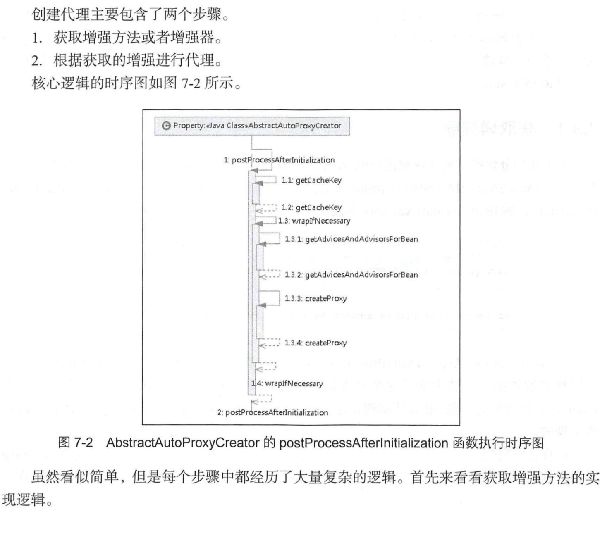

7 AOP

## 7.1 动态AOP使用示例

```

package com.spring.book.study.chapter07;

public class TestBean {

    private String testStr = "testStr";

    public String getTestStr() {
        return testStr;
    }

    public void setTestStr(String testStr) {
        this.testStr = testStr;
    }

    public void test() {
        System.out.println("test");
    }
}


package com.spring.book.study.chapter07;

import org.aspectj.lang.ProceedingJoinPoint;
import org.aspectj.lang.annotation.*;

@Aspect
public class AspectJTest {

    @Pointcut("execution(public * com.spring.book.study.chapter07.*.*(..))")
    public void test() {

    }

    @Before("test()")
    public void beforeTest() {
        System.out.println("beforeTest");
    }

    @After("test()")
    public void afterTest(){
        System.out.println("afterTest");
    }

    @Around("test()")
    public Object aroundTest(ProceedingJoinPoint p) {
        System.out.println("before1");
        Object o = null;
        try {
            o = p.proceed();
        } catch (Throwable e) {
            e.printStackTrace();
        }
        System.out.println("after1");
        return o;
    }

}


<?xml version="1.0" encoding="UTF-8"?>
<beans xmlns="http://www.springframework.org/schema/beans"
       xmlns:xsi="http://www.w3.org/2001/XMLSchema-instance" xmlns:util="http://www.springframework.org/schema/util"
       xmlns:aop="http://www.springframework.org/schema/aop"
       xsi:schemaLocation="http://www.springframework.org/schema/beans
    http://www.springframework.org/schema/beans/spring-beans.xsd http://www.springframework.org/schema/util http://www.springframework.org/schema/util/spring-util.xsd http://www.springframework.org/schema/aop http://www.springframework.org/schema/aop/spring-aop.xsd">

    <aop:aspectj-autoproxy/>

    <bean id="testBean" class="com.spring.book.study.chapter07.TestBean" />
    <bean class="com.spring.book.study.chapter07.AspectJTest"/>
</beans>


package com.spring.book.study.chapter07;

import org.springframework.context.ApplicationContext;
import org.springframework.context.support.ClassPathXmlApplicationContext;

public class Main {

    public static void main(String[] args) {
        testAspectJ();
    }

    private static void testAspectJ() {
        ApplicationContext bf = new ClassPathXmlApplicationContext("apectjTest.xml");
        TestBean testBean = (TestBean) bf.getBean("testBean");
        testBean.test();
    }

}


```

## 7.2 动态AOP自定义标签

```


public class AopNamespaceHandler extends NamespaceHandlerSupport {

	/**
	 * Register the {@link BeanDefinitionParser BeanDefinitionParsers} for the
	 * '{@code config}', '{@code spring-configured}', '{@code aspectj-autoproxy}'
	 * and '{@code scoped-proxy}' tags.
	 */
	@Override
	public void init() {
		// In 2.0 XSD as well as in 2.1 XSD.
		registerBeanDefinitionParser("config", new ConfigBeanDefinitionParser());
		registerBeanDefinitionParser("aspectj-autoproxy", new AspectJAutoProxyBeanDefinitionParser());
		registerBeanDefinitionDecorator("scoped-proxy", new ScopedProxyBeanDefinitionDecorator());

		// Only in 2.0 XSD: moved to context namespace as of 2.1
		registerBeanDefinitionParser("spring-configured", new SpringConfiguredBeanDefinitionParser());
	}

}

```

### 7.2.1 注册AnnotationAwareAspectJProxyCreator


```
所有解析器都是对BeanDefinitionParser接口的统一实现：
AspectJAutoProxyBeanDefinitionParser

public BeanDefinition parse(Element element, ParserContext parserContext) {
    // 注册AnnotationAwareAspectJAutoProxyCreator
    AopNamespaceUtils.registerAspectJAnnotationAutoProxyCreatorIfNecessary(parserContext, element);
    // 对于注解中紫烈的处理
    extendBeanDefinition(element, parserContext);
    return null;
}


public static void registerAspectJAnnotationAutoProxyCreatorIfNecessary(
        ParserContext parserContext, Element sourceElement) {
    
    // 注册或升级AutoProxyCreator定义beanName为org.springframework.aop.config.internalAutoProxyCreator的BeanDefinition
    BeanDefinition beanDefinition = AopConfigUtils.registerAspectJAnnotationAutoProxyCreatorIfNecessary(
            parserContext.getRegistry(), parserContext.extractSource(sourceElement));
    // 对于proxy-target-class以及expose-proxy属性的处理
    useClassProxyingIfNecessary(parserContext.getRegistry(), sourceElement);
    // 注册主键并通知，便于监听器做进一步处理
    // 其中beanDefinition的className为AnnotationAwareAspectJAutoProxyCreator
    registerComponentIfNecessary(beanDefinition, parserContext);
}


```

> registerAspectJAnnotationAutoProxyCreatorIfNecessary主要完成了3件事

**1.注册或者升级AnnotationAwareAspectJAutoProxyCreator**

```
public static BeanDefinition registerAspectJAnnotationAutoProxyCreatorIfNecessary(BeanDefinitionRegistry registry, Object source) {
    return registerOrEscalateApcAsRequired(AnnotationAwareAspectJAutoProxyCreator.class, registry, source);
}


private static BeanDefinition registerOrEscalateApcAsRequired(Class<?> cls, BeanDefinitionRegistry registry, Object source) {
    Assert.notNull(registry, "BeanDefinitionRegistry must not be null");
    // 如果已经存在了自动代理创建器且存在的自动代理创建器与现在的不一致，那么需要根据优先级来判断到底需要使用哪
    if (registry.containsBeanDefinition(AUTO_PROXY_CREATOR_BEAN_NAME)) {
        BeanDefinition apcDefinition = registry.getBeanDefinition(AUTO_PROXY_CREATOR_BEAN_NAME);
        if (!cls.getName().equals(apcDefinition.getBeanClassName())) {
            int currentPriority = findPriorityForClass(apcDefinition.getBeanClassName());
            int requiredPriority = findPriorityForClass(cls);
            if (currentPriority < requiredPriority) {
                // 改变bean最重要的就是改变bean所对应的className属性
                apcDefinition.setBeanClassName(cls.getName());
            }
        }
        // 如果已经存在自动代理创建器并且与将要创建的一致，那么无须再次创建
        return null;
    }
    RootBeanDefinition beanDefinition = new RootBeanDefinition(cls);
    beanDefinition.setSource(source);
    beanDefinition.getPropertyValues().add("order", Ordered.HIGHEST_PRECEDENCE);
    beanDefinition.setRole(BeanDefinition.ROLE_INFRASTRUCTURE);
    registry.registerBeanDefinition(AUTO_PROXY_CREATOR_BEAN_NAME, beanDefinition);
    return beanDefinition;
}

```

**2.处理proxy-target-class以及expose-proxy属性**

```
useClassProxyingIfNecessary实现了proxy-target-class属性以及expose-proxy属性的处理


private static void useClassProxyingIfNecessary(BeanDefinitionRegistry registry, Element sourceElement) {
    if (sourceElement != null) {
        // 对于proxy-target-class属性处理
        boolean proxyTargetClass = Boolean.valueOf(sourceElement.getAttribute(PROXY_TARGET_CLASS_ATTRIBUTE));
        if (proxyTargetClass) {
            AopConfigUtils.forceAutoProxyCreatorToUseClassProxying(registry);
        }
        // 对于expose-proxy属性处理
        boolean exposeProxy = Boolean.valueOf(sourceElement.getAttribute(EXPOSE_PROXY_ATTRIBUTE));
        if (exposeProxy) {
            AopConfigUtils.forceAutoProxyCreatorToExposeProxy(registry);
        }
    }
}


// 强制使用的过程其实也是一个属性设置的过程
public static void forceAutoProxyCreatorToUseClassProxying(BeanDefinitionRegistry registry) {
    if (registry.containsBeanDefinition(AUTO_PROXY_CREATOR_BEAN_NAME)) {
        BeanDefinition definition = registry.getBeanDefinition(AUTO_PROXY_CREATOR_BEAN_NAME);
        definition.getPropertyValues().add("proxyTargetClass", Boolean.TRUE);
    }
}

static void forceAutoProxyCreatorToExposeProxy(BeanDefinitionRegistry registry) {
    if (registry.containsBeanDefinition(AUTO_PROXY_CREATOR_BEAN_NAME)) {
        BeanDefinition definition = registry.getBeanDefinition(AUTO_PROXY_CREATOR_BEAN_NAME);
        definition.getPropertyValues().add("exposeProxy", Boolean.TRUE);
    }
}

proxy-target-class: Spring AOP部分使用JDK动态代理或者CGLIB来为目标对象创建代理(建议尽量使用JDK的动态代理)。如果被代理的目标对象实现了至少一个接口，
则会使用JDK动态代理。所有该目标类型实现的接口都将被代理。若该目标对象没有实现任何接口，则创建爱你一个CGLIB代理。如果你希望强制使用CGLIB代理，那也可以。
但是会产生两个问题
1.无法通知(advise)Final方法，因为他们不能被覆盖。
2.需要将CGLIB二进制发型包放在classpath下面。

强制使用CGLIB代理需要将<aop.config>的proxy-target-class属性设为true；
<aop:config proxy-target-class="true">...</aop:config>

当需要使用CGLIB代理和@AspectJ自动代理支持，可以按照以下方式设置<aop:aspectj-autoproxy>的proxy-target-class属性：
<aop:aspectj-autoproxy proxy-target-class="true"/>
使用过程中才会发现细节问题差别：
1.JDK动态代理：其代理对象必须是某个接口的实现，它是通过在运行期间创建一个接口的实现类来完成对目标对象的代理。
2.CGLIB代理：实现原理类似与JDK动态代理，智慧树它在运行期间生成的代理对象是针对目标类扩展的紫烈。CGLIB是高效的代码生成包，底层是依靠ASM
  (开源的java字节码编辑类库)操作字节码实现的，性能比JDK强。
3.expose-proxy：有时候目标对象内部的自我调用将无法实施切面中的增强，如下例：

public interface AService{
    public void a();
    
    public void b();
}


@Service
public class AServiceImpl1 implements AService{
    
    @Transactional(propagation=Propagation.REQUIRED)
    public void a(){
        this.b();
    }
    
    @Transactional(propagation=Propagation.REQUIRES_NEW)
    public void b(){
    
    }
}

此处的this指向目标对象，英雌调用this.b()将不会执行b事务切面，即不会执行事务增强，英雌
b方法的事务定义"@Transactional(propagation=Propagation.REQUIRES_NEW)"将不会实施，
解决这个问题：
<aop:aspectj-autoproxy expose-proxy="true"/>

让后将以上代码中的"this.b()"修改为"((AService)AopContxt.currentProxy()).b();"即可

```

## 7.3 创建AOP代理

> 在类的层级中，我们看到AnnotationAwareAspectJAutoProxyCreator实现了BeanPostProcessor接口，
  而实现BeanPostProcessor后，当Spring加载这个Bean时会在实例化前调用其postProcessorAfterInitialization
  方法。
  
```
AbstractAutoProxyCreator.java

public Object postProcessAfterInitialization(Object bean, String beanName) throws BeansException {
    if (bean != null) {
        // 根据给定的bean的class和name构建出一个key，格式：beanClassName_beanName
        Object cacheKey = getCacheKey(bean.getClass(), beanName);
        if (!this.earlyProxyReferences.contains(cacheKey)) {
            // 如果它适合被代理，则需要封装指定bean
            return wrapIfNecessary(bean, beanName, cacheKey);
        }
    }
    return bean;
}


protected Object wrapIfNecessary(Object bean, String beanName, Object cacheKey) {
    // 如果已经处理过
    if (beanName != null && this.targetSourcedBeans.contains(beanName)) {
        return bean;
    }
    
    if (Boolean.FALSE.equals(this.advisedBeans.get(cacheKey))) {
        return bean;
    }
    // 给定的bean类是否代表一个基础设施类，基础设施类不应代理，或者配置了指定bean不需要自动代理
    if (isInfrastructureClass(bean.getClass()) || shouldSkip(bean.getClass(), beanName)) {
        this.advisedBeans.put(cacheKey, Boolean.FALSE);
        return bean;
    }

    // Create proxy if we have advice.
    Object[] specificInterceptors = getAdvicesAndAdvisorsForBean(bean.getClass(), beanName, null);
    // 如果过获取到了增强需要针对增强创建代理
    if (specificInterceptors != DO_NOT_PROXY) {
        this.advisedBeans.put(cacheKey, Boolean.TRUE);
        // 创建代理
        Object proxy = createProxy(bean.getClass(), beanName, specificInterceptors, new SingletonTargetSource(bean));
        this.proxyTypes.put(cacheKey, proxy.getClass());
        return proxy;
    }

    this.advisedBeans.put(cacheKey, Boolean.FALSE);
    return bean;
}

真正创建代理的代码是从getAdcicesAndAdvisorsForBean开始。
创建代理主要包含了两个步骤：
1.获取增强方法或者增强器。
2.根据获取的增强进行代理


AbstractAdvisorAutoProxyCreator.java

protected Object[] getAdvicesAndAdvisorsForBean(Class<?> beanClass, String beanName, TargetSource targetSource) {
    List<Advisor> advisors = findEligibleAdvisors(beanClass, beanName);
    if (advisors.isEmpty()) {
        return DO_NOT_PROXY;
    }
    return advisors.toArray();
}

protected List<Advisor> findEligibleAdvisors(Class<?> beanClass, String beanName) {
    List<Advisor> candidateAdvisors = findCandidateAdvisors();
    List<Advisor> eligibleAdvisors = findAdvisorsThatCanApply(candidateAdvisors, beanClass, beanName);
    extendAdvisors(eligibleAdvisors);
    if (!eligibleAdvisors.isEmpty()) {
        eligibleAdvisors = sortAdvisors(eligibleAdvisors);
    }
    return eligibleAdvisors;
}

对于指定bean的增强方法的获取一定是包含两个步骤的，获取所有的增强以及寻找所有增强中适用于
bean的增强并应用，那么findCandidateAdvisors与findAdvisorsThatCanApply便是做了这两件事情。
当然，如果无法找到对应的增强器便返回DO_NOT_PROXY=null.


```




### 7.3.1 获取增强器

> 对于findCandidateAdvisors的实现其实是由AnnotationAwareAspectJAutoProxyCreator类完成的。

```

AnnotationAwareAspectJAutoProxyCreator.java

protected List<Advisor> findCandidateAdvisors() {
    // Add all the Spring advisors found according to superclass rules.
    List<Advisor> advisors = super.findCandidateAdvisors();
    // Build Advisors for all AspectJ aspects in the bean factory.
    advisors.addAll(this.aspectJAdvisorsBuilder.buildAspectJAdvisors());
    return advisors;
}

AnnotationAwareAspectJAutoProxyCreator间接继承了AbstractAdvisorAutoProxyCreator

1.获取所有beanName，这一步骤中所有在beanFactory中注册的bean都会被提取出来。
2.遍历所有beanName，并找出声明AspectJ注解的类，进行进一步的处理。
3.对标记为AspectJ注解的类进行增强器的提取
4.将提取结果加入缓存


public List<Advisor> buildAspectJAdvisors() {
    List<String> aspectNames = null;

    synchronized (this) {
        aspectNames = this.aspectBeanNames;
        if (aspectNames == null) {
            List<Advisor> advisors = new LinkedList<Advisor>();
            aspectNames = new LinkedList<String>();
            // 获取所有的beanName
            String[] beanNames =
                    BeanFactoryUtils.beanNamesForTypeIncludingAncestors(this.beanFactory, Object.class, true, false);
            // 循环所有的beanName找出对应的增强方法
            for (String beanName : beanNames) {
                // 不合法的bean则略过，由子类定义规则，默认返回true
                if (!isEligibleBean(beanName)) {
                    continue;
                }
                // We must be careful not to instantiate beans eagerly as in this
                // case they would be cached by the Spring container but would not
                // have been weaved
                // 获取对应的bean类型
                Class<?> beanType = this.beanFactory.getType(beanName);
                if (beanType == null) {
                    continue;
                }
                // 如果存在Aspect注解
                if (this.advisorFactory.isAspect(beanType)) {
                    aspectNames.add(beanName);
                    AspectMetadata amd = new AspectMetadata(beanType, beanName);
                    if (amd.getAjType().getPerClause().getKind() == PerClauseKind.SINGLETON) {
                        MetadataAwareAspectInstanceFactory factory =
                                new BeanFactoryAspectInstanceFactory(this.beanFactory, beanName);
                        // 解析标记AspectJ注解中的增强方法
                        List<Advisor> classAdvisors = this.advisorFactory.getAdvisors(factory);
                        if (this.beanFactory.isSingleton(beanName)) {
                            this.advisorsCache.put(beanName, classAdvisors);
                        }
                        else {
                            this.aspectFactoryCache.put(beanName, factory);
                        }
                        advisors.addAll(classAdvisors);
                    }
                    else {
                        // Per target or per this.
                        if (this.beanFactory.isSingleton(beanName)) {
                            throw new IllegalArgumentException("Bean with name '" + beanName +
                                    "' is a singleton, but aspect instantiation model is not singleton");
                        }
                        MetadataAwareAspectInstanceFactory factory =
                                new PrototypeAspectInstanceFactory(this.beanFactory, beanName);
                        this.aspectFactoryCache.put(beanName, factory);
                        advisors.addAll(this.advisorFactory.getAdvisors(factory));
                    }
                }
            }
            this.aspectBeanNames = aspectNames;
            return advisors;
        }
    }

    if (aspectNames.isEmpty()) {
        return Collections.emptyList();
    }
    // 记录在缓存中
    List<Advisor> advisors = new LinkedList<Advisor>();
    for (String aspectName : aspectNames) {
        List<Advisor> cachedAdvisors = this.advisorsCache.get(aspectName);
        if (cachedAdvisors != null) {
            advisors.addAll(cachedAdvisors);
        }
        else {
            MetadataAwareAspectInstanceFactory factory = this.aspectFactoryCache.get(aspectName);
            advisors.addAll(this.advisorFactory.getAdvisors(factory));
        }
    }
    return advisors;
}

```


## 7.4 静态AOP使用示例

## 7.5 创建AOP静态代理


