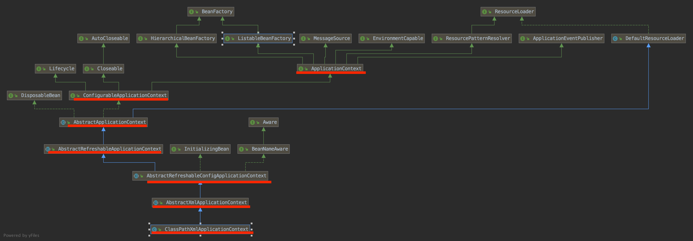
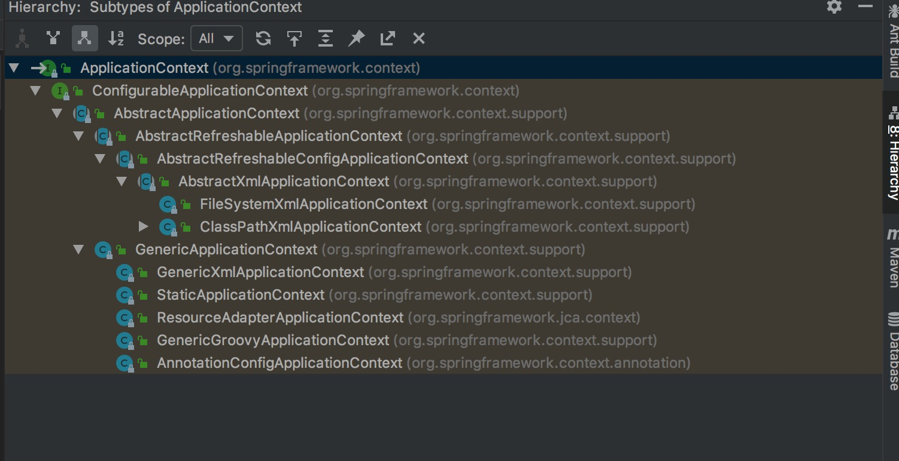

ApplicationContext(应用上下文)

## 1 简介

### 1.1 认识及简单使用方式

> ClassPathXmlApplicationContext类名分割：ClassPath+Xml+ApplicationContext
  classPath:一般指src/main/resources(描述不太准确)下的路径,xml:xml类型的配置文件
  可以理解:src/main/resources下的xml配置文件的应用上下文
  

```
package com.spring.source.code.study.ApplicationContext;

import org.junit.Test;
import org.springframework.context.support.ClassPathXmlApplicationContext;

public class ClassPathXmlApplicationContextTest {

    @Test
    public void testClassPathXmlApplicationContextTest(){
        // 传入xml配置文件的位置，且可以传多个xml文件
        ClassPathXmlApplicationContext app = new ClassPathXmlApplicationContext("01.ApplicationContext/01_ApplicationContext.xml");
    }
}

```

### 1.2 类关系



> 如结构关系比较复杂，但本次我们只关注红线的7个ApplicationContext，如下图中不止7个



```
ApplicationContext (org.springframework.context)
    ConfigurableApplicationContext (org.springframework.context)                                            # 可以配置的应用上下文
        AbstractApplicationContext (org.springframework.context.support)                                    # 抽象应用上下文
            AbstractRefreshableApplicationContext (org.springframework.context.support)                     # 抽象可重刷新应用上下文
                AbstractRefreshableConfigApplicationContext (org.springframework.context.support)           # 抽象可重刷新配置应用上下文
                    AbstractXmlApplicationContext (org.springframework.context.support)                     # 抽象的xml应用上下文
                        FileSystemXmlApplicationContext (org.springframework.context.support)
                        ClassPathXmlApplicationContext (org.springframework.context.support)                # 以上抽象类和接口的具体实现ClassPath
            GenericApplicationContext (org.springframework.context.support)
                GenericXmlApplicationContext (org.springframework.context.support)
                StaticApplicationContext (org.springframework.context.support)
                ResourceAdapterApplicationContext (org.springframework.jca.context)
                GenericGroovyApplicationContext (org.springframework.context.support)
                AnnotationConfigApplicationContext (org.springframework.context.annotation)

```

> 备注: 这些类的命名基本都是ApplicationContext相关结尾，Spring的命名基本可以见名知意
  able结尾的单词:可以的，可行的，具备某种能力的。比如Configurable:可配置的Refreshable：可以重刷新的
  re开头的单词: 重复，重新等等
  
  
## 2 从ClassPathXmlApplicationContext构造函数开始跟踪

```
ClassPathXmlApplicationContext app = new ClassPathXmlApplicationContext("01.ApplicationContext/01_ApplicationContext.xml");

```
### 2.1 ClassPathXmlApplicationContext中setConfigLocations方法

```

1. ClassPathXmlApplicationContext 构造方法，classpath下参数配置文件的位置
public ClassPathXmlApplicationContext(String configLocation) throws BeansException {
    // 参数1:配置文件数组，参数2:是否能重刷新，参数3：父应用上下文
    // 暂时不关注参数3
    this(new String[] {configLocation}, true, null);
}

public ClassPathXmlApplicationContext(String[] configLocations, boolean refresh, ApplicationContext parent)
			throws BeansException {
    
    super(parent);
    // 设置配置，这个方法进入到了超类(父类的父类)AbstractRefreshableConfigApplicationContext(可刷新配置的应用上下文)
    // 即setConfigLocations是AbstractRefreshableConfigApplicationContext的方法
    setConfigLocations(configLocations);
    if (refresh) {
        refresh();
    }
}

2. 进入AbstractRefreshableConfigApplicationContext.setConfigLocations(configLocations)
// 这个方法只是为configLocations属性赋值，即将配置文件已数组的形式记录下来
// configLocations 是这个类的属性，
// 这个类的根据名字可以看出主要完成了解析配置文件位置，和重刷新功能(目前笔者还不清楚重刷新啥)
public void setConfigLocations(String... locations) {
    if (locations != null) {
        Assert.noNullElements(locations, "Config locations must not be null");
        this.configLocations = new String[locations.length];
        for (int i = 0; i < locations.length; i++) {
            // 这个方法为了参数中${XX}占位符，这个占位符的值可以在XXX.properties文件中定义
            // 这个方法背后是Environment(环境配置)一系列类干的活，另做专题讨论，这里不展开讨论，
            // 可以断点运行demo查看效果
            this.configLocations[i] = resolvePath(locations[i]).trim();
        }
    }
    else {
        this.configLocations = null;
    }
}

protected String resolvePath(String path) {
    return getEnvironment().resolveRequiredPlaceholders(path);
}


```

**测试resolvePath的demo**

```
在/src/main/resources/01.ApplicationContext下创建配置文件

1.parentApplicationContext.xml

<?xml version="1.0" encoding="UTF-8"?>
<beans xmlns="http://www.springframework.org/schema/beans"
       xmlns:xsi="http://www.w3.org/2001/XMLSchema-instance"
       xsi:schemaLocation="
    http://www.springframework.org/schema/beans
    http://www.springframework.org/schema/beans/spring-beans.xsd">


</beans>

2.childrenApplicationContext.xml

<?xml version="1.0" encoding="UTF-8"?>
<beans xmlns="http://www.springframework.org/schema/beans"
       xmlns:xsi="http://www.w3.org/2001/XMLSchema-instance"
       xsi:schemaLocation="
    http://www.springframework.org/schema/beans
    http://www.springframework.org/schema/beans/spring-beans.xsd">


</beans>

3.resourceProperty.properties，内容如下

context=01_ApplicationContext


测试类
 @Test
public void testChildrenContextWithPlaceHolder() {

    // 创建并设置父容器
    ClassPathXmlApplicationContext parentApp = createParentContext();
    // 子容器，在第二次子容器加载时，运行到 resolvePath方法的时候，可以看一看 占位符的字符换成了对应的值¬
    // this.configLocations[i] = resolvePath(locations[i]).trim();
    ClassPathXmlApplicationContext childrenApp = new ClassPathXmlApplicationContext(new String[]{"01.ApplicationContext/${children}.xml", "01.ApplicationContext/${context}.xml"}, true, parentApp);
}

private ClassPathXmlApplicationContext createParentContext() {
    /* 父容器 */
    ClassPathXmlApplicationContext parentApp = new ClassPathXmlApplicationContext("01.ApplicationContext/parentApplicationContext.xml");

    // 环境配置相关：自定义些变量在父容器中
    ConfigurableEnvironment environment = parentApp.getEnvironment();
    MutablePropertySources propertySources = environment.getPropertySources();

    Map<String, Object> map = new HashMap<String, Object>();
    map.put("children", "childrenApplicationContext");
    MapPropertySource mapProperty = new MapPropertySource("mapProperty", map);
    propertySources.addLast(mapProperty);

    ResourcePropertySource resourcePropertySource = null;
    try {
        resourcePropertySource = new ResourcePropertySource("01.ApplicationContext/resourceProperty.properties");
    } catch (IOException e) {
        e.printStackTrace();
    }
    propertySources.addLast(resourcePropertySource);
    return parentApp;
}


```

> 总结:
  1.ClassPathXmlApplicationContext中setConfigLocations方法其实是超类中的AbstractRefreshableConfigApplicationContext.setConfigLocations(configLocations)
  2.setConfigLocations方法主要是完成配置文件路径的解析、赋值
  
  
### 2.2 ClassPathXmlApplicationContext中refresh()方法

```

这个方法干的事情比较多
这个方法是超类AbstractApplicationContext.java中的方法

public void refresh() throws BeansException, IllegalStateException {
    synchronized (this.startupShutdownMonitor) {
        // Prepare this context for refreshing.
        // 为刷新上下文做准备的方法，其实就是完成自定义属性资源的配置、加载
        prepareRefresh();

        // Tell the subclass to refresh the internal bean factory.
        // 获得刷新的beanFactory
        ConfigurableListableBeanFactory beanFactory = obtainFreshBeanFactory();

        // Prepare the bean factory for use in this context.
        prepareBeanFactory(beanFactory);

        try {
            // Allows post-processing of the bean factory in context subclasses.
            postProcessBeanFactory(beanFactory);

            // Invoke factory processors registered as beans in the context.
            invokeBeanFactoryPostProcessors(beanFactory);

            // Register bean processors that intercept bean creation.
            registerBeanPostProcessors(beanFactory);

            // Initialize message source for this context.
            initMessageSource();

            // Initialize event multicaster for this context.
            initApplicationEventMulticaster();

            // Initialize other special beans in specific context subclasses.
            onRefresh();

            // Check for listener beans and register them.
            registerListeners();

            // Instantiate all remaining (non-lazy-init) singletons.
            finishBeanFactoryInitialization(beanFactory);

            // Last step: publish corresponding event.
            finishRefresh();
        }

        catch (BeansException ex) {
            logger.warn("Exception encountered during context initialization - cancelling refresh attempt", ex);

            // Destroy already created singletons to avoid dangling resources.
            destroyBeans();

            // Reset 'active' flag.
            cancelRefresh(ex);

            // Propagate exception to caller.
            throw ex;
        }
    }
}


```

#### 2.1.1 AbstractApplicationContext.prepareRefresh()方法


```
// 重刷新前的准备方法
protected void prepareRefresh() {
    this.startupDate = System.currentTimeMillis();
    this.active.set(true);

    if (logger.isInfoEnabled()) {
        logger.info("Refreshing " + this);
    }
    // Initialize any placeholder property sources in the context environment
    // 初始化占位属性资源在上下文环境中，这是个空方法，
    // 可以继承ClassPathXmlApplicationContext,重写initPropertySources，进行自定义属性资源
    // 测试demo如下
    initPropertySources();

    // Validate that all properties marked as required are resolvable
    // see ConfigurablePropertyResolver#setRequiredProperties
    // 对属性资源进行校验
    getEnvironment().validateRequiredProperties();
}


protected void initPropertySources() {
    // For subclasses: do nothing by default.
}


```

**initPropertySources测试demo**

```

package com.spring.source.code.study.ApplicationContext;

import org.springframework.beans.BeansException;
import org.springframework.beans.factory.support.DefaultListableBeanFactory;
import org.springframework.context.support.ClassPathXmlApplicationContext;
import org.springframework.core.env.ConfigurableEnvironment;
import org.springframework.core.env.MapPropertySource;
import org.springframework.core.env.MutablePropertySources;
import org.springframework.core.env.PropertySource;
import org.springframework.core.io.support.ResourcePropertySource;

import java.io.IOException;
import java.util.HashMap;
import java.util.Map;
import java.util.concurrent.Executors;

public class MyClassPathXmlApplicationContext extends ClassPathXmlApplicationContext {

    public MyClassPathXmlApplicationContext(String... configLocations) throws BeansException {
        super(configLocations);
    }

    @Override
    protected void initPropertySources() {
        ConfigurableEnvironment environment = getEnvironment();
        MutablePropertySources propertySources = environment.getPropertySources();
        ResourcePropertySource resourcePropertySource = null;
        try {
            resourcePropertySource = new ResourcePropertySource("01.ApplicationContext/resourceProperty.properties");
        } catch (IOException e) {
            e.printStackTrace();
        }
        propertySources.addLast(resourcePropertySource);

        System.out.println(environment.getRequiredProperty("context"));

    }

    @Override
    protected void customizeBeanFactory(DefaultListableBeanFactory beanFactory) {
        super.setAllowBeanDefinitionOverriding(false);
        super.setAllowCircularReferences(false);
        super.customizeBeanFactory(beanFactory);
    }
}


测试案例
@Test
public void testMyClassPathXmlApplicationContextTestWithCustomPropertySource() {
    MyClassPathXmlApplicationContext myApp = new MyClassPathXmlApplicationContext("01.ApplicationContext/parentApplicationContext.xml");
}

```

> 总结：
  1.refresh() 和 prepareRefresh() 两个方法都是AbstractApplicationContext.java的方法
  2.prepareRefresh()是刷新前完成自定义属性资源加载用的方法，需要用户自己重写initPropertySources() 或则getEnvironment()后编码设置
      

#### 2.1.2 AbstractApplicationContext.obtainFreshBeanFactory()方法


```

//
protected ConfigurableListableBeanFactory obtainFreshBeanFactory() {
    // 在该类中这个方法是抽象的
    // 在具体子类GenericApplicationContext和抽象子类AbstractRefreshableApplicationContext都有实现
    // 这里分析AbstractRefreshableApplicationContext中的方法，且也是笔者测试代码跟踪的方法
    // GenericApplicationContext子类中的该方法实现较简单，读者可自行观看
    refreshBeanFactory();
    // 获得beanFactory 这个也是在子类中实现的，其实这个获得也是上个方法创建完后的beanFactory，这里只是get一下
    ConfigurableListableBeanFactory beanFactory = getBeanFactory();
    if (logger.isDebugEnabled()) {
        logger.debug("Bean factory for " + getDisplayName() + ": " + beanFactory);
    }
    return beanFactory;
}


protected abstract void refreshBeanFactory() throws BeansException, IllegalStateException;


//在AbstractRefreshableApplicationContext中实现
protected final void refreshBeanFactory() throws BeansException {
    if (hasBeanFactory()) {
        destroyBeans();
        closeBeanFactory();
    }
    try {
        DefaultListableBeanFactory beanFactory = createBeanFactory();
        beanFactory.setSerializationId(getId());
        customizeBeanFactory(beanFactory);
        loadBeanDefinitions(beanFactory);
        synchronized (this.beanFactoryMonitor) {
            this.beanFactory = beanFactory;
        }
    }
    catch (IOException ex) {
        throw new ApplicationContextException("I/O error parsing bean definition source for " + getDisplayName(), ex);
    }
}


public abstract ConfigurableListableBeanFactory getBeanFactory() throws IllegalStateException;

//在AbstractRefreshableApplicationContext中实现
public final ConfigurableListableBeanFactory getBeanFactory() {
    synchronized (this.beanFactoryMonitor) {
        if (this.beanFactory == null) {
            throw new IllegalStateException("BeanFactory not initialized or already closed - " +
                    "call 'refresh' before accessing beans via the ApplicationContext");
        }
        return this.beanFactory;
    }
}


```

##### 2.1.2.1 AbstractRefreshableApplicationContext.refreshBeanFactory()方法
AbstractRefreshableApplicationContext
```

// 
protected final void refreshBeanFactory() throws BeansException {
    // 当前的context(应用上线文)是否已经创建过beanFactory
    // 笔者为想到怎么测试这段代码，
    if (hasBeanFactory()) {
        // 已经存在的，则进行销毁，关闭
        destroyBeans();
        closeBeanFactory();
    }
    try {
        // 创建beanFactory工厂实例,beanFactory是用于生产bean的
        // DefaultListableBeanFactory是beanFactory的一个默认实现
        // 可以打开看看，也是直接new的，简单粗暴
        DefaultListableBeanFactory beanFactory = createBeanFactory();
        // beanFactory的一个唯一标识，它等于context的唯一标识
        // getId()是context的id，可以看demo3
        beanFactory.setSerializationId(getId());
        
        // 对beanFactory属性进行自定义，该方法可以重写，默认比较简单
        customizeBeanFactory(beanFactory);
        // 将配置文件中的标签加载到beanFactory中，
        // 这个方法完成配置文件的解析，生成bean，注入到beanFactory中(所谓注入就是有个集合来维护)
        // 是个核心方法，本章节 不会深入这个方法
        loadBeanDefinitions(beanFactory);
        // 将创建加载好bean的beanFactory赋值给当前context(应用上下文的属性，应用上下文维护一个beanFactory)
        synchronized (this.beanFactoryMonitor) {
            this.beanFactory = beanFactory;
        }
    }
    catch (IOException ex) {
        throw new ApplicationContextException("I/O error parsing bean definition source for " + getDisplayName(), ex);
    }
}


protected final boolean hasBeanFactory() {
    synchronized (this.beanFactoryMonitor) {
        return (this.beanFactory != null);
    }
}


protected DefaultListableBeanFactory createBeanFactory() {
    // DefaultListableBeanFactory是默认实现的beanFactory
    // getInternalParentBeanFactory()获得内部父beanFactory，其实是父context
    // 可在demo3中查看
    return new DefaultListableBeanFactory(getInternalParentBeanFactory());
}

// 这些都是beanFactory生成bean时的内容，这里不详细展开
protected void customizeBeanFactory(DefaultListableBeanFactory beanFactory) {
    if (this.allowBeanDefinitionOverriding != null) {
        // 允许bean覆盖
        beanFactory.setAllowBeanDefinitionOverriding(this.allowBeanDefinitionOverriding);
    }
    if (this.allowCircularReferences != null) {
        // 允许bean循环引用
        beanFactory.setAllowCircularReferences(this.allowCircularReferences);
    }
}

// 加载bean是个抽像方法，实现在AbstractXmlApplicationContext应用中进行实现的，
protected abstract void loadBeanDefinitions(DefaultListableBeanFactory beanFactory)
			throws BeansException, IOException;


```

> 总结: 个人理解重刷新的的方法就是将已经存在的beanFactory进行销毁，然后重新创建

**查看context和beanFactory的id的测试demo3**

```
// 输出的结果是context和beanFactory测id是同一个，格式如：org.springframework.context.support.ClassPathXmlApplicationContext@567d299b
// 但是父容器和子容器是两个不同的值，也就是两个不同的应用上下文和两个不同的beanFactory，一个context维护一个beanFactory，一对一关系
@Test
public void testChildrenContextWithPlaceHolder() {

    // 创建并设置父容器
    ClassPathXmlApplicationContext parentApp = createParentContext();
    // org.springframework.context.support.ClassPathXmlApplicationContext@7113b13f
    System.out.println(parentApp);
    // org.springframework.context.support.ClassPathXmlApplicationContext@7113b13f
    System.out.println(parentApp.getId());
    // org.springframework.context.support.ClassPathXmlApplicationContext@7113b13f
    System.out.println(((DefaultListableBeanFactory) parentApp.getBeanFactory()).getSerializationId());
    // 子容器
    ClassPathXmlApplicationContext childrenApp = new ClassPathXmlApplicationContext(new String[]{"01.ApplicationContext/${children}.xml", "01.ApplicationContext/${context}.xml"}, true, parentApp);
    // org.springframework.context.support.ClassPathXmlApplicationContext@5d7148e2
    System.out.println(childrenApp);
    // org.springframework.context.support.ClassPathXmlApplicationContext@5d7148e2
    System.out.println(childrenApp.getId());
    
    DefaultListableBeanFactory childrenAppBeanFactory = (DefaultListableBeanFactory) childrenApp.getBeanFactory();
    // org.springframework.context.support.ClassPathXmlApplicationContext@5d7148e2
    System.out.println(childrenAppBeanFactory.getSerializationId());
    // org.springframework.context.support.ClassPathXmlApplicationContext@7113b13f
    // 这个是父应用上下文
    System.out.println(childrenApp.getParentBeanFactory());

}


```

###### 2.1.2.1.1 AbstractXmlpplicationContext.loadBeanDefinitions(DefaultListableBeanFactory beanFactory)方法

```

protected void loadBeanDefinitions(DefaultListableBeanFactory beanFactory) throws BeansException, IOException {
    // Create a new XmlBeanDefinitionReader for the given BeanFactory.
    // 创建bean配置文件阅读器
    XmlBeanDefinitionReader beanDefinitionReader = new XmlBeanDefinitionReader(beanFactory);

    // Configure the bean definition reader with this context's
    // resource loading environment.
    // 设置一些必要的属性
    // 系统环境配置
    beanDefinitionReader.setEnvironment(this.getEnvironment());
    // 资源加载器
    beanDefinitionReader.setResourceLoader(this);
    // 实体解析器
    beanDefinitionReader.setEntityResolver(new ResourceEntityResolver(this));

    // Allow a subclass to provide custom initialization of the reader,
    // then proceed with actually loading the bean definitions.
    initBeanDefinitionReader(beanDefinitionReader);
    loadBeanDefinitions(beanDefinitionReader);
}


protected void initBeanDefinitionReader(XmlBeanDefinitionReader reader) {
    reader.setValidating(this.validating);
}


protected void loadBeanDefinitions(XmlBeanDefinitionReader reader) throws BeansException, IOException {
    Resource[] configResources = getConfigResources();
    if (configResources != null) {
        // 这里是继续深入的点，TODO，先暂停
        reader.loadBeanDefinitions(configResources);
    }
    String[] configLocations = getConfigLocations();
    if (configLocations != null) {
        reader.loadBeanDefinitions(configLocations);
    }
}


```

##### 2.1.2.2 AbstractRefreshableApplicationContext.getBeanFactory()方法


```
// 没啥可说的 主要是上述的刷新创建
public final ConfigurableListableBeanFactory getBeanFactory() {
    // 加了同步的获得
    synchronized (this.beanFactoryMonitor) {
        if (this.beanFactory == null) {
            throw new IllegalStateException("BeanFactory not initialized or already closed - " +
                    "call 'refresh' before accessing beans via the ApplicationContext");
        }
        return this.beanFactory;
    }
}

```


#### 2.1.3 AbstractApplicationContext.prepareBeanFactory(ConfigurableListableBeanFactory beanFactory)方法

> 为beanFactory做一些必要的准备，都是些设置工作，后续分每个专题一一分析，这里到此为止

```

protected void prepareBeanFactory(ConfigurableListableBeanFactory beanFactory) {
    // Tell the internal bean factory to use the context's class loader etc.
    // 设置加载器等等
    beanFactory.setBeanClassLoader(getClassLoader());
    // Spring EL表达式的标准解析器
    beanFactory.setBeanExpressionResolver(new StandardBeanExpressionResolver(beanFactory.getBeanClassLoader()));
    // 属性编辑注册器
    beanFactory.addPropertyEditorRegistrar(new ResourceEditorRegistrar(this, getEnvironment()));

    // Configure the bean factory with context callbacks.
    // post处理器
    beanFactory.addBeanPostProcessor(new ApplicationContextAwareProcessor(this));
    beanFactory.ignoreDependencyInterface(ResourceLoaderAware.class);
    beanFactory.ignoreDependencyInterface(ApplicationEventPublisherAware.class);
    beanFactory.ignoreDependencyInterface(MessageSourceAware.class);
    beanFactory.ignoreDependencyInterface(ApplicationContextAware.class);
    beanFactory.ignoreDependencyInterface(EnvironmentAware.class);

    // BeanFactory interface not registered as resolvable type in a plain factory.
    // MessageSource registered (and found for autowiring) as a bean.
    beanFactory.registerResolvableDependency(BeanFactory.class, beanFactory);
    beanFactory.registerResolvableDependency(ResourceLoader.class, this);
    beanFactory.registerResolvableDependency(ApplicationEventPublisher.class, this);
    beanFactory.registerResolvableDependency(ApplicationContext.class, this);

    // Detect a LoadTimeWeaver and prepare for weaving, if found.
    if (beanFactory.containsBean(LOAD_TIME_WEAVER_BEAN_NAME)) {
        beanFactory.addBeanPostProcessor(new LoadTimeWeaverAwareProcessor(beanFactory));
        // Set a temporary ClassLoader for type matching.
        beanFactory.setTempClassLoader(new ContextTypeMatchClassLoader(beanFactory.getBeanClassLoader()));
    }

    // Register default environment beans.
    if (!beanFactory.containsLocalBean(ENVIRONMENT_BEAN_NAME)) {
        beanFactory.registerSingleton(ENVIRONMENT_BEAN_NAME, getEnvironment());
    }
    if (!beanFactory.containsLocalBean(SYSTEM_PROPERTIES_BEAN_NAME)) {
        beanFactory.registerSingleton(SYSTEM_PROPERTIES_BEAN_NAME, getEnvironment().getSystemProperties());
    }
    if (!beanFactory.containsLocalBean(SYSTEM_ENVIRONMENT_BEAN_NAME)) {
        beanFactory.registerSingleton(SYSTEM_ENVIRONMENT_BEAN_NAME, getEnvironment().getSystemEnvironment());
    }
}


```

#### 2.1.4 AbstractApplicationContext.postProcessBeanFactory(ConfigurableListableBeanFactory beanFactory)方法

> 对beanFactory添加自定义的processor，
  在prepareBeanFactory(ConfigurableListableBeanFactory beanFactory)方法中就有注册processor,
  beanFactory.addBeanPostProcessor(new ApplicationContextAwareProcessor(this));
  这个方法需要自己重写，添加自定义的processor

```
/**
 * Modify the application context's internal bean factory after its standard
 * 在标准初始化后，修改应用上下文的内部beanFactory
 * initialization. All bean definitions will have been loaded, but no beans
 * 所有beanDefinition(这个是配置的标签解析后的bean定义信息都这这个对象中)已经被加载
 * will have been instantiated yet. This allows for registering special
 * 没有bean可以被初始化了。该方法允许注册特殊的bean处理器等在某些应用上下文的实现中
 * BeanPostProcessors etc in certain ApplicationContext implementations.
 * @param beanFactory the bean factory used by the application context
 */
protected void postProcessBeanFactory(ConfigurableListableBeanFactory beanFactory) {
}
```

#### 2.1.5 AbstractApplicationContext.invokeBeanFactoryPostProcessors(ConfigurableListableBeanFactory beanFactory)方法


> 对注册的BeanFactoryPostProcessor进行调用，对beanFactory进行处理，这个和上一个BeanPostProcessor不是同一个东东
  BeanFactoryPostProcessor看名称是作用于beanFactory，
  BeanPostProcessor看名称是作用于bean的，
  且该方法在postProcessBeanFactory在之后，这也说明了beanFactory在bean之前(先有工厂后生产bean)，
  工行先拿到工厂的processor，才能给bean分配processor

```
/**
 * Instantiate and invoke all registered BeanFactoryPostProcessor beans,
 * 按照明确给定的顺序，实例化和调用所有的已注册的BeanFactoryPostProcessor bean
 * respecting explicit order if given.
 * <p>Must be called before singleton instantiation.
 */
protected void invokeBeanFactoryPostProcessors(ConfigurableListableBeanFactory beanFactory) {
    // delegate:代理
    PostProcessorRegistrationDelegate.invokeBeanFactoryPostProcessors(beanFactory, getBeanFactoryPostProcessors());
}


```


#### 2.1.6 AbstractApplicationContext.registerBeanPostProcessors(ConfigurableListableBeanFactory beanFactory)方法

```
/**
 * Instantiate and invoke all registered BeanPostProcessor beans,
 * 按照明确给定的顺序，实例化和调用所有的BeanPostProcessor bean
 * respecting explicit order if given.
 * <p>Must be called before any instantiation of application beans.
 */
protected void registerBeanPostProcessors(ConfigurableListableBeanFactory beanFactory) {
    PostProcessorRegistrationDelegate.registerBeanPostProcessors(beanFactory, this);
}

```


## 3 总结
 
> 1.bean加载、解析、添加processor等操作都在抽象类AbstractApplicationContext中定义或实现
  2.真正的加载解析的方法是在AbstractXmlApplicationContext中实现的

```

ApplicationContext (org.springframework.context)
    ConfigurableApplicationContext (org.springframework.context)                                            # 可以配置的应用上下文
        AbstractApplicationContext (org.springframework.context.support)                                    # 抽象应用上下文
            AbstractRefreshableApplicationContext (org.springframework.context.support)                     # 抽象可重刷新应用上下文
                AbstractRefreshableConfigApplicationContext (org.springframework.context.support)           # 抽象可重刷新配置应用上下文
                    AbstractXmlApplicationContext (org.springframework.context.support)                     # 抽象的xml应用上下文
                        FileSystemXmlApplicationContext (org.springframework.context.support)
                        ClassPathXmlApplicationContext (org.springframework.context.support)                # 以上抽象类和接口的具体实现ClassPath
            GenericApplicationContext (org.springframework.context.support)
                GenericXmlApplicationContext (org.springframework.context.support)
                StaticApplicationContext (org.springframework.context.support)
                ResourceAdapterApplicationContext (org.springframework.jca.context)
                GenericGroovyApplicationContext (org.springframework.context.support)
                AnnotationConfigApplicationContext (org.springframework.context.annotation)
    

```


