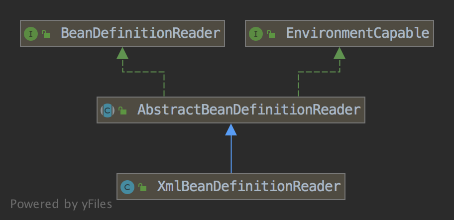
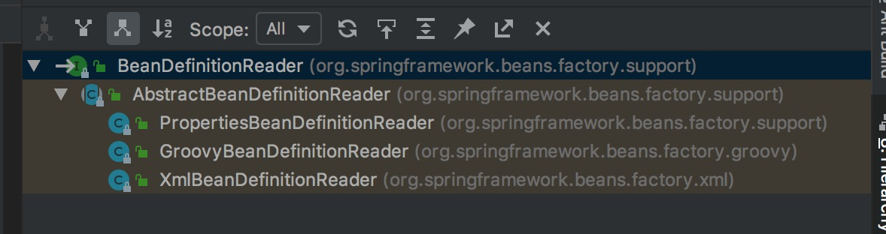

BeanDefinitionReader(bean定义信息阅读器)


## 1 简介

### 1.1 目的

> 该章节内容主要是针对loadBeanDefinitions(DefaultListableBeanFactory beanFactory)方法深入分析做铺垫


```

AbstractXmlApplicationContext.loadBeanDefinitions

/**
 * Loads the bean definitions via an XmlBeanDefinitionReader.
 * @see org.springframework.beans.factory.xml.XmlBeanDefinitionReader
 * @see #initBeanDefinitionReader
 * @see #loadBeanDefinitions
 */
protected void loadBeanDefinitions(DefaultListableBeanFactory beanFactory) throws BeansException, IOException {
    // Create a new XmlBeanDefinitionReader for the given BeanFactory.
    XmlBeanDefinitionReader beanDefinitionReader = new XmlBeanDefinitionReader(beanFactory);

    // Configure the bean definition reader with this context's
    // resource loading environment.
    beanDefinitionReader.setEnvironment(this.getEnvironment());
    beanDefinitionReader.setResourceLoader(this);
    beanDefinitionReader.setEntityResolver(new ResourceEntityResolver(this));

    // Allow a subclass to provide custom initialization of the reader,
    // then proceed with actually loading the bean definitions.
    initBeanDefinitionReader(beanDefinitionReader);
    loadBeanDefinitions(beanDefinitionReader);
}


```

### 1.2 介绍

> 1.BeanDefinition:bean+definition(定义)，BeanDefinition这个类是用来描述一个bean；
    比如下面Student类，配置到xml文件中后，配置文件被加载，然后解析标签，将标签上的描述
    Tom这个学生的实例bean的信息封装到BeanDefinition这个类的一个实例对象中，BeanDefinition
    包含了Student的字段名和字段的值，Student的类信息等等。也就是一个bean的定义信息。
  2.理解了BeanDefinition，就很容易理解了BeanDefinitionReader(阅读器)，就是将标签上的信息
    读到一个BeanDefinition，BeanDefinitionReader是过程，BeanDefinition是结果

```
class Student{
    String stuName;
    int age;
}

<bean class="test.Student">
    <property name="stuName" value="Tom" />
    <propety name="age" value="20" />
</bean>


```

> 


### 1.2 类关系

> 类图



> 层级结构图



```

BeanDefinitionReader (org.springframework.beans.factory.support)                            # 顶层接口
    AbstractBeanDefinitionReader (org.springframework.beans.factory.support)                # 抽象实现
        PropertiesBeanDefinitionReader (org.springframework.beans.factory.support)          # properties具体实现
        GroovyBeanDefinitionReader (org.springframework.beans.factory.groovy)               # groovy具体实现
        XmlBeanDefinitionReader (org.springframework.beans.factory.xml)                     # xml具体实现


```


## 2 从AbstractXmlApplicationContext.loadBeanDefinitions(DefaultListableBeanFactory beanFactory)跟踪


```
protected void loadBeanDefinitions(DefaultListableBeanFactory beanFactory) throws BeansException, IOException {
    // Create a new XmlBeanDefinitionReader for the given BeanFactory.
    // 创建bean阅读器
    XmlBeanDefinitionReader beanDefinitionReader = new XmlBeanDefinitionReader(beanFactory);

    // Configure the bean definition reader with this context's
    // resource loading environment.
    // 设置资源加载器，设置环境配置
    beanDefinitionReader.setEnvironment(this.getEnvironment());
    beanDefinitionReader.setResourceLoader(this);
    // 设置
    beanDefinitionReader.setEntityResolver(new ResourceEntityResolver(this));

    // Allow a subclass to provide custom initialization of the reader,
    // then proceed with actually loading the bean definitions.
    initBeanDefinitionReader(beanDefinitionReader);
    loadBeanDefinitions(beanDefinitionReader);
}

/**
 * Initialize the bean definition reader used for loading the bean
 * 初始化bean定义信息阅读器用于加载bean，
 * definitions of this context. Default implementation is empty.
 * 默认实现是空的
 * <p>Can be overridden in subclasses, e.g. for turning off XML validation
 * 子类中可以覆盖重写，关闭xml校验或者用不同的XmlBeanDefinitionParser实现
 * or using a different XmlBeanDefinitionParser implementation.
 * @param reader the bean definition reader used by this context
 * @see org.springframework.beans.factory.xml.XmlBeanDefinitionReader#setDocumentReaderClass
 */
protected void initBeanDefinitionReader(XmlBeanDefinitionReader reader) {
    reader.setValidating(this.validating);
}

/**
 * Load the bean definitions with the given XmlBeanDefinitionReader.
 * 使用XmlBeanDefinitionReader加载bean
 * <p>The lifecycle of the bean factory is handled by the {@link #refreshBeanFactory}
 * method; hence this method is just supposed to load and/or register bean definitions.
 * @param reader the XmlBeanDefinitionReader to use
 * @throws BeansException in case of bean registration errors
 * @throws IOException if the required XML document isn't found
 * @see #refreshBeanFactory
 * @see #getConfigLocations
 * @see #getResources
 * @see #getResourcePatternResolver
 */
protected void loadBeanDefinitions(XmlBeanDefinitionReader reader) throws BeansException, IOException {
    // 通过ClassPathXmlApplicationContext进来的，这个资源配置为空
    Resource[] configResources = getConfigResources();
    if (configResources != null) {
        // 加载bean交给阅读器进行加载
        reader.loadBeanDefinitions(configResources);
    }
    // 这个传入的配置文件
    String[] configLocations = getConfigLocations();
    if (configLocations != null) {
        reader.loadBeanDefinitions(configLocations);
    }
}


```

### 2.1 AbstractBeanDefinitionReader.loadBeanDefinitions()方法

```

public int loadBeanDefinitions(String... locations) throws BeanDefinitionStoreException {
    Assert.notNull(locations, "Location array must not be null");
    int counter = 0;
    for (String location : locations) {
        // 进入重载的方法
        counter += loadBeanDefinitions(location);
    }
    return counter;
}


public int loadBeanDefinitions(String location) throws BeanDefinitionStoreException {
    // 又重载
    return loadBeanDefinitions(location, null);
}


// 
public int loadBeanDefinitions(String location, Set<Resource> actualResources) throws BeanDefinitionStoreException {
    // 注意这个获得资源加载器，他的赋值其实 就在
    // AbstractXmlApplicationContext.loadBeanDefinitions方法中创建XmlBeanDefinitionReader的时候,设置的
    // beanDefinitionReader.setResourceLoader(this); 
    // 传入的this说明AbstractXmlApplicationContext 也实现了ResourceLoader的功能
    // 读者可以自己一层层查看AbstractXmlApplicationContext 的超类，可以看到其间接实现了ResourceLoader
    ResourceLoader resourceLoader = getResourceLoader();
    if (resourceLoader == null) {
        throw new BeanDefinitionStoreException(
                "Cannot import bean definitions from location [" + location + "]: no ResourceLoader available");
    }

    if (resourceLoader instanceof ResourcePatternResolver) {
        // Resource pattern matching available.
        try {
            // 这里强转ResourcePatternResolver，说明AbstractXmlApplicationContext 也实现了ResourcePatternResolver
            // 一层层看上去，可以看到ApplicationContext实现了ResourcePatternResolver接口
            Resource[] resources = ((ResourcePatternResolver) resourceLoader).getResources(location);
            // 又又重载
            int loadCount = loadBeanDefinitions(resources);
            if (actualResources != null) {
                for (Resource resource : resources) {
                    actualResources.add(resource);
                }
            }
            if (logger.isDebugEnabled()) {
                logger.debug("Loaded " + loadCount + " bean definitions from location pattern [" + location + "]");
            }
            return loadCount;
        }
        catch (IOException ex) {
            throw new BeanDefinitionStoreException(
                    "Could not resolve bean definition resource pattern [" + location + "]", ex);
        }
    }
    else {
        // Can only load single resources by absolute URL.
        Resource resource = resourceLoader.getResource(location);
        int loadCount = loadBeanDefinitions(resource);
        if (actualResources != null) {
            actualResources.add(resource);
        }
        if (logger.isDebugEnabled()) {
            logger.debug("Loaded " + loadCount + " bean definitions from location [" + location + "]");
        }
        return loadCount;
    }
}

public ResourceLoader getResourceLoader() {
    return this.resourceLoader;
}

// 这里是重载的最后一个了
public int loadBeanDefinitions(Resource... resources) throws BeanDefinitionStoreException {
    Assert.notNull(resources, "Resource array must not be null");
    int counter = 0;
    for (Resource resource : resources) {
        // 这里继续深入，就要进入子类具体实现类中了XmlBeanDefinitionReader
        // 这个方法是抽象的，笔者是跟踪XmlBeanDefinitionReader中的loadBeanDefinitions
        counter += loadBeanDefinitions(resource);
    }
    return counter;
}


```

#### 2.1.1 XmlBeanDefinitionReader.loadBeanDefinitions()方法


```
/**
 * Load bean definitions from the specified XML file.
 * @param resource the resource descriptor for the XML file
 * @return the number of bean definitions found
 * @throws BeanDefinitionStoreException in case of loading or parsing errors
 */
@Override
public int loadBeanDefinitions(Resource resource) throws BeanDefinitionStoreException {
    // 重载，进行统一编码处理
    return loadBeanDefinitions(new EncodedResource(resource));
}


public int loadBeanDefinitions(EncodedResource encodedResource) throws BeanDefinitionStoreException {
    Assert.notNull(encodedResource, "EncodedResource must not be null");
    if (logger.isInfoEnabled()) {
        logger.info("Loading XML bean definitions from " + encodedResource.getResource());
    }

    Set<EncodedResource> currentResources = this.resourcesCurrentlyBeingLoaded.get();
    if (currentResources == null) {
        currentResources = new HashSet<EncodedResource>(4);
        this.resourcesCurrentlyBeingLoaded.set(currentResources);
    }
    if (!currentResources.add(encodedResource)) {
        throw new BeanDefinitionStoreException(
                "Detected cyclic loading of " + encodedResource + " - check your import definitions!");
    }
    try {
        InputStream inputStream = encodedResource.getResource().getInputStream();
        try {
            InputSource inputSource = new InputSource(inputStream);
            if (encodedResource.getEncoding() != null) {
                inputSource.setEncoding(encodedResource.getEncoding());
            }
            // 进入do方法，这个方法是真的干活的，完成解析和注册量大功能
            return doLoadBeanDefinitions(inputSource, encodedResource.getResource());
        }
        finally {
            inputStream.close();
        }
    }
    catch (IOException ex) {
        throw new BeanDefinitionStoreException(
                "IOException parsing XML document from " + encodedResource.getResource(), ex);
    }
    finally {
        currentResources.remove(encodedResource);
        if (currentResources.isEmpty()) {
            this.resourcesCurrentlyBeingLoaded.remove();
        }
    }
}


```

#### 2.1.2 XmlBeanDefinitionReader.doLoadBeanDefinitions(InputSource inputSource, Resource resource)方法


```

/**
 * Actually load bean definitions from the specified XML file.
 * @param inputSource the SAX InputSource to read from
 * @param resource the resource descriptor for the XML file
 * @return the number of bean definitions found
 * @throws BeanDefinitionStoreException in case of loading or parsing errors
 * @see #doLoadDocument
 * @see #registerBeanDefinitions
 */
protected int doLoadBeanDefinitions(InputSource inputSource, Resource resource)
        throws BeanDefinitionStoreException {
    try {
        // 将配置文件解析为Document(文档)
        // 这里的inputSource起始也是resource的输入流用InputSource封装了
        // inputSource是用于sax解析为Document对象用的，resource是为了验正文件是XSD还是DTD用的
        Document doc = doLoadDocument(inputSource, resource);
        // 进行注册BeanDefinition
        return registerBeanDefinitions(doc, resource);
    }
    catch (BeanDefinitionStoreException ex) {
        throw ex;
    }
    catch (SAXParseException ex) {
        throw new XmlBeanDefinitionStoreException(resource.getDescription(),
                "Line " + ex.getLineNumber() + " in XML document from " + resource + " is invalid", ex);
    }
    catch (SAXException ex) {
        throw new XmlBeanDefinitionStoreException(resource.getDescription(),
                "XML document from " + resource + " is invalid", ex);
    }
    catch (ParserConfigurationException ex) {
        throw new BeanDefinitionStoreException(resource.getDescription(),
                "Parser configuration exception parsing XML from " + resource, ex);
    }
    catch (IOException ex) {
        throw new BeanDefinitionStoreException(resource.getDescription(),
                "IOException parsing XML document from " + resource, ex);
    }
    catch (Throwable ex) {
        throw new BeanDefinitionStoreException(resource.getDescription(),
                "Unexpected exception parsing XML document from " + resource, ex);
    }
}


```


#### 2.1.3 XmlBeanDefinitionReader.doLoadDocument(InputSource inputSource, Resource resource)方法

```

/**
 * Actually load the specified document using the configured DocumentLoader.
 * @param inputSource the SAX InputSource to read from
 * @param resource the resource descriptor for the XML file
 * @return the DOM Document
 * @throws Exception when thrown from the DocumentLoader
 * @see #setDocumentLoader
 * @see DocumentLoader#loadDocument
 */
protected Document doLoadDocument(InputSource inputSource, Resource resource) throws Exception {
    // 使用文档解析器 进行解析配置文件
    return this.documentLoader.loadDocument(inputSource, getEntityResolver(), this.errorHandler,
            getValidationModeForResource(resource), isNamespaceAware());
}


```


#### 2.1.4 XmlBeanDefinitionReader.registerBeanDefinitions(Document doc, Resource resource)方法


```

/**
 * Register the bean definitions contained in the given DOM document.
 * Called by {@code loadBeanDefinitions}.
 * <p>Creates a new instance of the parser class and invokes
 * {@code registerBeanDefinitions} on it.
 * @param doc the DOM document
 * @param resource the resource descriptor (for context information)
 * @return the number of bean definitions found
 * @throws BeanDefinitionStoreException in case of parsing errors
 * @see #loadBeanDefinitions
 * @see #setDocumentReaderClass
 * @see BeanDefinitionDocumentReader#registerBeanDefinitions
 */
@SuppressWarnings("deprecation")
public int registerBeanDefinitions(Document doc, Resource resource) throws BeanDefinitionStoreException {
    // 
    BeanDefinitionDocumentReader documentReader = createBeanDefinitionDocumentReader();
    documentReader.setEnvironment(getEnvironment());
    int countBefore = getRegistry().getBeanDefinitionCount();
    // 交给documentReader进行注册
    documentReader.registerBeanDefinitions(doc, createReaderContext(resource));
    return getRegistry().getBeanDefinitionCount() - countBefore;
}


/**
 * Create the {@link BeanDefinitionDocumentReader} to use for actually
 * reading bean definitions from an XML document.
 * <p>The default implementation instantiates the specified "documentReaderClass".
 * @see #setDocumentReaderClass
 */
protected BeanDefinitionDocumentReader createBeanDefinitionDocumentReader() {
    return BeanDefinitionDocumentReader.class.cast(BeanUtils.instantiateClass(this.documentReaderClass));
}


```

## 3 总结

> BeanDefinitionReader类主要干的工作，是将不同来源的资源配置文件转化为统一编码的输入资源InputSource，
  解析工作交给：DocumentLoader documentLoader = new DefaultDocumentLoader();
  注册交给了：BeanDefinitionDocumentReader
