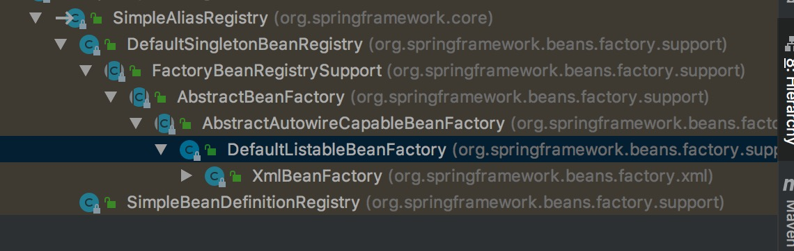

SimpleAliasRegistry(别名注册)

## 1 简介

### 1.1 认识
    
> 这个类的主要功能是对别名进行管理的，别名存在Map容器中，是对别名的增加、删除等的维护


### 1.2 类关系

> 

```

public interface AliasRegistry {

	/**
	 * Given a name, register an alias for it.
	 * @param name the canonical name
	 * @param alias the alias to be registered
	 * @throws IllegalStateException if the alias is already in use
	 * and may not be overridden
	 */
	void registerAlias(String name, String alias);

	/**
	 * Remove the specified alias from this registry.
	 * @param alias the alias to remove
	 * @throws IllegalStateException if no such alias was found
	 */
	void removeAlias(String alias);

	/**
	 * Determine whether this given name is defines as an alias
	 * (as opposed to the name of an actually registered component).
	 * @param beanName the bean name to check
	 * @return whether the given name is an alias
	 */
	boolean isAlias(String beanName);

	/**
	 * Return the aliases for the given name, if defined.
	 * @param name the name to check for aliases
	 * @return the aliases, or an empty array if none
	 */
	String[] getAliases(String name);

}

public class SimpleAliasRegistry implements AliasRegistry {
    
    // 用于保存别名的map
    private final Map<String, String> aliasMap = new ConcurrentHashMap<String, String>(16);
    
}


```

> SimpleAliasRegistry的子类



> 这个子类就是BeanFactory一系列的类。


## 2 DefaultBeanDefinitionDocumentReader.importBeanDefinitionResource(Element ele)方法跟踪

```

protected void processAliasRegistration(Element ele) {
    // 解析alias标签
    // <bean id="testA" class="com.spring.source.code.study.BeanDefinitionDocumentReader.TestA"/>
    // <alias name="testA" alias="testA1"></alias> 为testA在起个别名
    String name = ele.getAttribute(NAME_ATTRIBUTE);
    String alias = ele.getAttribute(ALIAS_ATTRIBUTE);
    boolean valid = true;
    if (!StringUtils.hasText(name)) {
        getReaderContext().error("Name must not be empty", ele);
        valid = false;
    }
    if (!StringUtils.hasText(alias)) {
        getReaderContext().error("Alias must not be empty", ele);
        valid = false;
    }
    if (valid) {
        try {
            // 在注册其中将别名注册到别名的aliasMap中
            // aliasMap的key是别名testA1,testA,值是testA，也就是别名和bean的id是多对一的
            // 在获取bean的时候，若是有别名，先用别名获得id，然后根据id获得bean实例
            getReaderContext().getRegistry().registerAlias(name, alias);
        }
        catch (Exception ex) {
            getReaderContext().error("Failed to register alias '" + alias +
                    "' for bean with name '" + name + "'", ele, ex);
        }
        getReaderContext().fireAliasRegistered(name, alias, extractSource(ele));
    }
}


```

### 2.1 SimpleAliasRegistry.registerAlias(String name, String alias)方法


```

public void registerAlias(String name, String alias) {
    Assert.hasText(name, "'name' must not be empty");
    Assert.hasText(alias, "'alias' must not be empty");
    // 别名和bean名(id)一样，不需要和bean id一样的别名
    if (alias.equals(name)) {
        this.aliasMap.remove(alias);
    }
    else {
        if (!allowAliasOverriding()) {
            // 不允许覆盖
            String registeredName = this.aliasMap.get(alias);
            if (registeredName != null && !registeredName.equals(name)) {
                throw new IllegalStateException("Cannot register alias '" + alias + "' for name '" +
                        name + "': It is already registered for name '" + registeredName + "'.");
            }
        }
        // 检查给定名称是否已经作为另一个方向的别名指向给定别名
        // 是否预先捕获了循环引用并引发了相应的IllegalStateException
        checkForAliasCircle(name, alias);
        this.aliasMap.put(alias, name);
    }
}


```
