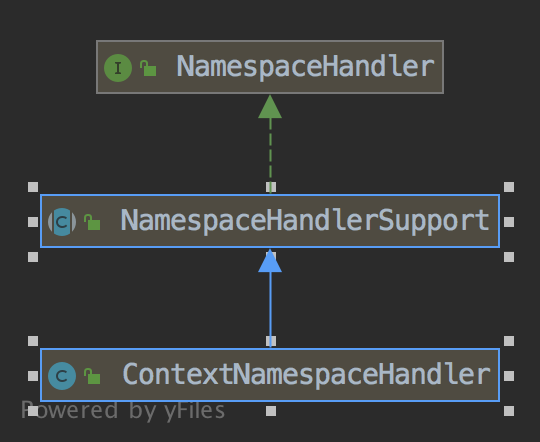
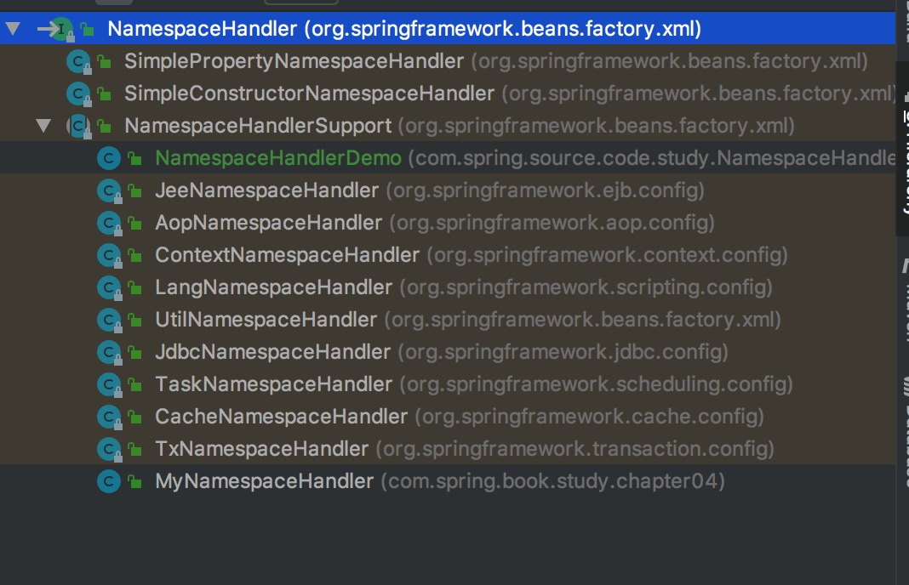

NamespaceHandler(命名空间处理器)和NamespaceHandlerResolver

## 1 简介

### 1.1 认识

> NamespaceHandler需要结合NamespaceHandlerResolver和BeanDefinitionParser一起来分析，这三个是
  紧密相连的。
  NamespaceHandler(接口)：命名空间处理器，主要是对命名空间(其实就是个约束文件：如xsd)和解析器做一个映射
  BeanDefinitionParser(接口)：BeanDefinition解析器，自定义标签，需要自定义解析器，需要实现这个接口
  NamespaceHandlerResolver(接口)：用于解析标签(其实是命名空间)和解析器间的映射关系的配置文件，
  先看个例子(例子是Spring深度源码解析树上的)：
  
```

在src/main/resources/下创建META-INF目录，在这个目录下一次创建Spring-demo.xsd，Spring.schemas,Spring.handlers


Spring-demo.xsd(自定义标签的约束文件)


<?xml version="1.0" encoding="UTF-8"?>
<schema xmlns="http://www.w3.org/2001/XMLSchema"
        targetNamespace="http://www.demo.com/schema/demo"
        xmlns:tns="http://www.demo.com/schema/demo"
        elementFormDefault="qualified">
    <!--targetNamespace就是命名空间，是个地址，表示目标文件在这个地址的远程服务器上-->
    <element name="demo">
        <complexType>
            <attribute name="id" type="string"/>
            <attribute name="demoName" type="string"/>
            <attribute name="demoDesc" type="string"/>
        </complexType>
    </element>

</schema>

Spring.schemas文件(将远程地址的命名空间，映射到本地，之前说道EntityResolver这个类处理本地自定义命名空间时，这里就是自定义本地的命名空间操作，EntityResolver就是处理它的)

## 将http\://www.demo.com/schema/demo.xsd远程地址映射到本地的META-INF/Spring-demo.xsd
http\://www.demo.com/schema/demo.xsd=META-INF/Spring-demo.xsd

Spring.handlers文件(将命名空间的的处理器映射起来，也就是NamespaceHandlerDemo是这个命名空间的处理器)

http\://www.demo.com/schema/demo=com.spring.source.code.study.NamespaceHandler.NamespaceHandlerDemo


在src/main/resources/09.NamespaceHandler中创建customDemoElements.xml

<?xml version="1.0" encoding="UTF-8"?>
<beans xmlns="http://www.springframework.org/schema/beans"
       xmlns:xsi="http://www.w3.org/2001/XMLSchema-instance"
       xmlns:myDemo="http://www.demo.com/schema/demo"
       xsi:schemaLocation="
    http://www.springframework.org/schema/beans
    http://www.springframework.org/schema/beans/spring-beans-2.0.xsd
    http://www.demo.com/schema/demo.xsd">

    <!--    xmlns:myDemo="http://www.demo.com/schema/demo"
            myDemo可以自己定义为其他的，比如myDemoA等等
    -->
    <myDemo:demo id="test" demoName="demo1" demoDesc="案例1"/>
</beans>

以上三个配置文件，都是配置的关系映射，把这些关系解析为对象之间的关系映射就需要NamespaceHandlerResolver来干活，
不过，还需要实现自己定义的解析器，以及解析器和标签见的映射关系需要注册到解析器的容器中，这样程序运行到代理解析器
(BeanDefinitionParserDelegate)时才知道，用哪个解析器解析哪个标签

package com.spring.source.code.study.NamespaceHandler;

public class Demo {

    private String demoName;

    private String demoDesc;


    public String getDemoName() {
        return demoName;
    }

    public void setDemoName(String demoName) {
        this.demoName = demoName;
    }

    public String getDemoDesc() {
        return demoDesc;
    }

    public void setDemoDesc(String demoDesc) {
        this.demoDesc = demoDesc;
    }
}


package com.spring.source.code.study.NamespaceHandler;

import org.springframework.beans.factory.xml.NamespaceHandlerSupport;

// NamespaceHandlerSupport 是 NamespaceHandler抽象实现
// 将标签和解析器关联起来，就是将解析器注册到容器中
// 解析的时候会通过标签前名称去找解析器，然后进行解析
public class NamespaceHandlerDemo extends NamespaceHandlerSupport {
    public void init() {
        /**
         * 当遇到自定义标签<demo:aaa>这样类似以demo开头的元素，就会把这个元素扔给UserBeanDefinitionParserDemo处理
         */
        registerBeanDefinitionParser("demo",new UserBeanDefinitionParserDemo());
    }
}

package com.spring.source.code.study.NamespaceHandler;

import org.springframework.beans.factory.support.BeanDefinitionBuilder;
import org.springframework.beans.factory.xml.AbstractSingleBeanDefinitionParser;
import org.springframework.util.StringUtils;
import org.w3c.dom.Element;

// 自定义解析器
public class UserBeanDefinitionParserDemo extends AbstractSingleBeanDefinitionParser {

    protected Class getBeanClass(Element element) {
        return Demo.class;
    }

    @Override
    protected void doParse(Element element, BeanDefinitionBuilder bean) {
        String demoName = element.getAttribute("demoName");
        String demoDesc = element.getAttribute("demoDesc");

        if (StringUtils.hasText(demoName)) {
            bean.addPropertyValue("demoName", demoName);
        }
        if (StringUtils.hasText(demoDesc)) {
            bean.addPropertyValue("demoDesc", demoDesc);
        }
    }
}


package com.spring.source.code.study.NamespaceHandler;

import org.junit.Test;
import org.springframework.context.ApplicationContext;
import org.springframework.context.support.ClassPathXmlApplicationContext;

public class NamespaceHandlerTest {

    @Test
    public void test() {

        ApplicationContext ap = new ClassPathXmlApplicationContext("09.NamespaceHandler/customDemoElement.xml");
        Demo demo = (Demo) ap.getBean("test");
        // Demo{demoName='demo1', demoDesc='案例1'}
        System.out.println(demo);

    }

}


```   
  
> 以上是一个自定义标签解析的简单例子，可以大致理解大致NamespaceHandler和BeanDefinitionParser的关系，
  这其中没看出来NamespaceHandlerResolver的影子，这个要代码跟踪一遍，才好理解。
  本章节，主要分析NamespaceHandler。
  
  
### 1.2 类关系


> ContextNamespaceHandler为例看一下从下往上类继承关系，ContextNamespaceHandler只是众多实现中的一个
  


> 类层次结构
> 其中NamespaceHandlerDemo和MyNamespaceHandler是笔者自定义的，其余均是Spring的
  注意打开NamespaceHandlerSupport这个类的之类，基本都只是实现了init()方法




> NamespaceHandlerSupport的类

```

public abstract class NamespaceHandlerSupport implements NamespaceHandler {

	/**
	 * Stores the {@link BeanDefinitionParser} implementations keyed by the
	 * local name of the {@link Element Elements} they handle.
	 * 存储解析器和元素映射的容器
	 */
	private final Map<String, BeanDefinitionParser> parsers =
			new HashMap<String, BeanDefinitionParser>();

	/**
	 * Stores the {@link BeanDefinitionDecorator} implementations keyed by the
	 * local name of the {@link Element Elements} they handle.
	 * 存储装饰器和元素映射的容器
	 */
	private final Map<String, BeanDefinitionDecorator> decorators =
			new HashMap<String, BeanDefinitionDecorator>();

	/**
	 * Stores the {@link BeanDefinitionDecorator} implementations keyed by the local
	 * name of the {@link Attr Attrs} they handle.
	 * 存储装饰器和属性映射的容器
	 */
	private final Map<String, BeanDefinitionDecorator> attributeDecorators =
			new HashMap<String, BeanDefinitionDecorator>();
    
    // 方法略，主要方法 就是容器中注入，和对元素或属性进行装饰的方法

}


```


## 2 从BeanDefinitionParserDelegate.decorateIfRequired(Node node, BeanDefinitionHolder originalDef, BeanDefinition containingBd)跟踪


```

public BeanDefinitionHolder decorateIfRequired(
        Node node, BeanDefinitionHolder originalDef, BeanDefinition containingBd) {

    // 解析器命名空间
    String namespaceUri = getNamespaceURI(node);
    if (!isDefaultNamespace(namespaceUri)) {
        // 获得命名空间处理器
        // 看到这里需要回头看一下readerContext是从XmlBeanDefinitionReader创建并传入的
        // 需要回头理一下
        NamespaceHandler handler = this.readerContext.getNamespaceHandlerResolver().resolve(namespaceUri);
        if (handler != null) {
            
            // 进行自定义的属性或标签进行解析并赋值给BeanDefinitionHolder
            return handler.decorate(node, originalDef, new ParserContext(this.readerContext, this, containingBd));
        }
        else if (namespaceUri != null && namespaceUri.startsWith("http://www.springframework.org/")) {
            error("Unable to locate Spring NamespaceHandler for XML schema namespace [" + namespaceUri + "]", node);
        }
        else {
            // A custom namespace, not to be handled by Spring - maybe "xml:...".
            if (logger.isDebugEnabled()) {
                logger.debug("No Spring NamespaceHandler found for XML schema namespace [" + namespaceUri + "]");
            }
        }
    }
    return originalDef;
}

```


### 2.1 XmlBeanDefinitionReader.registerBeanDefinitions(Document doc, Resource resource) 回头跟踪

```
    
public int registerBeanDefinitions(Document doc, Resource resource) throws BeanDefinitionStoreException {
    // 
    BeanDefinitionDocumentReader documentReader = createBeanDefinitionDocumentReader();
    documentReader.setEnvironment(getEnvironment());
    int countBefore = getRegistry().getBeanDefinitionCount();
    // 这一行代码是创建ReaderContext的
    documentReader.registerBeanDefinitions(doc, createReaderContext(resource));
    return getRegistry().getBeanDefinitionCount() - countBefore;
}

// 创建XmlReaderContext
// 需要NamespaceHandlerResolver，这个浮出水面了
public XmlReaderContext createReaderContext(Resource resource) {
    return new XmlReaderContext(resource, this.problemReporter, this.eventListener,
            this.sourceExtractor, this, getNamespaceHandlerResolver());
}
    
public NamespaceHandlerResolver getNamespaceHandlerResolver() {
    if (this.namespaceHandlerResolver == null) {
        // 创建默认的实现
        this.namespaceHandlerResolver = createDefaultNamespaceHandlerResolver();
    }
    return this.namespaceHandlerResolver;
}

protected NamespaceHandlerResolver createDefaultNamespaceHandlerResolver() {
    return new DefaultNamespaceHandlerResolver(getResourceLoader().getClassLoader());
} 
    

``` 
  
### 2.2  DefaultBeanDefinitionDocumentReader.parseBeanDefinitions(Element root, BeanDefinitionParserDelegate delegate)方法

```
由上一步的documentReader.registerBeanDefinitions(doc, createReaderContext(resource));方法进入到线面的方法

protected void parseBeanDefinitions(Element root, BeanDefinitionParserDelegate delegate) {
    if (delegate.isDefaultNamespace(root)) {
        NodeList nl = root.getChildNodes();
        for (int i = 0; i < nl.getLength(); i++) {
            Node node = nl.item(i);
            if (node instanceof Element) {
                Element ele = (Element) node;
                if (delegate.isDefaultNamespace(ele)) {
                    // 无论从这个方法进入
                    parseDefaultElement(ele, delegate);
                }
                else {
                    // 还是从这个方法，都会进入到BeanDefinitionParserDelegate类中
                    // 就会到了BeanDefinitionParserDelegate中的方法
                    // 在这个BeanDefinitionParserDelegate类中就有折磨一行代码
                    // 无论在parseCustomElement或是decorateIfRequired方法中，这两个方法前面都提及过了不一一跳回去跟踪了
                    // NamespaceHandler handler = this.readerContext.getNamespaceHandlerResolver().resolve(namespaceUri);
                    delegate.parseCustomElement(ele);
                }
            }
        }
    }
    else {
        delegate.parseCustomElement(root);
    }
}

```
  
### 2.3 DefaultNamespaceHandlerResolver.resolve(String namespaceUri)


```
// 这段代码分析完可以，明白这个DefaultNamespaceHandlerResolver是将NamespaceHandler配置文件中的映射关系加载到容器中
// 也就是目的是解析NamespaceHandler的

public NamespaceHandler resolve(String namespaceUri) {
    // 目的是加载META-INF/spring.handlers映射关系放到map容器中
    Map<String, Object> handlerMappings = getHandlerMappings();
    // 获得NamespaceHandler类型
    Object handlerOrClassName = handlerMappings.get(namespaceUri);
    if (handlerOrClassName == null) {
        return null;
    }
    else if (handlerOrClassName instanceof NamespaceHandler) {
        return (NamespaceHandler) handlerOrClassName;
    }
    else {
        
        String className = (String) handlerOrClassName;
        try {
            Class<?> handlerClass = ClassUtils.forName(className, this.classLoader);
            if (!NamespaceHandler.class.isAssignableFrom(handlerClass)) {
                throw new FatalBeanException("Class [" + className + "] for namespace [" + namespaceUri +
                        "] does not implement the [" + NamespaceHandler.class.getName() + "] interface");
            }
            NamespaceHandler namespaceHandler = (NamespaceHandler) BeanUtils.instantiateClass(handlerClass);
            // 注意这里调用了init()方法，我们自定义的NamespaceHandlerDemo的init方法就在这里执行的
            // 这个init方法执行，就把元素名称和解析器关联到一块了，也就是可以根据元素名称找到自己的解析器了
            namespaceHandler.init();
            handlerMappings.put(namespaceUri, namespaceHandler);
            return namespaceHandler;
        }
        catch (ClassNotFoundException ex) {
            throw new FatalBeanException("NamespaceHandler class [" + className + "] for namespace [" +
                    namespaceUri + "] not found", ex);
        }
        catch (LinkageError err) {
            throw new FatalBeanException("Invalid NamespaceHandler class [" + className + "] for namespace [" +
                    namespaceUri + "]: problem with handler class file or dependent class", err);
        }
    }
}

// 这个类似的方法其实在EntityResolver的xsd文件获取
// 目的是加载META-INF/spring.handlers映射关系放到map容器中
// 到这里大致晓得NamespaceHandlerResolver的作用了
private Map<String, Object> getHandlerMappings() {
    if (this.handlerMappings == null) {
        synchronized (this) {
            if (this.handlerMappings == null) {
                try {
                    Properties mappings =
                            PropertiesLoaderUtils.loadAllProperties(this.handlerMappingsLocation, this.classLoader);
                    if (logger.isDebugEnabled()) {
                        logger.debug("Loaded NamespaceHandler mappings: " + mappings);
                    }
                    Map<String, Object> handlerMappings = new ConcurrentHashMap<String, Object>(mappings.size());
                    CollectionUtils.mergePropertiesIntoMap(mappings, handlerMappings);
                    this.handlerMappings = handlerMappings;
                }
                catch (IOException ex) {
                    throw new IllegalStateException(
                            "Unable to load NamespaceHandler mappings from location [" + this.handlerMappingsLocation + "]", ex);
                }
            }
        }
    }
    return this.handlerMappings;
}


```


## 3 结语

> NamespaceHandler(命名空间处理器)和NamespaceHandlerResolver 这两个分开来叙述，感觉有点困难，所以还是需要联系前后一起来分析一遍
  这两个理解之后，基本就能够自定义自己的标签解析器了
  
