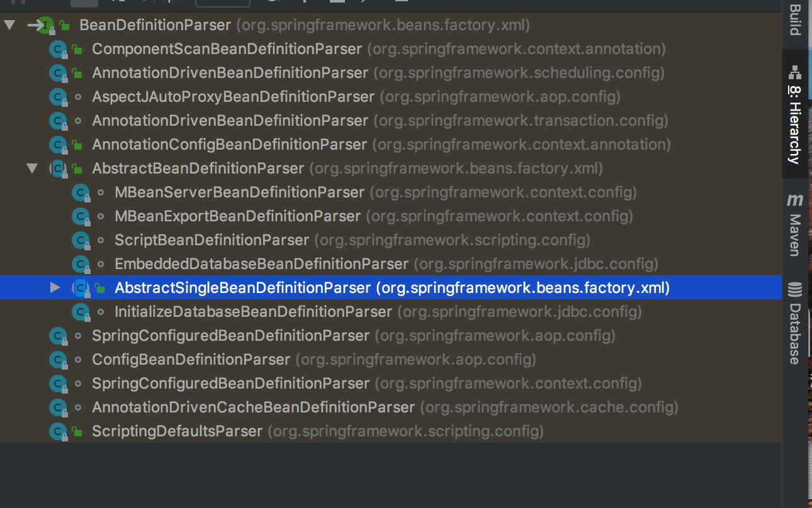

BeanDefinitionParser(解析器)

## 1 简介

### 1.1 认识

> 接口，就一个解析方法，通过前面的认识，其实BeanDefinitionParserDelegate的解析，最终都是使用的BeanDefinitionParser
  的子类去进行的解析。
  可以自己自定义标签和自定义解析器，间接实现的是该接口的parse方法。

```

public interface BeanDefinitionParser {

	BeanDefinition parse(Element element, ParserContext parserContext);

}


```


### 1.2 类关系



> 子类比较多，挑其中抽象的子类简单分析

```

public abstract class AbstractBeanDefinitionParser implements BeanDefinitionParser {}

public abstract class AbstractSingleBeanDefinitionParser extends AbstractBeanDefinitionParser {}

```


## 2 AbstractBeanDefinitionParser.parse(Element element, ParserContext parserContext)方法

```

// 实现的parse方法
public final BeanDefinition parse(Element element, ParserContext parserContext) {
    // 这个是模板方法，需要子类实现，主要是这里的逻辑
    AbstractBeanDefinition definition = parseInternal(element, parserContext);
    // 后面的逻辑暂时不用
    if (definition != null && !parserContext.isNested()) {
        try {
            String id = resolveId(element, definition, parserContext);
            if (!StringUtils.hasText(id)) {
                parserContext.getReaderContext().error(
                        "Id is required for element '" + parserContext.getDelegate().getLocalName(element)
                                + "' when used as a top-level tag", element);
            }
            String[] aliases = null;
            if (shouldParseNameAsAliases()) {
                String name = element.getAttribute(NAME_ATTRIBUTE);
                if (StringUtils.hasLength(name)) {
                    aliases = StringUtils.trimArrayElements(StringUtils.commaDelimitedListToStringArray(name));
                }
            }
            BeanDefinitionHolder holder = new BeanDefinitionHolder(definition, id, aliases);
            registerBeanDefinition(holder, parserContext.getRegistry());
            if (shouldFireEvents()) {
                BeanComponentDefinition componentDefinition = new BeanComponentDefinition(holder);
                postProcessComponentDefinition(componentDefinition);
                parserContext.registerComponent(componentDefinition);
            }
        }
        catch (BeanDefinitionStoreException ex) {
            parserContext.getReaderContext().error(ex.getMessage(), element);
            return null;
        }
    }
    return definition;
}


protected abstract AbstractBeanDefinition parseInternal(Element element, ParserContext parserContext);


```

### 2.1 AbstractSingleBeanDefinitionParser.parseInternal(Element element, ParserContext parserContext)方法


```
@Override
protected final AbstractBeanDefinition parseInternal(Element element, ParserContext parserContext) {
    // 获得一个BeanDefinitionBuilder，这个builder持有一个BeanDefinition实例
    BeanDefinitionBuilder builder = BeanDefinitionBuilder.genericBeanDefinition();
    String parentName = getParentName(element);
    // 下面对BeanDefinition进行相关的属性赋值
    if (parentName != null) {
        builder.getRawBeanDefinition().setParentName(parentName);
    }
    Class<?> beanClass = getBeanClass(element);
    if (beanClass != null) {
        builder.getRawBeanDefinition().setBeanClass(beanClass);
    }
    else {
        String beanClassName = getBeanClassName(element);
        if (beanClassName != null) {
            builder.getRawBeanDefinition().setBeanClassName(beanClassName);
        }
    }
    builder.getRawBeanDefinition().setSource(parserContext.extractSource(element));
    if (parserContext.isNested()) {
        // Inner bean definition must receive same scope as containing bean.
        builder.setScope(parserContext.getContainingBeanDefinition().getScope());
    }
    if (parserContext.isDefaultLazyInit()) {
        // Default-lazy-init applies to custom bean definitions as well.
        builder.setLazyInit(true);
    }
    // 最终是调了这个方法
    // 在NamespaceHandler章节中，自定义的解析器实现的方法就是该方法，
    // 到这里可以串到一起了
    // 可以断点跟踪一下
    doParse(element, parserContext, builder);
    return builder.getBeanDefinition();
}


```


## 3 结束语

> BeanDefinitionParser:BeanDefinitionParserDelegate只是BeanDefinitionParser委托者，最终走的还是BeanDefinitionParser
  这里有采用模板方法设计，不过，纵观Spring的先定义接口，后抽象实现，再到具体的子类实现的设计套路，一般都会带有模板方法设计的意味

