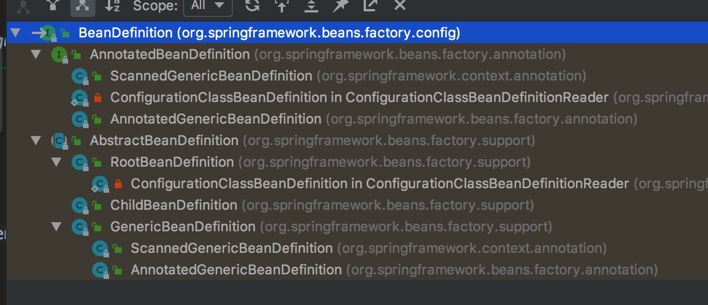

BeanDefinition(bean定义对象)

## 1.简介

### 1.1 认识

> BeanDefinition这个应该早先介绍，因为配置文件中的标签元素经过前面一系列的操作，解析之后用于封装
  这些信息的实例就是BeanDefinition，其中BeanDefinitionHolder也是BeanDefinition的包装类
  
  
### 1.2 类关系



> 主要看下AbstractBeanDefintion、RootBeanDefinition、ChildBeanDefinition和GenericBeanDefinition


## 2 AbstractBeanDefintion、RootBeanDefinition、ChildBeanDefinition和GenericBeanDefinition

### 2.1 BeanDefinition 

> https://docs.spring.io/spring-framework/docs/current/javadoc-api/org/springframework/beans/factory/config/BeanDefinition.html
  在线api，可使用浏览器翻译观看

```
// 定义了些get，set方法，不一一介绍，有兴趣去看api
public interface BeanDefinition extends AttributeAccessor, BeanMetadataElement {

	String SCOPE_SINGLETON = ConfigurableBeanFactory.SCOPE_SINGLETON;

	String SCOPE_PROTOTYPE = ConfigurableBeanFactory.SCOPE_PROTOTYPE;

	int ROLE_APPLICATION = 0;

	int ROLE_SUPPORT = 1;

	int ROLE_INFRASTRUCTURE = 2;

	String getParentName();

	void setParentName(String parentName);

	String getBeanClassName();

	void setBeanClassName(String beanClassName);

	String getFactoryBeanName();
	
	void setFactoryBeanName(String factoryBeanName);

	String getFactoryMethodName();

	void setFactoryMethodName(String factoryMethodName);

	String getScope();

	void setScope(String scope);

	boolean isLazyInit();

	void setLazyInit(boolean lazyInit);

	String[] getDependsOn();

	void setDependsOn(String... dependsOn);

	boolean isAutowireCandidate();

	void setAutowireCandidate(boolean autowireCandidate);

	boolean isPrimary();

	void setPrimary(boolean primary);

	ConstructorArgumentValues getConstructorArgumentValues();
	
	MutablePropertyValues getPropertyValues();

	boolean isSingleton();

	boolean isPrototype();

	boolean isAbstract();

	int getRole();

	String getDescription();

	String getResourceDescription();

	BeanDefinition getOriginatingBeanDefinition();

}


```

### 2.1 AbstractBeanDefintion 

```
// 大部分标签的属性等信息都在这里定义
public abstract class AbstractBeanDefinition extends BeanMetadataAttributeAccessor
		implements BeanDefinition, Cloneable {

	public static final String SCOPE_DEFAULT = "";

	public static final int AUTOWIRE_NO = AutowireCapableBeanFactory.AUTOWIRE_NO;

	public static final int AUTOWIRE_BY_NAME = AutowireCapableBeanFactory.AUTOWIRE_BY_NAME;

	public static final int AUTOWIRE_BY_TYPE = AutowireCapableBeanFactory.AUTOWIRE_BY_TYPE;

	public static final int AUTOWIRE_CONSTRUCTOR = AutowireCapableBeanFactory.AUTOWIRE_CONSTRUCTOR;

	@Deprecated
	public static final int AUTOWIRE_AUTODETECT = AutowireCapableBeanFactory.AUTOWIRE_AUTODETECT;

	public static final int DEPENDENCY_CHECK_NONE = 0;

	public static final int DEPENDENCY_CHECK_OBJECTS = 1;

	public static final int DEPENDENCY_CHECK_SIMPLE = 2;

	public static final int DEPENDENCY_CHECK_ALL = 3;

	public static final String INFER_METHOD = "(inferred)";

	private volatile Object beanClass;

	private String scope = SCOPE_DEFAULT;

	private boolean abstractFlag = false;

	private boolean lazyInit = false;

	private int autowireMode = AUTOWIRE_NO;

	private int dependencyCheck = DEPENDENCY_CHECK_NONE;

	private String[] dependsOn;

	private boolean autowireCandidate = true;

	private boolean primary = false;

	private final Map<String, AutowireCandidateQualifier> qualifiers =
			new LinkedHashMap<String, AutowireCandidateQualifier>(0);

	private boolean nonPublicAccessAllowed = true;

	private boolean lenientConstructorResolution = true;

	private ConstructorArgumentValues constructorArgumentValues;

	private MutablePropertyValues propertyValues;

	private MethodOverrides methodOverrides = new MethodOverrides();

	private String factoryBeanName;

	private String factoryMethodName;

	private String initMethodName;

	private String destroyMethodName;

	private boolean enforceInitMethod = true;

	private boolean enforceDestroyMethod = true;

	private boolean synthetic = false;

	private int role = BeanDefinition.ROLE_APPLICATION;

	private String description;

	private Resource resource;
}

```

> 感觉这个没啥可写的，就是一个封装标签信息的对象

```

<bean id="test" class="com.demo.Test" />

在解析这个bean是，就是将这个标签解析成了BeanDefinition对象。一般是子类GenericBeanDefinition

在BeanDefinitionParser.parseInternal(Element element, ParserContext parserContext)方法中的第一行代码
BeanDefinitionBuilder builder = BeanDefinitionBuilder.genericBeanDefinition();
就是创建一个包装了GenericBeanDefinition对象的包装类

BeanDefinitionBuilder还有几个方法：

BeanDefinitionBuilder.rootBeanDefinition方法，获得的是RootBeanDefinition
BeanDefinitionBuilder.childBeanDefinition方法，获得的是childBeanDefinition


```

