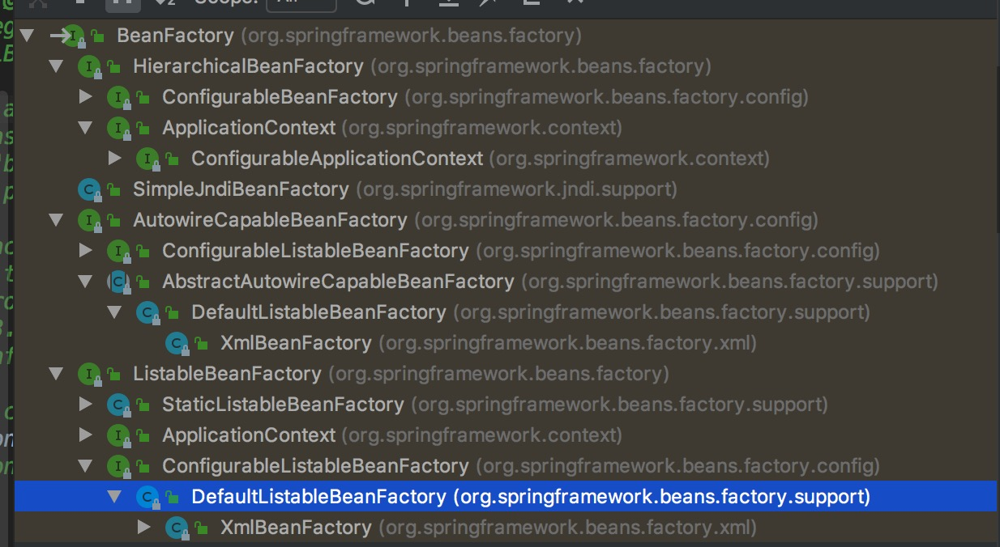

BeanFactory(bean工厂)

## 1 

### 1.1 认识

> BeanFactory这个是管理bean的核心功能接口，解析好的BeanDefinition就存在bean工程的容器map中


### 1.2 类关系



> 可以看到HierarchicalBeanFactory的子类就是ApplicationContext系列的类
  本章主要看看XmlBeanFactory->DefaultListableBeanFactory->ConfiguarableListableBeanFactory这几个类
  
```

public interface BeanFactory {
    // 主要方法getBean()
}

```

## 2 XmlBeanFactory->DefaultListableBeanFactory->ConfiguarableListableBeanFactory


> XmlBeanFactory测试类

```

// ApplicationContext其实是对BeanFactory的扩展
// XmlBeanFactory就是对xml配置文件的解析
@Test
public void testXmlBeanFactory(){
    XmlBeanFactory beanFactory = new XmlBeanFactory(new ClassPathResource("13.BeanFactory/beanFactoryTest.xml"));
    Object demo = beanFactory.getBean("demo");
    // class com.spring.source.code.study.BeanFactory.Demo
    System.out.println(demo.getClass());
}

```

### 2.1 XmlBeanFactory

```

// 其父类是DefaultListableBeanFactory
public class XmlBeanFactory extends DefaultListableBeanFactory {
    
    // beanDefiniton阅读器
	private final XmlBeanDefinitionReader reader = new XmlBeanDefinitionReader(this);
    
    // 传入资源
    // 这个资源来源有好几种，xml配置只是其中一种
	public XmlBeanFactory(Resource resource) throws BeansException {
		this(resource, null);
	}
	
	public XmlBeanFactory(Resource resource, BeanFactory parentBeanFactory) throws BeansException {
		super(parentBeanFactory);
		this.reader.loadBeanDefinitions(resource);
	}

}


```


### 2.2 AbstractBeanFactory


```
// 抽象工厂类主要是完成getBean这个方法
public abstract class AbstractBeanFactory extends FactoryBeanRegistrySupport implements ConfigurableBeanFactory {

	/** Parent bean factory, for bean inheritance support */
	// 父bean工厂
	private BeanFactory parentBeanFactory;

	/** ClassLoader to resolve bean class names with, if necessary */
	private ClassLoader beanClassLoader = ClassUtils.getDefaultClassLoader();

	/** ClassLoader to temporarily resolve bean class names with, if necessary */
	// 临时加载器
	private ClassLoader tempClassLoader;

	/** Whether to cache bean metadata or rather reobtain it for every access */
	private boolean cacheBeanMetadata = true;

	/** Resolution strategy for expressions in bean definition values */
	// bean异常解析器
	private BeanExpressionResolver beanExpressionResolver;

	/** Spring ConversionService to use instead of PropertyEditors */
	private ConversionService conversionService;

	/** Custom PropertyEditorRegistrars to apply to the beans of this factory */
	// 属性编辑器注册集合
	private final Set<PropertyEditorRegistrar> propertyEditorRegistrars =
			new LinkedHashSet<PropertyEditorRegistrar>(4);

	/** A custom TypeConverter to use, overriding the default PropertyEditor mechanism */
	// 类型转换器
	private TypeConverter typeConverter;

	/** Custom PropertyEditors to apply to the beans of this factory */
	// 自定义属性编辑器
	private final Map<Class<?>, Class<? extends PropertyEditor>> customEditors =
			new HashMap<Class<?>, Class<? extends PropertyEditor>>(4);

	/** String resolvers to apply e.g. to annotation attribute values */
	private final List<StringValueResolver> embeddedValueResolvers = new LinkedList<StringValueResolver>();

	/** BeanPostProcessors to apply in createBean */
	// bean后置处理器
	private final List<BeanPostProcessor> beanPostProcessors = new ArrayList<BeanPostProcessor>();

	/** Indicates whether any InstantiationAwareBeanPostProcessors have been registered */
	private boolean hasInstantiationAwareBeanPostProcessors;

	/** Indicates whether any DestructionAwareBeanPostProcessors have been registered */
	private boolean hasDestructionAwareBeanPostProcessors;

	/** Map from scope identifier String to corresponding Scope */
	// 作用域集合
	private final Map<String, Scope> scopes = new LinkedHashMap<String, Scope>(8);

	/** Security context used when running with a SecurityManager */
	private SecurityContextProvider securityContextProvider;

	/** Map from bean name to merged RootBeanDefinition */
	// 合并的beanDefinition集合
	private final Map<String, RootBeanDefinition> mergedBeanDefinitions =
			new ConcurrentHashMap<String, RootBeanDefinition>(64);

	/** Names of beans that have already been created at least once */
	private final Set<String> alreadyCreated = Collections.newSetFromMap(new ConcurrentHashMap<String, Boolean>(64));

	/** Names of beans that are currently in creation */
	private final ThreadLocal<Object> prototypesCurrentlyInCreation =
			new NamedThreadLocal<Object>("Prototype beans currently in creation");
			
	// 方法主要是getBean()这个方法

}

```
  
### 2.3 AutowireCapableBeanFactory

> AutowireCapableBeanFactory这个接口主要是完成bean创建和bean的自动装配的问题

```
public interface AutowireCapableBeanFactory extends BeanFactory {

    // 不自动装配
	int AUTOWIRE_NO = 0;
    
    // 通过名称自动装配
	int AUTOWIRE_BY_NAME = 1;
    
    // 通过类型自动装配
	int AUTOWIRE_BY_TYPE = 2;
    
    // 通过构造器自动装配
	int AUTOWIRE_CONSTRUCTOR = 3;

	@Deprecated
	int AUTOWIRE_AUTODETECT = 4;


	//-------------------------------------------------------------------------
	// Typical methods for creating and populating external bean instances
	//-------------------------------------------------------------------------
    
    // 使用指定的自动装配策略完全创建给定类的新bean实例
	<T> T createBean(Class<T> beanClass) throws BeansException;
    
    // 通过应用实例化后的回调和bean属性的后处理来填充给定的bean实例
	void autowireBean(Object existingBean) throws BeansException;
    
    // 配置给定的原始bean：自动装配bean属性，应用bean属性值，应用工厂回调（例如setBeanName 和）setBeanFactory，以及应用所有bean后处理器（包括可能包装给定原始bean的处理器）
	Object configureBean(Object existingBean, String beanName) throws BeansException;

    // 解决针对此工厂中定义的Bean的指定依赖关系。
	Object resolveDependency(DependencyDescriptor descriptor, String beanName) throws BeansException;


	//-------------------------------------------------------------------------
	// Specialized methods for fine-grained control over the bean lifecycle
	//-------------------------------------------------------------------------

	Object createBean(Class<?> beanClass, int autowireMode, boolean dependencyCheck) throws BeansException;

	Object autowire(Class<?> beanClass, int autowireMode, boolean dependencyCheck) throws BeansException;

	void autowireBeanProperties(Object existingBean, int autowireMode, boolean dependencyCheck)
			throws BeansException;

	void applyBeanPropertyValues(Object existingBean, String beanName) throws BeansException;
    
    // 初始化bean
	Object initializeBean(Object existingBean, String beanName) throws BeansException;

    // 应用于BeanPostProcessors给定的现有bean实例，调用其postProcessBeforeInitialization方法。
	Object applyBeanPostProcessorsBeforeInitialization(Object existingBean, String beanName)
			throws BeansException;
    
    // 应用于BeanPostProcessors给定的现有bean实例，调用其postProcessAfterInitialization方法。s
	Object applyBeanPostProcessorsAfterInitialization(Object existingBean, String beanName)
			throws BeansException;

	void destroyBean(Object existingBean);

	Object resolveDependency(DependencyDescriptor descriptor, String beanName,
			Set<String> autowiredBeanNames, TypeConverter typeConverter) throws BeansException;

}


// 该类主要是实现AutowireCapableBeanFactory接口的方法
public abstract class AbstractAutowireCapableBeanFactory extends AbstractBeanFactory
		implements AutowireCapableBeanFactory {

	/** Strategy for creating bean instances */
	private InstantiationStrategy instantiationStrategy = new CglibSubclassingInstantiationStrategy();

	/** Resolver strategy for method parameter names */
	private ParameterNameDiscoverer parameterNameDiscoverer = new DefaultParameterNameDiscoverer();

	/** Whether to automatically try to resolve circular references between beans */
	// 允许循环依赖引用
	private boolean allowCircularReferences = true;

	/**
	 * Whether to resort to injecting a raw bean instance in case of circular reference,
	 * even if the injected bean eventually got wrapped.
	 */
	private boolean allowRawInjectionDespiteWrapping = false;

	/**
	 * Dependency types to ignore on dependency check and autowire, as Set of
	 * Class objects: for example, String. Default is none.
	 */
	 // 忽略依赖的类型
	private final Set<Class<?>> ignoredDependencyTypes = new HashSet<Class<?>>();

	// 忽略依赖的接口
	private final Set<Class<?>> ignoredDependencyInterfaces = new HashSet<Class<?>>();

	/** Cache of unfinished FactoryBean instances: FactoryBean name --> BeanWrapper */
	// 工厂bean实例缓存
	private final Map<String, BeanWrapper> factoryBeanInstanceCache =
			new ConcurrentHashMap<String, BeanWrapper>(16);

	/** Cache of filtered PropertyDescriptors: bean Class -> PropertyDescriptor array */
	private final ConcurrentMap<Class<?>, PropertyDescriptor[]> filteredPropertyDescriptorsCache =
			new ConcurrentHashMap<Class<?>, PropertyDescriptor[]>(64);
			
}			


```


### 2.4 DefaultListableBeanFactory


```

// 默认工厂bean实现
public class DefaultListableBeanFactory extends AbstractAutowireCapableBeanFactory
		implements ConfigurableListableBeanFactory, BeanDefinitionRegistry, Serializable {

	private static Class<?> javaUtilOptionalClass = null;

	private static Class<?> javaxInjectProviderClass = null;

	static {
		try {
			javaUtilOptionalClass =
					ClassUtils.forName("java.util.Optional", DefaultListableBeanFactory.class.getClassLoader());
		}
		catch (ClassNotFoundException ex) {
			// Java 8 not available - Optional references simply not supported then.
		}
		try {
			javaxInjectProviderClass =
					ClassUtils.forName("javax.inject.Provider", DefaultListableBeanFactory.class.getClassLoader());
		}
		catch (ClassNotFoundException ex) {
			// JSR-330 API not available - Provider interface simply not supported then.
		}
	}


	/** Map from serialized id to factory instance */
	private static final Map<String, Reference<DefaultListableBeanFactory>> serializableFactories =
			new ConcurrentHashMap<String, Reference<DefaultListableBeanFactory>>(8);

	/** Optional id for this factory, for serialization purposes */
	private String serializationId;

	/** Whether to allow re-registration of a different definition with the same name */
	private boolean allowBeanDefinitionOverriding = true;

	/** Whether to allow eager class loading even for lazy-init beans */
	private boolean allowEagerClassLoading = true;

	/** Optional OrderComparator for dependency Lists and arrays */
	private Comparator<Object> dependencyComparator;

	/** Resolver to use for checking if a bean definition is an autowire candidate */
	private AutowireCandidateResolver autowireCandidateResolver = new SimpleAutowireCandidateResolver();

	/** Map from dependency type to corresponding autowired value */
	// 依赖的集合
	private final Map<Class<?>, Object> resolvableDependencies = new HashMap<Class<?>, Object>(16);

	/** Map of bean definition objects, keyed by bean name */
	// beanDefinition的map，解析xml的BeanDefinition对象都存在这里
	private final Map<String, BeanDefinition> beanDefinitionMap = new ConcurrentHashMap<String, BeanDefinition>(64);

	/** Map of singleton and non-singleton bean names, keyed by dependency type */
	private final Map<Class<?>, String[]> allBeanNamesByType = new ConcurrentHashMap<Class<?>, String[]>(64);

	/** Map of singleton-only bean names, keyed by dependency type */
	private final Map<Class<?>, String[]> singletonBeanNamesByType = new ConcurrentHashMap<Class<?>, String[]>(64);

	/** List of bean definition names, in registration order */
	private final List<String> beanDefinitionNames = new ArrayList<String>(64);

	/** List of names of manually registered singletons, in registration order */
	private final Set<String> manualSingletonNames = new LinkedHashSet<String>(16);

	/** Whether bean definition metadata may be cached for all beans */
	private boolean configurationFrozen = false;

	/** Cached array of bean definition names in case of frozen configuration */
	private String[] frozenBeanDefinitionNames;
	
	// getBean等一些方法
	
}


```


## 3 结语

> 简单介绍此类，这一系列的类，是核心的类，涉及的东西比较多，后面，在回头一起详细分析，或者结合其他的章节分析

