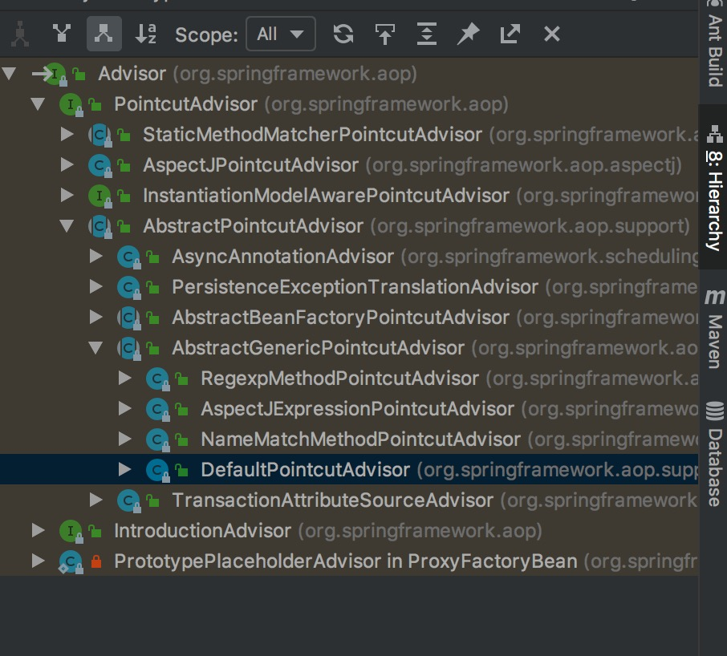

Aop

## 1 简介

### 1.1 概念介绍

> 1.通知(Advice):通知定义了切面是什么以及何时使用。描述了切面要完成的工作和何时需要执行这个工作
  2.连接点(Joinpoint):程序能够应用通知的一个"时机"，这些"时机"就连接点，例如方法被调用时，异常被抛出时等
  3.切入点(Pointcut):通知定义了切面要发生的"故事"和时间，那么切入点就定义了"故事"发生的地点，例如某个类或方法的
    名称，Spring中允许我们方便的用正则表达式来指定
  4.切面(Aspect):通知和切入点共同组成了切面：时间、地点和要发生的"故事"
  5.织入(Weaving):把切面应用到目标对象来创建新的代理对象的过程，织入一般发生在如下几个时机：
    (1)编译时：当一个类文件被编译时进行织入，这需要特殊的编译器才可以做的到，例如AspectJ的织入编译器。
    (2)类加载时：使用特殊的ClassLoader在目标类被加载到程序之前增强类的字节代码
    (3)运行时：切面在运行的某个时刻被织入，SpringAop就是以这种方式织入切面的，原理应该是使用了JDK的动态代理技术


### 1.2 Spring提供4中实现Aop的方式

> 1.基于代理的AOP；2.@AspectJ注解驱动的切面 3.<aop:config>方式


## 2 3种方式使用

### 2.1 基于代理的AOP

```


package com.spring.source.code.study.Aop;

public interface Sleepable {
    void sleep();
}

public class Human implements Sleepable {
    public void sleep() {
        System.out.println("sleeping。。。。");
    }
}


// 实现了前置通知和后置返回通知的的被织入对象

package com.spring.source.code.study.Aop;

import org.springframework.aop.AfterReturningAdvice;
import org.springframework.aop.MethodBeforeAdvice;

import java.lang.reflect.Method;

public class SleepHelper implements MethodBeforeAdvice, AfterReturningAdvice {

    public void afterReturning(Object returnValue, Method method, Object[] args, Object target) throws Throwable {
        System.out.println("put on cloth。。。。");
    }

    public void before(Method method, Object[] args, Object target) throws Throwable {
        System.out.println("take off cloth。。。。");
    }
}


// 配置文件aopTest1.xml

<?xml version="1.0" encoding="UTF-8"?>
<beans xmlns="http://www.springframework.org/schema/beans"
       xmlns:xsi="http://www.w3.org/2001/XMLSchema-instance"
       xsi:schemaLocation="
    http://www.springframework.org/schema/beans
    http://www.springframework.org/schema/beans/spring-beans-2.0.xsd">

    <!--    被代理对象-->
    <bean id="human" class="com.spring.source.code.study.Aop.Human"></bean>

    <!--    织入的对象-->
    <bean id="sleepHelper" class="com.spring.source.code.study.Aop.SleepHelper"></bean>

    <!--    切点表达式-->
    <bean id="sleepPointcut" class="org.springframework.aop.support.JdkRegexpMethodPointcut">
        <property name="pattern" value=".*sleep"></property>
    </bean>

    <!--    通知-->
    <bean id="sleepHelperAdvisor" class="org.springframework.aop.support.DefaultPointcutAdvisor">
        <property name="advice" ref="sleepHelper"></property>
        <property name="pointcut" ref="sleepPointcut"></property>
    </bean>

    <!--    代理对象-->
    <bean id="proxy" class="org.springframework.aop.framework.ProxyFactoryBean">
        <property name="target" ref="human"></property>
        <property name="interceptorNames" value="sleepHelperAdvisor"></property>
        <property name="proxyInterfaces" value="com.spring.source.code.study.Aop.Sleepable"></property>
    </bean>


</beans>


package com.spring.source.code.study.Aop;

import org.junit.Test;
import org.springframework.context.support.ClassPathXmlApplicationContext;

public class AopTest {

    @Test
    public void testProxy(){
        ClassPathXmlApplicationContext app = new ClassPathXmlApplicationContext("18.Aop/aopTest1.xml");
        Object proxy = app.getBean("proxy");
        System.out.println(proxy.getClass());
        Sleepable sleep = (Sleepable) proxy;
        System.out.println(sleep.getClass());
        sleep.sleep();

        /**
         * 输出结果
         * class com.sun.proxy.$Proxy6
         * class com.sun.proxy.$Proxy6
         * take off cloth。。。。
         * sleeping。。。。
         * put on cloth。。。。
         *
         */
    }

}


```
> 可以看到这种方式是获得代理bean，调用代理的方式，bean之间的关系，一目了然(我们手动配置的,组装的)，

### 2.2 

#### 2.2.1 DefaultPointcutAdvisor(顾问:管理切面和切点的)



``` 

// 通过配置文件可以看出，DefaultPointcutAdvisor有两个字段是需要注入的advice(切面)、pointcut(切点)
public class DefaultPointcutAdvisor extends AbstractGenericPointcutAdvisor implements Serializable {
    
    // 切点对象
    // Pointcut是接口
    // 本例中的xml配置的切点是org.springframework.aop.support.JdkRegexpMethodPointcut，
	private Pointcut pointcut = Pointcut.TRUE;


	public DefaultPointcutAdvisor() {
	}

	public DefaultPointcutAdvisor(Advice advice) {
		this(Pointcut.TRUE, advice);
	}

	public DefaultPointcutAdvisor(Pointcut pointcut, Advice advice) {
		this.pointcut = pointcut;
		setAdvice(advice);
	}


	public void setPointcut(Pointcut pointcut) {
		this.pointcut = (pointcut != null ? pointcut : Pointcut.TRUE);
	}

	@Override
	public Pointcut getPointcut() {
		return this.pointcut;
	}


	@Override
	public String toString() {
		return getClass().getName() + ": pointcut [" + getPointcut() + "]; advice [" + getAdvice() + "]";
	}

}

public abstract class AbstractGenericPointcutAdvisor extends AbstractPointcutAdvisor {

    // 切面类
	private Advice advice;


	/**
	 * Specify the advice that this advisor should apply.
	 */
	public void setAdvice(Advice advice) {
		this.advice = advice;
	}

	@Override
	public Advice getAdvice() {
		return this.advice;
	}
	
	@Override
	public String toString() {
		return getClass().getName() + ": advice [" + getAdvice() + "]";
	}

}

```


#### 2.2.1 ProxyFactoryBean(代理工厂bean)

> 由配置文件可以看出需要注入三个字段，target(被代理的对象),interceptorNames(拦截器的名称集合：实质就会切面的数组)，proxyInterfaces(被代理的接口集合) 
> 在app.getBean("proxy")中，会通过AbstractBeanFactory.getObjectForBeanInstance(Object beanInstance, String name, String beanName, RootBeanDefinition mbd)
  在获取ProxyFactoryBean的实例后，会调用ProxyFactoryBean.getObject()方法，可以断点跟踪一下，这里不再重复之前的东西
  

```

// 实现了FactoryBean，前面在BeanFactory章节中和BeanFactory对比讲过这个，也就是真正的bean是被ProxyFactoryBean包装，根据名称我们都可以猜测其包装的是Proxy
public class ProxyFactoryBean extends ProxyCreatorSupport
		implements FactoryBean<Object>, BeanClassLoaderAware, BeanFactoryAware {
		
	// 这个是获得被包装的bean	
	@Override
    public Object getObject() throws BeansException {
        // 初始化切面的链
        // 即是切面不止一个，要按照顺序形成一个链
        initializeAdvisorChain();
        if (isSingleton()) {
            // 如果是单例就走这个方法，本例显然是返利
            return getSingletonInstance();
        }
        else {
            if (this.targetName == null) {
                logger.warn("Using non-singleton proxies with singleton targets is often undesirable. " +
                        "Enable prototype proxies by setting the 'targetName' property.");
            }
            return newPrototypeInstance();
        }
    }
    
    
    private synchronized Object getSingletonInstance() {
        if (this.singletonInstance == null) {
            this.targetSource = freshTargetSource();
            if (this.autodetectInterfaces && getProxiedInterfaces().length == 0 && !isProxyTargetClass()) {
                // Rely on AOP infrastructure to tell us what interfaces to proxy.
                Class<?> targetClass = getTargetClass();
                if (targetClass == null) {
                    throw new FactoryBeanNotInitializedException("Cannot determine target class for proxy");
                }
                setInterfaces(ClassUtils.getAllInterfacesForClass(targetClass, this.proxyClassLoader));
            }
            // Initialize the shared singleton instance.
            super.setFrozen(this.freezeProxy);
            // 可以看到被包装的bean的字段是singletonInstance
            // 这个是获得代理的方法，这里就是创建代理的入口
            
            this.singletonInstance = getProxy(createAopProxy());
        }
        return this.singletonInstance;
    }
    
    // 创建代理
    protected final synchronized AopProxy createAopProxy() {
        if (!this.active) {
            activate();
        }
        // getAopProxyFactory()是父类中ProxyCreatorSupport中的方法
        return getAopProxyFactory().createAopProxy(this);
    }
		
}


public class ProxyCreatorSupport extends AdvisedSupport {

	private AopProxyFactory aopProxyFactory;

	private List<AdvisedSupportListener> listeners = new LinkedList<AdvisedSupportListener>();

	private boolean active = false;


	public ProxyCreatorSupport() {
	    // 默认的aop代理工厂
		this.aopProxyFactory = new DefaultAopProxyFactory();
	}
	
	public AopProxyFactory getAopProxyFactory() {
        return this.aopProxyFactory;
    }
	
	// 其余方法略
	
}
	


```


#### 2.2.2 DefaultAopProxyFactory

```


public class DefaultAopProxyFactory implements AopProxyFactory, Serializable {

    // 创建代理的方法
	@Override
	public AopProxy createAopProxy(AdvisedSupport config) throws AopConfigException {
		if (config.isOptimize() || config.isProxyTargetClass() || hasNoUserSuppliedProxyInterfaces(config)) {
			Class<?> targetClass = config.getTargetClass();
			if (targetClass == null) {
				throw new AopConfigException("TargetSource cannot determine target class: " +
						"Either an interface or a target is required for proxy creation.");
			}
			if (targetClass.isInterface()) {
			    // jdk动态代理
			    // 本例走的是jdk动态代理，这里就分析JdkDynamicAopProxy它为止
				return new JdkDynamicAopProxy(config);
			}
			// cglib代理
			// 后面再分析它
			return new ObjenesisCglibAopProxy(config);
		}
		else {
			return new JdkDynamicAopProxy(config);
		}
	}

	/**
	 * Determine whether the supplied {@link AdvisedSupport} has only the
	 * {@link org.springframework.aop.SpringProxy} interface specified
	 * (or no proxy interfaces specified at all).
	 */
	private boolean hasNoUserSuppliedProxyInterfaces(AdvisedSupport config) {
		Class<?>[] interfaces = config.getProxiedInterfaces();
		return (interfaces.length == 0 || (interfaces.length == 1 && SpringProxy.class.equals(interfaces[0])));
	}
}


```


#### 2.2.3  JdkDynamicAopProxy

```

// 实现了InvocationHandler这个接口，就是jdk的动态代理了
final class JdkDynamicAopProxy implements AopProxy, InvocationHandler, Serializable {

	private static final Log logger = LogFactory.getLog(JdkDynamicAopProxy.class);

	private final AdvisedSupport advised;

	private boolean equalsDefined;

	private boolean hashCodeDefined;

	public JdkDynamicAopProxy(AdvisedSupport config) throws AopConfigException {
		Assert.notNull(config, "AdvisedSupport must not be null");
		if (config.getAdvisors().length == 0 && config.getTargetSource() == AdvisedSupport.EMPTY_TARGET_SOURCE) {
			throw new AopConfigException("No advisors and no TargetSource specified");
		}
		this.advised = config;
	}


	@Override
	public Object getProxy() {
		return getProxy(ClassUtils.getDefaultClassLoader());
	}

	@Override
	public Object getProxy(ClassLoader classLoader) {
		if (logger.isDebugEnabled()) {
			logger.debug("Creating JDK dynamic proxy: target source is " + this.advised.getTargetSource());
		}
		Class<?>[] proxiedInterfaces = AopProxyUtils.completeProxiedInterfaces(this.advised);
		findDefinedEqualsAndHashCodeMethods(proxiedInterfaces);
		return Proxy.newProxyInstance(classLoader, proxiedInterfaces, this);
	}

	/**
	 * Finds any {@link #equals} or {@link #hashCode} method that may be defined
	 * on the supplied set of interfaces.
	 * @param proxiedInterfaces the interfaces to introspect
	 */
	private void findDefinedEqualsAndHashCodeMethods(Class<?>[] proxiedInterfaces) {
		for (Class<?> proxiedInterface : proxiedInterfaces) {
			Method[] methods = proxiedInterface.getDeclaredMethods();
			for (Method method : methods) {
				if (AopUtils.isEqualsMethod(method)) {
					this.equalsDefined = true;
				}
				if (AopUtils.isHashCodeMethod(method)) {
					this.hashCodeDefined = true;
				}
				if (this.equalsDefined && this.hashCodeDefined) {
					return;
				}
			}
		}
	}


	// 代理的方法
	@Override
	public Object invoke(Object proxy, Method method, Object[] args) throws Throwable {
		MethodInvocation invocation;
		Object oldProxy = null;
		boolean setProxyContext = false;

		TargetSource targetSource = this.advised.targetSource;
		Class<?> targetClass = null;
		Object target = null;

		try {
			if (!this.equalsDefined && AopUtils.isEqualsMethod(method)) {
				// The target does not implement the equals(Object) method itself.
				return equals(args[0]);
			}
			if (!this.hashCodeDefined && AopUtils.isHashCodeMethod(method)) {
				// The target does not implement the hashCode() method itself.
				return hashCode();
			}
			if (!this.advised.opaque && method.getDeclaringClass().isInterface() &&
					method.getDeclaringClass().isAssignableFrom(Advised.class)) {
				// Service invocations on ProxyConfig with the proxy config...
				return AopUtils.invokeJoinpointUsingReflection(this.advised, method, args);
			}

			Object retVal;

			if (this.advised.exposeProxy) {
				// Make invocation available if necessary.
				oldProxy = AopContext.setCurrentProxy(proxy);
				setProxyContext = true;
			}

			// May be null. Get as late as possible to minimize the time we "own" the target,
			// in case it comes from a pool.
			target = targetSource.getTarget();
			if (target != null) {
				targetClass = target.getClass();
			}

			// Get the interception chain for this method.
			List<Object> chain = this.advised.getInterceptorsAndDynamicInterceptionAdvice(method, targetClass);

			// Check whether we have any advice. If we don't, we can fallback on direct
			// reflective invocation of the target, and avoid creating a MethodInvocation.
			if (chain.isEmpty()) {
				// We can skip creating a MethodInvocation: just invoke the target directly
				// Note that the final invoker must be an InvokerInterceptor so we know it does
				// nothing but a reflective operation on the target, and no hot swapping or fancy proxying.
				retVal = AopUtils.invokeJoinpointUsingReflection(target, method, args);
			}
			else {
				// We need to create a method invocation...
				invocation = new ReflectiveMethodInvocation(proxy, target, method, args, targetClass, chain);
				// Proceed to the joinpoint through the interceptor chain.
				retVal = invocation.proceed();
			}

			// Massage return value if necessary.
			Class<?> returnType = method.getReturnType();
			if (retVal != null && retVal == target && returnType.isInstance(proxy) &&
					!RawTargetAccess.class.isAssignableFrom(method.getDeclaringClass())) {
				// Special case: it returned "this" and the return type of the method
				// is type-compatible. Note that we can't help if the target sets
				// a reference to itself in another returned object.
				retVal = proxy;
			}
			else if (retVal == null && returnType != Void.TYPE && returnType.isPrimitive()) {
				throw new AopInvocationException(
						"Null return value from advice does not match primitive return type for: " + method);
			}
			return retVal;
		}
		finally {
			if (target != null && !targetSource.isStatic()) {
				// Must have come from TargetSource.
				targetSource.releaseTarget(target);
			}
			if (setProxyContext) {
				// Restore old proxy.
				AopContext.setCurrentProxy(oldProxy);
			}
		}
	}


	@Override
	public boolean equals(Object other) {
		if (other == this) {
			return true;
		}
		if (other == null) {
			return false;
		}

		JdkDynamicAopProxy otherProxy;
		if (other instanceof JdkDynamicAopProxy) {
			otherProxy = (JdkDynamicAopProxy) other;
		}
		else if (Proxy.isProxyClass(other.getClass())) {
			InvocationHandler ih = Proxy.getInvocationHandler(other);
			if (!(ih instanceof JdkDynamicAopProxy)) {
				return false;
			}
			otherProxy = (JdkDynamicAopProxy) ih;
		}
		else {
			// Not a valid comparison...
			return false;
		}

		// If we get here, otherProxy is the other AopProxy.
		return AopProxyUtils.equalsInProxy(this.advised, otherProxy.advised);
	}

	@Override
	public int hashCode() {
		return JdkDynamicAopProxy.class.hashCode() * 13 + this.advised.getTargetSource().hashCode();
	}

}


```
