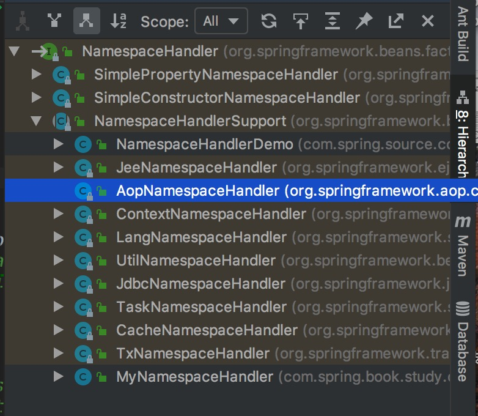

Aop(通过AspectJ提供的注解实现AOP)


## 1 通过AspectJ提供的注解实现AOP

```

新增切面类SleepHelperTwo

package com.spring.source.code.study.Aop;

import org.aspectj.lang.annotation.AfterReturning;
import org.aspectj.lang.annotation.Aspect;
import org.aspectj.lang.annotation.Before;
import org.aspectj.lang.annotation.Pointcut;

@Aspect
public class SleepHelperTwo {

    public SleepHelperTwo() {
    }

    @Pointcut("execution(* com.spring.source.code.study.Aop.Sleepable.sleep())")
    public void sleeppoint() {
    }


    @AfterReturning("sleeppoint()")
    public void afterReturning() throws Throwable {
        System.out.println("put on cloth。。。。");
    }


    @Before("sleeppoint()")
    public void before() throws Throwable {
        System.out.println("take off cloth。。。。");
    }
}

xml配置文件aopTest2.xml

<?xml version="1.0" encoding="UTF-8"?>
<beans xmlns="http://www.springframework.org/schema/beans"
       xmlns:xsi="http://www.w3.org/2001/XMLSchema-instance" xmlns:aop="http://www.springframework.org/schema/aop"
       xsi:schemaLocation="http://www.springframework.org/schema/beans
    http://www.springframework.org/schema/beans/spring-beans-2.0.xsd http://www.springframework.org/schema/aop http://www.springframework.org/schema/aop/spring-aop.xsd">


    <aop:aspectj-autoproxy/>
    <!--    被代理对象-->
    <bean id="human" class="com.spring.source.code.study.Aop.Human"></bean>

    <bean id="sleepHelperTwo" class="com.spring.source.code.study.Aop.SleepHelperTwo"/>


</beans>

测试类
@Test
public void testAspectJ(){
    ClassPathXmlApplicationContext app = new ClassPathXmlApplicationContext("18.Aop/aopTest2.xml");
    Object proxy = app.getBean("human");
    System.out.println(proxy.getClass());
    Sleepable sleep = (Sleepable) proxy;
    System.out.println(sleep.getClass());
    sleep.sleep();
    /**
     * 输出结果
     * class com.sun.proxy.$Proxy9
     * class com.sun.proxy.$Proxy9
     * take off cloth。。。。
     * sleeping。。。。
     * put on cloth。。。。
     */
}


```

## 2 分析过程

> 这种方式其实也是走的JdkDynamicAopProxy的代理，和上一章的区别就是，我们不需要手动配置，切点和切面，以及组装他们的关系洗，
  且没有使用ProxyFactoryBean
  
### 2.1 aop:aspectj-autoproxy标签的解析和Aop代理的创建

> 1.<aop:aspectj-autoproxy> 这个标签，自动代理怎么工作的？
  2.何时，何处，如何将切面和切点整合到一起的？

> 首先，我们知道xml配置中自定义的标签就那么几个，<beans>、<import>、<alias>、<bean>等，除了这些外，其余的标签都是自定义扩展出来的，
  比如<aop:aspectj-autoproxy>这个标签，就是Spring的扩展。前面说过，扩展自定义的标签，肯定会提供NamespaceHandler和BeanDefinitionParser的实现
  看一下NamespaceHandler的子类有一个AopNamespaceHandler，  
  


  
```

public class AopNamespaceHandler extends NamespaceHandlerSupport {

	
	@Override
	public void init() {
		// In 2.0 XSD as well as in 2.1 XSD.
		registerBeanDefinitionParser("config", new ConfigBeanDefinitionParser());
		// 这个注册的解析器就是解析<aop:aspectj-autoproxy>标签的解析器，这里是突破口
		registerBeanDefinitionParser("aspectj-autoproxy", new AspectJAutoProxyBeanDefinitionParser());
		registerBeanDefinitionDecorator("scoped-proxy", new ScopedProxyBeanDefinitionDecorator());

		// Only in 2.0 XSD: moved to context namespace as of 2.1
		registerBeanDefinitionParser("spring-configured", new SpringConfiguredBeanDefinitionParser());
	}

}


```  

#### 2.1.1 AspectJAutoProxyBeanDefinitionParser解析器，

```

先将aopTest2.xml中只配置<aop:aspectj-autoproxy/>这个标签的情况下，进行断点观察

// 
// BeanDefinitionParser的实现
class AspectJAutoProxyBeanDefinitionParser implements BeanDefinitionParser {

    // 重写的解析方法
	@Override
	public BeanDefinition parse(Element element, ParserContext parserContext) {
	    // 注册AspectJ的注解自动代理创建器()
	    // registerAspectJAnnotationAutoProxyCreatorIfNecessary 这个方法，翻译过来就是如果有需要，就注册AspectJ的注解自动代理创建器
	    // 注意这个Creator是自动代理Creator，并且是基于注解的，也就是处理注解实现的AspectJ切面功能
	    // 这个方法生成了个AUTO_PROXY_CREATOR_BEAN_NAME = "org.springframework.aop.config.internalAutoProxyCreator"名称的bean
	    // 接着往下看
		AopNamespaceUtils.registerAspectJAnnotationAutoProxyCreatorIfNecessary(parserContext, element);
		// 扩展BeanDefinition信息
		extendBeanDefinition(element, parserContext);
		return null;
	}

    // 扩展方法
	private void extendBeanDefinition(Element element, ParserContext parserContext) {
	    // AUTO_PROXY_CREATOR_BEAN_NAME = "org.springframework.aop.config.internalAutoProxyCreator"
		BeanDefinition beanDef =
				parserContext.getRegistry().getBeanDefinition(AopConfigUtils.AUTO_PROXY_CREATOR_BEAN_NAME);
		if (element.hasChildNodes()) {
			addIncludePatterns(element, parserContext, beanDef);
		}
	}

	private void addIncludePatterns(Element element, ParserContext parserContext, BeanDefinition beanDef) {
		ManagedList<TypedStringValue> includePatterns = new ManagedList<TypedStringValue>();
		NodeList childNodes = element.getChildNodes();
		for (int i = 0; i < childNodes.getLength(); i++) {
			Node node = childNodes.item(i);
			if (node instanceof Element) {
				Element includeElement = (Element) node;
				TypedStringValue valueHolder = new TypedStringValue(includeElement.getAttribute("name"));
				valueHolder.setSource(parserContext.extractSource(includeElement));
				includePatterns.add(valueHolder);
			}
		}
		if (!includePatterns.isEmpty()) {
			includePatterns.setSource(parserContext.extractSource(element));
			beanDef.getPropertyValues().add("includePatterns", includePatterns);
		}
	}

}


// AopNamespaceUtils工具方法
public static void registerAspectJAnnotationAutoProxyCreatorIfNecessary(
        ParserContext parserContext, Element sourceElement) {
    
    // 这里调用了Aop配置Utils工具类的方法
    BeanDefinition beanDefinition = AopConfigUtils.registerAspectJAnnotationAutoProxyCreatorIfNecessary(
            parserContext.getRegistry(), parserContext.extractSource(sourceElement));
    useClassProxyingIfNecessary(parserContext.getRegistry(), sourceElement);
    registerComponentIfNecessary(beanDefinition, parserContext);
}

// AopConfigUtils工具类方法
public static BeanDefinition registerAspectJAnnotationAutoProxyCreatorIfNecessary(BeanDefinitionRegistry registry, Object source) {
    // AnnotationAwareAspectJAutoProxyCreator.class，就是这个类就是注解自动注入AspectJ的自动代理创建器
    // 可以大胆的猜测，这个类完成了AspectJ的自动代理的创建，注解的识别，以及将通知等和被代理的对象关联起来，都和这个类由关系
    // 也就是这个类是个线索
    return registerOrEscalateApcAsRequired(AnnotationAwareAspectJAutoProxyCreator.class, registry, source);
}
	
	
// AopConfigUtils工具类方法	
private static BeanDefinition registerOrEscalateApcAsRequired(Class<?> cls, BeanDefinitionRegistry registry, Object source) {
    Assert.notNull(registry, "BeanDefinitionRegistry must not be null");
    if (registry.containsBeanDefinition(AUTO_PROXY_CREATOR_BEAN_NAME)) {
        BeanDefinition apcDefinition = registry.getBeanDefinition(AUTO_PROXY_CREATOR_BEAN_NAME);
        if (!cls.getName().equals(apcDefinition.getBeanClassName())) {
            int currentPriority = findPriorityForClass(apcDefinition.getBeanClassName());
            int requiredPriority = findPriorityForClass(cls);
            if (currentPriority < requiredPriority) {
                apcDefinition.setBeanClassName(cls.getName());
            }
        }
        return null;
    }
    // 创建一个AnnotationAwareAspectJAutoProxyCreator的BeanDefinition
    RootBeanDefinition beanDefinition = new RootBeanDefinition(cls);
    beanDefinition.setSource(source);
    beanDefinition.getPropertyValues().add("order", Ordered.HIGHEST_PRECEDENCE);
    beanDefinition.setRole(BeanDefinition.ROLE_INFRASTRUCTURE);
    registry.registerBeanDefinition(AUTO_PROXY_CREATOR_BEAN_NAME, beanDefinition);
    return beanDefinition;
}

```


#### 2.2.2 AnnotationAwareAspectJAutoProxyCreator分析


```

public class AnnotationAwareAspectJAutoProxyCreator extends AspectJAwareAdvisorAutoProxyCreator {

	private List<Pattern> includePatterns;
    
    // 先体下这个类是个关键，AspectJAdvisor工厂，既然是工厂我们就大概知道，他应该是生产AspectJ相关注解的通知(@Before,@After等)实例的，
    // 就是讲注解转化成实例
    // 这个留在后面细说
	private AspectJAdvisorFactory aspectJAdvisorFactory = new ReflectiveAspectJAdvisorFactory();

    // BeanFactoryAspectJAdvisors构造者
	private BeanFactoryAspectJAdvisorsBuilder aspectJAdvisorsBuilder;


	/**
	 * Set a list of regex patterns, matching eligible @AspectJ bean names.
	 * <p>Default is to consider all @AspectJ beans as eligible.
	 */
	public void setIncludePatterns(List<String> patterns) {
		this.includePatterns = new ArrayList<Pattern>(patterns.size());
		for (String patternText : patterns) {
			this.includePatterns.add(Pattern.compile(patternText));
		}
	}

	public void setAspectJAdvisorFactory(AspectJAdvisorFactory aspectJAdvisorFactory) {
		Assert.notNull(aspectJAdvisorFactory, "AspectJAdvisorFactory must not be null");
		this.aspectJAdvisorFactory = aspectJAdvisorFactory;
	}

	@Override
	protected void initBeanFactory(ConfigurableListableBeanFactory beanFactory) {
		super.initBeanFactory(beanFactory);
		this.aspectJAdvisorsBuilder =
				new BeanFactoryAspectJAdvisorsBuilderAdapter(beanFactory, this.aspectJAdvisorFactory);
	}


	@Override
	protected List<Advisor> findCandidateAdvisors() {
		// Add all the Spring advisors found according to superclass rules.
		List<Advisor> advisors = super.findCandidateAdvisors();
		// Build Advisors for all AspectJ aspects in the bean factory.
		advisors.addAll(this.aspectJAdvisorsBuilder.buildAspectJAdvisors());
		return advisors;
	}

	@Override
	protected boolean isInfrastructureClass(Class<?> beanClass) {
		// Previously we setProxyTargetClass(true) in the constructor, but that has too
		// broad an impact. Instead we now override isInfrastructureClass to avoid proxying
		// aspects. I'm not entirely happy with that as there is no good reason not
		// to advise aspects, except that it causes advice invocation to go through a
		// proxy, and if the aspect implements e.g the Ordered interface it will be
		// proxied by that interface and fail at runtime as the advice method is not
		// defined on the interface. We could potentially relax the restriction about
		// not advising aspects in the future.
		return (super.isInfrastructureClass(beanClass) || this.aspectJAdvisorFactory.isAspect(beanClass));
	}

	/**
	 * Check whether the given aspect bean is eligible for auto-proxying.
	 * <p>If no &lt;aop:include&gt; elements were used then "includePatterns" will be
	 * {@code null} and all beans are included. If "includePatterns" is non-null,
	 * then one of the patterns must match.
	 */
	protected boolean isEligibleAspectBean(String beanName) {
		if (this.includePatterns == null) {
			return true;
		}
		else {
			for (Pattern pattern : this.includePatterns) {
				if (pattern.matcher(beanName).matches()) {
					return true;
				}
			}
			return false;
		}
	}


	/**
	 * Subclass of BeanFactoryAspectJAdvisorsBuilderAdapter that delegates to
	 * surrounding AnnotationAwareAspectJAutoProxyCreator facilities.
	 */
	 // 内部类BeanFactoryAspectJAdvisorsBuilder类的适配器
	private class BeanFactoryAspectJAdvisorsBuilderAdapter extends BeanFactoryAspectJAdvisorsBuilder {

		public BeanFactoryAspectJAdvisorsBuilderAdapter(
				ListableBeanFactory beanFactory, AspectJAdvisorFactory advisorFactory) {
			super(beanFactory, advisorFactory);
		}

		@Override
		protected boolean isEligibleBean(String beanName) {
			return AnnotationAwareAspectJAutoProxyCreator.this.isEligibleAspectBean(beanName);
		}
	}

}

// 单单从这个类貌似不能看出更多信息了，下面就要看看这个类的超类了
// 这个类中，没看到实质的信息，接着看父类
public class AspectJAwareAdvisorAutoProxyCreator extends AbstractAdvisorAutoProxyCreator {
    
    private static final Comparator<Advisor> DEFAULT_PRECEDENCE_COMPARATOR = new AspectJPrecedenceComparator();
    
    
    // 对advisors进行排序，就是切面之前是由顺序的
    @Override
    @SuppressWarnings("unchecked")
    protected List<Advisor> sortAdvisors(List<Advisor> advisors) {
        List<PartiallyComparableAdvisorHolder> partiallyComparableAdvisors =
                new ArrayList<PartiallyComparableAdvisorHolder>(advisors.size());
        for (Advisor element : advisors) {
            partiallyComparableAdvisors.add(
                    new PartiallyComparableAdvisorHolder(element, DEFAULT_PRECEDENCE_COMPARATOR));
        }
        List<PartiallyComparableAdvisorHolder> sorted =
                PartialOrder.sort(partiallyComparableAdvisors);
        if (sorted != null) {
            List<Advisor> result = new ArrayList<Advisor>(advisors.size());
            for (PartiallyComparableAdvisorHolder pcAdvisor : sorted) {
                result.add(pcAdvisor.getAdvisor());
            }
            return result;
        }
        else {
            return super.sortAdvisors(advisors);
        }
    }

    /**
     * Adds an {@link ExposeInvocationInterceptor} to the beginning of the advice chain.
     * These additional advices are needed when using AspectJ expression pointcuts
     * and when using AspectJ-style advice.
     */
    @Override
    protected void extendAdvisors(List<Advisor> candidateAdvisors) {
        AspectJProxyUtils.makeAdvisorChainAspectJCapableIfNecessary(candidateAdvisors);
    }

    @Override
    protected boolean shouldSkip(Class<?> beanClass, String beanName) {
        // TODO: Consider optimization by caching the list of the aspect names
        List<Advisor> candidateAdvisors = findCandidateAdvisors();
        for (Advisor advisor : candidateAdvisors) {
            if (advisor instanceof AspectJPointcutAdvisor) {
                if (((AbstractAspectJAdvice) advisor.getAdvice()).getAspectName().equals(beanName)) {
                    return true;
                }
            }
        }
        return super.shouldSkip(beanClass, beanName);
    }


    /**
     * Implements AspectJ PartialComparable interface for defining partial orderings.
     */
    private static class PartiallyComparableAdvisorHolder implements PartialComparable {

        private final Advisor advisor;

        private final Comparator<Advisor> comparator;

        public PartiallyComparableAdvisorHolder(Advisor advisor, Comparator<Advisor> comparator) {
            this.advisor = advisor;
            this.comparator = comparator;
        }

        @Override
        public int compareTo(Object obj) {
            Advisor otherAdvisor = ((PartiallyComparableAdvisorHolder) obj).advisor;
            return this.comparator.compare(this.advisor, otherAdvisor);
        }

        @Override
        public int fallbackCompareTo(Object obj) {
            return 0;
        }

        public Advisor getAdvisor() {
            return this.advisor;
        }

        @Override
        public String toString() {
            StringBuilder sb = new StringBuilder();
            Advice advice = this.advisor.getAdvice();
            sb.append(ClassUtils.getShortName(advice.getClass()));
            sb.append(": ");
            if (this.advisor instanceof Ordered) {
                sb.append("order ").append(((Ordered) this.advisor).getOrder()).append(", ");
            }
            if (advice instanceof AbstractAspectJAdvice) {
                AbstractAspectJAdvice ajAdvice = (AbstractAspectJAdvice) advice;
                sb.append(ajAdvice.getAspectName());
                sb.append(", declaration order ");
                sb.append(ajAdvice.getDeclarationOrder());
            }
            return sb.toString();
        }
    }
    
}


// 这个类也没有太多我们想要的信息，至少要找到创建的动作在哪里AutoProxyCreator，自动创建的动作
public abstract class AbstractAdvisorAutoProxyCreator extends AbstractAutoProxyCreator {

	private BeanFactoryAdvisorRetrievalHelper advisorRetrievalHelper;

	@Override
	public void setBeanFactory(BeanFactory beanFactory) {
		super.setBeanFactory(beanFactory);
		if (!(beanFactory instanceof ConfigurableListableBeanFactory)) {
			throw new IllegalStateException("Cannot use AdvisorAutoProxyCreator without a ConfigurableListableBeanFactory");
		}
		initBeanFactory((ConfigurableListableBeanFactory) beanFactory);
	}

	protected void initBeanFactory(ConfigurableListableBeanFactory beanFactory) {
		this.advisorRetrievalHelper = new BeanFactoryAdvisorRetrievalHelperAdapter(beanFactory);
	}


	@Override
	protected Object[] getAdvicesAndAdvisorsForBean(Class<?> beanClass, String beanName, TargetSource targetSource) {
		List<Advisor> advisors = findEligibleAdvisors(beanClass, beanName);
		if (advisors.isEmpty()) {
			return DO_NOT_PROXY;
		}
		return advisors.toArray();
	}

	/**
	 * Find all eligible Advisors for auto-proxying this class.
	 * @param beanClass the clazz to find advisors for
	 * @param beanName the name of the currently proxied bean
	 * @return the empty List, not {@code null},
	 * if there are no pointcuts or interceptors
	 * @see #findCandidateAdvisors
	 * @see #sortAdvisors
	 * @see #extendAdvisors
	 */
	protected List<Advisor> findEligibleAdvisors(Class<?> beanClass, String beanName) {
		List<Advisor> candidateAdvisors = findCandidateAdvisors();
		List<Advisor> eligibleAdvisors = findAdvisorsThatCanApply(candidateAdvisors, beanClass, beanName);
		extendAdvisors(eligibleAdvisors);
		if (!eligibleAdvisors.isEmpty()) {
			eligibleAdvisors = sortAdvisors(eligibleAdvisors);
		}
		return eligibleAdvisors;
	}

	/**
	 * Find all candidate Advisors to use in auto-proxying.
	 * @return the List of candidate Advisors
	 */
	protected List<Advisor> findCandidateAdvisors() {
		return this.advisorRetrievalHelper.findAdvisorBeans();
	}

	/**
	 * Search the given candidate Advisors to find all Advisors that
	 * can apply to the specified bean.
	 * @param candidateAdvisors the candidate Advisors
	 * @param beanClass the target's bean class
	 * @param beanName the target's bean name
	 * @return the List of applicable Advisors
	 * @see ProxyCreationContext#getCurrentProxiedBeanName()
	 */
	protected List<Advisor> findAdvisorsThatCanApply(
			List<Advisor> candidateAdvisors, Class<?> beanClass, String beanName) {

		ProxyCreationContext.setCurrentProxiedBeanName(beanName);
		try {
			return AopUtils.findAdvisorsThatCanApply(candidateAdvisors, beanClass);
		}
		finally {
			ProxyCreationContext.setCurrentProxiedBeanName(null);
		}
	}

	/**
	 * Return whether the Advisor bean with the given name is eligible
	 * for proxying in the first place.
	 * @param beanName the name of the Advisor bean
	 * @return whether the bean is eligible
	 */
	protected boolean isEligibleAdvisorBean(String beanName) {
		return true;
	}

	/**
	 * Sort advisors based on ordering. Subclasses may choose to override this
	 * method to customize the sorting strategy.
	 * @param advisors the source List of Advisors
	 * @return the sorted List of Advisors
	 * @see org.springframework.core.Ordered
	 * @see org.springframework.core.OrderComparator
	 */
	protected List<Advisor> sortAdvisors(List<Advisor> advisors) {
		OrderComparator.sort(advisors);
		return advisors;
	}

	/**
	 * Extension hook that subclasses can override to register additional Advisors,
	 * given the sorted Advisors obtained to date.
	 * <p>The default implementation is empty.
	 * <p>Typically used to add Advisors that expose contextual information
	 * required by some of the later advisors.
	 * @param candidateAdvisors Advisors that have already been identified as
	 * applying to a given bean
	 */
	protected void extendAdvisors(List<Advisor> candidateAdvisors) {
	}

	/**
	 * This auto-proxy creator always returns pre-filtered Advisors.
	 */
	@Override
	protected boolean advisorsPreFiltered() {
		return true;
	}


	/**
	 * Subclass of BeanFactoryAdvisorRetrievalHelper that delegates to
	 * surrounding AbstractAdvisorAutoProxyCreator facilities.
	 */
	private class BeanFactoryAdvisorRetrievalHelperAdapter extends BeanFactoryAdvisorRetrievalHelper {

		public BeanFactoryAdvisorRetrievalHelperAdapter(ConfigurableListableBeanFactory beanFactory) {
			super(beanFactory);
		}

		@Override
		protected boolean isEligibleBean(String beanName) {
			return AbstractAdvisorAutoProxyCreator.this.isEligibleAdvisorBean(beanName);
		}
	}

}

// 这个抽象的父类，里的createProxy方法就是我们要找的，可以在这里打个断点跟踪一下。
public abstract class AbstractAutoProxyCreator extends ProxyProcessorSupport
		implements SmartInstantiationAwareBeanPostProcessor, BeanFactoryAware {
	
	
    protected Object createProxy(
            Class<?> beanClass, String beanName, Object[] specificInterceptors, TargetSource targetSource) {
        
        // 代理工厂
        ProxyFactory proxyFactory = new ProxyFactory();
        proxyFactory.copyFrom(this);

        if (!proxyFactory.isProxyTargetClass()) {
            if (shouldProxyTargetClass(beanClass, beanName)) {
                proxyFactory.setProxyTargetClass(true);
            }
            else {
                evaluateProxyInterfaces(beanClass, proxyFactory);
            }
        }

        Advisor[] advisors = buildAdvisors(beanName, specificInterceptors);
        for (Advisor advisor : advisors) {
            proxyFactory.addAdvisor(advisor);
        }

        proxyFactory.setTargetSource(targetSource);
        customizeProxyFactory(proxyFactory);

        proxyFactory.setFrozen(this.freezeProxy);
        if (advisorsPreFiltered()) {
            proxyFactory.setPreFiltered(true);
        }
        
        // 获得代理
        return proxyFactory.getProxy(getProxyClassLoader());
    }
		
}


// proxyFactory.getProxy：第一个xml配置的aop案例，代理的创建也会走这里，这也是AbstractAutoProxyCreator抽象类的作用，创建代理的逻辑都一样，
// 就抽象到父类中
ProxyFactory
public Object getProxy(ClassLoader classLoader) {
    return createAopProxy().getProxy(classLoader);
}

ProxyCreatorSupport
protected final synchronized AopProxy createAopProxy() {
    if (!this.active) {
        activate();
    }
    return getAopProxyFactory().createAopProxy(this);
}

ProxyCreatorSupport
public ProxyCreatorSupport() {
    this.aopProxyFactory = new DefaultAopProxyFactory();
}
public AopProxyFactory getAopProxyFactory() {
    return this.aopProxyFactory;
}

从上面可以看出，代理的获得，是由默认aop代理工厂生产的，就是DefaultAopProxyFactory，和上一个基于xml配置的代理创建方式一样的

public class DefaultAopProxyFactory implements AopProxyFactory, Serializable {

	@Override
	public AopProxy createAopProxy(AdvisedSupport config) throws AopConfigException {
		if (config.isOptimize() || config.isProxyTargetClass() || hasNoUserSuppliedProxyInterfaces(config)) {
			Class<?> targetClass = config.getTargetClass();
			if (targetClass == null) {
				throw new AopConfigException("TargetSource cannot determine target class: " +
						"Either an interface or a target is required for proxy creation.");
			}
			if (targetClass.isInterface()) {
			    // 上一个案例走的这里
				return new JdkDynamicAopProxy(config);
			}
			return new ObjenesisCglibAopProxy(config);
		}
		else {
		    // 本例断点会走这里，但还是jdk动态代理
			return new JdkDynamicAopProxy(config);
		}
	}

	private boolean hasNoUserSuppliedProxyInterfaces(AdvisedSupport config) {
		Class<?>[] interfaces = config.getProxiedInterfaces();
		return (interfaces.length == 0 || (interfaces.length == 1 && SpringProxy.class.equals(interfaces[0])));
	}
}


```

> 以上复制了老长的代码片段，只是理出了个创建代理是由哪些类完成的，其实我们没有分析何时创建代理，
  上一章ProxyFactoryBean简单介绍了这个的何时进入的。我们猜测本例的进入方式和ProxyFactoryBean肯定不一样的，
  后面分析吧，下面先介绍一些类以及类之间的关系，最后再来断点理一下逻辑。这里只解决了代理的创建问题。
  

### 2.2 


