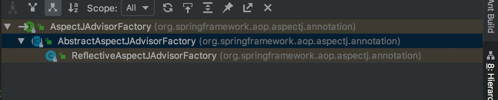

AspectJAdvisorFactory(AspectJ的通知工厂)


> AspectJAdvisorFactory:这个工厂主要是为了将注解Before, Around, After, AfterReturning, AfterThrowing, Pointcut
  转化为实例对象，然后获得Advisor或者Advice，也不知Advisor和Advice有啥区别。
  
  


> 可以看到，有一个实现类ReflectiveAspectJAdvisorFactory和抽象类AbstractAspectJAdvisorFactory


```

/**
 * Interface for factories that can create Spring AOP Advisors from classes
 * annotated with AspectJ annotation syntax.
 *
 * @author Rod Johnson
 * @author Juergen Hoeller
 * @since 2.0
 * @see AspectMetadata
 * @see org.aspectj.lang.reflect.AjTypeSystem
 */
public interface AspectJAdvisorFactory {

	//给定的类是否是Aspect类
	boolean isAspect(Class<?> clazz);

	// 对于给定的类进行校验
	void validate(Class<?> aspectClass) throws AopConfigException;

	 // 构建Advisor集合，对于所有AspectJ注解的方法
	List<Advisor> getAdvisors(MetadataAwareAspectInstanceFactory aif);

	 // 构建一个Advisor，通过给定的指定的通知方法
	Advisor getAdvisor(Method candidateAdviceMethod,
			MetadataAwareAspectInstanceFactory aif, int declarationOrderInAspect, String aspectName);

	 // 构建Advice，通过给定的通知方法
	Advice getAdvice(Method candidateAdviceMethod, AspectJExpressionPointcut pointcut,
			MetadataAwareAspectInstanceFactory aif, int declarationOrderInAspect, String aspectName);

}


``` 

> AbstractAspectJAdvisorFactory:抽象类，抽象类主要完成的工作：

```

/*
 * Copyright 2002-2013 the original author or authors.
 *
 * Licensed under the Apache License, Version 2.0 (the "License");
 * you may not use this file except in compliance with the License.
 * You may obtain a copy of the License at
 *
 *      http://www.apache.org/licenses/LICENSE-2.0
 *
 * Unless required by applicable law or agreed to in writing, software
 * distributed under the License is distributed on an "AS IS" BASIS,
 * WITHOUT WARRANTIES OR CONDITIONS OF ANY KIND, either express or implied.
 * See the License for the specific language governing permissions and
 * limitations under the License.
 */


public abstract class AbstractAspectJAdvisorFactory implements AspectJAdvisorFactory {

	private static final String AJC_MAGIC = "ajc$";


	/**
	 * Find and return the first AspectJ annotation on the given method
	 * (there <i>should</i> only be one anyway...)
	 */
	@SuppressWarnings("unchecked")
	// 这个是根据切面类的方法获得器是某类的通知的方法，返回通知的注解
	protected static AspectJAnnotation<?> findAspectJAnnotationOnMethod(Method method) {
		Class<?>[] classesToLookFor = new Class<?>[] {
				Before.class, Around.class, After.class, AfterReturning.class, AfterThrowing.class, Pointcut.class};
		for (Class<?> c : classesToLookFor) {
		    // 主要是这个方法进行获取，就是下面的方法
			AspectJAnnotation<?> foundAnnotation = findAnnotation(method, (Class<Annotation>) c);
			if (foundAnnotation != null) {
				return foundAnnotation;
			}
		}
		return null;
	}

    // 
	private static <A extends Annotation> AspectJAnnotation<A> findAnnotation(Method method, Class<A> toLookFor) {
		// 这个方法右通过工具类获取的，不在继续跟踪，肯定是通过反射
		A result = AnnotationUtils.findAnnotation(method, toLookFor);
		if (result != null) {
			return new AspectJAnnotation<A>(result);
		}
		else {
			return null;
		}
	}


	/** Logger available to subclasses */
	protected final Log logger = LogFactory.getLog(getClass());
    
    // 这个ParameterNameDiscoverer是用于解析切面方法的参数的，AspectJAnnotationParameterNameDiscoverer是个内部类
	protected final ParameterNameDiscoverer parameterNameDiscoverer = new AspectJAnnotationParameterNameDiscoverer();


    // 创建切点表达式的切点的方法
	protected AspectJExpressionPointcut createPointcutExpression(
			Method annotatedMethod, Class<?> declarationScope, String[] pointcutParameterNames) {

		Class<?> [] pointcutParameterTypes = new Class<?>[0];
		if (pointcutParameterNames != null) {
			pointcutParameterTypes = extractPointcutParameterTypes(pointcutParameterNames,annotatedMethod);
		}

		AspectJExpressionPointcut ajexp =
				new AspectJExpressionPointcut(declarationScope,pointcutParameterNames,pointcutParameterTypes);
		ajexp.setLocation(annotatedMethod.toString());
		return ajexp;
	}

	
	private Class<?>[] extractPointcutParameterTypes(String[] argNames, Method adviceMethod) {
		Class<?>[] ret = new Class<?>[argNames.length];
		Class<?>[] paramTypes = adviceMethod.getParameterTypes();
		if (argNames.length > paramTypes.length) {
			throw new IllegalStateException("Expecting at least " + argNames.length +
					" arguments in the advice declaration, but only found " + paramTypes.length);
		}
		// Make the simplifying assumption for now that all of the JoinPoint based arguments
		// come first in the advice declaration.
		int typeOffset = paramTypes.length - argNames.length;
		for (int i = 0; i < ret.length; i++) {
			ret[i] = paramTypes[i + typeOffset];
		}
		return ret;
	}

    
    // 几个通知的类型
	protected enum AspectJAnnotationType {
		AtPointcut,
		AtBefore,
		AtAfter,
		AtAfterReturning,
		AtAfterThrowing,
		AtAround
	}


	
	// 内部类，切面通知的的注解形式转化为实例的类
	protected static class AspectJAnnotation<A extends Annotation> {

		private static final String[] EXPRESSION_PROPERTIES = new String[] {"value", "pointcut"};

		private static Map<Class<?>, AspectJAnnotationType> annotationTypes =
				new HashMap<Class<?>, AspectJAnnotationType>();

		static {
			annotationTypes.put(Pointcut.class,AspectJAnnotationType.AtPointcut);
			annotationTypes.put(After.class,AspectJAnnotationType.AtAfter);
			annotationTypes.put(AfterReturning.class,AspectJAnnotationType.AtAfterReturning);
			annotationTypes.put(AfterThrowing.class,AspectJAnnotationType.AtAfterThrowing);
			annotationTypes.put(Around.class,AspectJAnnotationType.AtAround);
			annotationTypes.put(Before.class,AspectJAnnotationType.AtBefore);
		}

		private final A annotation;

		private final AspectJAnnotationType annotationType;

		private final String pointcutExpression;

		private final String argumentNames;

		public AspectJAnnotation(A annotation) {
			this.annotation = annotation;
			this.annotationType = determineAnnotationType(annotation);
			// We know these methods exist with the same name on each object,
			// but need to invoke them reflectively as there isn't a common interface.
			try {
				this.pointcutExpression = resolveExpression(annotation);
				this.argumentNames = (String) annotation.getClass().getMethod("argNames").invoke(annotation);
			}
			catch (Exception ex) {
				throw new IllegalArgumentException(annotation + " cannot be an AspectJ annotation", ex);
			}
		}

		private AspectJAnnotationType determineAnnotationType(A annotation) {
			for (Class<?> type : annotationTypes.keySet()) {
				if (type.isInstance(annotation)) {
					return annotationTypes.get(type);
				}
			}
			throw new IllegalStateException("Unknown annotation type: " + annotation.toString());
		}

		private String resolveExpression(A annotation) throws Exception {
			String expression = null;
			for (String methodName : EXPRESSION_PROPERTIES) {
				Method method;
				try {
					method = annotation.getClass().getDeclaredMethod(methodName);
				}
				catch (NoSuchMethodException ex) {
					method = null;
				}
				if (method != null) {
					String candidate = (String) method.invoke(annotation);
					if (StringUtils.hasText(candidate)) {
						expression = candidate;
					}
				}
			}
			return expression;
		}

		public AspectJAnnotationType getAnnotationType() {
			return this.annotationType;
		}

		public A getAnnotation() {
			return this.annotation;
		}

		public String getPointcutExpression() {
			return this.pointcutExpression;
		}

		public String getArgumentNames() {
			return this.argumentNames;
		}

		@Override
		public String toString() {
			return this.annotation.toString();
		}
	}


	// 内部类用于，解析切面，通知方法的参数的
	private static class AspectJAnnotationParameterNameDiscoverer implements ParameterNameDiscoverer {

		@Override
		public String[] getParameterNames(Method method) {
			if (method.getParameterTypes().length == 0) {
				return new String[0];
			}
			AspectJAnnotation<?> annotation = findAspectJAnnotationOnMethod(method);
			if (annotation == null) {
				return null;
			}
			StringTokenizer strTok = new StringTokenizer(annotation.getArgumentNames(), ",");
			if (strTok.countTokens() > 0) {
				String[] names = new String[strTok.countTokens()];
				for (int i = 0; i < names.length; i++) {
					names[i] = strTok.nextToken();
				}
				return names;
			}
			else {
				return null;
			}
		}

		@Override
		public String[] getParameterNames(Constructor<?> ctor) {
			throw new UnsupportedOperationException("Spring AOP cannot handle constructor advice");
		}
	}

}


```


> ReflectiveAspectJAdvisorFactory：唯一的实现类

```

public class ReflectiveAspectJAdvisorFactory extends AbstractAspectJAdvisorFactory {

	private static final Comparator<Method> METHOD_COMPARATOR;

    // 静态代码块初始化METHOD_COMPARATOR比较器
    // 这个比较器的作用就是排序的
	static {
		CompoundComparator<Method> comparator = new CompoundComparator<Method>();
		comparator.addComparator(new ConvertingComparator<Method, Annotation>(
				new InstanceComparator<Annotation>(
						Around.class, Before.class, After.class, AfterReturning.class, AfterThrowing.class),
				new Converter<Method, Annotation>() {
					@Override
					public Annotation convert(Method method) {
						AspectJAnnotation<?> annotation = AbstractAspectJAdvisorFactory.findAspectJAnnotationOnMethod(method);
						return annotation == null ? null : annotation.getAnnotation();
					}
				}));
		comparator.addComparator(new ConvertingComparator<Method, String>(
				new Converter<Method, String>() {
					@Override
					public String convert(Method method) {
						return method.getName();
					}
				}));
		METHOD_COMPARATOR = comparator;
	}


	@Override
	public List<Advisor> getAdvisors(MetadataAwareAspectInstanceFactory maaif) {
	    // AspectMetadata其实是切面类的元数据的封装类，包好了切面类的信息，切面class，切面名称
	    // AspectMetadata对象又被封装在MetadataAwareAspectInstanceFactory(元数据AwareAspect实例工厂)中
		final Class<?> aspectClass = maaif.getAspectMetadata().getAspectClass();
		final String aspectName = maaif.getAspectMetadata().getAspectName();
		// 校验切面类
		validate(aspectClass);

		// We need to wrap the MetadataAwareAspectInstanceFactory with a decorator
		// so that it will only instantiate once.
		// MetadataAwareAspectInstanceFactory又被封装一层
		final MetadataAwareAspectInstanceFactory lazySingletonAspectInstanceFactory =
				new LazySingletonAspectInstanceFactoryDecorator(maaif);

		final List<Advisor> advisors = new LinkedList<Advisor>();
		for (Method method : getAdvisorMethods(aspectClass)) {
		    // 调用获得单个Advisor
			Advisor advisor = getAdvisor(method, lazySingletonAspectInstanceFactory, advisors.size(), aspectName);
			if (advisor != null) {
				advisors.add(advisor);
			}
		}

		// If it's a per target aspect, emit the dummy instantiating aspect.
		if (!advisors.isEmpty() && lazySingletonAspectInstanceFactory.getAspectMetadata().isLazilyInstantiated()) {
			Advisor instantiationAdvisor = new SyntheticInstantiationAdvisor(lazySingletonAspectInstanceFactory);
			advisors.add(0, instantiationAdvisor);
		}

		// Find introduction fields.
		for (Field field : aspectClass.getDeclaredFields()) {
			Advisor advisor = getDeclareParentsAdvisor(field);
			if (advisor != null) {
				advisors.add(advisor);
			}
		}

		return advisors;
	}

    // 获得切面类的所有方法，这个方法是私有的，很不爽，我们无法自己创建这个工厂直接调用这个方法来测试一下
    // 不过可以仿照方法实现，我们自己可以写一个demo
	private List<Method> getAdvisorMethods(Class<?> aspectClass) {
		final List<Method> methods = new LinkedList<Method>();
		ReflectionUtils.doWithMethods(aspectClass, new ReflectionUtils.MethodCallback() {
			@Override
			public void doWith(Method method) throws IllegalArgumentException {
				// Exclude pointcuts
				if (AnnotationUtils.getAnnotation(method, Pointcut.class) == null) {
					methods.add(method);
				}
			}
		});
		Collections.sort(methods, METHOD_COMPARATOR);
		return methods;
	}

	
	private Advisor getDeclareParentsAdvisor(Field introductionField) {
		DeclareParents declareParents = introductionField.getAnnotation(DeclareParents.class);
		if (declareParents == null) {
			// Not an introduction field
			return null;
		}

		if (DeclareParents.class.equals(declareParents.defaultImpl())) {
			// This is what comes back if it wasn't set. This seems bizarre...
			// TODO this restriction possibly should be relaxed
			throw new IllegalStateException("defaultImpl must be set on DeclareParents");
		}

		return new DeclareParentsAdvisor(
				introductionField.getType(), declareParents.value(), declareParents.defaultImpl());
	}


    // 获取单个Advisor
	@Override
	public Advisor getAdvisor(Method candidateAdviceMethod, MetadataAwareAspectInstanceFactory aif,
			int declarationOrderInAspect, String aspectName) {

		validate(aif.getAspectMetadata().getAspectClass());

        // 这个是切点的封装对象
		AspectJExpressionPointcut ajexp =
				getPointcut(candidateAdviceMethod, aif.getAspectMetadata().getAspectClass());
		if (ajexp == null) {
			return null;
		}
		// 这个也是创建了一个InstantiationModelAwarePointcutAdvisorImpl
		return new InstantiationModelAwarePointcutAdvisorImpl(
				this, ajexp, aif, candidateAdviceMethod, declarationOrderInAspect, aspectName);
	}

    // 私有方法，不能直接写demo测试
	private AspectJExpressionPointcut getPointcut(Method candidateAdviceMethod, Class<?> candidateAspectClass) {
		AspectJAnnotation<?> aspectJAnnotation =
				AbstractAspectJAdvisorFactory.findAspectJAnnotationOnMethod(candidateAdviceMethod);
		if (aspectJAnnotation == null) {
			return null;
		}
		AspectJExpressionPointcut ajexp =
				new AspectJExpressionPointcut(candidateAspectClass, new String[0], new Class<?>[0]);
		ajexp.setExpression(aspectJAnnotation.getPointcutExpression());
		return ajexp;
	}


    // 获得Advice的类
	@Override
	public Advice getAdvice(Method candidateAdviceMethod, AspectJExpressionPointcut ajexp,
			MetadataAwareAspectInstanceFactory aif, int declarationOrderInAspect, String aspectName) {

		Class<?> candidateAspectClass = aif.getAspectMetadata().getAspectClass();
		validate(candidateAspectClass);

		AspectJAnnotation<?> aspectJAnnotation =
				AbstractAspectJAdvisorFactory.findAspectJAnnotationOnMethod(candidateAdviceMethod);
		if (aspectJAnnotation == null) {
			return null;
		}

		// If we get here, we know we have an AspectJ method.
		// Check that it's an AspectJ-annotated class
		if (!isAspect(candidateAspectClass)) {
			throw new AopConfigException("Advice must be declared inside an aspect type: " +
					"Offending method '" + candidateAdviceMethod + "' in class [" +
					candidateAspectClass.getName() + "]");
		}

		if (logger.isDebugEnabled()) {
			logger.debug("Found AspectJ method: " + candidateAdviceMethod);
		}

		AbstractAspectJAdvice springAdvice;

        // 根据注解类型，进行创建不同的通知
		switch (aspectJAnnotation.getAnnotationType()) {
			case AtBefore:
				springAdvice = new AspectJMethodBeforeAdvice(candidateAdviceMethod, ajexp, aif);
				break;
			case AtAfter:
				springAdvice = new AspectJAfterAdvice(candidateAdviceMethod, ajexp, aif);
				break;
			case AtAfterReturning:
				springAdvice = new AspectJAfterReturningAdvice(candidateAdviceMethod, ajexp, aif);
				AfterReturning afterReturningAnnotation = (AfterReturning) aspectJAnnotation.getAnnotation();
				if (StringUtils.hasText(afterReturningAnnotation.returning())) {
					springAdvice.setReturningName(afterReturningAnnotation.returning());
				}
				break;
			case AtAfterThrowing:
				springAdvice = new AspectJAfterThrowingAdvice(candidateAdviceMethod, ajexp, aif);
				AfterThrowing afterThrowingAnnotation = (AfterThrowing) aspectJAnnotation.getAnnotation();
				if (StringUtils.hasText(afterThrowingAnnotation.throwing())) {
					springAdvice.setThrowingName(afterThrowingAnnotation.throwing());
				}
				break;
			case AtAround:
				springAdvice = new AspectJAroundAdvice(candidateAdviceMethod, ajexp, aif);
				break;
			case AtPointcut:
				if (logger.isDebugEnabled()) {
					logger.debug("Processing pointcut '" + candidateAdviceMethod.getName() + "'");
				}
				return null;
			default:
				throw new UnsupportedOperationException(
						"Unsupported advice type on method " + candidateAdviceMethod);
		}

		// Now to configure the advice...
		springAdvice.setAspectName(aspectName);
		springAdvice.setDeclarationOrder(declarationOrderInAspect);
		String[] argNames = this.parameterNameDiscoverer.getParameterNames(candidateAdviceMethod);
		if (argNames != null) {
			springAdvice.setArgumentNamesFromStringArray(argNames);
		}
		springAdvice.calculateArgumentBindings();
		return springAdvice;
	}

	
	@SuppressWarnings("serial")
	protected static class SyntheticInstantiationAdvisor extends DefaultPointcutAdvisor {

		public SyntheticInstantiationAdvisor(final MetadataAwareAspectInstanceFactory aif) {
			super(aif.getAspectMetadata().getPerClausePointcut(), new MethodBeforeAdvice() {
				@Override
				public void before(Method method, Object[] args, Object target) {
					// Simply instantiate the aspect
					aif.getAspectInstance();
				}
			});
		}
	}

}


```

> 这个工厂中代码不多，但是涉及了好多其他的类：MetadataAwareAspectInstanceFactory(这个又可以引出一系列的类，mmp)，
  AbstractAspectJAdvice(通知，也是一个系列)，Advisor(这个也是一个系列)，显然InstantiationModelAwarePointcutAdvisorImpl
  就是Advisor的一个实现，不想写了
